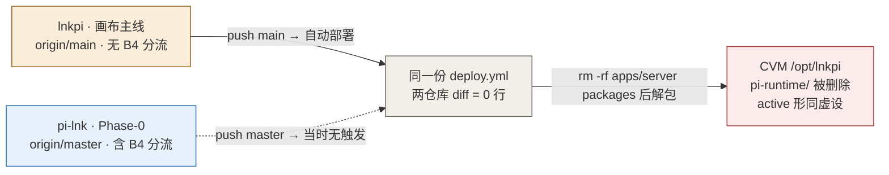
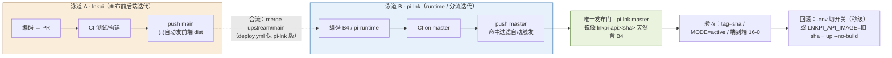

# 复盘：两仓库并行开发导致生产 runtime 分流被覆盖（2026-09-23）

> 完整版（含 4 张矢量图）见 [`POSTMORTEM-2026-09-23-deploy-overwrite.html`](./POSTMORTEM-2026-09-23-deploy-overwrite.html)
> 操作手册见 [`RUNBOOK-single-release-gate.md`](./RUNBOOK-single-release-gate.md)

- **状态**：已闭环（根因消除；1 处残留交叉点已于 2026-09-23 同批收窄，见 §残留交叉点 ①）
- **业务影响**：无（接口与数据无损伤，期间流量由老 runtime 正常服务）
- **修复主题**：单一发布门 + 构建防呆守卫 + 镜像回滚保留

## 一页速览

- **现象**：一次部署后 `/opt/lnkpi/apps/server/src/agent/pi-runtime/` 整体消失；`PI_RUNTIME_MODE=active` 仍写在 `.env` 里却不再生效 —— 请求静默走回老 LangGraph runtime，**无报错、无回退提示**。
- **根因**：pi-lnk 与 lnkpi 是 fork 关系的两个仓库，**共用同一份 `deploy.yml`（diff = 0 行）、同一个部署目标 `/opt/lnkpi`**；同步动作是 `rm -rf apps/server packages` 后再解包 —— **包内没有的文件会被物理删除**。lnkpi 源码不含 B4 分流文件，于是"从 lnkpi 发版"＝定时擦掉分流代码。
- **为何长期未暴露**：覆盖后是静默降级而非报错；且 pi-lnk 工作流挂在 `main`、实际开发在 `master`，等于没有自动化，无法形成对照。
- **修复**：① 历史合流 ② 构建守卫 ③ 部署权收敛到单一发布门 ④ 镜像保留上一版（秒级回滚）。
- **代价（有意权衡）**：lnkpi 的 **API 改动不再自动上线**；**前端开发零影响**。

## 时间线

| 时间（约） | 事件 |
| --- | --- |
| 03:16 | lnkpi 推送精修抠图 `df45200`（PR #402） |
| 06:12 | lnkpi 推送 `30a3781e`：本仓库停用 API 直部署（CI #920 / Deploy #415） |
| **11:17** | **从本地环境（源码为 df452008，不含 B4）部署 → 覆盖 `/opt/lnkpi`，B4 目录被删除** |
| 12:40 前后 | 修复：仅回填 B4 相关文件（保留新增 matting 代码）+ 重建镜像 `2b636e7`，active 真正生效 |
| 13:48 | ⚠️ 守卫脚本测试**误触发一次真实构建**（已核查业务无损伤，并补可辨识别名） |
| 13:50 | 历史合流 `3242fa8` + 构建守卫 `aca108a` |
| 14:10 | 核查发现两仓库 `deploy.yml` 完全一致 → 覆盖是 lnkpi 发版的**默认行为**，非偶发 |
| 14:20 | 发布门落地：pi-lnk `1c96a14`（对齐 master）、lnkpi `30a3781e`（停 API 部署） |
| 14:50 | 首次全自动部署闭环成功（镜像 tag = 提交 sha，端到端 16/0） |
| 15:10 | 回滚保留策略 `b219af5`；磁盘清理释放 4.07 GB |
| 15:20 | 两仓库统一 MIT（lnkpi `3bd984e3` → pi-lnk `e34bdad`） |
| 15:22 | 删 `/opt/lnkcanvas`（先归档，上游有留存）；`actions-runner` 经核实为 aimarket 活跃 runner，保持不动 |

## 现状问题分析（事故当时）

### 1. 结构性：一个代码库、两条开发线、一个部署目标



### 2. 文件级机理：删除语义决定一切

- `deploy.yml`（发 API 的）：`rm -rf $DEPLOY_DIR/packages $DEPLOY_DIR/apps/server` 后再解包 → **包内没有的文件被物理删除**。
- `deploy-agent-runtime.yml`：直接 `tar -xzf - -C $DEPLOY_DIR` → **只覆盖同名文件，不删除**。
- 而 `apps/server/**`、`deploy/**` 是两个仓库**都有的路径**，B4 分流代码就住在 `apps/server/src/agent/` 里。所以"我只改画布、没动 runtime"对覆盖毫无帮助。

三条关键资产的实际遭遇：`agent.service.ts`（含 B4 逻辑）**被覆盖**、`pi-runtime/`（B4 独有目录）**被删除**、`deploy/*.sh`（守卫与保留策略）**被回退** —— 任一缺失，分流都不成立。

### 3. 为何长期未暴露：静默降级

NestJS 走的是老 runtime 分支，接口照样 200、画布照样能用（老 runtime 一直在服役），没有任何告警提示"分流没生效"。唯一可靠判据是指标：pi-runtime 的 `sessions/:id/prompt` 计数是否在涨 —— 这也是后来把它写进验收判据的原因。

## 解决方案（目标模式）



| 仓库 | 提交 | 内容 |
| --- | --- | --- |
| pi-lnk | `3242fa8` | 合并 upstream/main（抠图 `df45200` + 规格 `5e5a0c9`），两仓库收敛同一历史 |
| pi-lnk | `aca108a` | `launch-cvm-build.sh` 加 B4 守卫（缺 `pi-runtime/` 或分流引用则 exit 1）+ tag/HEAD 一致性 WARN |
| pi-lnk | `1c96a14` | 三个工作流触发分支 main → master（此前发布门等于没有自动化） |
| lnkpi | `30a3781e` | 停用 API 直部署（新增 `allow_api_deploy`，默认 false）；自动部署只剩 `deploy-web` |
| pi-lnk | `b219af5` | 镜像保留「当前 + latest + 最近 N 个历史」，回滚点写 `.last-api-image` |
| pi-lnk | `575bee5` / `a042331` / `396b86c` | 运维手册与磁盘口径 |
| 两仓库 | `3bd984e3` / `e34bdad` | 统一 MIT 协议，消除 LICENSE add/add 冲突 |

> **合流固定陷阱**：lnkpi 的 `30a3781e` 改了 `.github/workflows/deploy.yml`。两仓库共享该路径，**直接 merge 会把"禁用 API 部署"带进 pi-lnk，静默废掉唯一发布门**。必须 `git merge --no-commit` → `git checkout HEAD -- .github/workflows/deploy.yml && git add` → 再 commit。（`git checkout --ours <path>` 只在路径冲突时有效，等价但更脆；`HEAD --` 在自动合并成功时也能用。）

## 验证闭环

- **三态**：`off`（流量全走老 runtime）→ `shadow`（镜像双跑比对，用户无感）→ `active`（SSE 由 pi-runtime 出）。切换都是"改 `.env` + `compose up -d --force-recreate`"，秒级。
- **每次部署后三条验收**：① 容器 image tag == 提交 sha 且 healthy ② `PI_RUNTIME_MODE=active` ③ `prod-agent-thread-verify.py` → PASS=16 FAIL=0。
- **回滚两条路径**（均不触发重新构建）：① 秒级止血 = 切 `PI_RUNTIME_MODE=off|shadow`；② 版本回退 = `LNKPI_API_IMAGE=lnkpi-api:<旧 sha> compose up -d --no-build`，旧镜像由保留策略保证存在。
- **磁盘代价（实测反直觉）**：`docker images` 显示 1.68 GB，但 `docker history` 拆解后依赖层 562 MB + 系统包层 473 MB + 基础层 243 MB 为镜像间共享，每次部署真正变化的只有 `apps/server/dist` ≈ **1.1 MB**，故"多留一个历史版本"的真实增量约 1 MB。

## 这次变化对 lnkpi 独立开发的影响

**结论：前端零影响；后端 API 不再自动上线，需过一次发布门。**

| 你在 lnkpi 改什么 | 触发的工作流 | 会自动部署？ | 你要做什么 |
| --- | --- | --- | --- |
| 画布前端 `apps/web/**` | Deploy（web 命中）→ `Deploy web to CVM` | ✅ 会（约 1-2 min） | 不用管；只写 `web/dist` + `deploy/nginx.conf`、`deploy-web.sh` |
| 后端 API `apps/server/**`、`packages/**` | Deploy（api 命中），但 `Build API on CVM` 条件已改为"仅手动显式开启" | ❌ 不会 | 需过一次发布门 |
| `deploy/**`、`package.json`、`pnpm-lock.yaml`、`.dockerignore` | 同上 | ❌ 不会 | 同上 |
| `.github/workflows/deploy.yml` | api + web 都命中 | ⚠️ 只重发前端 | 无需操作 |
| `services/agent-runtime/**`、`deploy/docker/**` | `Deploy Agent Runtime`（lnkpi 侧仍自动跑） | ✅ 只写 `services/agent-runtime/**`，其余路径被 Guard 拦截 | 无需操作；见残留交叉点 ①（已收窄） |
| `docs/**`、`*.md`、`README`、`LICENSE` | 不命中部署过滤；CI 因 `paths-ignore` 也不跑 | — | 无 |
| 任意代码改动 | CI（测试/构建/契约） | — | 照旧，不受影响 |

### API 改动的正确上线路径

```bash
# 1. lnkpi 正常开发并 push（CI 照跑；API 不会自动上线）
cd ~/workspace/lnkpi && git push origin main

# 2. 同步到发布门（只搬源码；deploy.yml 必须保 pi-lnk 版）
cd ~/workspace/pi-lnk
git fetch upstream
git merge upstream/main --no-commit --no-ff
git checkout HEAD -- .github/workflows/deploy.yml && git add .github/workflows/deploy.yml
grep -c "allow_api_deploy" .github/workflows/deploy.yml   # 必须是 0
git commit -m "merge: sync lnkpi main (API changes)"
git push origin master        # → 自动触发发布门部署，完成后跑三条验收
```

> 完整命令流（含自检与常见故障）：[`RUNBOOK-lnkpi-to-pi-lnk-sync.md`](./RUNBOOK-lnkpi-to-pi-lnk-sync.md)。
> 注意 `git checkout --ours <path>` **只在路径处于冲突状态时**有效；用 `git checkout HEAD -- <path>` 更稳（语义相同：恢复 pi-lnk 合并前的版本）。

若只是纯前端改动，第 1 步后即可访问 `http://119.29.173.89:8888/`；只有当"前端调用了 API 新接口"时才必须走第 2 步，否则会出现前端已上线、接口仍旧版本的错配。

### 残留交叉点

1. ~~**中风险 — `services/agent-runtime/**` 改动仍会覆盖源码树**~~ → **✅ 已收窄（2026-09-23，lnkpi `2a4d5220` / pi-lnk `0c6b91b`）**：该工作流的 `tar` 改为白名单，只打包 `services/agent-runtime`；同时新增 `Guard: release-gate invariants` 步骤，校验生产树上 ① B4 分流代码在位 ② B4 构建守卫在位 ③ 发布门独占文件（compose / enable-agent-runtime.sh / agent-runtime Dockerfile）无漂移——任一不满足即红灯并提示"走发布门"，**不再静默覆盖**。原风险描述（保留供对照）：无 `rm -rf`、只覆盖同名文件，`agent.service.ts` 会被换成无 B4 版本、`deploy/launch-cvm-build.sh`（守卫）与 `deploy-remote-build.sh`（保留策略）被回退，形成"守卫被回退"时间窗；运行中容器不受影响（B4 在镜像里），下次经发布门部署会自愈。
2. **低风险 — `deploy-web` 覆盖 `deploy/{nginx.conf,deploy-web.sh}`**：只写这两个文件 + `web/dist`，不碰源码树，两仓库同源实际一致。
3. **低风险 — 守卫与保留策略未回流 lnkpi**：从 lnkpi 手动构建仍是无守卫版本。**注意**：收窄后 lnkpi 的 `Deploy Agent Runtime` 也不再同步 `deploy/**`，所以 lnkpi 侧的守卫脚本改动必须走发布门才生效（Guard 会校验漂移）。

### 关于 `#920`

它不是 PR，而是 **lnkpi CI 工作流的第 920 次运行**（`run_number = 920`），对应提交 `30a3781e`（push 触发，success），只跑测试与契约校验，**不部署任何东西**。同一次 push 触发的 `Deploy to Tencent Cloud #415` 的 job 结果正是设计意图：`Deploy web to CVM` 跑了（该提交改了 `deploy.yml`，命中 web 过滤，无害）、`Build API on CVM (disabled — owned by pi-lnk)` = **skipped**、`Recover CVM only` = skipped。

## 残留风险与待办

| 优先级 | 事项 | 说明 |
| --- | --- | --- |
| 高 | ~~收窄 lnkpi 的 `deploy-agent-runtime.yml` 同步范围~~ **✅ 已完成** | lnkpi `2a4d5220` / pi-lnk `0c6b91b`：tar 白名单 + 发布门不变量 Guard，消除"守卫被回退"时间窗 |
| 高 | ~~同步命令流沉淀（不自动化）~~ **✅ 已完成** | [`RUNBOOK-lnkpi-to-pi-lnk-sync.md`](./RUNBOOK-lnkpi-to-pi-lnk-sync.md)：完整命令、`checkout HEAD --` 陷阱、三层门控、验收三件套 |
| — | ~~回滚可用性验证~~ **✅ 已完成（2026-09-23 17:26 演练）** | `active→shadow` 后验收 16/0、再切回 `active` 复跑 16/0；回滚点镜像与 `.last-api-image` 一致 |
| 中 | 把 B4 守卫与镜像保留策略上游化到 lnkpi | 让任何仓库构建都不会静默产出假镜像 |
| 中 | P1：canvas tool 迁移 | 工具清单 → pi-runtime atomic 注册表 → shadow 双跑比对 |
| P2 | K1 golden 用例集仅 3 条 | 不足则 shadow 比对缺基线 |
| P2 | K6 监控栈未部署 | 受 CVM 内存限制 |
| P3 | `/opt/actions-runner` 约 1.4 GB 升级残留 | 用户决定暂不处理；**目录本身不可删**（aimarket 活跃 runner） |
| P3 | `/opt/lnkpi/.worktrees/poc-pi-agent-spike`（863 文件） | 陈旧副本，同步脚本不清理 |
| P3 | compose 的 `matting` 服务未运行 | 与本次事故无关 |

## 附录：关键命令

```bash
# 验收三件套
ssh deploy-cvm 'docker ps --format "{{.Names}} {{.Image}} {{.Status}}" | grep lnkpi-api'
ssh deploy-cvm 'docker exec lnkpi-api printenv PI_RUNTIME_MODE'     # 期望 active
python3 deploy/prod-agent-thread-verify.py                          # 期望 PASS=16 FAIL=0

# 秒级回滚 ① 切开关
ssh deploy-cvm "cd /opt/lnkpi && sed -i 's/^PI_RUNTIME_MODE=.*/PI_RUNTIME_MODE=shadow/' .env \
  && docker compose -f deploy/docker-compose.prod.yml up -d --no-build --force-recreate api"

# 秒级回滚 ② 回退镜像版本
ssh deploy-cvm 'cat /opt/lnkpi/.last-api-image'
ssh deploy-cvm 'cd /opt/lnkpi && LNKPI_API_IMAGE=lnkpi-api:<旧 sha> \
  docker compose -f deploy/docker-compose.prod.yml up -d --no-build --force-recreate api'

# 磁盘纪律
docker builder prune -f     # 安全；曾释放 4.07 GB
# ⚠️ 禁止 docker image prune -a —— 同机还跑着 pintuotuo / aimarket 的镜像
```
