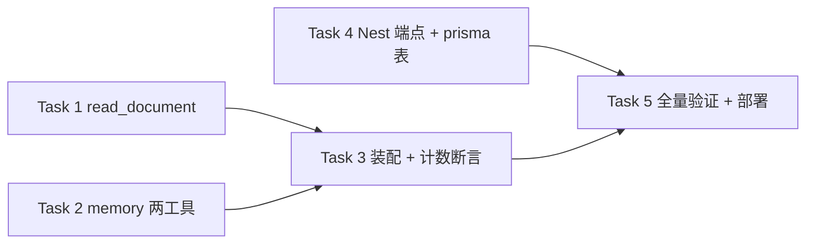

# P1 Agent 工具（read_document / save_memory / recall_memory）实现计划

> **For agentic workers:** REQUIRED SUB-SKILL: Use superpowers:subagent-driven-development (recommended) or superpowers:executing-plans to implement this plan task-by-task. Steps use checkbox (`- [ ]`) syntax for tracking.

**Goal:** 给 pi-runtime agent 补上素材全文读取（read_document）与跨会话记忆（save_memory / recall_memory）两条能力，task_plan 按 spec 裁决移交 UX P0-P2 不在本计划内。

**Architecture:** read_document 纯读 `toolContext.attachments`（Nest 每轮已注入），零 Nest/DB 改动，截断复用 `web.ts` 的 `truncateMarkdown`；memory 是本计划唯一跨三层新链路——pi-runtime 工具 → Nest 新端点 `/agent/internal/memory-save|memory-search`（挂在既有 `AgentInternalGuard` 之后）→ 新聚焦服务 `AgentMemoryService` → prisma 新表 `agent_memories`（sqlite）。Nest 侧新建独立小服务而非往 2700 行的 `agent-canvas-tools.service.ts` 里追加。任务依赖关系见图 1（Task 1 与 Task 2 可并行，Task 3 依赖两者，Task 4 独立）。

**Tech Stack:** TypeScript (ESM)、typebox（import 自 `"typebox"`）、node:test + tsx（pi-runtime）、vitest + @nestjs/testing（apps/server）、prisma 6.2 + sqlite、无新依赖。

**Spec:** `docs/superpowers/specs/2026-09-29-agent-tool-p1-read-document-memory-design.md`（实现时 spec 与本计划同读）

## 0. 配图索引

| 编号 | 形式 | 内容 | 位置 | 用途 |
|---|---|---|---|---|
| 图 1 | 内嵌 Mermaid flowchart | 5 个任务的依赖顺序（1、2 可并行，3 依赖 1+2，4 独立，5 收尾） | 本节下方 | 执行者据此判断任务能否乱序/并行 |

**图 1 · 任务依赖图（1 与 2 可并行，4 独立于 1-3）**



## Global Constraints

- 工具 execute 定义为四参 `async (_id, params, _u, tc: LnkpiToolContext) => ...`（对照 `delete-nodes.ts:41`）；**测试里调用 execute 必须垫齐 6 参**：`tool.execute!("1", params as never, undefined as never, tc as never, undefined as never, undefined as never)`（对照 `delete-nodes.test.ts:9-11` 的 `runTool` helper）
- 工具返回形态：本计划两批工具**有意偏离** `textResult` 的 `{ok,data}` 包装，直接以 payload 为顶层（`{ ok:true, text:... }` / `{ ok:false, error:... }`，spec §5.1/§5.2 契约如此）——本地 helper 形如 `{ content: [{ type: "text" as const, text: JSON.stringify(payload) }], details: undefined }`；`details` 必须为 `undefined`（**禁止** `details.actions`：本两批工具不产 CanvasAction，误加会让 Nest 派生空 canvas_action）
- 错误处理 fail-closed：直接 `throw new Error("<工具名> ...")`——harness 不校验 schema、不应用 TypeBox 默认值，**所有参数约束与默认值必须在 execute 内兜底**
- typebox import 是 `import { Type } from "typebox"`；`Type.Array`/`Type.Number` 只写 `description`，min/max 在 execute 内手动判
- `userId` / `sessionId` 只取 `tc`（Nest 注入），schema 绝不暴露（toolContext 安全模型红线）；需 userId 的工具侧 fail-closed：`if (!tc.userId) throw new Error("<工具名> requires userId in toolContext")`
- 截断一律复用 `web.ts` 的 `truncateMarkdown(md, startIndex) → { text, total, next }`（`web.ts:73`）+ `FETCH_MAX_CHARS = 20_000`（已 export），**不得**复制或另建窗口
- 测试命令：pi-runtime `env -u NODE_OPTIONS pnpm -C services/pi-runtime test`；server `env -u NODE_OPTIONS pnpm -C apps/server test -- src/agent/agent-memory.service.test.ts`；类型检查 `env -u NODE_OPTIONS pnpm -C services/pi-runtime exec tsc --noEmit`
- **本机必须加 `env -u NODE_OPTIONS` 前缀**（WorkBuddy node-language-shim 注入会 SIGKILL 高 IO node 进程）；跑测试前先确认
- **每个 commit 步骤前必须 `git status --short` 复核目标文件出现**（本环境有 Edit 报成功但未落盘前科；可靠判据只有 git status 的 ` M`/`??`）；**复核 grep 一律用 `grep -E`**（macOS BSD grep 的 BRE 不支持 `\|` 交替，`grep "a\|b"` 恒返回 0）
- 分支：`git fetch origin` 后用 worktree 新建 `feat/agent-tool-p1-read-document-memory`（**不得**在主工作区直接切分支——主工作区归用户并行会话）；本计划的 spec 文件在主仓是 untracked，实现分支首 commit 一并带入
- sqlite 已知限制：`contains` 对 ASCII 大小写敏感（Prisma `mode: 'insensitive'` 不支持 sqlite）——中文记忆无影响，英文关键词需模型自行换措辞（已写进工具 description）
- 部署（Task 5）：pi-runtime 当前生产 tag **0.0.13** → 本次加一；构建上下文 = CVM monorepo 根 `/root/pi-lnk-build`；helm 必须带 `KUBECONFIG=/etc/rancher/k3s/k3s.yaml` + `--reuse-values -f /root/pi-lnk-charts/tavily.yaml` + `--set image.tag=<新tag> --set env.PI_RUNTIME_VERSION=<新tag>`；mysql/sqlite 表由 API 容器 entrypoint 的 `prisma migrate deploy` 自动应用，但**必须等 deploy-api job 绿**（memory 端点依赖新表）

## Review Focus

spec 隐含但任务测试未完全覆盖、最可能咬到真实用户的五类输入（每条已 pinned 到对应任务）：

1. **模型拿过期/拼错的 ref 调 read_document**（T3、t2、小写 t1、上一次会话的 T1）→ 必须返回 `ok:false` + 附件清单，**绝不**返回任何素材正文（防「猜一个相似素材的全文喂给模型」）—— Task 1
2. **续读越界**：`start_index` 传负数 / 超过总长 / 非数字 → 必须被夹取到 `[0, total]`，`next_start_index` 为 null 而非 NaN —— Task 1
3. **text 素材是空串或只有空白**（前端允许只填 label）→ read_document 报「文本为空」，不得返回空 text 让模型误以为素材无内容 —— Task 1
4. **userId 缺失**（会话身份断裂、内部调用）→ save_memory / recall_memory 必须在 execute 内直接 throw，且**不得发出任何 Nest 请求**（fail-closed 而非 fail-open）—— Task 2
5. **limit 畸形值**（0 / 999 / 小数 / 字符串）→ recall_memory 与 Nest 两侧都夹取到 `[1,50]`，默认 10；且 pi-runtime 侧算出的 limit 与 Nest 侧二次夹取结果一致（纵深防御不得打架）—— Task 2 + Task 4

---

### Task 1: read_document 工具 + resolveRef 纯函数

**Files:**
- Create: `services/pi-runtime/src/tools/read-document.ts`
- Test: `services/pi-runtime/src/tools/read-document.test.ts`

**Interfaces:**
- Consumes: `truncateMarkdown(md: string, startIndex: number): { text: string; total: number; next: number | null }`（`web.ts`，已 export）；`LnkpiToolContext.attachments?: SidebarAttachment[]`（`types.ts:35`，元素形如 `{ url?, text?, mediaType? }`，运行时还带 Nest 透传的 `id`/`label`）
- Produces: `buildReadDocumentTools(): LnkpiTool[]`（Task 3 装配用）；`resolveRef(attachments: SidebarAttachment[], ref: string): { index: number; key: string; item: SidebarAttachment } | null`

- [ ] **Step 1: 写失败测试**

Create `services/pi-runtime/src/tools/read-document.test.ts`:

```ts
import { test } from "node:test";
import assert from "node:assert/strict";
import { buildReadDocumentTools, resolveRef } from "./read-document.js";
import type { LnkpiTool, LnkpiToolContext } from "./types.js";

type ToolResult = { content: { text: string }[]; details?: unknown };
function runTool(tool: LnkpiTool, params: unknown, tc: unknown = {}): Promise<ToolResult> {
	return tool.execute!("1", params as never, undefined as never, tc as never, undefined as never, undefined as never) as Promise<ToolResult>;
}
function payload(out: ToolResult): { ok: boolean; [k: string]: unknown } {
	return JSON.parse(out.content[0].text) as { ok: boolean; [k: string]: unknown };
}

const att = (mediaType: string, extra: Record<string, unknown> = {}) => ({ mediaType, ...extra });

test("resolveRef：T/I/V/A 按 mediaType 计数，未知类型跳过", () => {
	const list = [att("text"), att("image"), att("text"), att("video", { id: "vid-9" }), att("weird")];
	assert.equal(resolveRef(list, "T1")?.index, 0);
	assert.equal(resolveRef(list, "T2")?.index, 2);
	assert.equal(resolveRef(list, "I1")?.index, 1);
	assert.equal(resolveRef(list, "V1")?.index, 3);
});

test("resolveRef：大小写不敏感 + id 精确匹配", () => {
	const list = [att("text", { id: "abc" })];
	assert.equal(resolveRef(list, "t1")?.key, "T1");
	assert.equal(resolveRef(list, "abc")?.index, 0);
	assert.equal(resolveRef(list, "T3"), null);
	assert.equal(resolveRef([], "T1"), null);
});

test("read_document：命中 text 素材返回全文 + 窗口字段", async () => {
	const tc = { sessionId: "s1", userId: "u1", attachments: [att("text", { label: "brief", text: "hello world" })] } as LnkpiToolContext;
	const [tool] = buildReadDocumentTools();
	const out = await runTool(tool, { ref: "T1" }, tc);
	const p = payload(out) as { ok: boolean; text: string; total_length: number; next_start_index: number | null; ref: string };
	assert.equal(p.ok, true);
	assert.equal(p.ref, "T1");
	assert.equal(p.text, "hello world");
	assert.equal(p.total_length, 11);
	assert.equal(p.next_start_index, null);
});

test("read_document：超 20k 截断 + start_index 续读（Review#2 越界夹取）", async () => {
	const body = "x".repeat(20_050);
	const tc = { sessionId: "s1", userId: "u1", attachments: [att("text", { text: body })] } as LnkpiToolContext;
	const [tool] = buildReadDocumentTools();
	const first = payload(await runTool(tool, { ref: "T1" }, tc)) as { text: string; next_start_index: number | null };
	assert.equal(first.text.length, 20_000);
	assert.equal(first.next_start_index, 20_000);
	const second = payload(await runTool(tool, { ref: "T1", start_index: 20_000 }, tc)) as { text: string; next_start_index: number | null };
	assert.equal(second.text.length, 50);
	assert.equal(second.next_start_index, null);
	const clamped = payload(await runTool(tool, { ref: "T1", start_index: -5 }, tc)) as { start_index: number; text: string };
	assert.equal(clamped.start_index, 0);
	assert.equal(clamped.text.length, 20_000);
});

test("read_document：未命中 → 清单兜底，绝不返回正文（Review#1）", async () => {
	const tc = {
		sessionId: "s1",
		userId: "u1",
		attachments: [att("text", { text: "secret-full-text-that-must-not-leak" }), att("image", { url: "https://cdn/x.png" })],
	} as LnkpiToolContext;
	const [tool] = buildReadDocumentTools();
	const out = await runTool(tool, { ref: "T9" }, tc);
	assert.equal((payload(out) as { ok: boolean }).ok, false);
	assert.ok(!out.content[0].text.includes("secret-full-text-that-must-not-leak"));
	const list = (payload(out) as { attachments: { ref: string; mediaType: string; preview: string }[] }).attachments;
	assert.deepEqual(list.map((a) => a.ref), ["T1", "I1"]);
	assert.equal(list[0].mediaType, "text");
	assert.equal(list[0].preview, "secret-full-text-that-must-not-leak".slice(0, 80));
});

test("read_document：非 text 素材给指引性错误；空文本报错（Review#3）", async () => {
	const [tool] = buildReadDocumentTools();
	const imgTc = { sessionId: "s1", attachments: [att("image", { url: "https://cdn/x.png" })] } as LnkpiToolContext;
	const img = payload(await runTool(tool, { ref: "I1" }, imgTc)) as { ok: boolean; error: string };
	assert.equal(img.ok, false);
	assert.match(img.error, /仅支持文本素材/);
	const emptyTc = { sessionId: "s1", attachments: [att("text", { text: "   " })] } as LnkpiToolContext;
	const empty = payload(await runTool(tool, { ref: "T1" }, emptyTc)) as { ok: boolean; error: string };
	assert.equal(empty.ok, false);
	assert.match(empty.error, /文本为空/);
});

test("read_document：无附件 / 缺 ref 参数 → 明确失败", async () => {
	const [tool] = buildReadDocumentTools();
	const none = payload(await runTool(tool, { ref: "T1" }, { sessionId: "s1" } as LnkpiToolContext)) as { ok: boolean; error: string };
	assert.equal(none.ok, false);
	assert.match(none.error, /没有侧栏参考素材/);
	await assert.rejects(() => runTool(tool, {}, { sessionId: "s1" } as LnkpiToolContext), /requires ref/);
	assert.equal(tool.tier, "read");
});
```

- [ ] **Step 2: 运行测试确认失败**

Run: `env -u NODE_OPTIONS pnpm -C services/pi-runtime test -- read-document`
Expected: FAIL —— `Cannot find module './read-document.js'`

- [ ] **Step 3: 实现最小代码**

Create `services/pi-runtime/src/tools/read-document.ts`:

```ts
/**
 * P1 感知层：read_document（tier=read）。
 * spec: docs/superpowers/specs/2026-09-29-agent-tool-p1-read-document-memory-design.md
 * 读 toolContext.attachments（Nest 每轮注入，session-manager.ts:193），零 Nest/DB 改动。
 * refKey 复刻 Nest sidebar-block.assignSidebarRefKeys（T/I/V/A 按 mediaType 计数）；
 * miss 返回附件清单让模型重查——不猜（spec §4 不猜判据）。
 */
import { Type } from "typebox";
import { truncateMarkdown } from "./web.js";
import type { LnkpiTool, LnkpiToolContext, SidebarAttachment } from "./types.js";

const REF_PREFIX: Record<string, string> = { text: "T", image: "I", video: "V", audio: "A" };
const PREVIEW_MAX = 80;

export interface ResolvedRef {
	index: number;
	key: string;
	item: SidebarAttachment;
}

/** refKey（T1/I1/V1/A1）或素材 id 精确匹配；未命中返回 null（调用方负责给清单，不猜）。 */
export function resolveRef(attachments: SidebarAttachment[], ref: string): ResolvedRef | null {
	const target = (ref ?? "").trim();
	if (!target) return null;
	const counters: Record<string, number> = {};
	let index = -1;
	for (const item of attachments ?? []) {
		const mediaType = (item?.mediaType ?? "").trim();
		const prefix = REF_PREFIX[mediaType];
		if (!prefix) continue;
		counters[mediaType] = (counters[mediaType] ?? 0) + 1;
		index += 1;
		const key = prefix + counters[mediaType];
		const id = (item as { id?: string }).id;
		if (key.toLowerCase() === target.toLowerCase() || (!!id && id === target)) {
			return { index, key, item };
		}
	}
	return null;
}

/** 附件清单（供 miss 时模型自纠）：ref + mediaType + 预览 80 字。 */
function describe(attachments: SidebarAttachment[]): Array<{ ref: string; mediaType: string; preview: string }> {
	const counters: Record<string, number> = {};
	const out: Array<{ ref: string; mediaType: string; preview: string }> = [];
	for (const item of attachments ?? []) {
		const mediaType = (item?.mediaType ?? "").trim();
		const prefix = REF_PREFIX[mediaType];
		if (!prefix) continue;
		counters[mediaType] = (counters[mediaType] ?? 0) + 1;
		const body = (item.text ?? item.url ?? "").trim();
		out.push({ ref: prefix + counters[mediaType], mediaType, preview: body.slice(0, PREVIEW_MAX) });
	}
	return out;
}

function readResult(payload: Record<string, unknown>): { content: [{ type: "text"; text: string }]; details: undefined } {
	return { content: [{ type: "text", text: JSON.stringify(payload) }], details: undefined };
}

export function buildReadDocumentTools(): LnkpiTool[] {
	return [
		{
			tier: "read" as const,
			name: "read_document",
			label: "读取参考素材全文",
			description:
				"Read the full text of a sidebar reference attachment (text media only). Pass the ref key shown in the sidebar block (T1/I1/V1/A1) or the attachment id. Long documents return a 20000-char window plus next_start_index for continuation. On a miss the tool returns the attachment list instead of guessing.",
			parameters: Type.Object({
				ref: Type.String({ description: "Attachment ref key (e.g. T1) or attachment id" }),
				start_index: Type.Optional(Type.Number({ description: "Continuation offset (default 0)" })),
			}),
			execute: async (_id, p: { ref: string; start_index?: number }, _u, tc: LnkpiToolContext) => {
				// harness 不做 schema 校验，约束在此兜底
				if (!p || typeof p.ref !== "string" || !p.ref.trim()) {
					throw new Error("read_document requires ref (attachment ref key like T1, or attachment id)");
				}
				const attachments = tc?.attachments ?? [];
				if (!attachments.length) {
					return readResult({ ok: false, error: "本会话没有侧栏参考素材", attachments: [] });
				}
				const hit = resolveRef(attachments, p.ref);
				if (!hit) {
					return readResult({ ok: false, error: "ref " + p.ref + " 不存在", attachments: describe(attachments) });
				}
				if (hit.item.mediaType !== "text") {
					return readResult({
						ok: false,
						error: hit.key + " 是 " + hit.item.mediaType + " 素材，read_document 仅支持文本素材；图片素材已随对话注入视觉解析",
					});
				}
				const body = (hit.item.text ?? "").trim();
				if (!body) {
					return readResult({ ok: false, error: hit.key + " 文本为空", ref: hit.key });
				}
				const rawStart = typeof p.start_index === "number" && Number.isFinite(p.start_index) ? Math.floor(p.start_index) : 0;
				const start = Math.max(0, Math.min(rawStart, body.length));
				const win = truncateMarkdown(body, start);
				return readResult({
					ok: true,
					ref: hit.key,
					text: win.text,
					start_index: start,
					next_start_index: win.next,
					total_length: win.total,
				});
			},
		},
	];
}
```

- [ ] **Step 4: 运行测试确认通过**

Run: `env -u NODE_OPTIONS pnpm -C services/pi-runtime test -- read-document`
Expected: PASS（8 tests）；再跑 `env -u NODE_OPTIONS pnpm -C services/pi-runtime exec tsc --noEmit` 应无输出

- [ ] **Step 5: 复核落盘并提交**

```bash
git status --short   # 必须看到 ?? services/pi-runtime/src/tools/read-document.ts 与 read-document.test.ts
git add services/pi-runtime/src/tools/read-document.ts services/pi-runtime/src/tools/read-document.test.ts
git commit -m "feat(pi-runtime): read_document 工具——侧栏素材全文按 refKey 读取（P1 spec）"
```

---

### Task 2: memory 两工具（save_memory / recall_memory）

**Files:**
- Create: `services/pi-runtime/src/tools/memory.ts`
- Test: `services/pi-runtime/src/tools/memory.test.ts`

**Interfaces:**
- Consumes: `NestClient.post(path: string, body: unknown): Promise<unknown>`（`nest-client.ts:87`）；`LnkpiToolContext.userId?: string`
- Produces: `buildMemoryTools(client: NestClient): LnkpiTool[]`（Task 3 装配用）；导出常量 `MEMORY_CONTENT_MAX = 2000`、`MEMORY_RECALL_DEFAULT = 10`、`MEMORY_RECALL_MAX = 50`；Nest 侧请求体形状 `{ userId, content }` / `{ userId, query?, limit }`（Task 4 的 DTO 必须与之一致）

- [ ] **Step 1: 写失败测试**

Create `services/pi-runtime/src/tools/memory.test.ts`:

```ts
import { test } from "node:test";
import assert from "node:assert/strict";
import { buildMemoryTools, MEMORY_CONTENT_MAX, MEMORY_RECALL_DEFAULT, MEMORY_RECALL_MAX } from "./memory.js";
import type { NestClient } from "./nest-client.js";
import type { LnkpiTool, LnkpiToolContext } from "./types.js";

type ToolResult = { content: { text: string }[]; details?: unknown };
function runTool(tool: LnkpiTool, params: unknown, tc: unknown = {}): Promise<ToolResult> {
	return tool.execute!("1", params as never, undefined as never, tc as never, undefined as never, undefined as never) as Promise<ToolResult>;
}
function payload(out: ToolResult): { ok: boolean; [k: string]: unknown } {
	return JSON.parse(out.content[0].text) as { ok: boolean; [k: string]: unknown };
}

function fakeClient(capture: { path?: string; body?: unknown; calls: number } = { calls: 0 }, reply: unknown = {}): NestClient {
	return {
		post: async (path: string, body: unknown) => {
			capture.path = path;
			capture.body = body;
			capture.calls += 1;
			return reply;
		},
	} as unknown as NestClient;
}

const tc = { sessionId: "s1", userId: "u1" } as LnkpiToolContext;
const find = (tools: LnkpiTool[], name: string) => tools.find((t) => t.name === name)!;

test("memory：schema 不暴露 userId/sessionId（toolContext 安全模型锁）", () => {
	const tools = buildMemoryTools(fakeClient());
	const schema = JSON.stringify(tools.map((t) => t.parameters));
	assert.ok(!schema.includes("userId"));
	assert.ok(!schema.includes("sessionId"));
	assert.equal(find(tools, "save_memory").tier, "write_light");
	assert.equal(find(tools, "recall_memory").tier, "read");
});

test("save_memory：userId 缺失 → 抛错且不发请求（Review#4 fail-closed）", async () => {
	const capture = { calls: 0 };
	const tools = buildMemoryTools(fakeClient(capture));
	await assert.rejects(() => runTool(find(tools, "save_memory"), { content: "x" }, { sessionId: "s1" } as LnkpiToolContext), /requires userId/);
	assert.equal(capture.calls, 0);
});

test("save_memory：trim + 2000 截断 + 中文 note", async () => {
	const capture = { calls: 0 };
	const tools = buildMemoryTools(fakeClient(capture, { id: "m1", createdAt: "2026-09-29T01:00:00.000Z" }));
	const long = "  " + "汉".repeat(MEMORY_CONTENT_MAX + 10) + "  ";
	const p = payload(await runTool(find(tools, "save_memory"), { content: long }, tc)) as {
		ok: boolean; id: string; truncated: boolean; note: string;
	};
	assert.equal(capture.path, "/agent/internal/memory-save");
	const body = capture.body as { userId: string; content: string };
	assert.equal(body.userId, "u1");
	assert.equal(body.content.length, MEMORY_CONTENT_MAX);
	assert.equal(p.id, "m1");
	assert.equal(p.truncated, true);
	assert.match(p.note, /^已记住：/);
	await assert.rejects(() => runTool(find(tools, "save_memory"), { content: "   " }, tc), /non-empty content/);
});

test("recall_memory：默认 limit 10、无 query 时 body 不带 query（Review#5 夹取）", async () => {
	const capture = { calls: 0 };
	const tools = buildMemoryTools(fakeClient(capture, { items: [] }));
	const p = payload(await runTool(find(tools, "recall_memory"), {}, tc)) as { ok: boolean; count: number; note: string };
	assert.equal(capture.path, "/agent/internal/memory-search");
	assert.deepEqual(capture.body, { userId: "u1", limit: MEMORY_RECALL_DEFAULT });
	assert.equal(p.count, 0);
	assert.match(p.note, /没有相关记忆/);

	const capture2 = { calls: 0 };
	const tools2 = buildMemoryTools(fakeClient(capture2, { items: [] }));
	await runTool(find(tools2, "recall_memory"), { limit: 999 }, tc);
	assert.equal((capture2.body as { limit: number }).limit, MEMORY_RECALL_MAX);
	const capture3 = { calls: 0 };
	await runTool(find(buildMemoryTools(fakeClient(capture3)), "recall_memory"), { limit: 0, query: " 品牌色 " }, tc);
	assert.deepEqual(capture3.body, { userId: "u1", query: "品牌色", limit: 1 });
});

test("recall_memory：命中项原样透传，miss 带换关键词提示", async () => {
	const items = [{ id: "m1", content: "品牌色 #0F4C81", createdAt: "2026-09-29T01:00:00.000Z" }];
	const tools = buildMemoryTools(fakeClient({ calls: 0 }, { items }));
	const hit = payload(await runTool(find(tools, "recall_memory"), { query: "品牌色" }, tc)) as { count: number; items: typeof items; note?: string };
	assert.equal(hit.count, 1);
	assert.deepEqual(hit.items, items);
	assert.equal(hit.note, undefined);
	const tools2 = buildMemoryTools(fakeClient({ calls: 0 }, { items: [] }));
	const miss = payload(await runTool(find(tools2, "recall_memory"), { query: "brand" }, tc)) as { note: string };
	assert.match(miss.note, /关键词/);
});

test("recall_memory：Nest 返回畸形（null / 缺 items）→ 空列表不炸", async () => {
	const tools = buildMemoryTools(fakeClient({ calls: 0 }, null));
	const p = payload(await runTool(find(tools, "recall_memory"), {}, tc)) as { ok: boolean; count: number };
	assert.equal(p.ok, true);
	assert.equal(p.count, 0);
});
```

- [ ] **Step 2: 运行测试确认失败**

Run: `env -u NODE_OPTIONS pnpm -C services/pi-runtime test -- memory`
Expected: FAIL —— `Cannot find module './memory.js'`

- [ ] **Step 3: 实现最小代码**

Create `services/pi-runtime/src/tools/memory.ts`:

```ts
/**
 * P1 记忆层：save_memory / recall_memory。
 * spec: docs/superpowers/specs/2026-09-29-agent-tool-p1-read-document-memory-design.md
 * 跨会话记忆全落 Nest/DB（pi-runtime 无状态）；userId 只取 toolContext，fail-closed。
 */
import { Type } from "typebox";
import type { LnkpiTool, LnkpiToolContext } from "./types.js";
import type { NestClient } from "./nest-client.js";

export const MEMORY_CONTENT_MAX = 2000;
export const MEMORY_RECALL_DEFAULT = 10;
export const MEMORY_RECALL_MAX = 50;
const NOTE_PREVIEW = 50;

interface MemoryItem {
	id: string;
	content: string;
	createdAt: string;
}

function memoryResult(payload: Record<string, unknown>): { content: [{ type: "text"; text: string }]; details: undefined } {
	return { content: [{ type: "text", text: JSON.stringify(payload) }], details: undefined };
}

function clampLimit(raw: unknown): number {
	const n = typeof raw === "number" && Number.isFinite(raw) ? Math.floor(raw) : MEMORY_RECALL_DEFAULT;
	return Math.min(Math.max(n, 1), MEMORY_RECALL_MAX);
}

export function buildMemoryTools(client: NestClient): LnkpiTool[] {
	return [
		{
			tier: "write_light" as const,
			name: "save_memory",
			label: "记住用户偏好",
			description:
				"Save a durable fact about the user (preferences, brand rules, recurring instructions) so it can be recalled in later sessions. Keep it to one self-contained sentence; max 2000 characters, longer input is truncated.",
			parameters: Type.Object({ content: Type.String({ description: "The fact to remember" }) }),
			execute: async (_id, p: { content: string }, _u, tc: LnkpiToolContext) => {
				if (!tc?.userId) throw new Error("save_memory requires userId in toolContext");
				const raw = (p?.content ?? "").trim();
				if (!raw) throw new Error("save_memory requires non-empty content");
				const content = raw.slice(0, MEMORY_CONTENT_MAX);
				const data = (await client.post("/agent/internal/memory-save", { userId: tc.userId, content })) as
					| { id?: string; createdAt?: string }
					| null
					| undefined;
				return memoryResult({
					ok: true,
					id: data?.id ?? null,
					createdAt: data?.createdAt ?? null,
					truncated: raw.length > MEMORY_CONTENT_MAX,
					note: "已记住：" + content.slice(0, NOTE_PREVIEW) + "（跨会话生效，用户可要求你随时回顾）",
				});
			},
		},
		{
			tier: "read" as const,
			name: "recall_memory",
			label: "回顾用户记忆",
			description:
				"Recall durable facts saved about the user. Omit query to list the most recent memories; pass a query to filter by keyword. Keyword search is case-sensitive for ASCII text, so if a query returns nothing try a different phrasing or omit query.",
			parameters: Type.Object({
				query: Type.Optional(Type.String({ description: "Keyword filter; omit for most recent memories" })),
				limit: Type.Optional(Type.Number({ description: "Max items (1-50, default 10)" })),
			}),
			execute: async (_id, p: { query?: string; limit?: number }, _u, tc: LnkpiToolContext) => {
				if (!tc?.userId) throw new Error("recall_memory requires userId in toolContext");
				const query = typeof p?.query === "string" && p.query.trim() ? p.query.trim() : undefined;
				const limit = clampLimit(p?.limit);
				const data = (await client.post("/agent/internal/memory-search", {
					userId: tc.userId,
					...(query ? { query } : {}),
					limit,
				})) as { items?: MemoryItem[] } | null | undefined;
				const items = Array.isArray(data?.items) ? data.items : [];
				const note = items.length
					? undefined
					: query
						? "没有相关记忆；可尝试其他关键词，或去掉 query 拉取最近记忆"
						: "没有相关记忆";
				return memoryResult({ ok: true, count: items.length, items, ...(note ? { note } : {}) });
			},
		},
	];
}
```

- [ ] **Step 4: 运行测试确认通过**

Run: `env -u NODE_OPTIONS pnpm -C services/pi-runtime test -- memory`
Expected: PASS（6 tests）；`env -u NODE_OPTIONS pnpm -C services/pi-runtime exec tsc --noEmit` 无输出

- [ ] **Step 5: 复核落盘并提交**

```bash
git status --short   # 必须看到 ?? services/pi-runtime/src/tools/memory.ts 与 memory.test.ts
git add services/pi-runtime/src/tools/memory.ts services/pi-runtime/src/tools/memory.test.ts
git commit -m "feat(pi-runtime): save_memory / recall_memory——跨会话记忆两工具（P1 spec）"
```

---

### Task 3: 装配三工具 + 计数断言

**Files:**
- Modify: `services/pi-runtime/src/tools/registry.ts`
- Modify: `services/pi-runtime/src/tools/config.ts:36-68`
- Test: `services/pi-runtime/src/tools/config.test.ts:20-46,72-98`

**Interfaces:**
- Consumes: `buildReadDocumentTools(): LnkpiTool[]`（Task 1）、`buildMemoryTools(client: NestClient): LnkpiTool[]`（Task 2）
- Produces: `resolveTools()` 返回 38 个工具（有 TAVILY）/ 36 个（无 TAVILY）；`registry.ts` 导出 `buildReadDocumentTools` / `buildMemoryTools`

- [ ] **Step 1: 改断言先失败**

在 `config.test.ts` 中：

1) 第 20 行的测试标题与断言 33 → 36：
```ts
test("env 齐全（TAVILY 缺省）→ 7 read + 12 write + 7 ui_command + 6 gen/lifecycle + 1 destructive + 1 read_document + 2 memory = 36", () => {
```
断言 `assert.equal(tools.length, 33)` → `assert.equal(tools.length, 36)`，并在该测试内追加：
```ts
		assert.ok(tools.some((t) => t.name === "read_document" && t.tier === "read"));
		assert.ok(tools.some((t) => t.name === "save_memory" && t.tier === "write_light"));
		assert.ok(tools.some((t) => t.name === "recall_memory" && t.tier === "read"));
```

2) 第 72 行的 P0 TAVILY 测试 35 → 38（标题里的 35 也改 38）：
```ts
test("P0：TAVILY_API_KEY 齐全 → 38 个工具（web_search/web_fetch 注册）", () => {
```
`assert.equal(tools.length, 35)` → `assert.equal(tools.length, 38)`

3) 第 89 行的 REPLACE_ME 测试 33 → 36（标题里的 33 也改 36）。

- [ ] **Step 2: 运行测试确认失败**

Run: `env -u NODE_OPTIONS pnpm -C services/pi-runtime test -- config`
Expected: FAIL —— `36 !== 33`（新工具未装配）

- [ ] **Step 3: 实现装配**

`registry.ts` 追加（与既有 import 同级）：

```ts
import { buildReadDocumentTools } from "./read-document.js";
import { buildMemoryTools } from "./memory.js";
```
并在 web/delete 的 `export {}` 之后追加：

```ts
/** P1 批次：read_document（tier=read，读 toolContext.attachments，零 Nest 改动）。 */
export { buildReadDocumentTools };

/** P1 批次：save_memory / recall_memory（跨会话记忆，走 Nest internal 端点）。 */
export { buildMemoryTools };
```

`config.ts` 的 import 行（第 3 行）追加两个名字：
```ts
import { buildCanvasReadTools, buildCanvasWriteTools, buildUiCommandTools, buildAskUserTools, buildArrangeNodesTools, buildGenerationTools, buildWebTools, buildDeleteNodesTools, buildReadDocumentTools, buildMemoryTools } from "./registry.js";
```

`resolveToolsWithClient` 的 `tools` 数组改为：
```ts
	const tools: LnkpiTool[] = [
		...buildCanvasReadTools(client),
		...buildCanvasWriteTools(client),
		...buildUiCommandTools(metrics),
		...buildAskUserTools(metrics),
		...buildArrangeNodesTools(metrics),
		...buildGenerationTools(client),
		...(hasTavily ? buildWebTools() : []),
		...buildDeleteNodesTools(client),
		...buildReadDocumentTools(),
		...buildMemoryTools(client),
	];
```

- [ ] **Step 4: 运行测试确认通过**

Run: `env -u NODE_OPTIONS pnpm -C services/pi-runtime test && env -u NODE_OPTIONS pnpm -C services/pi-runtime exec tsc --noEmit`
Expected: 全量 PASS（含既有 web/delete 测试），tsc 无输出

- [ ] **Step 5: 复核落盘并提交**

```bash
git status --short   # 必须看到 M services/pi-runtime/src/tools/{registry,config,config.test}.ts
git add services/pi-runtime/src/tools/registry.ts services/pi-runtime/src/tools/config.ts services/pi-runtime/src/tools/config.test.ts
git commit -m "feat(pi-runtime): 装配 read_document + memory 工具（总数 38/36）"
```

---

### Task 4: Nest memory 端点 + AgentMemoryService + prisma 表

**Files:**
- Create: `apps/server/src/agent/agent-memory.service.ts`
- Create: `apps/server/src/agent/agent-memory.service.test.ts`
- Modify: `apps/server/prisma/schema.prisma`（文件末尾追加 model）
- Create: `apps/server/prisma/migrations/20260929090000_add_agent_memory/migration.sql`
- Modify: `apps/server/src/agent/agent.module.ts:20-30`
- Modify: `apps/server/src/agent/agent-canvas-tools.controller.ts`（DTO 区 213 行后 + 端点区 993 行后 + 构造函数 926-931）

**Interfaces:**
- Consumes: NestClient 请求体契约（Task 2）：`{ userId, content }` / `{ userId, query?, limit }`
- Produces: `AgentMemoryService.saveMemory({ userId, content }): Promise<{ id: string; createdAt: string }>`、`AgentMemoryService.searchMemory({ userId, query?, limit? }): Promise<{ items: { id: string; content: string; createdAt: string }[] }>`；端点 `POST /agent/internal/memory-save`、`POST /agent/internal/memory-search`（包络 `{ code: 0, message: 'ok', data }`）

- [ ] **Step 1: 写失败测试**

Create `apps/server/src/agent/agent-memory.service.test.ts`:

```ts
import 'reflect-metadata'
import { BadRequestException } from '@nestjs/common'
import { beforeEach, describe, expect, it, vi } from 'vitest'
import { Test } from '@nestjs/testing'
import { PrismaService } from '../prisma/prisma.service'
import { AgentMemoryService } from './agent-memory.service'

describe('AgentMemoryService', () => {
  let svc: AgentMemoryService
  const create = vi.fn()
  const findMany = vi.fn()

  beforeEach(async () => {
    vi.clearAllMocks()
    create.mockImplementation(async ({ data }: { data: { userId: string; content: string } }) => ({
      id: 'm1',
      userId: data.userId,
      content: data.content,
      createdAt: new Date('2026-09-29T01:00:00.000Z'),
    }))
    findMany.mockResolvedValue([])
    const moduleRef = await Test.createTestingModule({
      providers: [
        AgentMemoryService,
        { provide: PrismaService, useValue: { agentMemory: { create, findMany } } },
      ],
    }).compile()
    svc = moduleRef.get(AgentMemoryService)
  })

  it('saveMemory：trim + 2000 截断', async () => {
    const long = '  ' + '汉'.repeat(2100) + '  '
    const out = await svc.saveMemory({ userId: 'u1', content: long })
    expect(create).toHaveBeenCalledTimes(1)
    const body = create.mock.calls[0][0].data as { userId: string; content: string }
    expect(body.userId).toBe('u1')
    expect(body.content.length).toBe(2000)
    expect(out).toEqual({ id: 'm1', createdAt: '2026-09-29T01:00:00.000Z' })
  })

  it('saveMemory：空内容 → BadRequest', async () => {
    await expect(svc.saveMemory({ userId: 'u1', content: '   ' })).rejects.toBeInstanceOf(BadRequestException)
    expect(create).not.toHaveBeenCalled()
  })

  it('searchMemory：无 query → 只按 userId 过滤，倒序取 limit', async () => {
    findMany.mockResolvedValue([
      { id: 'm1', content: '品牌色 #0F4C81', createdAt: new Date('2026-09-29T01:00:00.000Z') },
    ])
    const out = await svc.searchMemory({ userId: 'u1' })
    expect(findMany).toHaveBeenCalledWith({
      where: { userId: 'u1' },
      orderBy: { createdAt: 'desc' },
      take: 10,
    })
    expect(out.items).toEqual([{ id: 'm1', content: '品牌色 #0F4C81', createdAt: '2026-09-29T01:00:00.000Z' }])
  })

  it('searchMemory：有 query → contains 过滤 + limit 夹取（Review#5 纵深防御）', async () => {
    await svc.searchMemory({ userId: 'u1', query: ' 品牌色 ', limit: 999 })
    expect(findMany).toHaveBeenCalledWith({
      where: { userId: 'u1', content: { contains: '品牌色' } },
      orderBy: { createdAt: 'desc' },
      take: 50,
    })
    await svc.searchMemory({ userId: 'u1', limit: 0 })
    expect((findMany.mock.calls[1][0] as { take: number }).take).toBe(1)
  })
})
```

- [ ] **Step 2: 运行测试确认失败**

Run: `env -u NODE_OPTIONS pnpm -C apps/server test -- src/agent/agent-memory.service.test.ts`
Expected: FAIL —— `Failed to resolve import "./agent-memory.service"`

- [ ] **Step 3: 写 prisma model 与 migration**

`apps/server/prisma/schema.prisma` 末尾追加：

```prisma
/// P1 memory（spec 2026-09-29）：agent 跨会话用户记忆。
model AgentMemory {
  id        String   @id @default(cuid())
  userId    String
  content   String
  createdAt DateTime @default(now())

  @@index([userId])
  @@map("agent_memories")
}
```

Create `apps/server/prisma/migrations/20260929090000_add_agent_memory/migration.sql`:

```sql
-- CreateTable
CREATE TABLE "agent_memories" (
    "id" TEXT NOT NULL PRIMARY KEY,
    "userId" TEXT NOT NULL,
    "content" TEXT NOT NULL,
    "createdAt" DATETIME NOT NULL DEFAULT CURRENT_TIMESTAMP
);

-- CreateIndex
CREATE INDEX "agent_memories_userId_idx" ON "agent_memories"("userId");
```

然后生成 client：

Run: `env -u NODE_OPTIONS pnpm -C apps/server exec prisma generate`
Expected: `Generated Prisma Client`（含 agentMemory delegate，`this.prisma.agentMemory` 才可类型通过）

- [ ] **Step 4: 实现 AgentMemoryService**

Create `apps/server/src/agent/agent-memory.service.ts`:

```ts
import { BadRequestException, Inject, Injectable } from '@nestjs/common'
import { PrismaService } from '../prisma/prisma.service'

/** 与 pi-runtime tools/memory.ts 的常量保持一致（两侧纵深夹取，改一处必须同步另一处）。 */
export const MEMORY_CONTENT_MAX = 2000
export const MEMORY_RECALL_DEFAULT = 10
export const MEMORY_RECALL_MAX = 50

/**
 * P1 memory（spec docs/superpowers/specs/2026-09-29-agent-tool-p1-read-document-memory-design.md）：
 * agent 跨会话记忆落库。独立小服务（不并入 2700 行的 agent-canvas-tools.service）。
 */
@Injectable()
export class AgentMemoryService {
  constructor(@Inject(PrismaService) private readonly prisma: PrismaService) {}

  async saveMemory(input: { userId: string; content: string }): Promise<{ id: string; createdAt: string }> {
    const content = (input.content ?? '').trim()
    if (!content) throw new BadRequestException('content required')
    const record = await this.prisma.agentMemory.create({
      data: { userId: input.userId, content: content.slice(0, MEMORY_CONTENT_MAX) },
    })
    return { id: record.id, createdAt: record.createdAt.toISOString() }
  }

  async searchMemory(input: {
    userId: string
    query?: string
    limit?: number
  }): Promise<{ items: { id: string; content: string; createdAt: string }[] }> {
    const query = (input.query ?? '').trim()
    const rawLimit = typeof input.limit === 'number' && Number.isFinite(input.limit) ? Math.floor(input.limit) : MEMORY_RECALL_DEFAULT
    const limit = Math.min(Math.max(rawLimit, 1), MEMORY_RECALL_MAX)
    const items = await this.prisma.agentMemory.findMany({
      where: { userId: input.userId, ...(query ? { content: { contains: query } } : {}) },
      orderBy: { createdAt: 'desc' },
      take: limit,
    })
    return {
      items: items.map((m) => ({ id: m.id, content: m.content, createdAt: m.createdAt.toISOString() })),
    }
  }
}
```

- [ ] **Step 5: 运行测试确认通过**

Run: `env -u NODE_OPTIONS pnpm -C apps/server test -- src/agent/agent-memory.service.test.ts`
Expected: PASS（4 tests）

- [ ] **Step 6: 注册 module + 挂端点**

`agent.module.ts`：import 段加 `import { AgentMemoryService } from './agent-memory.service'`；`providers` 数组在 `CompositionService,` 之后加 `AgentMemoryService,`；`exports` 数组追加 `AgentMemoryService`。

`agent-canvas-tools.controller.ts`：

1) import 段加 `import { AgentMemoryService } from './agent-memory.service'`
2) DTO 区（`RemoveEdgesDto` 之后）追加：
```ts
// P1 memory（spec 2026-09-29）
class SaveMemoryDto {
  @IsString()
  userId!: string

  @IsString()
  content!: string
}

class SearchMemoryDto {
  @IsString()
  userId!: string

  @IsOptional()
  @IsString()
  query?: string

  @IsOptional()
  @IsNumber()
  limit?: number
}
```
3) 构造函数追加一行（**必须补 injection**，否则运行期 DI 报错）：
```ts
    @Inject(AgentMemoryService) private readonly memory: AgentMemoryService,
```
4) 端点区（`removeNodes` 之后）追加：
```ts
  // P1 memory：跨会话记忆（spec 2026-09-29）
  @Post('memory-save')
  async saveMemory(@Body() dto: SaveMemoryDto) {
    const data = await this.memory.saveMemory(dto)
    return { code: 0, message: 'ok', data }
  }

  @Post('memory-search')
  async searchMemory(@Body() dto: SearchMemoryDto) {
    const data = await this.memory.searchMemory(dto)
    return { code: 0, message: 'ok', data }
  }
```

- [ ] **Step 7: 校验编译与既有测试**

Run: `env -u NODE_OPTIONS pnpm -C apps/server exec tsc --noEmit && env -u NODE_OPTIONS pnpm -C apps/server test -- src/agent/agent-canvas-tools.service.test.ts`
Expected: tsc 无输出；既有 service 测试全 PASS（新增 DI 不得破坏既有装配）

- [ ] **Step 8: 复核落盘并提交**

```bash
git status --short   # 必须看到 M apps/server/{prisma/schema.prisma,src/agent/agent.module.ts,src/agent/agent-canvas-tools.controller.ts} 与 ?? 三个新文件
git add apps/server/prisma/schema.prisma apps/server/prisma/migrations/20260929090000_add_agent_memory apps/server/src/agent/agent-memory.service.ts apps/server/src/agent/agent-memory.service.test.ts apps/server/src/agent/agent.module.ts apps/server/src/agent/agent-canvas-tools.controller.ts
git commit -m "feat(server): memory 端点 + AgentMemoryService + agent_memories 表（P1 spec）"
```

---

### Task 5: 全量验证 + 部署 + 生产验收

**Files:**
- 无新增文件；本任务只做验证、部署与记录

**Interfaces:**
- Consumes: Task 1-4 的全部产出
- Produces: 生产 pi-runtime 新 tag（0.0.13 +1）与 API 镜像含 memory 表；验收证据写入 `.workbuddy/memory/2026-09-29.md`

- [ ] **Step 1: 全仓验证**

```bash
env -u NODE_OPTIONS pnpm -C services/pi-runtime test
env -u NODE_OPTIONS pnpm -C services/pi-runtime exec tsc --noEmit
env -u NODE_OPTIONS pnpm -C apps/server test
env -u NODE_OPTIONS pnpm --filter @lnkpi/server exec tsc --noEmit
env -u NODE_OPTIONS pnpm verify-spec-figures --file docs/superpowers/specs/2026-09-29-agent-tool-p1-read-document-memory-design.md
```
Expected: 全部通过；spec 校验 0 错 0 警

- [ ] **Step 2: 开 PR 并等 CI**

```bash
git push -u origin feat/agent-tool-p1-read-document-memory
gh pr create --repo sev7n4/pi-lnk --base master --title "feat(pi-runtime/server): P1 工具 read_document + memory" --body "spec: docs/superpowers/specs/2026-09-29-agent-tool-p1-read-document-memory-design.md"
gh pr checks <PR号>
```
Expected: Verify spec figures / Build monorepo / Build API Docker image 三项 green；**判失败看退出码 `$?`**；队列未清空前不得合并新 PR

- [ ] **Step 3: 合并（串行铁律）**

```bash
gh pr merge <PR号> --repo sev7n4/pi-lnk --squash --delete-branch
```
合并后确认 `deploy-api` job 跑起来并 success（prisma migrate deploy 在 entrypoint 自动应用新表）。

- [ ] **Step 4: 部署 pi-runtime（tag 加一）**

```bash
# 0) 探当前 tag（当前应为 0.0.13）
ssh -i ~/.ssh/tencent_cloud_deploy root@119.29.173.89 "KUBECONFIG=/etc/rancher/k3s/k3s.yaml helm get values pi-lnk-runtime-dev -n pi-lnk-runtime | grep -E 'tag|PI_RUNTIME_VERSION'"
# 1) rsync 新源码（从实现 worktree 的 services/pi-runtime）
rsync -az --delete --exclude node_modules --exclude dist -e "ssh -i ~/.ssh/tencent_cloud_deploy" \
  <worktree>/services/pi-runtime/ root@119.29.173.89:/root/pi-lnk-build/services/pi-runtime/
# 2) 构建（上下文必须是 monorepo 根，否则 COPY skills/vendor 失败）
ssh -i ~/.ssh/tencent_cloud_deploy root@119.29.173.89 "cd /root/pi-lnk-build && nohup docker build --no-cache -t 127.0.0.1:5000/pi-runtime:<新tag> -f services/pi-runtime/Dockerfile . > /root/build-<新tag>.log 2>&1 & echo started"
# 3) 轮询日志直到 DONE，再 push 并记录 digest
ssh -i ~/.ssh/tencent_cloud_deploy root@119.29.173.89 "docker push 127.0.0.1:5000/pi-runtime:<新tag> 2>&1 | tail -1; docker inspect 127.0.0.1:5000/pi-runtime:<新tag> --format '{{index .RepoDigests 0}}'"
# 4) helm 升级（KUBECONFIG 必须带；PI_RUNTIME_VERSION 必须同步，否则 healthz 显示旧版本）
ssh -i ~/.ssh/tencent_cloud_deploy root@119.29.173.89 "KUBECONFIG=/etc/rancher/k3s/k3s.yaml helm upgrade pi-lnk-runtime-dev /root/pi-lnk-charts/pi-lnk-runtime -n pi-lnk-runtime --reuse-values -f /root/pi-lnk-charts/tavily.yaml --set image.tag=<新tag> --set env.PI_RUNTIME_VERSION=<新tag> 2>/dev/null | grep STATUS; kubectl -n pi-lnk-runtime rollout status deploy/pi-lnk-runtime --timeout=180s"
```
Expected: `STATUS: deployed` + `successfully rolled out`

- [ ] **Step 5: 生产验收（四项）**

```bash
# ① 镜像真伪：pod imageID digest == push digest；且 dist 特征串在位
ssh -i ~/.ssh/tencent_cloud_deploy root@119.29.173.89 "kubectl -n pi-lnk-runtime get pod -o jsonpath='{.items[0].status.containerStatuses[0].imageID}'; POD=\$(kubectl -n pi-lnk-runtime get pod -o name | head -1); kubectl -n pi-lnk-runtime exec \$POD -- sh -c 'ls /app/services/pi-runtime/dist/tools/ | grep -E \"read-document|memory\"'"
# ② healthz 版本一致
ssh -i ~/.ssh/tencent_cloud_deploy root@119.29.173.89 "curl -s localhost:30100/healthz"
# ③ memory 表已应用 + 端点可用（token 从 API 容器取，勿落明文）
ssh -i ~/.ssh/tencent_cloud_deploy root@119.29.173.89 "TOK=\$(docker exec lnkpi-api printenv LNKPI_INTERNAL_SERVICE_TOKEN); curl -s -X POST http://127.0.0.1:5100/api/agent/internal/memory-save -H 'content-type: application/json' -H \"x-lnkpi-service-token: \$TOK\" -d '{\"userId\":\"smoke-u1\",\"content\":\"验收冒烟：品牌色 #0F4C81\"}'; echo; curl -s -X POST http://127.0.0.1:5100/api/agent/internal/memory-search -H 'content-type: application/json' -H \"x-lnkpi-service-token: \$TOK\" -d '{\"userId\":\"smoke-u1\",\"query\":\"品牌色\"}'"
```
Expected: ① pod digest 与 push digest 一致且 dist 列出 read-document.js / memory.js；② `"version":"<新tag>"`；③ save 返回 `{code:0,...,"id":"..."}`、search 返回含「品牌色 #0F4C81」的 items（**这一条同时证明 migration 已应用**，否则 prisma 报表不存在）

- [ ] **Step 6: UI 冒烟（用户侧）+ 记录与清理**

- 让 agent 调 `read_document`：侧栏挂 text 素材 → 问「T1 全文讲了什么」→ 应答细节只能来自全文（非 200 字标签）
- 让 agent 调 `save_memory` 后**新开会话**问同一事实 → 命中（recall_memory）
- 把验收证据（digest、healthz、curl 输出摘要）追加到 `.workbuddy/memory/2026-09-29.md`；`git worktree remove <worktree>` 清理；确认 `git status` 干净

---

## Self-Review 记录

- **Spec 覆盖**：§1 目标 1 → Task 1；目标 2 → Task 2 + Task 4；目标 3（task_plan 移交）→ 无任务（有意，spec §2 不在范围）；§5.1 契约 → Task 1；§5.2 → Task 2 + Task 4；§5.3 → Task 4 Step 3；§7 → Task 4 Step 3；§8 → Task 1 Step 3 + Task 2 Step 3；§9 文件清单 → 与各任务 Files 一一对应；§10 → Task 5 Step 1/5
- **占位符扫描**：无 TBD/TODO；每个代码步骤给了可直接落盘的完整实现
- **类型一致性**：`resolveRef` 返回 `{index,key,item}` 与测试断言一致；`buildMemoryTools(client)` 与 Task 3 装配调用一致；Nest 请求体 `{userId,content}` / `{userId,query?,limit}` 在 Task 2（发出）与 Task 4（DTO 接收）两侧一致；常量 2000/10/50 在 pi-runtime（Task 2）与 Nest（Task 4）两侧同名同值并互相注明
- **Review Focus 落位**：5 条分别 pinned 到 Task 1（1/2/3）、Task 2（4/5）、Task 4（5 纵深防御）
- **已知偏离**：spec §5.1 曾写「pi-runtime 侧收窄前以 `(item as {id?:string}).id` 宽容读取」——Task 1 实现照此；spec §10 的「curl localhost:30100/skills 同法确认工具注册数」改为 Task 5 Step 5 的 dist 特征串 + healthz（skills 端点不反映工具总数）
