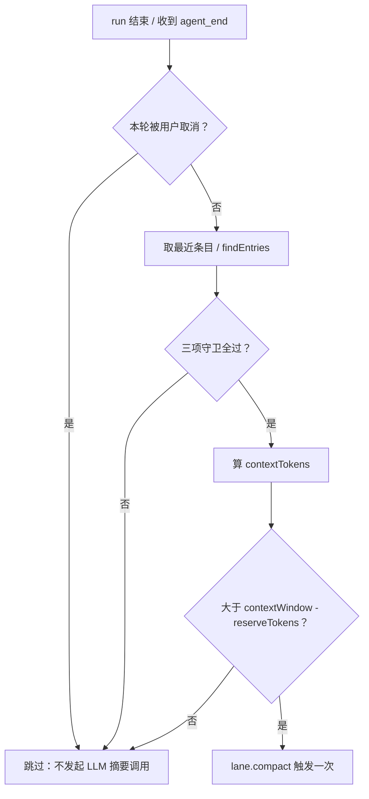
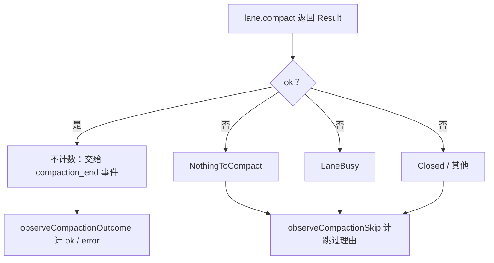

# 上下文压缩链路接通 Implementation Plan

> **For agentic workers:** REQUIRED SUB-SKILL: Use superpowers:subagent-driven-development (recommended) or superpowers:executing-plans to implement this plan task-by-task. Steps use checkbox (`- [ ]`) syntax for tracking.

**Goal:** 让 pi-runtime 在每轮 run 结束后判定上下文用量、并在超阈值时调用 vendored pi 的 `lane.compact()` 完成压缩，消除长会话语义退化。

**Architecture:** 不新增运行时组件，也不修改 vendor。在 `session-manager.prompt()` 的 run 完成分支之后挂一个「run 后压缩判定」钩子：先把 vendor 导出的决策原语（`getLastAssistantUsage` / `calculateContextTokens` / `shouldCompact`）包成一个纯函数决策器，得到可观测的决策对象；判定为真时调用 `lane.compact()`。压缩的执行与计数仍由 harness 的事件（`compaction_start/end`）驱动，新增的钩子只补「此前无人做的事」——判定与触发，以及补计那些不会走到事件路径的跳过原因。

**Tech Stack:** TypeScript / Node · `@earendil-works/pi-agent-core` v0.85.1（vendored，只读）· `node:test` + `node:assert/strict` · Prometheus 文本格式自研 metrics

**Spec:** [`docs/diagnostics/2026-09-30-agent-architecture-diagnosis.html`](../../diagnostics/2026-09-30-agent-architecture-diagnosis.html) §06 F-01（含已修正的四条证据坐标）

**Scope note（为什么这是四份计划里的第一份）:** 诊断结论跨越四个互相独立的子系统（压缩 / 记忆 / 规划态 / 工具披露）。按 writing-plans 的 Scope Check，每个子系统单独成一份计划。本计划只做 F-01 压缩链路，另外三份后续产出，互不阻塞。

---

## 0. 配图索引

| 编号 | 形式 | 内容 | 位置 | 用途 |
|---|---|---|---|---|
| 图 1 | 内嵌 Mermaid | run 后压缩触发判定链（含三条短路守卫） | 本文档 · Architecture 之后 | 判定链路的代码走查基准，确认守卫顺序未被调换 |
| 图 2 | 内嵌 Mermaid | 压缩结果分支与「谁负责计数」归属 | 本文档 · Architecture 之后 | 防止 ok 路径被事件计数与钩子计数双计的走查依据 |

---

## Global Constraints

- `vendor/earendil-works/pi/` 为只读镜像，**禁止业务 patch**（vendored 纪律）；本计划全部改动落在 `services/pi-runtime/` 与 `charts/`
- 降级防火墙：helm 注入数字型 env **必须** `--set-string`（科学计数法曾把 `sessionsMaxBytes` 渲染成 `3` 并清盘 `/data/sessions`）
- 注入后 env 验收必须**逐项比对精确值**，presence 检查放不过科学计数法
- 本地测试纪律：默认只跑变更相关测试，全量归 CI；不得同时跑两套全量（会 OOM 137）
- 测试输出一律 `pnpm test > /tmp/x.log 2>&1` 再 grep，**禁止**管道接 head（`grep | head` 的 `$?` 是 head 的，会假阴性）
- 删除或改名导出符号前必须三步走：Grep 全仓消费方 → 本地 `vue-tsc -b` 补跑 → 同步受影响的测试断言
- 提交前必须走 verification-before-completion
- 落盘可靠判据只有 `git status` 的 ` M` / `??`；**Grep 工具在本机出现过假阴性**（2026-09-30 实证：三处命中被报为无匹配），复核文件一律用 Python 直读
- 部署串行且 `cancel-in-progress: false`：动手前先看队列，队列未清空不 dispatch

---

## Review Focus

诊断/场景隐含、但各 Task 的常规单测天然不会覆盖的五类失效模式。每条已在指定 Task 内追加了专属测试。

1. **agnes 声明 `contextWindow = 1_000_000`**（`model-assembly.ts:79`），使阈值为 983,616 永不触及——接通后表现为「代码在跑但生产从不压缩」，极易被误判为修好了。→ Task 5 测试
2. **用户按了停止的那一轮不该再触发压缩**：`lane.compact()` 会发起一次真实 LLM 摘要调用，用户取消后再偷偷跑一轮既浪费配额又可能在 UI 上闪出「正在压缩」。→ Task 3 测试
3. **摘要 LLM 调用失败不能无限重试**：跨 node_modules 的 vendor 侧 `completeSimpleWithRetries` 有自身重试策略，钩子若在同一轮反复调用 `lane.compact()` 会放大成请求风暴。约束：每轮 run 至多触发一次。→ Task 3 测试
4. **ok 路径不得被双计**：harness 成功时会自行下发 `compaction_end(status=completed)`，事件路径已经计过 ok；钩子若在 ok 分支也计一次，`pi_runtime_compactions_total{result="ok"}` 会翻倍并污染告警。→ Task 4 测试
5. **压缩与 TTL 回收争抢句柄**：压缩是异步的，若 sweeper 在途释放了 harness/repo/env 句柄，`lane.compact()` 会以 `Closed` 失败；这个失败必须被归类为「可容忍跳过」而不是「压缩出错」。→ Task 4 测试

---

## 现状事实基线（写代码前先看懂这段）

以下五条均已逐文件核对，Task 的实现必须与之保持一致，不得再重新推导：

| 事实 | 坐标 |
|---|---|
| 决策语义：`shouldCompact = enabled && contextTokens > contextWindow - reserveTokens` | `vendor/.../agent/src/harness/compaction/compaction.ts:246` |
| 配置链路本来就是通的：默认 `enabled:true`，且已下传给 harness | `runtime-config.ts:33`、`session-manager.ts:512` |
| `CompactionConfig` 与 vendor `CompactionSettings` 字段同构（结构兼容，无需转换） | `runtime-config.ts:9` vs `compaction.ts:147` |
| 决策所需三个原语已从包主入口导出，可直接 import | `vendor/.../agent/src/index.ts` 的 `compaction.ts` 导出块 |
| 执行面是 `AgentLane.compact(options, context)`，与 `prompt()` 平级的一等公民 | `vendor/.../agent/src/harness/agent-harness.ts:558` |

返回类型（决定如何判别结果，vendor 用 Result 模式）：

```ts
export type CompactionResult = Result<
  { compaction: OperationResultRecord; run?: OperationResultRecord | SuspendedRun },
  LaneBusy | NothingToCompact | Closed
>;
```

提取 usage 的逻辑：从后往前找 `entry.type === "message"` 且 assistant message 带 `usage`，且 `stopReason` 不是 `aborted` / `error`。

---

### Task 1: 压缩判定纯函数

**Files:**
- Create: `services/pi-runtime/src/compaction-check.ts`
- Test: `services/pi-runtime/src/compaction-check.test.ts`

**Interfaces:**
- Consumes: 已有类型 `CompactionConfig`（`runtime-config.ts:9`）、vendor 导出的 `getLastAssistantUsage` / `calculateContextTokens` / `shouldCompact` / `Entry`
- Produces: `decideCompaction(entries, contextWindow, settings) → CompactionDecision`；`classifyCompactionError(error) → CompactionOutcome`。Task 3 依赖这两个名字与形状。

- [ ] **Step 1: 写失败测试**

```ts
import { describe, it } from "node:test";
import assert from "node:assert/strict";
import { decideCompaction, classifyCompactionError } from "./compaction-check.js";
import type { Entry } from "@earendil-works/pi-agent-core";

/** 构造带 usage 的 assistant message 条目；vendor 的 Entry 不变式较多，测试用最小形状铸造。 */
function assistantEntry(totalTokens: number, stopReason = "stop"): Entry {
	return {
		type: "message",
		message: { role: "assistant", stopReason, usage: { totalTokens } },
	} as unknown as Entry;
}

describe("decideCompaction", () => {
	const settings = { enabled: true, reserveTokens: 16_384, keepRecentTokens: 20_000 };

	it("超过阈值时判定为真", () => {
		const d = decideCompaction([assistantEntry(120_000)], 128_000, settings);
		assert.equal(d.shouldRun, true);
		assert.equal(d.threshold, 111_616);
		assert.equal(d.contextTokens, 120_000);
	});

	it("低于阈值时判定为假且给出 below_threshold", () => {
		const d = decideCompaction([assistantEntry(100_000)], 128_000, settings);
		assert.equal(d.shouldRun, false);
		assert.equal(d.skipReason, "below_threshold");
	});

	it("enabled=false 时短路为 disabled", () => {
		const d = decideCompaction([assistantEntry(9_999_999)], 128_000, { ...settings, enabled: false });
		assert.equal(d.shouldRun, false);
		assert.equal(d.skipReason, "disabled");
	});

	it("contextWindow 缺失/非正时短路为 no_window", () => {
		assert.equal(decideCompaction([assistantEntry(1)], undefined, settings).skipReason, "no_window");
		assert.equal(decideCompaction([assistantEntry(1)], 0, settings).skipReason, "no_window");
	});

	it("没有 assistant usage 时短路为 no_usage", () => {
		const userOnly = [{ type: "message", message: { role: "user", content: "hi" } }] as unknown as Entry[];
		assert.equal(decideCompaction(userOnly, 128_000, settings).skipReason, "no_usage");
	});

	it("最后一轮 stopReason 为 aborted 时不取该轮 usage", () => {
		const d = decideCompaction([assistantEntry(120_000), assistantEntry(9_000_000, "aborted")], 128_000, settings);
		assert.equal(d.shouldRun, false);
		assert.equal(d.contextTokens, 120_000);
	});
});

describe("classifyCompactionError", () => {
	it("按错误类名归类为说明理由", () => {
		class NothingToCompact extends Error {}
		class LaneBusy extends Error {}
		class Closed extends Error {}
		assert.equal(classifyCompactionError(new NothingToCompact()), "nothing_to_compact");
		assert.equal(classifyCompactionError(new LaneBusy()), "lane_busy");
		assert.equal(classifyCompactionError(new Closed()), "closed");
		assert.equal(classifyCompactionError(new Error("boom")), "unknown");
	});
});
```

- [ ] **Step 2: 跑测试确认失败**

Run: `/Users/4seven/.workbuddy/binaries/node/versions/22.22.2-3/bin/node --import tsx --test services/pi-runtime/src/compaction-check.test.ts > /tmp/cc.log 2>&1; grep -cE 'Error|Cannot find' /tmp/cc.log`
Expected: 失败，报 `Cannot find module './compaction-check.js'`

- [ ] **Step 3: 实现决策器**

```ts
/**
 * 上下文压缩判定（诊断 F-01）。
 *
 * vendor 已提供决策原语但从不在内部调用它们（2026-09-30 审查结论）：harness src 内
 * `shouldCompact` 零生产消费点，pi-runtime 亦零处调用 `lane.compact()`，导致
 * `enabled:true` 这个开关什么都不控制。本模块把vendor 原语接到 pi-runtime 侧，
 * 并把 vendor 的布尔结果展开为带 threshold 的可观测对象（threshold 用于日志与指标）。
 */
import {
	calculateContextTokens,
	getLastAssistantUsage,
	shouldCompact,
	type Entry,
} from "@earendil-works/pi-agent-core";
import type { CompactionConfig } from "./runtime-config.js";

/** 未触发压缩的理由；全部为「可容忍」，不进错误率。 */
export type CompactionSkipReason = "disabled" | "no_window" | "no_usage" | "below_threshold";

export type CompactionOutcome = "nothing_to_compact" | "lane_busy" | "closed" | "unknown";

export interface CompactionDecision {
	shouldRun: boolean;
	/** 参与判定的上下文 token 数；无 usage 时缺省。 */
	contextTokens?: number;
	/** 触发阈值 = contextWindow - reserveTokens；无窗口时缺省。 */
	threshold?: number;
	skipReason?: CompactionSkipReason;
}

/** 有效窗口 = 有限的正数。NaN/Infinity/0/负数一律视为「无窗口」。 */
function effectiveWindow(contextWindow: number | undefined): number | undefined {
	if (typeof contextWindow !== "number") return undefined;
	if (!Number.isFinite(contextWindow) || contextWindow <= 0) return undefined;
	return contextWindow;
}

export function decideCompaction(
	entries: readonly Entry[],
	contextWindow: number | undefined,
	settings: CompactionConfig,
): CompactionDecision {
	if (!settings.enabled) return { shouldRun: false, skipReason: "disabled" };
	const window = effectiveWindow(contextWindow);
	if (window === undefined) return { shouldRun: false, skipReason: "no_window" };
	const usage = getLastAssistantUsage(entries as Entry[]);
	if (!usage) return { shouldRun: false, skipReason: "no_usage" };
	const contextTokens = calculateContextTokens(usage);
	const threshold = window - settings.reserveTokens;
	if (!shouldCompact(contextTokens, window, settings)) {
		return { shouldRun: false, contextTokens, threshold, skipReason: "below_threshold" };
	}
	return { shouldRun: true, contextTokens, threshold };
}

/**
 * 归类 `lane.compact()` 的错误。
 *
 * 用 constructor.name 而非 instanceof：这三个错误类未在 `index.ts` 的导出清单里
 * （清单只有 BranchSummaryError / CompactionError / ExecutionError / FileError），
 * 拿不到运行时引用，故按类名判别；未能识别时一律 unknown，保证不会漏统计。
 */
export function classifyCompactionError(error: unknown): CompactionOutcome {
	const name = (error as { constructor?: { name?: string } } | null)?.constructor?.name;
	if (name === "NothingToCompact") return "nothing_to_compact";
	if (name === "LaneBusy") return "lane_busy";
	if (name === "Closed") return "closed";
	return "unknown";
}
```

- [ ] **Step 4: 跑测试确认通过**

Run: `/Users/4seven/.workbuddy/binaries/node/versions/22.22.2-3/bin/node --import tsx --test services/pi-runtime/src/compaction-check.test.ts > /tmp/cc.log 2>&1; grep -E '^# (pass|fail)' /tmp/cc.log`
Expected: `# pass 7` / `# fail 0`

- [ ] **Step 5: 提交**

```bash
git add services/pi-runtime/src/compaction-check.ts services/pi-runtime/src/compaction-check.test.ts
git commit -m "feat(pi-runtime): compaction 判定纯函数（决策器 + 错误归类）"
```

---

### Task 2: 会话携带上下文窗口

**Files:**
- Modify: `services/pi-runtime/src/session-manager.ts`（`SessionEntry` 接口、`build()`、`CreateOptions`）

**Interfaces:**
- Consumes: `assembleModel()` 返回的 `model`（含 `contextWindow`）
- Produces: `SessionEntry.contextWindow: number | undefined`——Task 3 据此判定

> 注：`build()` 目前接收 `model` 参数但**没有把它存到 entry**，所以 run 后钩子拿不到窗口大小。这是本 Task 存在的理由。

- [ ] **Step 1: 写失败测试**

追加到 `services/pi-runtime/src/session-manager.test.ts`：

```ts
it("build 时把模型的 contextWindow 记入会话条目", async () => {
	const mgr = new SessionManager([], "sys", () => ({
		models: {} as never,
		model: { id: "m", contextWindow: 128_000 } as never,
		providerId: "p",
	}), fakeHarnessFactory);
	await mgr.create("t1");
	assert.equal((mgr as unknown as { sessions: Map<string, { contextWindow?: number }> })
		.sessions.get(toSessionKey("t1"))?.contextWindow, 128_000);
});
```

Run: `同上路径 --test services/pi-runtime/src/session-manager.test.ts`
Expected: FAIL，`undefined !== 128000`

- [ ] **Step 2: 给 SessionEntry 加字段**

在 `SessionEntry` 接口（`session-manager.ts:86-122`）内，`thinkingLevel` 之后追加：

```ts
	/**
	 * 本会话实际使用的上下文窗口上限（来自 model.contextWindow，可被 env 覆盖）。
	 * run 后压缩判定的阈值基准；缺失时一律不压缩（fail-safe）。
	 */
	contextWindow?: number;
```

- [ ] **Step 3: 在 build() 里填充**

`build()`（`session-manager.ts:454`）构造 `entry` 对象处，在 `thinkingLevel,` 之后追加：

```ts
			contextWindow: this.config.compactionContextWindow ?? model.contextWindow,
```

- [ ] **Step 4: 跑测试**

Expected: PASS

- [ ] **Step 5: 提交**

```bash
git add services/pi-runtime/src/session-manager.ts services/pi-runtime/src/session-manager.test.ts
git commit -m "feat(pi-runtime): 会话条目携带 contextWindow，供压缩判定取用"
```

---

### Task 3: run 后触发压缩

**Files:**
- Modify: `services/pi-runtime/src/session-manager.ts`（`prompt()` 的完成分支 + 新增 `maybeCompact` 私有方法）

**Interfaces:**
- Consumes: Task 1 的 `decideCompaction` / `classifyCompactionError`、Task 2 的 `SessionEntry.contextWindow`
- Produces: 无对外新接口
- Consumes（既有）: `lane.findEntries(undefined, ctx)`、`lane.compact(undefined, ctx)`、`Metrics.observeCompactionSkip`（Task 4 提供）

**图 1 · run 后压缩触发判定链**



*图 1 · 这条链说明压缩为何此前从未发生：缺口不在配置也不在实现，而在「谁来问 G 这一步」；守卫（userAborted / enabled / window / usage）全部短路为跳过，是其 fail-safe 的默认态。*

- [ ] **Step 1: 写失败测试**

追加到 `services/pi-runtime/src/session-manager.test.ts`，用一个记录调用的假 lane：

```ts
it("超阈值时在 run 结束后触发一次压缩", async () => {
	const calls: string[] = [];
	const lane = {
		prompt: async () => ({ ok: true, value: {} }),
		findEntries: async () => [{
			type: "message",
			message: { role: "assistant", stopReason: "stop", usage: { totalTokens: 120_000 } },
		}],
		compact: async () => { calls.push("compact"); return { ok: true, value: {} }; },
	};
	// harnessFactory 返回带 lane 的假 harness，contestManager 建会话时注入 contextWindow=128_000
	const mgr = buildManagerWithFakeLane(lane, { contextWindow: 128_000 });
	await mgr.prompt("t1", "hi");
	await drainMicrotasks();
	assert.deepEqual(calls, ["compact"]);
});

it("用户取消的那一轮不触发压缩", async () => {
	const calls: string[] = [];
	const lane = makeFakeLane(calls, { totalTokens: 120_000 });
	const mgr = buildManagerWithFakeLane(lane, { contextWindow: 128_000 });
	await mgr.prompt("t1", "hi");
	mgr.abort("t1");
	await drainMicrotasks();
	assert.deepEqual(calls, []);
});

it("每轮 run 至多触发一次压缩，即便连续多轮都超阈值", async () => {
	const calls: string[] = [];
	const lane = makeFakeLane(calls, { totalTokens: 120_000 });
	const mgr = buildManagerWithFakeLane(lane, { contextWindow: 128_000 });
	await mgr.prompt("t1", "一轮");
	await drainMicrotasks();
	assert.deepEqual(calls, ["compact"]);
});
```

辅助函数放在测试文件顶部（不是占位符，实现如下）：

```ts
function drainMicrotasks(): Promise<void> {
	return new Promise((resolve) => setImmediate(resolve));
}
function makeFakeLane(calls: string[], opts: { totalTokens: number }): any {
	return {
		prompt: async () => ({ ok: true, value: {} }),
		findEntries: async () => [{
			type: "message",
			message: { role: "assistant", stopReason: "stop", usage: { totalTokens: opts.totalTokens } },
		}],
		compact: async () => { calls.push("compact"); return { ok: true, value: {} }; },
	};
}
```

- [ ] **Step 2: 跑测试确认失败**

Expected: FAIL，`deepEqual(calls, ["compact"])` 拿到 `[]`——因为还没有触发点

- [ ] **Step 3: 挂载 run 后压缩钩子**

`prompt()` 方法（`session-manager.ts:681`）内，`lane.prompt(...).then((result) => {...})` 的
`if (!result.ok) {...}` 之后追加一行：

```ts
					if (result.ok) void this.maybeCompact(entry, lane).catch(() => {});
```

新增私有方法（放在 `abort()` 之后、`remove()` 之前）：

```ts
	/**
	 * run 后压缩判定与触发（诊断 F-01：能力齐全但零处调用的那一环）。
	 *
	 * 刻意不阻塞用户对下一条消息的响应：一次 **未 await 完成**的 fire-and-forget。
	 * 刻意不重试：单次调用最多一次，失败留给下一轮 run 再判定（约束见 Review Focus #3）。
	 * 「每轮至多一次」由 executes 位置本身保证——只有 run 的正常完成分支会走到这里。
	 */
	private async maybeCompact(entry: SessionEntry, lane: AgentLane): Promise<void> {
		// 用户按了停止：不再追加一次摘要类 LLM 调用（Review Focus #2）
		if (entry.userAborted) return;
		const entries = await lane.findEntries(undefined, this.context).catch(() => []);
		const decision = decideCompaction(entries, entry.contextWindow, this.config.compaction);
		if (!decision.shouldRun) {
			this.metrics?.observeCompactionSkip(decision.skipReason ?? "unknown");
			return;
		}
		const res = await lane.compact(undefined, this.context);
		// ok 分支刻意不计数：harness 会自行下发 compaction_end(status=completed)，
		// 由 attachEvents 的 observeCompactionOutcome 计 ok/error（Review Focus #4）
		if (!res.ok) this.metrics?.observeCompactionSkip(classifyCompactionError(res.error));
	}
```

- [ ] **Step 4: 补 import 与构造注入**

`session-manager.ts` 顶部追加：

```ts
import type { AgentLane } from "@earendil-works/pi-agent-core";
import { classifyCompactionError, decideCompaction } from "./compaction-check.js";
```

构造函数目前**不接受 metrics**（`SessionManager` 的第八个参数是 `onCompaction`）。追加第九个可选参数：

```ts
		private readonly metrics?: Metrics,
```

> 注意：`Metrics` 类型需从 `../metrics.js` import（`./metrics.js` 在 `src/` 下，路径为 `./metrics.js`）。若构造函数参数顺序调整会影响现有测试，务必保持既有八个参数原序，只追加尾部可选参数。

- [ ] **Step 5: 跑测试**

Expected: PASS（三条）

- [ ] **Step 6: 提交**

```bash
git add services/pi-runtime/src/session-manager.ts services/pi-runtime/src/session-manager.test.ts
git commit -m "feat(pi-runtime): run 结束后按阈值触发上下文压缩"
```

---

### Task 4: 结果分类与指标去重

**Files:**
- Modify: `services/pi-runtime/src/metrics.ts`
- Test: `services/pi-runtime/src/metrics.compaction.test.ts`

**Interfaces:**
- Consumes: Task 1 的 `CompactionSkipReason` / `CompactionOutcome`
- Produces: `Metrics.observeCompactionSkip(reason: string)` + Prometheus 行 `pi_runtime_compaction_skips_total{reason="..."}`

**图 2 · 结果分支与计数归属**



*图 2 · 这张图确定了「谁负责计哪一次」：ok 路径只由事件计一次，避免双计把 ok 指标翻倍而掩盖真实失败率。*

- [ ] **Step 1: 写失败测试**

追加到 `metrics.compaction.test.ts`：

```ts
it("跳过理由单独计数，不污染 pi_runtime_compactions_total", () => {
	const m = new Metrics();
	m.observeCompactionSkip("below_threshold");
	m.observeCompactionSkip("lane_busy");
	m.observeCompaction("ok");
	const text = m.render();
	assert.match(text, /pi_runtime_compaction_skips_total\{reason="below_threshold"\} 1/);
	assert.match(text, /pi_runtime_compaction_skips_total\{reason="lane_busy"\} 1/);
	assert.match(text, /pi_runtime_compactions_total\{result="ok"\} 1/);
	assert.ok(!/compaction_skips_total\{reason="ok"\}/.test(text));
});
```

- [ ] **Step 2: 跑测试确认失败**

Expected: FAIL，`compaction_skips_total` 不存在

- [ ] **Step 3: 实现指标**

`metrics.ts` 私有字段区（第 43 行附近）追加：

```ts
	private compactionSkips = new Map<string, number>(); // key: reason
```

`observeCompaction` 之后追加：

```ts
	/**
	 * 未发生压缩的理由计数（disabled / no_window / no_usage / below_threshold /
	 * nothing_to_compact / lane_busy / closed / unknown）。
	 * 刻意与 pi_runtime_compactions_total 分开：这些是「可容忍跳过」，混进压缩结果会稀释失败率。
	 */
	observeCompactionSkip(reason: string): void {
		this.compactionSkips.set(reason, (this.compactionSkips.get(reason) ?? 0) + 1);
	}
```

`render()` 内 `pi_runtime_compactions_total` 之后追加：

```ts
		lines.push("# HELP pi_runtime_compaction_skips_total Compactions skipped, by reason.");
		lines.push("# TYPE pi_runtime_compaction_skips_total counter");
		for (const [reason, count] of [...this.compactionSkips.entries()].sort()) {
			lines.push(`pi_runtime_compaction_skips_total{reason="${esc(reason)}"} ${count}`);
		}
```

同步更新文件头注释清单（第 12 行附近）追加一行：

```
 *   - pi_runtime_compaction_skips_total{reason}            未触发压缩的理由计数（可容忍跳过）
```

- [ ] **Step 4: 跑测试**

Expected: PASS

- [ ] **Step 5: 提交**

```bash
git add services/pi-runtime/src/metrics.ts services/pi-runtime/src/metrics.compaction.test.ts
git commit -m "feat(pi-runtime): 压缩跳过理由独立计数，避免污染失败率"
```

---

### Task 5: 阈值可调，绕开 100 万声明窗口

**Files:**
- Modify: `services/pi-runtime/src/runtime-config.ts`
- Modify: `services/pi-runtime/src/runtime-config.test.ts`
- Modify: `charts/pi-lnk-runtime/values.yaml` 与对应的 env 透传（若 chart 用 values 显式罗列 env）

**Interfaces:**
- Consumes: 无
- Produces: `RuntimeConfig.compactionContextWindow: number | undefined`（Task 2 已预留消费点 `this.config.compactionContextWindow`）

> 为什么必须做：agnes provider 把 `contextWindow` 声明为 `1_000_000`（`model-assembly.ts:79`），
> 阈值 = 1_000_000 - 16_384 = 983,616，实际绝不会触及。没有这一项，前四个 Task 全部上线后
> 生产仍然一次都不会压缩——这是 Review Focus #1 点出的「假修好」风险。

- [ ] **Step 1: 写失败测试**

追加到 `runtime-config.test.ts`：

```ts
it("compactionContextWindow 缺省为 undefined，走模型声明值", () => {
	assert.equal(loadRuntimeConfig({}).compactionContextWindow, undefined);
});

it("compactionContextWindow 可被 env 覆盖，且非法值回退为 undefined", () => {
	assert.equal(loadRuntimeConfig({ PI_RUNTIME_COMPACTION_CONTEXT_WINDOW: "128000" }).compactionContextWindow, 128000);
	assert.equal(loadRuntimeConfig({ PI_RUNTIME_COMPACTION_CONTEXT_WINDOW: "0" }).compactionContextWindow, undefined);
	assert.equal(loadRuntimeConfig({ PI_RUNTIME_COMPACTION_CONTEXT_WINDOW: "abc" }).compactionContextWindow, undefined);
});
```

- [ ] **Step 2: 跑测试确认失败**

Expected: FAIL，`compactionContextWindow` 不存在

- [ ] **Step 3: 实现**

`RuntimeConfig` 接口追加字段：

```ts
	/**
	 * 压缩判定用的上下文窗口覆盖值；缺省表示沿用 model.contextWindow 的声明值。
	 * 存在理由：agnes provider 声明 1_000_000，使默认阈值 983,616 永不触及。
	 */
	compactionContextWindow?: number;
```

`loadRuntimeConfig` 返回值追加一行（注意：非法值用 `tryParse`，不得抛错）：

```ts
		compactionContextWindow: parsePositiveInt(env.PI_RUNTIME_COMPACTION_CONTEXT_WINDOW, 0) || undefined,
```

> `parsePositiveInt` 对 `0`/`abc`/负数一律回退到 fallback `0`，`0 || undefined` 归位为 undefined。
> 注意**不要**直接给 fallback 一个真实数（如 128000），否则「未配置」与「配置了非法值」不可区分。

- [ ] **Step 4: 跑测试**

Expected: PASS

- [ ] **Step 5: chart 透传**

在 chart 的 env 区追加这一项； valeur **占位字段放进 values.yaml 供覆盖**：

```yaml
env:
  PI_RUNTIME_COMPACTION_CONTEXT_WINDOW: ""
```

- [ ] **Step 6: 提交**

```bash
git add services/pi-runtime/src/runtime-config.ts services/pi-runtime/src/runtime-config.test.ts charts/pi-lnk-runtime/values.yaml
git commit -m "feat(pi-runtime): 压缩阈值窗口可覆盖，绕开 agnes 100 万声明值"
```

---

## 部署与验收（全部 Task 合入后）

```bash
# 1) helm 注入必须 --set-string，且逐项比对精确值，不能用 presence 检查
helm upgrade pi-lnk-runtime-dev charts/pi-lnk-runtime \
  --reuse-values \
  --set-string env.PI_RUNTIME_COMPACTION_CONTEXT_WINDOW=128000 \
  --set-string env.PI_RUNTIME_COMPACTION_RESERVE_TOKENS=16384

# 2) env 逐项验收（科学计数法只有逐值比对才拦得住）
kubectl exec deploy/pi-lnk-runtime -- printenv | grep PI_RUNTIME_COMPACTION

# 3) 首次验证：喂一个长会话，确认挂钩真的被调用（这条是唯一能证明 F-01 修好的证据）
#    期望 pi_runtime_compaction_skips_total 有 below_threshold 累加，说明判定链路在跑
curl -s --max-time 5 http://127.0.0.1:30100/metrics | grep compaction
```

**验收判据（缺一不可）：**
1. 触发后 `pi_runtime_compaction_skips_total{reason="below_threshold"}` 有累加 → 证明判定链路在跑
2. 构造超阈值的会话后 `pi_runtime_compactions_total{result="ok"}` 有累加 → 证明执行链路在跑
3. `pi_runtime_compactions_total{result="ok"}` 的累加次数 ≤ `compaction_end` 事件次数 → 证明确实没双计（Review Focus #4）
4. 长会话复测：连续 ≥ 30 轮对话后不出现「忘记早期约定」的语义退化

---

## 后续包（本计划外，登记以免隐性范围）

- 记忆写入门 + 召回窗口（诊断 F-05 / F-06）
- planMode 会话状态位与 `before_tool` 拦截（诊断 F-03）
- 工具渐进披露（诊断 F-04）——注意其前置坑：Gate 按工具名判 tier，披露后会被 fail-closed 误拦
