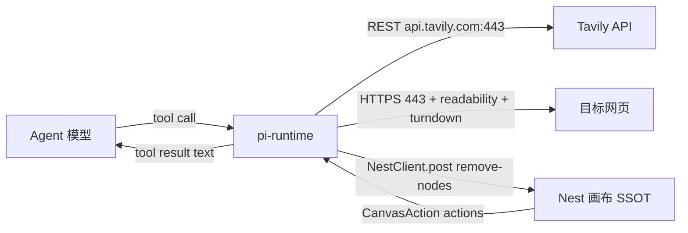

# P0 工具补齐设计规格：web_search / web_fetch / delete_nodes + 拍板项

状态：已拍板待开发（D1–D5 已确认按推荐，2026-09-28；范围由 agent 工具缺口分析拍板「都按默认」）
前置：pi-runtime 工具注册体系（已上线 0.0.11）；Nest `/agent/internal/remove-nodes` 端点（已存在，W31）
分支约定：实现走 feature 分支 + PR + squash merge。

## 0. 配图索引（结构与视觉两类，均随本文档演进）

本文档的图分两类：**结构图**一律以 Mermaid 内嵌；**视觉稿**以 `assets/` 下的 SVG 附件承载（相对路径引用）。本规格只有结构图，无视觉稿（纯后端工具契约，无 UI 像素级布局）。

| 编号 | 形式 | 内容 | 位置 | 用途 |
|---|---|---|---|---|
| 图 1 | 内嵌 Mermaid flowchart | web_search / web_fetch / delete_nodes 三工具的调用链路与依赖 | §5 | 验收「不重复造轮子」边界：search 走 Tavily API、fetch 复用 MCP fetch 同款 npm 栈、delete 只包既有 Nest 端点 |

## 1. 目标

1. 补齐 pi-runtime agent 的**感知层**：`web_search`（检索）+ `web_fetch`（抓取 URL 转 markdown），对齐业界 agent 工具最佳实践（Anthropic WebSearch/WebFetch、MCP fetch server），**不自研检索/HTML 解析**
2. 补齐**破坏性操作**：`delete_nodes` 工具——agent 目前「能建不能删」，Nest 端点已存在（W31），pi-runtime 零 Nest 改动包一层
3. 清理拍板悬置项：`introduce_nodes_to_agent` 正式判「有意不支持」+ 回归锁；`ToolTier` 死枚举（`workflow_io`/`export`）删除

## 2. 范围（含明确不做）

**在范围**：
- pi-runtime 新增 `web_search` / `web_fetch` 工具（tier=read，新文件 `tools/web.ts`）
- pi-runtime 新增 `delete_nodes` 工具（tier=destructive，新文件 `tools/delete-nodes.ts`）
- `tools/config.ts` 装配条件：`TAVILY_API_KEY` 缺失时 web 工具不注册（对齐现有纯文本降级哲学）
- `tools/types.ts` `ToolTier` 枚举删除 `workflow_io` / `export`
- `tools/config.test.ts` 工具总数断言 32→35 + introduce_nodes_to_agent 回归锁
- `charts/pi-lnk-runtime/values.yaml` secrets 注释加 `TAVILY_API_KEY`（部署时 `--set` 注入，仓库不落明文）
- pi-runtime `package.json` 新增依赖：`@mozilla/readability`、`turndown`、`jsdom`（fetch 栈）；**不装 Tavily SDK**（REST 直调，省一个包）

**不在范围**（显式不做，避免隐性范围）：
- 不做 `remove_edges` 独立工具（`delete_nodes` 已自动清理关联边，见 §5.3；独立删边登记 §12 后续包）
- 不做 delete 前的交互式 HITL 审批（画布有 undo/redo 兜底，v1 直接执行；若误删率高再上 before_tool 审批）
- 不做 fetch 内容的小模型摘要（Claude Code WebFetch 模式）——v1 用截断 + `start_index` 续读（MCP fetch 模式），pi-runtime 无小模型通道，加摘要 = 新增一次 Agnes 调用，YAGNI
- 不做 http:// 纯 HTTP 站点抓取支持（netpol egress 白名单只放行 443，见 §7 限制）
- 不动 P1 项（read_document / memory / task_plan / analyze_images——另立 spec）
- 不改 vendored pi harness、不加 MCP 客户端

## 3. 与既有规格的关系

- **显式复用** `NestClient.post` + `textResult` + `TOOL_TIMEOUT_OVERRIDES` 模式（`nest-client.ts` / `canvas-read.ts` 现有）——web 与 delete 工具按同款模式装配
- **显式复用** Nest `POST /agent/internal/remove-nodes`（`agent-canvas-tools.controller.ts:982`，DTO: `{sessionId, nodeIds, stage?}`）——服务端已自动删除关联边（`agent-canvas-tools.service.ts:752` 起），pi-runtime 零 Nest 改动
- **显式复用** `config.ts` 环境降级模式（`loadNestConfig` 缺失 → 工具不注册）——扩展到 `TAVILY_API_KEY`
- **显式推翻** 无：不修改任何现有工具的 schema/tier/语义

## 4. 规范与判据

- **不重复造轮子判据**：search 走 Tavily REST API（agent 检索事实标准，返回 LLM-ready 清洗内容；免费 1000 次/月，项目无真实流量绰绰有余）；fetch 用 `@mozilla/readability`（正文抽取）+ `turndown`（HTML→markdown）——MCP fetch server 同款技术栈。检索源/HTML 栈均不得自研
- **fail-closed 判据**：`TAVILY_API_KEY` 未配置 → `web_search`/`web_fetch` **不注册**（不是注册后报错）——对齐 `config.ts` NEST 降级哲学，工具列表永远真实
- **toolContext 安全判据**：`delete_nodes` 的 `sessionId` 只取 `toolContext.sessionId`（Nest 注入），**schema 不暴露 sessionId 参数**——模型入参不可覆盖会话归属（对齐 toolContext 安全模型）；`node_ids` 单次上限 50
- **SSRF 判据**：`web_fetch` 抓取前做 URL 校验纯函数——协议限 http/https、hostname 黑名单（localhost/127.0.0.0/8、10.0.0.0/8、172.16.0.0/12、192.168.0.0/16、169.254.0.0/16、::1、0.0.0.0）；DNS rebinding 不深防（pod 内 netpol 白名单本身限制内网可达面，记录为已知限制）
- **截断判据**：`web_fetch` 单次返回 ≤20,000 字符 markdown，超出部分不丢弃——返回尾部附 `…[截断，共 N 字符，续读用 start_index=M]`，模型带 `start_index` 再调续读（MCP fetch 模式）；15 分钟内存缓存（Map，对齐 Claude Code WebFetch 15min cache）
- **tier 判据**：web 双工具 = `read`；delete_nodes = `destructive`（v1 无 gate 消费方，tier 仅用于 metrics 分组与未来审批挂点）
- **超时判据**：web_search 15s、web_fetch 20s——进 `TOOL_TIMEOUT_OVERRIDES` 由 NestClient 统一管理（无 `/agent/internal` 前缀，本地 fetch 不走 Nest，直接在工具内 fetch，用 AbortController）

## 5. 架构与契约

调用链路见图 1。



*图 1 · P0 三工具调用链路——search/fetch 直连外网（netpol 443 已放行），delete 复用既有 Nest 端点*

### 5.1 web 工具定义（新增 `services/pi-runtime/src/tools/web.ts`）

```ts
import { Type } from "@sinclair/typebox";
import type { LnkpiTool } from "./types.js";

const SEARCH_TIMEOUT = 15_000;
const FETCH_TIMEOUT = 20_000;
const FETCH_MAX_CHARS = 20_000;
const CACHE_TTL = 15 * 60 * 1000;

export function isPrivateHost(hostname: string): boolean {
	// 纯函数，§8 测试锁：localhost / 127.* / 10.* / 172.16-31.* / 192.168.* / 169.254.* / ::1 / 0.0.0.0
}

export function truncateMarkdown(md: string, startIndex: number): { text: string; total: number; next: number | null } {
	// 纯函数：20k 窗口 + next 指针（§8 测试锁）
}

export function buildWebTools(): LnkpiTool[] {
	const cache = new Map<string, { ts: number; md: string }>(); // 模块级缓存，15min TTL
	return [
		{
			tier: "read",
			name: "web_search",
			label: "网络搜索",
			summary: "Search the web and return LLM-ready results (title/url/content).",
			description:
				"Search the web via Tavily. Returns up to max_results entries with title, url and a cleaned content excerpt. Use before web_fetch to discover sources.",
			parameters: Type.Object({
				query: Type.String({ description: "search query" }),
				max_results: Type.Optional(Type.Number({ description: "1-10, default 5" })),
			}),
			execute: async (_id, p) => {
				// POST https://api.tavily.com/search {api_key: env.TAVILY_API_KEY, query, max_results, search_depth: "basic", include_raw_content: false}
				// 映射 results[] → "title\nurl\ncontent(截1k)" 块，总输出 ≤8k chars；失败返回 textResult 明确错误（不 throw 裸栈）
			},
		},
		{
			tier: "read",
			name: "web_fetch",
			label: "抓取网页",
			summary: "Fetch a URL and return readable markdown (20k window, start_index to continue).",
			description:
				"Fetch a public https URL, extract main content with Readability, convert to markdown. Long pages return a 20k-char window; pass start_index to continue reading.",
			parameters: Type.Object({
				url: Type.String({ description: "http(s) URL of a public page" }),
				start_index: Type.Optional(Type.Number({ description: "character offset to continue a truncated fetch" })),
			}),
			execute: async (_id, p) => {
				// ① URL/SSRF 校验（isPrivateHost）② 缓存命中 ③ fetch（AbortController 20s, UA 标识, content-type 限 text/html|text/plain，非 HTML 返回明确「不支持 PDF 等」提示）④ Readability+turndown ⑤ truncateMarkdown(start_index)
			},
		},
	];
}
```

**设计决策**：
- Tavily 响应映射为 `title / url / content` 纯文本块（`include_raw_content:false` 不拉全文，全文抓取由 `web_fetch` 按需负责——两工具职责分离，对齐 Anthropic WebSearch/WebFetch 分工）
- fetch 直接在 pi-runtime 内 `globalThis.fetch`，不走 NestClient（`/agent/internal` 前缀的超时表不适用），AbortController 自管超时
- 非 HTML content-type（PDF/图片）明确返回不支持提示，不静默喂乱码

### 5.2 delete_nodes 工具定义（新增 `services/pi-runtime/src/tools/delete-nodes.ts`）

```ts
import { Type } from "@sinclair/typebox";
import type { LnkpiTool } from "./types.js";
import type { NestClient } from "./nest-client.js";

export function buildDeleteNodesTools(client: NestClient): LnkpiTool[] {
	return [{
		tier: "destructive",
		name: "delete_nodes",
		label: "删除节点",
		description:
			"Delete canvas nodes by id. Edges connected to deleted nodes are removed automatically. Max 50 nodes per call. The canvas supports undo, but prefer confirming scope with the user for large deletions.",
		parameters: Type.Object({
			node_ids: Type.Array(Type.String(), { min: 1, max: 50, description: "node ids to delete" }),
		}),
		execute: async (_id, p, tc) => {
			// sessionId 只取 tc.sessionId（fail-closed），node_ids 透传
			// client.post("/agent/internal/remove-nodes", { sessionId: tc.sessionId, nodeIds: p.node_ids })
			// 返回 textResult(删除统计：n nodes + m edges removed)
		},
	}];
}
```

**设计决策**：
- `stage` 参数 v1 不透传（恒默认直接删）；若未来要「先标删后确认」再扩 schema
- 注册进 `config.ts` 装配列表（NEST env 齐全即注册，与画布工具同命运）

### 5.3 装配与断言（`tools/config.ts` + `tools/config.test.ts` + `tools/types.ts`）

```ts
// config.ts resolveToolsWithClient 内：
const hasTavily = !!process.env.TAVILY_API_KEY;
const tools: LnkpiTool[] = [
	...buildCanvasReadTools(client),
	...buildCanvasWriteTools(client),
	...buildUiCommandTools(metrics),
	...buildAskUserTools(metrics),
	...buildArrangeNodesTools(metrics),
	...buildGenerationTools(client),
	...(hasTavily ? buildWebTools() : []),
	...buildDeleteNodesTools(client),
];
```

- `config.test.ts`：`assert.equal(tools.length, 35)`（现值 32 + web_search + web_fetch + delete_nodes；TAVILY_API_KEY 未设时 33）+ **回归锁**：`assert.ok(!names.includes("introduce_nodes_to_agent"))` 注释标明「有意不支持，2026-09-28 拍板」
- `types.ts`：`ToolTier` 删除 `"workflow_io" | "export"`（全仓无消费方，dead 占位；grep 复核 metrics/gate 无引用）

## 6. 主场景规格（可验收）

**场景 A：检索→抓取→落画布**——用户「找几张包豪斯海报参考」→ agent `web_search({query:"Bauhaus poster design examples"})` → 返回 5 条 title/url/content → agent 选优 `web_fetch({url})` 续读全文 → 结合上下文产出 prompt 并 `upsert_prompt_node`。全程感知层闭环，无幻觉来源。

**场景 B：长文续读**——`web_fetch` 返回 20k 窗口 + `next` 指针 → agent 带 `start_index` 再调 → 拿到后续窗口。两次调用拼接后语义连续。

**场景 C：清理画布**——用户「把刚才的废稿删了」→ agent `get_canvas_layout` 定位 → `delete_nodes({node_ids:[...]})` → Nest 返回 actions → textResult「已删 3 节点 + 2 关联边」→ 前端画布经既有 CanvasAction 通道同步（W31 老链路已消费）。

**场景 D：降级**——未配 `TAVILY_API_KEY` 的环境（本地 dev / 维护态）→ 工具列表无 web_search/web_fetch，模型不感知其存在；delete_nodes 不受影响。

## 7. 数据与状态变更

- 无 DB 变更（remove-nodes 走既有 session canvas SSOT；web 工具无状态）
- fetch 缓存为模块级 Map（进程内存，15min TTL，重启即清，不落盘）
- helm：`values.yaml` secrets 段注释加 `TAVILY_API_KEY`（同 `AGNES_API_KEY` 模式，部署时 `--set secrets.TAVILY_API_KEY=<值>` 注入，仓库不落明文）
- netpol：pi-runtime pod egress 白名单已放行 53/443 → Tavily(443) 与目标网站(443) 可达；**http:// 80 端口被 netpol 拦截**——http-only 站点 fetch 失败为已知限制（有意不支持，错误信息明确提示「仅支持 https」）

## 8. 纯函数与算法

- `isPrivateHost(hostname)`：私网/loopback 黑名单判定，纯函数，独立测试锁（含 `172.17.x` 边界、IPv6 `::1`、`0.0.0.0`）
- `truncateMarkdown(md, startIndex)`：20k 窗口切分 + `{text,total,next}` 指针，纯函数，测试锁（边界：恰好 20k、20k+1、startIndex 越界）
- Tavily 响应→文本块映射、删除统计文案组装：纯函数，mock 响应测试

## 9. 文件级改动清单

| 文件 | 改动 | 行数估 |
|---|---|---|
| `services/pi-runtime/src/tools/web.ts` | 新增 web_search + web_fetch + 纯函数 | ~150 |
| `services/pi-runtime/src/tools/web.test.ts` | SSRF/截断/映射/降级测试 | ~130 |
| `services/pi-runtime/src/tools/delete-nodes.ts` | 新增 delete_nodes | ~50 |
| `services/pi-runtime/src/tools/delete-nodes.test.ts` | sessionId fail-closed / 上限 50 / 返回统计 | ~60 |
| `services/pi-runtime/src/tools/registry.ts` | `buildWebTools` / `buildDeleteNodesTools` 导出工厂 | ~8 |
| `services/pi-runtime/src/tools/config.ts` | TAVILY 条件装配 + delete 装配 | ~5 |
| `services/pi-runtime/src/tools/config.test.ts` | 32→35 断言 + TAVILY 缺省 33 断言 + introduce 回归锁 | ~10 |
| `services/pi-runtime/src/tools/types.ts` | ToolTier 删 workflow_io/export | ~2 |
| `services/pi-runtime/package.json` | + `@mozilla/readability` `turndown` `jsdom` + `@types/turndown` | ~4 |
| `charts/pi-lnk-runtime/values.yaml` | secrets 注释 + TAVILY_API_KEY 占位 | ~2 |

总计 ~420 行。**零 Nest 改动、零前端改动、无 DB / 迁移**。

## 10. 测试策略与验收标准

- `web.test.ts`：isPrivateHost 全黑名单分支；truncateMarkdown 窗口边界；Tavily 响应映射（mock fetch）；content-type 非 HTML 拒绝；缓存命中不二次外呼；TAVILY_API_KEY 缺失 execute 返回明确错误文案（防御层，主防线是不注册）
- `delete-nodes.test.ts`：schema 无 sessionId 字段（安全锁）；node_ids >50 拒绝；NestClient mock 调用参数含 `tc.sessionId`
- `config.test.ts`：有/无 TAVILY_API_KEY 两态断言；introduce_nodes_to_agent 回归锁；tier 枚举无 workflow_io/export
- `tsc --noEmit` + pi-runtime 全量 vitest 绿
- 目视验收（生产 pi-runtime 0.0.12）：对话里让 agent 搜一个真实主题并抓一个 URL，观察 tool result 有真实内容；画布删 2 节点后前端同步消失且可 Ctrl+Z 撤销

## 11. 决策点（已拍板，2026-09-28，按推荐默认）

- ✅ **D1 检索源 = Tavily**：免费 1000 次/月 + agent 生态事实标准 + 返回 LLM-ready 内容；将来换源在 `web.ts` 内改一个函数，不扩散
- ✅ **D2 fetch 长文策略 = 截断 + start_index 续读**（MCP fetch 模式），非小模型摘要——pi-runtime 无小模型通道，YAGNI
- ✅ **D3 delete v1 免交互审批**：画布 undo/redo 兜底 + 单次上限 50；若误删率高再上 before_tool 审批（tier=destructive 已预留挂点）
- ✅ **D4 `introduce_nodes_to_agent` 有意不支持**：回归测试锁住，schema 不暴露
- ✅ **D5 死 tier 删除**：`workflow_io`/`export` 从 ToolTier 枚举移除（老 runtime 遗留占位，全仓无消费方）

## 12. 后续包 / 路线图（本包外，登记避免隐性范围）

- P1：`read_document`（侧栏 PDF/docx 附件正文，需先核实 `validateSidebarAttachments` 清洗深度）、跨会话 `memory`（userId 落库）、`task_plan` 进度板（ui_command 家族）、`analyze_images` 对比选优
- P2：`remove_edges` 独立工具、`web_search` 结果观测（`/metrics` 加 `pi_runtime_web_tool_calls`）、fetch 缓存 LRU 化（当前 Map 无上限，v1 靠 TTL + 低频场景可接受）
- 搁置：export/workflow 系（无商业流量，待需求出现再立项）、create_skill（agent 自造 skill，等 skill 生态成熟）

## 13. 配图规范自检

```
pnpm verify-spec-figures --file docs/superpowers/specs/2026-09-28-agent-tool-p0-web-and-delete-design.md
```

预期：通过（图 1 为内嵌 Mermaid flowchart，§0 索引已登记，图注已写用途，正文 §5 已引用图 1）。本规格无视觉稿附件。
