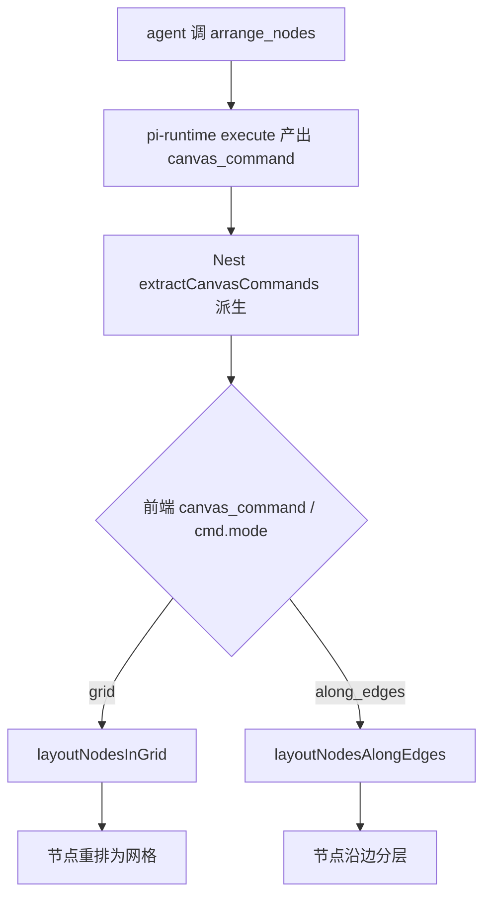

# arrange_nodes 工具设计规格

状态：已拍板待开发（D1–D5 已确认按推荐，2026-09-28）
前置：pi-runtime drop-in skill 体系（已上线，pi-runtime 0.0.10）；前端 `useCanvasGrouping` 布局函数（已上线：`layoutNodesInGrid` / `layoutNodesAlongEdges`）；`canvas_command` SSE 通道与 `extractCanvasCommands` 派生（已上线）
分支约定：实现走 feature 分支 + PR + squash merge。

## 0. 配图索引（结构与视觉两类，均随本文档演进）

本文档的图分两类：**结构图**一律以 Mermaid 内嵌；**视觉稿**以 `assets/` 下的 SVG 附件承载（相对路径引用）。本规格只有结构图，无视觉稿（纯工具契约 + 前端函数路由，无像素级布局）。

| 编号 | 形式 | 内容 | 位置 | 用途 |
|---|---|---|---|---|
| 图 1 | 内嵌 Mermaid flowchart | arrange_nodes 从工具调用到前端布局函数路由 | §5 | 验收 grid/along_edges 双模式复用现有 useCanvasGrouping 函数，零新建布局算法 |

## 1. 目标

1. 给 pi-runtime agent 一个 `arrange_nodes` 工具，能触发前端 `layoutNodesInGrid`（网格）或 `layoutNodesAlongEdges`（沿边分层）自动排列一批节点——补 pi 当前"agent 无工具控多节点排列"的缺口
2. 复用现有 `useCanvasGrouping` 布局函数与 `canvas_command` SSE 通道，**不新建布局算法、不改节点坐标数据模型**
3. 单向 UI 命令（非阻塞、无回流），比 `ask_user` 简单——布局是即触即发的 UI 动作，不需用户回复

## 2. 范围（含明确不做）

**在范围**：
- pi-runtime 新增 `arrange_nodes` 工具（tier=ui_command，非阻塞单向）
- `PiCanvasCommand` DTO 扩 `node_ids?` / `mode?` / `gap?` / `edges?` 可选字段
- 前端 `AgentSideRail.vue` canvas_command 分支新增 `arrange_nodes` 渲染分支，按 `mode` 路由到 `layoutNodesInGrid` 或 `layoutNodesAlongEdges`
- 复用现有 `useCanvasGrouping` 函数，**零新建布局算法**

**不在范围**（显式不做）：
- 不新建布局算法（网格 cols=ceil(√n) 与沿边分层 assignRanks 均已实现于 `useCanvasGrouping.ts`）
- 不改节点坐标数据模型（`upsert_media_node` 仍无 x/y，节点位置仍由前端持有；arrange_nodes 只改既有节点 position，不入库）
- 不改工具阻塞语义（单向 UI 命令，execute 立即返回，无 user message 回流）
- 不动 DB / helm / 部署链路
- 不取代用户手动选区布局（前端用户选区 → `layoutNodesInGrid` 的既有路径保留；arrange_nodes 是 agent 触发的并行路径）

## 3. 与既有规格的关系

- **显式复用** `useCanvasGrouping.layoutNodesInGrid`（`apps/web/src/composables/useCanvasGrouping.ts:230`）与 `layoutNodesAlongEdges`（同文件 :374）——零新建布局逻辑
- **显式复用** `canvas_command` SSE 通道与 `extractCanvasCommands`（`apps/server/src/agent/pi-runtime/pi-events.ts:121`）——同 `ask_user` spec 模式，只新增一个 `type` 值 `arrange_nodes`
- **显式复用** `uiResult` 返回格式（`services/pi-runtime/src/tools/ui-command.ts:17`）
- **与 `ask_user` spec 的关系**：`arrange_nodes` 与 `ask_user` 同属 ui_command tier 的 canvas_command 工具族，但 `arrange_nodes` 是**单向无回流**（布局即发即完），`ask_user` 是**需用户回填**——两者 DTO 字段不同（arrange 无 questions，有 node_ids/mode/edges）
- **与 `connect_nodes` 的协同**：`arrange_nodes` mode=along_edges 时复用 `connect_nodes` 创建的 edges（`LayoutEdge = {source, target}` 同构），agent 可先 `connect_nodes` 连边再 `arrange_nodes` 沿边分层

## 4. 规范与判据

- **单向判据**：`arrange_nodes` execute 必须在产出 canvas_command 后立即 resolve，**不等布局完成、无 Promise 回流**。理由：布局是前端同步 UI 动作（`layoutNodesInGrid` 是纯函数返回新 nodes 数组），不需要 turn 切换
- **tier 判据**：归 `ui_command` tier（本地 UI 命令，不走 Nest，返回 canvasCommands）——对齐 `ui-command.ts` 现有 5 个工具
- **复用判据**：前端分支必须直接调 `useCanvasGrouping` 的现有 `layoutNodesInGrid` / `layoutNodesAlongEdges`，**不得重新实现布局算法**
- **mode 判据**：`mode` 仅认 `grid` | `along_edges` 两值，其它值前端静默忽略（不崩）
- **edges 判据**：`mode=along_edges` 时 `edges` 必填（`LayoutEdge[]`）；`mode=grid` 时 `edges` 忽略
- **节点数判据**：`node_ids` 长度 ≥2 才有意义（`layoutNodesInGrid` / `layoutNodesAlongEdges` 均在 targets<2 时原样返回）；<2 时工具仍返回 ok 但前端不重排

## 5. 架构与契约

工具调用到前端布局函数路由见 图 1。



*图 1 · arrange_nodes 从工具调用到前端布局函数路由，用于验收 grid/along_edges 双模式复用现有 useCanvasGrouping 函数，零新建布局算法*

### 5.1 pi-runtime 工具定义（新增 `services/pi-runtime/src/tools/arrange-nodes.ts`）

```ts
import { Type } from "typebox";
import type { LnkpiTool } from "./types.js";
import type { Metrics } from "../metrics.js";
import { uiResult } from "./ui-command.js";

export interface ArrangeEdge {
	source: string;
	target: string;
}

export function createArrangeNodesTools(metrics: Metrics): LnkpiTool[] {
	return [{
		tier: "ui_command" as const,
		name: "arrange_nodes",
		label: "排列节点",
		description: "Auto-arrange a set of canvas nodes into a grid or a layered layout along directed edges. Non-blocking UI command; reuses the existing useCanvasGrouping layout functions on the frontend. Use grid for unordered sets, along_edges when nodes are connected (e.g. an ecommerce image set linked by reference edges) to lay out as a left-to-right reference chain.",
		parameters: Type.Object({
			node_ids: Type.Array(Type.String(), {
				description: "Canvas node ids to arrange; at least 2 to have effect",
			}),
			mode: Type.String({
				description: "grid | along_edges; grid ignores edges, along_edges requires edges",
			}),
			gap: Type.Optional(Type.Number({ description: "pixel gap between nodes, default 40" })),
			edges: Type.Optional(
				Type.Array(Type.Object({
					source: Type.String(),
					target: Type.String(),
				}), {
					description: "Directed edges; required when mode=along_edges, ignored when mode=grid",
				}),
			),
		}),
		execute: async (_id, p: {
			node_ids: string[];
			mode: string;
			gap?: number;
			edges?: ArrangeEdge[];
		}) => {
			metrics.observeToolCall("arrange_nodes", "ok");
			const mode = p.mode === "along_edges" ? "along_edges" : "grid";
			return uiResult([{
				type: "arrange_nodes",
				nodeIds: p.node_ids,
				mode,
				gap: p.gap ?? 40,
				...(mode === "along_edges" && p.edges?.length ? { edges: p.edges } : {}),
			} as any]);
		},
	}];
}
```

**设计决策**：
- `mode` 在 execute 内收窄为 `grid` | `along_edges`（脏值兜底为 grid，对齐 §4 mode 判据）
- `gap` 缺省 40（对齐 `useCanvasGrouping` 默认值）
- `as any` 规避 `CanvasCommand` 接口当前无 arrange 字段的 TS 报错（§5.2 扩接口后可去）
- 与 `ask_user` 不同：无 `questions`，有 `node_ids`/`mode`/`edges`；无回流，单向

### 5.2 DTO 契约扩展（`apps/server/src/agent/pi-runtime/pi-events.ts`）

```ts
// pi-events.ts:107 现有接口（已含 ask_user spec 的 questions?，此处再扩 arrange 字段）
export interface PiCanvasCommand {
	type: string;
	nodeId?: string;
	nodeIds?: string[];
	questions?: AskUserQuestion[];  // ask_user spec 引入
	mode?: "grid" | "along_edges";   // 新增，仅 type=arrange_nodes 时有
	gap?: number;                    // 新增
	edges?: ArrangeEdge[];           // 新增，仅 mode=along_edges 时有
}

export interface ArrangeEdge {
	source: string;
	target: string;
}
```

**`extractCanvasCommands` filter 不变**（只校验 `typeof c.type === "string"`，新字段透传）。

### 5.3 前端渲染分支（`apps/web/src/components/agent/AgentSideRail.vue:1943` canvas_command case）

新增 `else if` 分支：

```ts
} else if (cmd.type === 'arrange_nodes' && cmd.nodeIds?.length >= 2) {
  const fn = cmd.mode === 'along_edges' && cmd.edges?.length
    ? (nodes: FlowNode[]) => layoutNodesAlongEdges(nodes, cmd.edges!, cmd.nodeIds!, cmd.gap ?? 40)
    : (nodes: FlowNode[]) => layoutNodesInGrid(nodes, cmd.nodeIds!, cmd.gap ?? 40)
  emit('arrangeNodes', fn)  // CanvasPage 消费，对当前 nodes 应用纯函数后 setNodes
}
```

- 复用 `useCanvasGrouping` 的 `layoutNodesInGrid` / `layoutNodesAlongEdges`（已 import 于 `CanvasPage.vue:89-90`）
- `emit('arrangeNodes', transformFn)` 让 `CanvasPage` 对当前 nodes 数组应用纯函数并 `setNodes`（对齐现有 `layoutNodesInGrid` 在 CanvasPage:1819 的消费模式）

## 6. 主场景规格（可验收）

**场景 A 网格排列套图**——agent 生成 6 张电商套图后调 `arrange_nodes({node_ids:[6个id], mode:"grid"})` → 前端 `layoutNodesInGrid` 把 6 图排成 2×3 网格（cols=ceil(√6)=3）

**场景 B 沿边分层参考链**——agent 先 `connect_nodes` 把白底主图→场景图/细节图/模特图连成有向边，再 `arrange_nodes({node_ids:[全部id], mode:"along_edges", edges:[...]})` → 前端 `layoutNodesAlongEdges` 按拓扑分层：主图居左第 0 层，衍生图按入度分层向右展开

**场景 C 脏值兜底**——agent 传 `mode:"xyz"` → execute 收窄为 grid → 前端走网格，不崩

## 7. 数据与状态变更

- 无 DB 变更（节点 position 是前端画布状态，arrange 后 setNodes 不入库；持久化时由现有画布保存逻辑处理）
- 无 session 状态机变更（单向 UI 命令，不产生新 turn）

## 8. 纯函数与算法

- `layoutNodesInGrid` / `layoutNodesAlongEdges` 均为已上线的纯函数（输入 nodes + ids 返回新 nodes 数组），零改
- `assignRanks`（`useCanvasGrouping.ts:309`）是 `layoutNodesAlongEdges` 的分层子算法（拓扑入度 BFS），零改
- execute 内 `mode` 收窄是纯字符串判定

## 9. 文件级改动清单

| 文件 | 改动 | 行数估 |
|---|---|---|
| `services/pi-runtime/src/tools/arrange-nodes.ts` | 新增工具定义 | ~50 |
| `services/pi-runtime/src/tools/registry.ts` | 注册 `buildArrangeNodesTools` | ~3 |
| `services/pi-runtime/src/tools/ui-command.ts` | 导出 `uiResult`（或 arrange-nodes.ts 内联，同 ask_user） | 0–2 |
| `apps/server/src/agent/pi-runtime/pi-events.ts` | `PiCanvasCommand` 加 `mode?` / `gap?` / `edges?` + `ArrangeEdge` interface | ~6 |
| `apps/web/src/components/agent/AgentSideRail.vue` | canvas_command 加 `arrange_nodes` 分支 + `emit('arrangeNodes', fn)` | ~8 |
| `apps/web/src/pages/CanvasPage.vue` | 监听 `@arrangeNodes` 对当前 nodes 应用 fn 后 setNodes | ~6 |

总计 ~75 行，无 DB / helm / 部署链路改动。比 `ask_user`（~150 行）更轻（无回流、无前端组件、无 multiSelect 组装）。

## 10. 测试策略与验收标准

- `services/pi-runtime/src/tools/arrange-nodes.test.ts`：execute 返回 `{type:"arrange_nodes", nodeIds, mode, gap}` 形态、tier=ui_command、mode 脏值收窄为 grid、along_edges 无 edges 时降级为 grid
- `apps/server/src/agent/pi-runtime/pi-events.test.ts` 扩：`extractCanvasCommands` 对含 `mode/gap/edges` 的 canvasCommand 透传
- 前端：`layoutNodesInGrid` / `layoutNodesAlongEdges` 已有测试（`useCanvasGrouping.layoutAlongEdges.test.ts`），arrange_nodes 分支只需测"cmd.mode 路由到正确函数 + emit 传纯函数"
- 目视验收：agent 生成 6 图后调 `arrange_nodes(grid)` → 画布 6 图自动排成网格；调 `arrange_nodes(along_edges)` + 先 `connect_nodes` → 6 图按参考链分层

## 11. 决策点（已拍板，2026-09-28，按推荐）

- ✅ **D1 mode 缺省 grid**：最常见、无依赖
- ✅ **D2 along_edges 无 edges 时降级 grid**：容错，agent 漏传 edges 不崩
- ✅ **D3 不与 focus 联动**：arrange 与 focus 职责分离，skill 分别调
- ✅ **D4 gap 暴露给 agent**：默认 40，agent 可按图数量调密度
- ✅ **D5 edges 必须显式传**：显式 > 隐式，agent 从 `get_canvas_layout` 拿 edges 再传，零前端查 state 改动

## 12. 后续包 / 路线图

- 本包：`arrange_nodes` 工具 + DTO 扩 + 前端路由分支
- 后续包（本包外，登记避免隐性范围）：
  - `arrange_nodes` 在 `/metrics` 的观测（`pi_runtime_arrange_nodes_invocations` by mode）
  - 自动排列触发策略（如"生成 N 图后 skill 指导 agent 自动调 arrange_nodes"——属 skill 侧，不属本工具）
  - 自定义布局模式（如环形、瀑布流）——若产品需要再扩 mode 枚举

## 13. 配图规范自检

```
pnpm verify-spec-figures --file docs/superpowers/specs/2026-09-28-arrange-nodes-tool-design.md
```

预期：通过（图 1 为内嵌 Mermaid flowchart，§0 索引已登记，图注已写用途，正文 §5 已引用图 1）。本规格无视觉稿附件。
