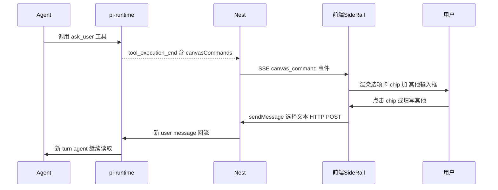

# ask_user 工具设计规格

状态：已拍板待开发（D1–D5 已确认按推荐，2026-09-28，对齐 WorkBuddy 设计）
前置：pi-runtime drop-in skill 体系（已上线，pi-runtime 0.0.10）；前端 `AgentSideRail.vue` canvas_command 消费链路（已上线）
分支约定：实现走 feature 分支 + PR + squash merge。

## 0. 配图索引（结构与视觉两类，均随本文档演进）

本文档的图分两类：**结构图**一律以 Mermaid 内嵌；**视觉稿**以 `assets/` 下的 SVG 附件承载（相对路径引用）。本规格只有结构图，无视觉稿（纯后端契约 + 前端渲染分支，无像素级布局）。

| 编号 | 形式 | 内容 | 位置 | 用途 |
|---|---|---|---|---|
| 图 1 | 内嵌 Mermaid sequenceDiagram | ask_user 从工具调用到用户回填的完整时序 | §5 | 验收回流链路复用 sendMessage，无新建回流通道 |

## 1. 目标

1. 给 pi-runtime agent 一个 `ask_user` 工具，产出**可点击选项卡 UI**（chip + 其他可编辑输入框），用户点选/填写后回填为 user message 进入下一轮——对齐 WorkBuddy AskUserQuestion 渐进披露哲学
2. 复用现有 `sendMessage` 回流机制与 `canvas_command` SSE 通道，**不新建回流链路、不改工具阻塞语义**
3. 让 `ecommerce-product-photo` 等 skill 能声明"问什么 + 选项候选"，由工具负责呈现成可点击卡片而非纯文本

## 2. 范围（含明确不做）

**在范围**：
- pi-runtime 新增 `ask_user` 工具（tier=ui_command，非阻塞）
- `PiCanvasCommand` DTO 扩 `questions` 可选字段
- 前端 `AgentSideRail.vue` canvas_command 分支新增 `ask_user` 渲染分支 + chip click 调 `sendMessage`
- agent 行为契约（skill 侧）：调 `ask_user` 后结束本轮，等用户回复

**不在范围**（显式不做，避免隐性范围）：
- 不改工具 execute 阻塞语义（`ask_user` 立即返回，不等用户；用户回复作为新 user message 进新 turn，非 Promise resolve）
- 不做多轮对话状态机（每次 `ask_user` 是独立一轮）
- 不加 `ask_user` 的 schema 强校验（复用 `extractCanvasCommands` 现有 filter：只校验 `type` 是 string，`questions` 字段透传）
- 不动 DB / helm / 部署链路（纯前后端 + DTO 字段扩展）

## 3. 与既有规格的关系

- **显式复用** `canvas_command` SSE 通道与 `extractCanvasCommands` 派生逻辑（`apps/server/src/agent/pi-runtime/pi-events.ts:121`）——只新增一个 `type` 值 `ask_user`，不改派生契约
- **显式复用** 前端 `sendMessage` 函数（`AgentSideRail.vue` 已被 `sendMacroSchemeConfirm` / `sendShotConfirm` 等大量用于按钮→user message）——chip click handler 直接 `await sendMessage(option.value)`
- **显式推翻** 无：不修改任何现有 canvas_command 分支的 type 语义（focus/undo/redo/open_editor/introduce_nodes/export_pack 全保留）

## 4. 规范与判据

- **非阻塞判据**：`ask_user` 工具 execute 必须在产出 canvas_command 后立即 resolve，**不得 await 用户回流**。理由：pi-runtime 当前 SSE 单向（pi→Nest→前端），用户回流走新 user message HTTP POST 进新 turn，不是 Promise 回调；若 execute 阻塞会卡死整个 turn
- **tier 判据**：归 `ui_command` tier（本地 UI 命令，不走 Nest，返回 canvasCommands）——对齐 `ui-command.ts` 现有 5 个工具
- **回流复用判据**：chip click 必须调现有 `sendMessage`，**不得新建 HTTP 端点或 SSE 反向通道**
- **agent 终止判据**：skill 正文须指导 agent"调 `ask_user` 后结束本轮回复，不继续 generating"——避免产出选项卡又继续说话导致用户困惑
- **选项数量判据**：单次 `ask_user` 调用 `questions` 数组 1–4 个（对齐 WorkBuddy AskUserQuestion 上限 4），每问 `options` ≥1 个

## 5. 架构与契约

回流时序见 图 1。



*图 1 · ask_user 工具从调用到用户回填的完整时序，用于验收回流链路复用 sendMessage（无新建回流通道）*

### 5.1 pi-runtime 工具定义（新增 `services/pi-runtime/src/tools/ask-user.ts`）

```ts
import { Type } from "typebox";
import type { LnkpiTool } from "./types.js";
import type { Metrics } from "../metrics.js";
import { uiResult } from "./ui-command.js"; // 复用现有 uiResult 返回格式

export interface AskUserQuestion {
	id: string;            // 稳定问题 id，如 "scene"
	question: string;      // 给用户看的问题文本
	options: { label: string; value: string }[];  // value 是点选后回填的 user message 文本
	multiSelect?: boolean;
	allowOther?: boolean;   // 默认 true，对齐 WorkBuddy 哲学
}

export function createAskUserTools(metrics: Metrics): LnkpiTool[] {
	return [{
		tier: "ui_command" as const,
		name: "ask_user",
		label: "向用户提问",
		description: "Present clickable option chips plus free-text other to the user; the user's choice is sent back as the next user message. Non-blocking: returns immediately after emitting the card; agent should end its turn after calling.",
		parameters: Type.Object({
			questions: Type.Array(Type.Object({
				id: Type.String({ description: "stable question id, e.g. scene" }),
				question: Type.String({ description: "question text shown to user" }),
				options: Type.Array(Type.Object({
					label: Type.String(),
					value: Type.String({ description: "text sent back as user message when chip clicked" }),
				}), { min: 1 }),
				multiSelect: Type.Optional(Type.Boolean()),
				allowOther: Type.Optional(Type.Boolean({ description: "show free-text other input, default true" })),
			}), { min: 1, max: 4 }),
		}),
		execute: async (_id, p: { questions: AskUserQuestion[] }) => {
			metrics.observeToolCall("ask_user", "ok");
			// 单条 canvas_command 包裹全部 questions，避免前端渲染多张卡
			return uiResult([{ type: "ask_user", questions: p.questions } as any]);
		},
	}];
}
```

**设计决策**：
- 单次调用包全部 questions（1–4 个）为一条 canvas_command，前端渲染一张卡含多问，减少工具往返
- `uiResult` 返回 `{ content:[{text}], details:{ ok:true, canvasCommands:[{type:"ask_user", questions}] } }`，复用 `ui-command.ts` 现有返回格式
- `as any` 规避 `CanvasCommand` 接口当前无 `questions` 字段的 TS 报错（§5.2 扩接口后可去 `as any`）

### 5.2 DTO 契约扩展（`apps/server/src/agent/pi-runtime/pi-events.ts`）

```ts
// pi-events.ts:107 现有接口
export interface PiCanvasCommand {
	type: string;
	nodeId?: string;
	nodeIds?: string[];
	questions?: AskUserQuestion[];  // 新增，仅 type=ask_user 时有
}

// 新增 interface（从 ask-user.ts 导入或在此声明）
export interface AskUserQuestion {
	id: string;
	question: string;
	options: { label: string; value: string }[];
	multiSelect?: boolean;
	allowOther?: boolean;
}
```

**`extractCanvasCommands` filter 不变**（`pi-events.ts:130` 现有 filter 只校验 `typeof c.type === "string"`，`questions` 字段透传）——零改派生逻辑。

### 5.3 前端渲染分支（`apps/web/src/components/agent/AgentSideRail.vue:1943` canvas_command case）

新增 `else if` 分支：

```ts
} else if (cmd.type === 'ask_user' && cmd.questions?.length) {
  pendingAskUser.value = cmd.questions  // 存到 ref，模板渲染选项卡组件
}
```

模板侧新增 `<AskUserCard v-if="pendingAskUser" :questions="pendingAskUser" @select="onAskSelect" />` 组件：
- 每个 question 渲染：问题文本 + options 的 chip 列表 + （allowOther !== false 时）"其他"输入框 + 提交按钮
- chip click：`onAskSelect(question, option) => await sendMessage(option.value)`
- "其他"提交：`await sendMessage(其他文本)`
- multiSelect：收集多选后组装 `"id1:val1 id2:val2"` 一次 `sendMessage`（agent 解析空格分隔）

### 5.4 agent 行为契约（skill 侧，不改 code）

skill 正文（如 `ecommerce-product-photo` 的 step2）声明：调 `ask_user` 工具产出选项卡后，结束本轮回复，等待用户回复。本轮不再 generating。

## 6. 主场景规格（可验收）

**场景 A：单问单选**——agent 调 `ask_user({questions:[{id:"scene", question:"场景选哪个", options:[{label:"家居",value:"场景:家居"},...], allowOther:true}]})` → 前端渲染 5 chip + 其他输入框 → 用户点"家居"chip → `sendMessage("场景:家居")` → 新 turn agent 读到"场景:家居"继续

**场景 B：多问一次问全**——agent 一次调 `ask_user({questions:[场景, 风格, 用途]})` → 前端渲染一张卡含 3 问 → 用户逐问点选 → 每问点完即 `sendMessage`（或末尾统一提交 multiSelect 风格）

**场景 C：用户选"其他"**——用户不点 chip，在"其他"输入框写"复古胶片风" → `sendMessage("复古胶片风")` → agent 读到自由文本继续

## 7. 数据与状态变更

- 无 DB 变更（canvas_command 是运行时 SSE 事件，不落库）
- 前端新增 `pendingAskUser` ref（组件内本地状态，渲染完即清空）
- 无 session 状态机变更（每次 ask_user 是独立一轮）

## 8. 纯函数与算法

- `extractCanvasCommands` 已是纯函数，零改
- 前端 `onAskSelect` 组装 user message 文本：单选直传 `option.value`；多选用 `questions.map(q => q.id + ":" + q.selectedValue).join(" ")`，agent 侧 skill 指导解析

## 9. 文件级改动清单

| 文件 | 改动 | 行数估 |
|---|---|---|
| `services/pi-runtime/src/tools/ask-user.ts` | 新增工具定义 | ~45 |
| `services/pi-runtime/src/tools/registry.ts` | 注册 `buildAskUserTools` | ~3 |
| `services/pi-runtime/src/tools/ui-command.ts` | 导出 `uiResult`（或 ask-user.ts 内联） | 0–2 |
| `apps/server/src/agent/pi-runtime/pi-events.ts` | `PiCanvasCommand` 加 `questions?` + `AskUserQuestion` interface | ~8 |
| `apps/web/src/components/agent/AgentSideRail.vue` | canvas_command 加 `ask_user` 分支 + `pendingAskUser` ref | ~10 |
| `apps/web/src/components/agent/AskUserCard.vue` | 新增选项卡组件 | ~80 |

总计 ~150 行，无 DB / helm / 部署链路改动。

## 10. 测试策略与验收标准

- `services/pi-runtime/src/tools/ask-user.test.ts`：工具 execute 返回 `{type:"ask_user", questions}` 形态、tier=ui_command、非阻塞（execute 不 pending）
- `apps/server/src/agent/pi-runtime/pi-events.test.ts` 扩：`extractCanvasCommands` 对含 `questions` 的 canvasCommand 透传（不被 filter 丢）
- 前端 `AskUserCard.vue` 组件测试：chip click 触发 `sendMessage(option.value)`、其他输入框提交触发 `sendMessage(文本)`、multiSelect 组装格式
- 目视验收：agent 调 `ask_user` 后画布侧栏出现可点击选项卡，点选后选项卡消失 + 对话流出现用户选择文本 + agent 继续

## 11. 决策点（已拍板，2026-09-28，按推荐对齐 WorkBuddy 设计）

- ✅ **D1 单次问全**：单次 `ask_user` 一次问全 4 项（questions 数组 1–4），减少工具往返与 turn 数
- ✅ **D2 multiSelect 回流格式**：`"id:val id:val"` 空格分隔，agent 解析简单且 LLM 友好
- ✅ **D3 allowOther 默认 true**：对齐 WorkBuddy 渐进披露哲学
- ✅ **D4 带"取消"按钮**：选项卡带"取消"→ `sendMessage("取消")` 让 agent 退回开放问
- ✅ **D5 不限制触发方**：工具通用，skill 是主要消费方但不限制只能 skill 触发

## 12. 后续包 / 路线图

- 本包：`ask_user` 工具 + DTO 扩 + 前端渲染 + `ecommerce-product-photo` skill step2 升级用真选项卡
- 后续包（本包外，登记避免隐性范围）：
  - `ask_user` 的 schema 强校验（如果脏 questions 导致前端崩）
  - 多轮对话状态机（如果单轮 ask_user 不够复杂场景）
  - `ask_user` 在 `/metrics` 的观测（`pi_runtime_ask_user_invocations`）

## 13. 配图规范自检

```
pnpm verify-spec-figures --file docs/superpowers/specs/2026-09-28-ask-user-tool-design.md
```

预期：通过（图 1 为内嵌 Mermaid sequenceDiagram，§0 索引已登记，图注已写用途，正文 §5 已引用图 1）。本规格无视觉稿附件。
