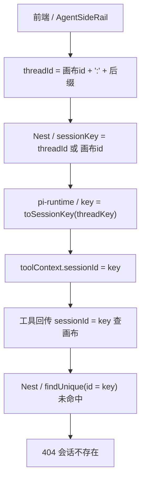
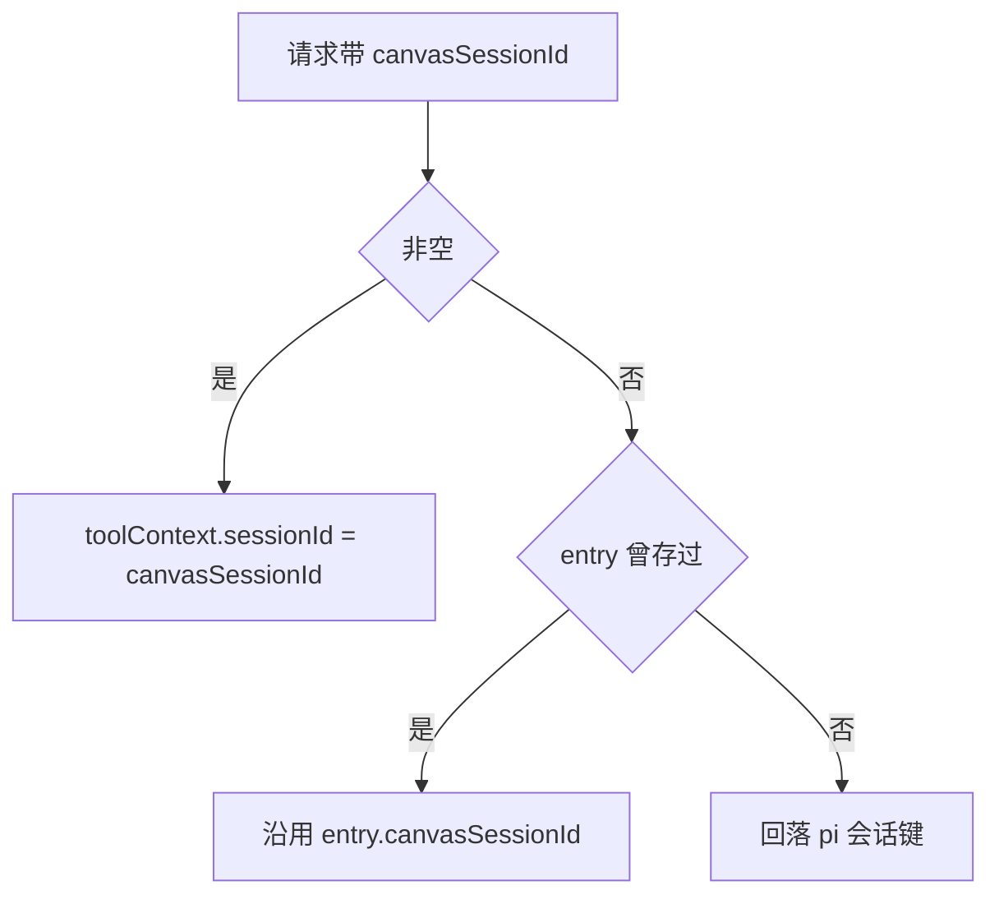

# agent 画布工具会话身份错位修复（hotfix）设计规格

状态：已实现（hotfix，2026-09-29）
前置：`docs/superpowers/specs/2026-09-29-persistent-harness-session-design.md`（#70，会话键改 `threadKey = threadId || sessionId`，本包**修正其外溢影响**）、`docs/superpowers/specs/2026-09-29-canvas-node-crud-completeness-design.md`（#71，画布工具面 SSOT）
分支约定：实现走 feature 分支 + PR + squash merge。

## 0. 配图索引

本文档全部为**结构图**，一律以 Mermaid 内嵌（无视觉稿：本包不涉及页面布局，判据见 SPEC-CONVENTIONS §1 反面判据）。

| 编号 | 形式 | 内容 | 位置 | 用途 |
|---|---|---|---|---|
| 图 1 | 内嵌 Mermaid | 回归根因链：两个「会话 id」被合并成同一个值 | §2 | 定位断点用；每一环都有代码坐标 |
| 图 2 | 内嵌 Mermaid | 修复后的身份分离与回落判据 | §4.1 | 实现自检：`toolContext.sessionId` 的取值优先级 |

## 1. 问题

### 1.1 现象（生产）

rev 27+（镜像 tag 0.0.16 起）**agent 的画布工具全部失败**，模型侧拿到的是：

```
nest /agent/internal/upsert-media-node http 404: 会话不存在
nest /agent/internal/get-canvas-summary http 404: 会话不存在
```

后果：agent 既**读不到**也**写不了**画布——`upsert_prompt_node` / `upsert_media_node` / `set_node_text` / `update_node` / `connect_nodes` / `propose_generation` / `delete_nodes` / `remove_edges` / `run_*_generation` / `cancel_generation` 等 25 处调用点全线 404，且**不产出任何 `canvas_action`**（前端因此零反应）。

### 1.2 判据（不修不可）

1. 生产端到端跑画布六步 CRUD，`canvas_action` 事件数 = 0、画布 0 变化 → 与 #71 规格 §10.2 #9「每步画布实时变化」直接矛盾；
2. 直接调用 Nest `POST /api/agent/internal/get-canvas-summary`：传真实画布 id → **201 ok**；传任何带后缀/复合形态 → **404 会话不存在**。证明是**键格式**不匹配，与归属、权限、网络无关。

## 2. 根因

见 图 1。



*图 1 · 这张图说明断点在哪一环：`toolContext.sessionId` 承载的是**pi 会话键**，而下游 Nest 端点把它当**画布会话 id** 查库。两个语义完全不同的 id 被合并进同一个字段，是本次回归的全部内容。*

### 2.1 逐环代码坐标

| 环 | 位置 | 事实 |
|---|---|---|
| 1 | `apps/web/src/components/agent/streamRecovery.ts:31` | `createAgentThreadId(sessionId) = \`${sessionId}:${随机后缀}\`` —— 前端**永远**发复合 threadId |
| 2 | `apps/server/src/agent/agent.service.ts:625` | `sessionKey = threadId?.trim() \|\| sessionId` |
| 3 | `services/pi-runtime/src/session-manager.ts:354` | `key = toSessionKey(threadKey)` = `sanitized-threadKey` + `-` + `sha256 前 8 位` |
| 4 | `services/pi-runtime/src/session-manager.ts:480` | `toolContext: () => ({ sessionId: key, userId, ...turn })` |
| 5 | `services/pi-runtime/src/tools/canvas-*.ts` 等 | `sessionId: tc.sessionId` 原样进 Nest 请求体（**该字段唯一消费方**，见 §3.3 判据 E-3） |
| 6 | `apps/server/src/agent/agent-canvas-tools.service.ts:2911` | `loadSession` 做 `prisma.session.findUnique({ where: { id: sessionId } })` → `null` → 404 |

### 2.2 引入时点与漏测原因

- 环 2 与环 4 **同由 `c75168f`（PR #70）引入**：`c75168f^` 里分别是 `ensurePiSession(client, sessionId, …)` 与 `toolContext: { sessionId: id, … }`，而当时的 `id` 就是画布 sessionId → **语义原本正确**。#70 只改了「pi 会话键」这一个概念，却顺带把 `toolContext.sessionId` 的**值语义**换了，属于跨边界语义变更未追全。
- #70 规格自身已记录该值变化（`2026-09-29-persistent-harness-session-design.md` 的 `"sessionId": "<sessionKey>"  // 语义变更`），但同文档又把 `services/pi-runtime/src/tools/**` 声明为「**零改动**（工具经 `toolContext` 函数拿到的仍是同一对象）」——**只审到 pi-runtime 边界，没有追到 Nest 用该字段查画布会话**。本包在该 spec 末尾追加「勘误」段。
- #70 的线上验收脚本 `deploy/prod-agent-thread-verify.py` 只断言助手**文本回复**（跨轮记忆、线程隔离、并发 409），**从未调用任何画布工具**，故 16 项 PASS 与本次回归并不矛盾。

## 3. 判据

| ID | 判据 | 落地 |
|---|---|---|
| **E-1** | **会话身份两分**：pi 会话键（持久化 / `sessions` map / URL key）与画布会话 id（Nest 查库用）是两个不同 id，**不得共用一个字段** | `toolContext.sessionId` 恢复为画布会话 id；pi 会话键仅作 `sessions` map key 与 URL 参数 |
| **E-2** | **回落 fail-safe**：未提供画布会话 id 时（旧 Nest 或不传），`toolContext.sessionId` 回落为 pi 会话键——行为退化为 #70 状态而非崩溃 | `entry.canvasSessionId ?? key` |
| **E-3** | **工具侧零改动**：`services/pi-runtime/src/tools/**` 一行不改 | 已核：`tc.sessionId` 全仓仅出现在 Nest 请求体，无其他消费方，故改语义即可 |
| **E-4** | **每轮自愈**：内存命中的 resume 分支也刷新画布会话 id，使滚动升级期间不会残留错值 | `doCreate` 内存分支补一次赋值 |
| **E-5** | **不引入反解**：不得尝试从 pi 会话键反推画布 id | `toSessionKey` 含 sha256 且非法字符被替换，**不可逆** |
| **E-6** | **回归锁**：两侧各加用例，锁住「复合 threadId 下 `toolContext.sessionId` 必须等于画布会话 id」 | 见 §7 |

## 4. 方案

### 4.1 取值优先级

见 图 2。



*图 2 · 这张图说明 `toolContext.sessionId` 的三级取值与回落。前两级都是「画布会话 id」，只有第三级（旧 Nest / 未传）才退化为 #70 行为——即修复对滚动升级是安全的，不会因部署顺序产生新的失败形态。*

### 4.2 数据流（修复后）

1. Nest 每轮调 `ensurePiSession(client, sessionKey, { …, canvasSessionId: sessionId })`（**Nest 侧 `sessionId` 变量就是画布会话 id**）；
2. `pi-runtime.client.ts` 把 `canvasSessionId` 放进 `POST /sessions` body；
3. `app.ts` 透传给 `manager.create`；
4. `session-manager.ts` 存进 `entry.canvasSessionId`；
5. 工具经 `toolContext.sessionId` 拿到画布会话 id → Nest 查库命中 → 正常读写与 `details.actions`。

## 5. 明确不做（有意不支持）

| 项 | 理由 |
|---|---|
| Nest 侧反解 pi 会话键前缀 | 不可逆（判据 E-5） |
| 改前端 `threadId` 格式 | #70 的「新对话即新键」语义正确，问题不在前端 |
| 改 `toSessionKey` 算法 | 会影响磁盘目录命名与既有会话 resume，风险远大于收益 |
| 把 canvasSessionId 持久化进 session meta | 不必：`ensurePiSession` 每轮都调，重建路径会带上；且 meta 的用途是归属/身份 fail-closed，不掺业务字段 |
| 给 `LnkpiToolContext` 新增 `sessionKey` 字段 | 当前无消费方；需要时再按 §12 加 |

## 6. 文件级改动清单

| 文件 | 改动 |
|---|---|
| `services/pi-runtime/src/session-manager.ts` | `CreateOptions` 加 `canvasSessionId?`；`SessionEntry` 加 `canvasSessionId?`；`build()` 写入；内存 resume 分支刷新（E-4）；`toolContext.sessionId` 改三级取值 |
| `services/pi-runtime/src/app.ts` | `/sessions` body 类型加 `canvasSessionId?`，透传进 `manager.create` |
| `services/pi-runtime/src/tools/types.ts` | `LnkpiToolContext.sessionId` 注释订正为「画布会话 id」 |
| `apps/server/src/agent/pi-runtime/pi-runtime.client.ts` | `CreateSessionOptions` 加 `canvasSessionId?`；进 `/sessions` body |
| `apps/server/src/agent/agent.service.ts` | `ensurePiSession` 的 opts 加 `canvasSessionId?`，调用点传 `canvasSessionId: sessionId` |
| `docs/superpowers/specs/2026-09-29-persistent-harness-session-design.md` | 末尾追加「勘误」段（订正「tools/** 零改动」的推断缺陷） |
| 测试 | 见 §7 |

**无数据库 schema 变更、无 migration、无存量数据迁移、无前端改动。**

## 7. 测试策略与验收标准

### 7.1 本地命令

```
# pi-runtime
cd services/pi-runtime && pnpm test && pnpm typecheck
# Nest
cd apps/server && pnpm exec vitest run src/agent && pnpm exec tsc --noEmit
```

### 7.2 新增回归锁

| 侧 | 用例 | 断言 |
|---|---|---|
| pi-runtime | `session-manager`：`create(key, { canvasSessionId: 'canvas-A' })` 后取 `toolContext` | `sessionId === 'canvas-A'`，且 `sessions` map 键仍为 `toSessionKey(key)` |
| pi-runtime | 同上但不传 `canvasSessionId` | `sessionId === toSessionKey(key)`（回落，判据 E-2） |
| pi-runtime | 内存 resume 后再传新的 `canvasSessionId` | 已刷新（判据 E-4） |
| Nest | `pi-runtime.client`：`createSession(key, { canvasSessionId })` | 请求 body 含 `canvasSessionId` |
| Nest | `agent.service`：带 `threadId` 的对话 | `createSession` 收到的 `canvasSessionId` === 画布 `sessionId`（**核心回归锁**：复合 threadId 不得污染该值） |

### 7.3 验收标准

| # | 项 | 判据 |
|---|---|---|
| 1 | 本地测试 | 上述用例与新老全量用例全绿，两侧 `tsc --noEmit` 无错 |
| 2 | CI 三项 | Verify spec figures / Build monorepo / Build API Docker image 全绿 |
| 3 | 生产端到端 | 同一会话内跑画布六步 CRUD：每步都有 `canvas_action`，且**首条 `canvas_action` 的时间戳早于流结束**（实时通道） |
| 4 | 生产落库 | 六步后 `canvasData` 与服务端动作一致；删除的边与节点**不复活** |
| 5 | 键格式对照 | 同一画布：真实 id → 201；加后缀 → 404（保持既有严格性） |

## 8. 部署顺序

**先 API、后 pi-runtime**（与本仓既有铁律一致）。两侧皆向后兼容（判据 E-2），故顺序错也不会产生新失败形态；但按顺序做可在 pi-runtime 重启后立即获得正确值。

pi-runtime 升级按 `docs/ops/RUNBOOK-pi-runtime-deploy.md`：CVM `--no-cache` 构建 → 镜像内 grep 验特征串 → push → 校验 digest → `helm upgrade --reuse-values --set image.tag=… --set env.PI_RUNTIME_VERSION=…` → pod imageID digest 逐字符比对。

## 9. 风险

| 风险 | 影响 | 缓解 |
|---|---|---|
| 部署顺序颠倒（pi-runtime 先） | 旧 Nest 不传 `canvasSessionId` → 回落 #70 行为（仍 404，但**不新增**失败形态） | 按 §8 顺序；E-4 自愈 |
| 旧 pi-runtime + 新 Nest | Nest 多发的字段被 fastify 忽略（body 非严格 schema）→ 行为同旧 | 无需处理 |
| 磁盘 resume 的旧会话目录 | `build()` 会用当轮上传入值重建 `entry`，无残留 | 已覆盖 |
| 本包与在途 PR #72 同改 `session-manager.ts` | 合并冲突 | #72 的改动位于 `attachEvents` dispatch（~508 行），与本包落点（~185/~448/~480 行）不重叠 |

## 10. 后续包 / 路线图

| 项 | 说明 |
|---|---|
| 画布工具端到端冒烟纳入常规验收 | 建议把「六步 CRUD + `canvas_action` 时间序」做成可重复脚本，补上 #70 验收只测文本回复的缺口 |
| `LnkpiToolContext` 字段语义表 | 在 `tools/types.ts` 集中登记每个字段的「谁写入 / 谁消费」，避免再次跨边界改语义 |
