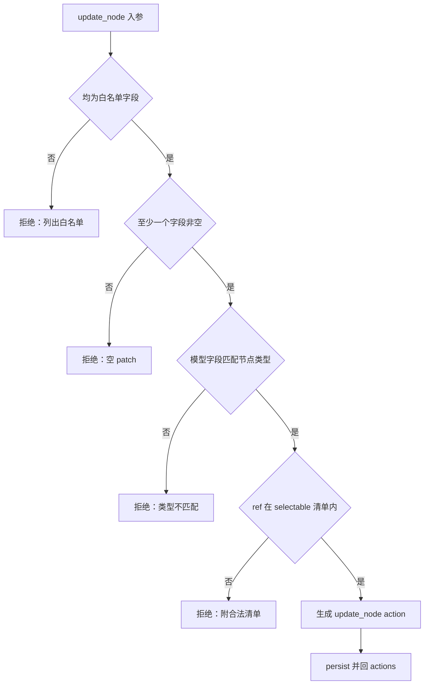
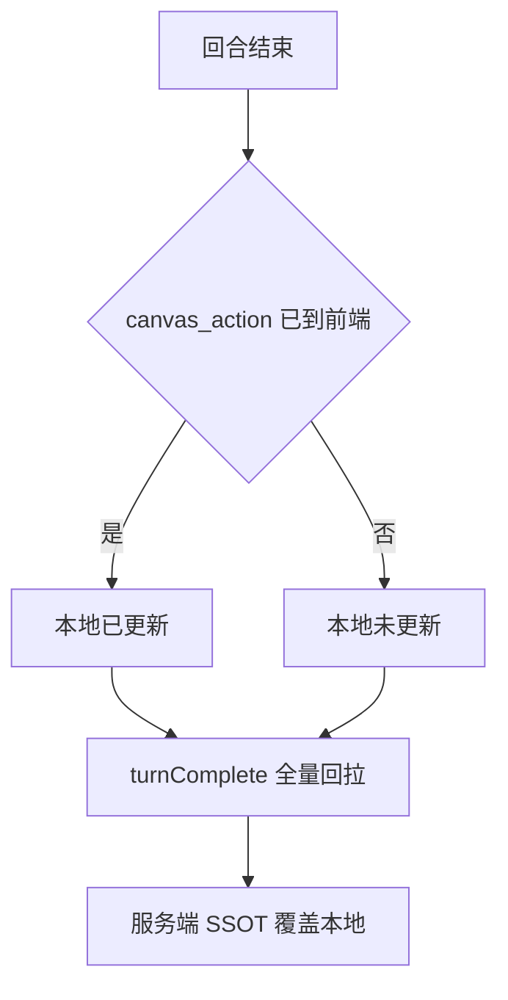
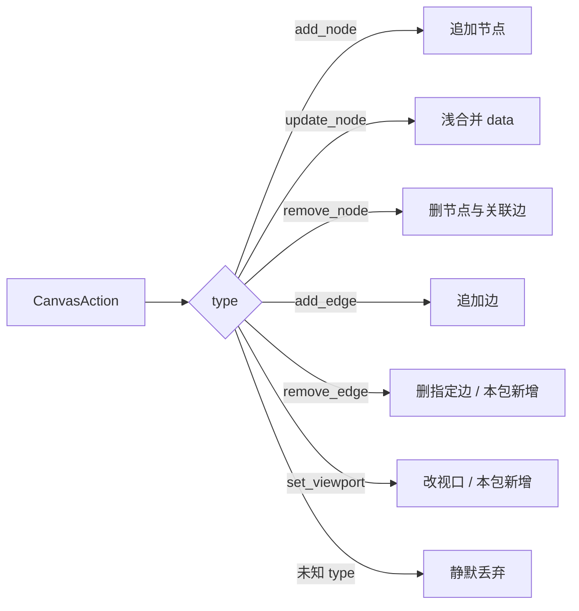

# 画布节点 CRUD 契约补全 + 新建画布去种子 设计规格

状态：待评审（brainstorming 产出，2026-09-29）
前置：`docs/superpowers/specs/2026-09-28-two-product-line-boundary-mapping.md`（`applyCanvasActions` 归属 seam，本包不动归属）、`docs/superpowers/specs/2026-09-24-ui-command-canvas-action-design.md`（canvas_action 通道，本包扩展其 action 路由）、`docs/superpowers/plans/2026-09-23-p1-canvas-tool-inventory.md`（工具清单 SSOT，本包部分解冻）
分支约定：实现走 feature 分支 + PR + squash merge。

## 0. 配图索引（结构与视觉两类，均随本文档演进）

本文档全部为**结构图**，一律以 Mermaid 内嵌（无视觉稿：本包不涉及页面布局，判据见 SPEC-CONVENTIONS §1 反面判据）。

| 编号 | 形式 | 内容 | 位置 | 用途 |
|---|---|---|---|---|
| 图 1 | 内嵌 Mermaid | `update_node` 白名单与 fail-closed 判据 | §4.2 | 实现与评审的自检清单，5 条拒绝分支逐条对应测试 |
| 图 2 | 内嵌 Mermaid | 写工具端到端数据流（工具 → Nest → persist → details.actions → SSE → 前端 applier） | §5.2 | 判定「实时打通」的验收链路基准，定位断点用 |
| 图 3 | 内嵌 Mermaid | 回合末 `turnComplete` 全量回拉兜底路径 | §5.3 | 说明「实时只是提前预览、服务端仍是 SSOT」为何安全 |
| 图 4 | 内嵌 Mermaid | 前端 `applyActionsToFlow` 的 action 路由（6 种 type 的落地去向） | §5.4 | 本包新增 `remove_edge`/`set_viewport` 分支的验收基准 |

## 1. 目标

1. **新建画布不再自动产生提示词节点**：空白新建画布初始节点数为 0；工作台输入框填的创意 brief 不再落成画布节点（仍作为 `initialPrompt` 预填侧栏输入框，内容不丢）；剧集创建行为**不变**。
2. **agent 具备「改节点名 / 改节点 dock 提示词 / 改节点芯片 / 增删改上下游关系」全部四个动作**：对每个动作，模型都能通过工具做到，且改动对用户**实时可见**（不再等到回合末回拉）。
3. **修正一处契约不一致**：`get_canvas_layout` 的工具描述声称返回 edges，实现不返回——必须对齐（本包选择补实现）。

三条均可验收：目标 1 用「新建后 `nodes.length === 0`」判据；目标 2 用端到端冒烟一次对话内跑完六步；目标 3 用 `get_canvas_layout` 返回体含 `edges` 判据。

## 2. 范围（含明确不做）

### 2.1 在范围内

| 编号 | 交付 | 说明 |
|---|---|---|
| S1 | 去掉 seed ①② | 前端占位种子 + 服务端 brief 种子；③ 剧集保留 |
| S2 | 新工具 `update_node` | 白名单 patch：`title` + 节点自身模态的模型字段 |
| S3 | 新工具 `list_model_options` | 按模态返回合法模型 ref（含 BYOK 渠道）与来源 |
| S4 | 新工具 `remove_edges` | 删除指定边（≤20 条/次） |
| S5 | 写侧实时打通 | 新工具 + 既有 11 个 canvas-write 写工具统一 `resultWithActions` |
| S6 | 前端 action 路由补全 | `applyActionsToFlow` 补 `remove_edge` / `set_viewport` |
| S7 | 读契约扩展 | `get_node` 补 `upstream`/`downstream`；`get_canvas_layout` 补 `edges` 并修 description |
| S8 | 归属校验一致性 | `removeEdges` 从裸 `loadSession` 升级为带 `userId` 的 `loadOwnedSession` |
| S9 | 回归锁 | seed ③ 存在性断言、seed ①② 不存在性断言、工具计数断言 |

### 2.2 明确不做（有意不支持，须有回归锁或留痕）

| 项 | 决策 | 理由 |
|---|---|---|
| **节点芯片来源（平台 / BYOK）显式读取** | **不做**（用户 2026-09-29 当面裁决） | 不落 `node.data.lastProviderSource`：省一次数据迁移，且避免「切了模型但字段写着旧来源」的过期数据。损失可控——`list_model_options` 会给出每个 ref 的 `source`，模型把节点模型值与清单一比即可推导来源。**回归锁**：断言节点写路径不得写入来源类字段 |
| `update_node` 支持 `position` | 不做 | 布局已由 `arrange_nodes`（ui_command）覆盖；再给 `move_nodes` 语义会重叠。白名单后续加一行即可扩，YAGNI |
| `update_node` 支持 dock 生成参数（`imageAspect`/`imageResolution`/`imageCount`/`videoSettings`/`audioVoice`…） | 不做 | 不在用户本次点名的四项能力内。**登记进 §12 后续包**（这是已知空白，不是遗漏） |
| `update_node` 触碰 `prompt` / `content` | **禁止** | 那归 `set_node_text`。否则与本仓已锁定的「`upsert_prompt_node` 全量覆盖 vs `set_node_text` 部分更新」语义（PR #63）产生两套真相 |
| `update_nodes_batch` 注册为工具 | 不做 | 任意 patch 会把 `status`/`generationRecordId`/`manifestKey` 等内部 SSOT 字段交给模型涂改，不可回归 |
| `add_nodes_batch` / `group_nodes` / `ungroup_node` / `arrange_nodes_grid` / `move_nodes` / `apply_layout_ops` 注册为工具 | 维持关闭 | 沿用 P1 roadmap 关闭决策，本包只解冻 `remove_edges` 一项 |
| `mergeCanvasNodesFromServer` 只增不减的问题 | 本包不动 | 已有 `turnComplete → loadSession` 全量回拉兜底；属独立缺陷，登记 §12 |
| system prompt 规则 4/5 文本 | 不改 | 逐字对齐老链路（`explore.py:95-112`），工具描述已足够承载新工具用法 |

## 3. 与既有规格的关系

| 既有文档 | 关系 | 说明 |
|---|---|---|
| `plans/2026-09-23-p1-canvas-tool-inventory.md` §3 | **显式修订** | 原 B-6/B-7「图内批处理 / 破坏性」整块后置。本包**只解冻 `remove_edges`**（归 `write_light`，非 `destructive`——边不承载数据、画布 undo 可恢复、且搭骨架时模型需要频繁纠错，归 destructive 只会给未来审批门禁加噪音）。其余维持关闭 |
| `specs/2026-09-24-ui-command-canvas-action-design.md` | **显式扩展** | 原设计只覆盖 UI 命令派发；本包把「写工具的 actions 也走 canvas_action」从 `delete_nodes` 单点推广到全部写工具，并补全前端 action 路由 |
| `specs/2026-09-28-two-product-line-boundary-mapping.md` §6 | **不变** | `applyCanvasActions` 归属仍待定。本包只补它内部的分支，不碰归属，也不换 `CANVAS_ACTION_APPLIER` 实现 |
| `specs/2026-09-28-agent-tool-p0-web-and-delete-design.md` D3 | **沿用** | `delete_nodes` 的「v1 免交互审批 + undo 兜底 + 单次上限」范式被 `remove_edges` 继承 |
| PR #63 `upsert_prompt_node` 全量覆盖语义 | **不变** | `update_node` 不碰文本，故无冲突 |
| `packages/shared/src/studioModelCatalog.ts` | **显式修订（小范围去重）** | 新增 `normalizeModelRef`，并把 `apps/web/src/constants/studioModels.ts` 的 `resolveGenerationModel` 改为委托它，**避免出现第三份模型 ref 归一逻辑**（现已有 `resolveGenerationModel` + `ProviderResolverService` 两处）。除该函数外不动 studioModelCatalog 其它导出 |

## 4. 规范与判据

### 4.1 字段白名单（`update_node` 唯一可写集）

| 节点类型 | 可写 `title` | 可写模型字段 | 对应 selectable 清单 |
|---|---|---|---|
| `image` | ✅ | `imageModel` | `preferences.selectableImageModels` |
| `video` | ✅ | `videoModel` | `preferences.selectableVideoModels` |
| `text` | ✅ | `textModel` | `preferences.selectableTextModels` |
| `prompt` | ✅ | `textModel` | `preferences.selectableTextModels` |
| `audio` | ✅ | `audioModel` | `preferences.selectableAudioModels` |
| 其余（`group`/`shot`/`sceneComposer`） | ✅ | ❌（传模型字段即拒绝） | — |
| `mediaInput`/`videoComposition`/`worldModel` | ❌（不在 `NODE_TYPES` 白名单，节点本身不可被 agent 创建） | ❌ | — |

**判据 R-1（模态唯一性）**：一次调用只允许出现**一个**模型字段，且必须与该节点类型的模态一致。传多个模型字段 → 拒绝。

**判据 R-2（模型 ref 归一）**：入参接受两种形态——① 已编码 ref（`channelId::modelName`，即 `list_model_options` 的输出形态）② 裸模型名。裸名经 `normalizeModelRef` 归一到 `platform::<modelKey>`；归一命中 `resolveModelKey().fallback === true` 说明该裸名不在目录中 → **拒绝，不得静默回落默认模型**。

**判据 R-3（清单校验 fail-closed）**：归一后的 ref 必须 ∈ 对应 `selectable<Modality>Models`。不在清单内 → 拒绝，并在错误信息里附**该模态的合法清单**（形态同 `list_model_options` 输出），让模型一步自纠。这条与 `read_document` 的「refKey 精确匹配，miss 返回清单不猜」是同一纪律。

**判据 R-4（空 patch）**：`title` 与模型字段全缺 → 拒绝。

**判据 R-5（归属）**：一律 `loadOwnedSession(sessionId, userId)`；`userId` 只取 `toolContext`，模型入参不可覆盖（沿用全仓既有安全模型）。

### 4.2 `update_node` 判据决策树

见 图 1。



*图 1 · 这张图说明 `update_node` 的 5 条拒绝分支与唯一放行路径。每条拒绝边都是 §10 的一条测试用例；任何一条被实现成「放过」都等于白名单失效。*

### 4.3 工具 tier 归属判据

| 工具 | tier | 判据 |
|---|---|---|
| `update_node` | `write_light` | 可撤销的属性修改，不损失内容 |
| `list_model_options` | `read` | 只读、幂等 |
| `remove_edges` | `write_light` | 删边不丢数据（undo 可恢复）；`destructive` 预留给会丢内容的操作（`delete_nodes`） |

## 5. 架构与契约

### 5.1 总量变化

| 项 | 现状（master `607292a`） | 本包后 |
|---|---|---|
| pi-runtime 工具总数 | 36（无 TAVILY）/ 38（有） | **39 / 41** |
| Nest internal 端点 | 既有 `remove-edges` 等 | +2（`update-node`、`list-model-options`） |

### 5.2 写侧端到端数据流

见 图 2。


*图 2 · 这张图是「实时打通」的验收链路基准。本包之前，第 6 环（`返回 actions` → `details.actions`）只对 `delete_nodes` / `run_*` / `cancel_generation` 成立，其余写工具在此断链，只能靠 图 3 的兜底路径生效。*

**契约要点（改动的实质）**：Nest 各端点**已经**返回 `{actions}`（服务端也是唯一写者）；断链只发生在 pi-runtime 工具把 `actions` 丢在 `content` 文本里、`details` 留 `undefined`。因此本包在 pi-runtime 侧把 11 个既有写工具 + 3 个新工具的返回统一为：

```ts
{ content: [{ type: "text", text: JSON.stringify({ ok: true, data }) }],
  details: { actions: extractActions(data) } }
```

该形态直接复用 `delete-nodes.ts` / `generation.ts` 的既有实现（`resultWithActions`），需提取为共享 helper 避免第三次复制。

### 5.3 回合末回拉兜底

见 图 3。



*图 3 · 这张图说明为什么「实时推送」是安全的：它只是提前预览。回合末 `turnComplete → loadSession()` 无条件全量回拉（`AgentSideRail.vue:1737-1738` → `CanvasPage.vue:1514-1549`），且 `handleAgentActions` 明确不 `persistUserEdit`、`finalizeTurn` 传 `rewriteCanvasData:false`——服务端始终是唯一写者，实时错位会被纠回。*

### 5.4 前端 action 路由补全

见 图 4。



*图 4 · 契约里有 6 种 action，落地面此前只认前 4 种——`remove_edge` / `set_viewport` 会被静默丢弃。这张图是补全后的路由标定：不加 `remove_edge` 分支，删边就永远不可能实时。*

### 5.5 读契约扩展

**`get_node`**（服务端 `getNode`）返回体在既有 `{id, type, position, data}` 上追加两个 **optional** 字段（向后兼容）：

```ts
upstream?:   Array<{ id: string; type: string; title: string }>   // 指向该节点的边的 source 侧
downstream?: Array<{ id: string; type: string; title: string }>   // 该节点为 source 的边的 target 侧
```

只回三元组，体积可控；`edges` 详情由 `get_canvas_layout` 承担。

**`get_canvas_layout`**（服务端 `getCanvasLayout`）返回体追加：

```ts
edges: Array<{ id: string; source: string; target: string }>
```

同时修正 pi-runtime 侧 `get_canvas_layout` 的 `description`——**在实现补上 edges 之后**，原描述才成立；两者必须同时改，不允许只改一边。既有的 `slimLayout`（丢冗余 `absolutePosition`）+ `trimData`（数组 >50 截断）逻辑不动，edges 自然继承截断保护。

## 6. 主场景规格

### 场景 A｜新建空白画布（S1）

| 步骤 | 期望 |
|---|---|
| 工作台「+ 新建画布」或侧栏「新建画布」（输入框为空） | `POST /sessions` → `canvasData = null` |
| 进入 `/workflow/:id` | 画布 0 节点，无任何自动生成的提示词节点；侧栏正常打开 |
| 再次进入同一画布（刷新） | 仍为 0 节点（不因前端空数组而重新种节点） |

### 场景 B｜工作台填 brief 后新建（S1）

| 步骤 | 期望 |
|---|---|
| 首页 `CreativeLauncher` 输入「一个赛博朋克茶馆」→ 创建 | `POST /sessions` **不带** `prompt`；`canvasData = null`；画布 0 节点 |
| 跳转后 | 侧栏输入框**已预填**「一个赛博朋克茶馆」（经 `initialPrompt` query，`CanvasPage.vue:1624-1636`）；brief 不丢 |

### 场景 C｜剧集创建（S1，行为不变）

| 步骤 | 期望 |
|---|---|
| 「短片」→ 新建故事（标题 + 简介）→ 创建并进入画布 | 画布上有 1 个提示词节点，内容 = `synopsis ?? title`（**本包必须锁住这一条**，防止被"统一成空画布"误伤） |

### 场景 D｜agent 六步 CRUD 冒烟（S2–S8）

一次对话内依次要求，逐步核对画布**实时**变化：

| 步 | 模型动作 | 期望画布反应 |
|---|---|---|
| 1 | `upsert_media_node(target_type=image, prompt=…)` | 新节点**立即**出现（不再等回合末） |
| 2 | `update_node(node_id, title="茶馆主视觉")` | 节点标题**立即**变 |
| 3 | `list_model_options(modality=image)` → `update_node(node_id, image_model=<清单内 ref>)` | 节点芯片**立即**变；dock 重同步（`ImageDockPanel.vue:202` 读 `data.imageModel`） |
| 4 | `upsert_media_node(target_type=video, …)` + `connect_nodes([{source, target}])` | 边**立即**出现 |
| 5 | `get_node(node_id)` | 返回 `upstream`/`downstream` 非空，能说出上下游 |
| 6 | `remove_edges([edgeId])` → `delete_nodes([nodeId])` | 边、节点**立即**消失 |

### 场景 E｜非法入参 fail-closed（S2）

| 入参 | 期望 |
|---|---|
| `update_node` 传 `status:"completed"` | 拒绝，错误信息列出白名单 |
| `update_node` 只传空/缺字段 | 拒绝（空 patch） |
| `update_node` 对 image 节点传 `videoModel` | 拒绝（类型不匹配） |
| `update_node` 传 `imageModel="不存在的模型"` | 拒绝，错误信息附该模态合法清单 |
| `update_node` 传 `imageModel="platform::seedream-4"` 但清单里无此项 | 拒绝（清单校验是唯一权威） |

## 7. 数据与状态变更

- **无数据库 schema 变更**（无新表、无新列、无 migration）。这是「取消芯片来源落库」决策的直接收益。
- **无存量数据迁移**。既有画布里的 `prompt-1` 种子节点**不回填、不清理**（用户可自行删除；不做批量数据操作）。
- **`Session.canvasData` 形状不变**（仍 `{nodes, edges, compositionRunGroup?}`）；本包只改「谁能写、写完怎么通知前端」。
- **`node.data` 形状不变**：`update_node` 只写既有字段（`title`、`imageModel`/`videoModel`/`textModel`/`audioModel`），不引入新字段。
- **API 变更**：`POST /sessions` 移除 `prompt` 字段。`ValidationPipe({ whitelist: true })` 无 `forbidNonWhitelisted`，故旧调用方传 `prompt` 会被**静默忽略而非 400**；同仓前端同步停传。

## 8. 纯函数与算法（含单测要求）

| 单元 | 位置 | 职责 | 单测要求 |
|---|---|---|---|
| `normalizeModelRef(modality, raw)` | `packages/shared/src/studioModelCatalog.ts` | 裸名 → `platform::<modelKey>`；已编码 ref 原样通过；未知裸名 → 返回 `fallback=true` 供调用方拒绝 | ① 裸已知名 → encoded ② 已编码 ref → 原样 ③ 未知裸名 → fallback ④ 空值 → null |
| `resolveGenerationModel(modality, requested)` | `apps/web/src/constants/studioModels.ts` | 改为委托 `normalizeModelRef`，保留原有「无值 → `platform::defaultModelKey`」兜底 | 既有行为回归（现值/默认两条路径不变） |
| `validateNodePatch(patch, node, selectable)` | `apps/server/src/agent/agent-canvas-tools.service.ts`（模块级纯函数） | 判据 R-1~R-4；返回 `{ok:true, data}` 或 `{ok:false, reason, allowed?}` | 图 1 的 5 条拒绝分支 + 1 条放行，逐条一个用例 |
| `relationsForNode(canvas, nodeId)` | 同上（模块级纯函数） | 由 `canvas.edges` 推导 `{upstream, downstream}`，按 `{id,type,title}` 输出，缺节点时跳过悬空边 | ① 无关系 → 空数组 ② 多上游 ③ 悬空边被跳过 ④ 自环不崩 |
| `applyActionsToFlow` 新增两分支 | `apps/web/src/composables/useCanvasActions.ts` | `remove_edge` 按 `payload.id` 删边（不存在则 no-op）；`set_viewport` 更新视口 | ① remove_edge 命中 ② remove_edge 未命中不抛 ③ set_viewport ④ 未知 type 静默丢弃 |

## 9. 文件级改动清单

| 文件 | 改动 |
|---|---|
| `apps/web/src/pages/CanvasPage.vue` | 删空画布分支的占位种子；`catch` 分支不再造假节点（保留错误提示） |
| `apps/server/src/sessions/sessions.service.ts` | `create` 去掉 `prompt` 参数与种子逻辑，`canvasData` 恒 `null` |
| `apps/server/src/sessions/sessions.controller.ts` | `CreateSessionDto` 去掉 `prompt` |
| `apps/web/src/pages/WorkflowPage.vue` | `createCanvas` 不再传 `prompt`（保留 `title` 与 `initialPrompt`） |
| `apps/web/src/services/sessions-api.ts` | `create` 入参类型去掉 `prompt` |
| `services/pi-runtime/src/tools/canvas-write.ts` | 新增 `update_node`；11 个既有写工具改 `resultWithActions`；`set_node_text` 的 prompt 分支接上 actions |
| `services/pi-runtime/src/tools/remove-edges.ts`（新） | `remove_edges` 工具 |
| `services/pi-runtime/src/tools/canvas-read.ts` | 新增 `list_model_options`；修 `get_canvas_layout` 的 description（去掉"edges"歧义，改为与实现一致的表述——本包补上 edges 后描述即为真） |
| `services/pi-runtime/src/tools/result-with-actions.ts`（新） | `resultWithActions` / `extractActions` 共享 helper（消除第三次复制） |
| `services/pi-runtime/src/tools/{registry,config}.ts` | 装配 3 个新工具 |
| `services/pi-runtime/src/tools/config.test.ts` | 计数断言 36→39 / 38→41；新工具存在性断言 |
| `apps/server/src/agent/agent-canvas-tools.controller.ts` | +2 端点与 DTO；`RemoveEdgesDto` + optional `userId` |
| `apps/server/src/agent/agent-canvas-tools.service.ts` | `updateNode`、`listNodeModelOptions`、`validateNodePatch`、`relationsForNode`；`getNode` / `getCanvasLayout` / `removeEdges` 改造；注入 `ProviderService` |
| `packages/shared/src/agentContract.ts` | `GetNodeResponseSchema` 加 optional `upstream`/`downstream`；画布 layout 契约加 `edges` |
| `packages/shared/src/studioModelCatalog.ts` | 新增 `normalizeModelRef` |
| `apps/web/src/constants/studioModels.ts` | `resolveGenerationModel` 委托 `normalizeModelRef` |
| `apps/web/src/composables/useCanvasActions.ts` | 补 `remove_edge` / `set_viewport` |
| `apps/web/src/composables/useCanvasActions.test.ts`（新） | 该文件目前**无测试**，本包补齐 6 种 action 的路由用例 |
| `apps/server/src/agent/agent-canvas-tools.service.test.ts` | 新方法 + 改造方法的用例 |
| `apps/server/src/sessions/sessions.service.test.ts`（新） | seed 回归锁（①② 不存在） |
| `apps/server/src/stories/stories.service.test.ts`（新） | seed ③ 存在性回归锁 |

## 10. 测试策略与验收标准

### 10.1 本地命令

```bash
pnpm -C services/pi-runtime test                       # node --test
pnpm -C services/pi-runtime typecheck                  # tsc --noEmit
pnpm -C apps/server test                               # vitest
pnpm -C apps/server exec tsc --noEmit
pnpm -C apps/web test
pnpm -C packages/shared test
pnpm verify-spec-figures --file docs/superpowers/specs/2026-09-29-canvas-node-crud-completeness-design.md
```

**已知环境约束（沿用，必须遵守）**：① `upstream-ref-inline.test.ts` 与 `membership.usage.sqlite.integration.test.ts` 是本机已知 flake，加 `--hookTimeout=120000`；② **禁止并行跑 pi-runtime 与 server 套件**（资源竞争 SIGKILL 137）；③ **禁止 `pnpm test | grep | head`**（SIGPIPE 使 vitest 提前退出产生假结果），须 `> log 2>&1` 再 grep。

### 10.2 验收标准

| # | 判据 | 方式 |
|---|---|---|
| 1 | 工具总数 39（无 TAVILY）/ 41（有） | `config.test.ts` 断言 |
| 2 | `update_node` 5 条拒绝分支全部生效 | 服务层单测（图 1 逐条对应） |
| 3 | 新建空白画布 `nodes.length === 0`；工作台 brief 用例画布仍 0 节点且侧栏预填 | 服务层单测 + 手动冒烟 |
| 4 | 剧集创建仍有 1 个提示词节点 | 回归锁断言 |
| 5 | 全部 14 个写工具的返回含 `details.actions` | 工具层单测 + 冒烟看画布实时变化 |
| 6 | 前端 6 种 action 全部落地、未知 type 不抛 | `useCanvasActions.test.ts` |
| 7 | `get_node` 回 `upstream`/`downstream`；`get_canvas_layout` 回 `edges` | 服务层单测 |
| 8 | `remove_edges` 跨账号被拒 | 服务层单测（Forbidden） |
| 9 | 场景 D 六步端到端可见 | 生产/预发一次对话冒烟（**目视验收**：每步画布实时变化，不等回合末） |
| 10 | 节点写路径不出现来源类字段 | `update_node` 白名单回归锁 |

### 10.3 CI 与部署顺序

CI 三项沿用：Verify spec figures / Build monorepo（全量 `pnpm test`）/ Build API Docker image。

⚠️ **部署顺序（与 `2026-09-29-persistent-harness-session` 那条相反，必须显式遵守）**：新工具会打**新** Nest 端点，若 pi-runtime 先上，工具会 404。

```
deploy-api 绿（新端点在位） → helm upgrade pi-runtime（新工具上线） → deploy-web（随 push 自动）
```

## 11. 风险

| 风险 | 影响 | 缓解 |
|---|---|---|
| `agent-canvas-tools.service.ts` 已 2948 行，本包再加 ~120 行 | 可维护性继续下降 | 本包**刻意不抽新服务**：`updateNode` 必须复用 `loadOwnedSession` / `applyOrStage` / `expireStaleStage`（staged-actions 一致性闸门），拆服务会复制这段防护，风险大于收益。抽 `CanvasStore` 作为独立重构登记 §12 |
| 11 个既有写工具改返回形态 | 面广，可能改错某个工具的 data 形状 | 统一走共享 `resultWithActions` helper；逐一断言 `details.actions` 存在；`finalizeTurn({rewriteCanvasData:false})` + 回合末回拉是安全网 |
| 实时推送引发"本地与服务端不一致" | 用户看到闪回 | 图 3 的三重机制：唯一写者 + 不写回 + 全量回拉 |
| `rename`/改模型对**正在生成中**的节点生效 | 可能改到已提交任务的语义 | 与用户侧同一约束（UI 也不锁），不额外加闸；`propose_generation` 的 Gate 仍在 `run_*` 处把关 |
| 并行在途分支冲突 | 合并冲突 | 已核对：`persistent-session`（`app.ts`/`session-manager.ts`/`metrics.ts`）、`vision-refine`（`tools/generation.ts`）与本节文件清单**无重叠**；`feat/agent-ux-p0-p2` 可能同改 `CanvasPage.vue`，合并前需 `git fetch` + 复核 |
| 删 `POST /sessions` 的 `prompt` 字段 | 旧调用方 | 已验证 `ValidationPipe` 无 `forbidNonWhitelisted` → 静默忽略；同仓前端同步 |

## 12. 后续包 / 路线图

| 项 | 为什么不在本包 | 建议 |
|---|---|---|
| `update_node` 支持 dock 生成参数（aspect/resolution/count/videoSettings/voice） | 不在本次点名的四项能力内 | 白名单加字段即可，小包 |
| `move_nodes` / `group_nodes` / `apply_layout_ops` 注册为工具 | 沿用 roadmap 关闭决策 | 有真实需求再开 |
| `mergeCanvasNodesFromServer` 只增不减 | 独立缺陷，已有回拉兜底 | 独立修复包 |
| `agent-canvas-tools.service.ts` 抽 `CanvasStore` | 属重构，不该夹在功能包里 | 独立重构包 |
| `add_nodes_batch` 暴露为工具 | 当前 `upsert_media_node` 已覆盖单节点场景 | 有多节点批量需求时再评估 |

## 13. 配图规范自检

```
$ pnpm verify-spec-figures --file docs/superpowers/specs/2026-09-29-canvas-node-crud-completeness-design.md
```

（校验结果以提交前实跑为准，见实现计划 Task 0。）
