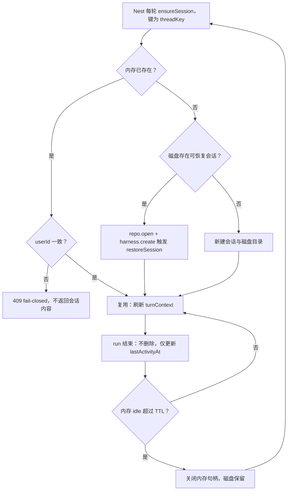
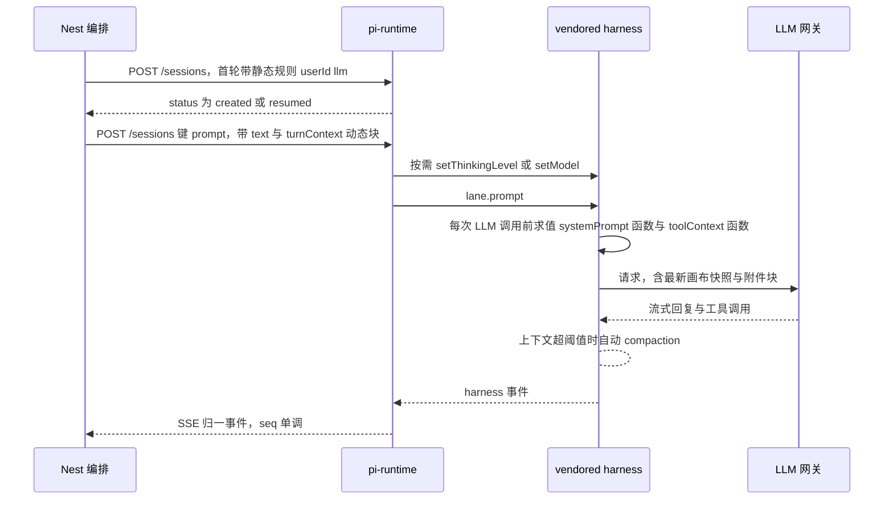
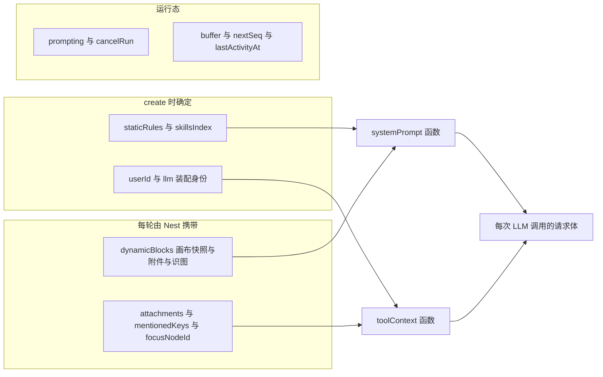

# P0-① 持久 harness 会话 + 原生 compaction 设计规格

状态：已拍板待开发（D1–D4 已确认按推荐，2026-09-29，用户「都按默认」）
前置：`docs/discussion/2026-09-29-agent-harness-gap-review.md`（§3.1 本规格的来源）；P0-②③（abort 级联 + SSE 增量续传）已上线 pi-runtime 0.0.14
分支约定：实现走 feature 分支 + PR + squash merge。

## 0. 配图索引（结构与视觉两类，均随本文档演进）

本文档的图分两类：**结构图**一律以 Mermaid 内嵌；**视觉稿**以 `assets/` 下的 SVG 附件承载（相对路径引用）。

本规格**只有结构图，无视觉稿**：本包是后端会话生命周期与契约变更，不含 UI 像素级布局（前端零改动），按 SPEC-CONVENTIONS §1 反面判据不产出视觉稿。

| 编号 | 形式 | 内容 | 位置 | 用途 |
|---|---|---|---|---|
| 图 1 | 内嵌 Mermaid flowchart | 会话 resume-or-create 与回收状态机 | §5.1 | 验收「复用优先、fail-closed、TTL 只回收内存」三条判据的全部路径 |
| 图 2 | 内嵌 Mermaid sequenceDiagram | 每轮 Nest → runtime → harness → LLM 的数据流与求值时机 | §5.2 | 验收「动态上下文不写进对话历史」「systemPrompt 每次 LLM 调用前求值」两条判据 |
| 图 3 | 内嵌 Mermaid flowchart | SessionEntry 字段的三层分类与消费方 | §5.3 | 验收字段归属：create 期确定 / 每轮刷新 / 运行态，防止把易变态写进静态层 |

## 1. 目标

1. **让对话历史真正留存**：同一对话（thread）跨轮复用同一个 harness 会话，历史进原生 context，废止「近 4 轮截断文本」当记忆的现状（审视 §3.1 实证：每轮 `rm -rf` 会话目录）
2. **上下文超限走 vendor 原生 compaction**：接入 `DEFAULT_COMPACTION_SETTINGS` 的阈值与 overflow 两条自动路径（当前全链路 0 调用）
3. **退役为「每轮重建」而生的全部补丁**：`createSessionReplacingStale`、409 竞态处理、`acquirePiSessionLock`、`compress-recent-turns`，并顺手补上 pi-runtime 侧并发 prompt 防护（审视 P2 5.1）

## 2. 范围（含明确不做）

**在范围**：

- pi-runtime `session-manager.ts`：resume-or-create 幂等语义、`systemPrompt`/`toolContext` 改函数式、每轮 `turnContext` 刷新、TTL sweeper、磁盘 LRU 上限、`prompting` 中重复 prompt → 409、会话键 sanitize
- pi-runtime `index.ts`：`POST /sessions` 幂等返回 `{status: created|resumed}`；`POST /sessions/:key/prompt` body 增 `turnContext`；compaction 事件归一透传
- pi-runtime 路由装配抽取：新增 `src/app.ts` 导出 `buildApp(manager)`，`index.ts` 退化为 bootstrap（只 listen）。**为路由级测试（`app.inject`）做的最小抽取，不改任何路由语义**——现状 `index.ts` 在 import 时即 `listen()`，无法被测试引用
- pi-runtime `src/runtime-config.ts`（新增）：§5.6 全部 env 的单一解析处（现状 env 读取散落在 `session-manager.ts` / `model-assembly.ts` / `index.ts`；不新增文件则 TTL 与磁盘上限参数没有归属地）
- pi-runtime `metrics.ts`：`sessions_live` / `session_resumes_total` / `compactions_total` / `prompt_rejections_total`
- Nest `agent.service.ts`：每轮结束**不再** `deleteSession`；`ensurePiSession` 改 resume-or-create；`turnContext` 组装与透传；退役 `acquirePiSessionLock`；`cancelRun` 带 threadId
- Nest `pi-runtime.client.ts`：`createSessionReplacingStale` 退役（改幂等 create + tolerant parse）；`prompt` 增 `turnContext`；`streamEvents`/`abortRun` 用会话键
- Nest `pi-prompt-assembler.service.ts`：拆「静态规则段」与「动态段」；退役 `recent-turns` 层
- Nest `compress-recent-turns.ts`（含测试）删除
- Nest `agent.controller.ts`：`runs/cancel` 把 `threadId` 传给 service（DTO 已有字段）
- `charts/pi-lnk-runtime/values.yaml`：新增 TTL / 磁盘上限 / compaction 参数的 env 默认值

**不在范围**（显式不做，避免隐性范围）：

- 不做 steering / followUp 插话（审视 P1 4.2，另立项）
- 不做 `transform_context` hook 注入（P1 4.1 的 hook 补强，本包用 vendor 原生函数式求值等价达成）
- 不做「编辑历史消息后回滚 pi 上下文」（`lane.navigateTree` / `repo.fork` 可支持，登记 §12）
- 不做 thread 删除端点（前后端目前均无删除入口；磁盘治理靠 §5.4 LRU，不依赖用户删对话）
- 不做 pi-runtime HTTP 端点鉴权（审视 P2 5.2，另立项）
- 不做 P0-④ run_* 异步化（本包落地后另接）
- 不改 vendored pi（`vendor/**` 零改动）；不改前端（`apps/web/**` 零改动）；不改 Nest 持久化 schema

## 3. 与既有规格的关系

- **显式复用** vendored `createAgentHarness` 的 `restoreSession`（`harness/runtime/harness.ts:389`）——传入既有会话即恢复 lane 状态，不需要自研恢复逻辑
- **显式复用** `AgentHarnessOptions.systemPrompt` 与 `.toolContext` 的**函数形态**（`agent-harness.ts:525-526`）——每轮动态上下文有 vendor 原生挂点
- **显式复用** `lane.setThinkingLevel` / `lane.setModel`（`runtime/lane.ts:1653,1674`）——换档不重建会话
- **显式复用** chart 既有 PVC（5Gi，挂载 `/data/sessions` = `PI_RUNTIME_DATA_DIR`）——持久化基础设施已就位
- **显式推翻** 审视 §3.1 原文「代价与对策」中对 thinkingLevel 的判断：**不再需要**「保留按需重建路径」作为换档手段（`lane.setThinkingLevel` 存活会话可用）；仅 BYOK 换渠道且目标模型不在注册表时保留重建兜底（§5.5）
- **显式推翻** `agent.service.ts:749` 注释「历史已由 JsonlSessionRepo 落盘，内存句柄不留」——该注释描述的意图与本实现相反，本包删除该路径
- **显式修订** P0-②③ 的 SSE 语义不受影响：会话存活期变长后 buffer（上限 500）仍按 seq 增量重放；会话被 TTL 回收后重连会拿到 404 → 客户端已有「404 终态不重连」处理（`pi-runtime.client.ts` 重连循环）

## 4. 规范与判据

- **会话粒度判据（D1）**：持久化键 = `threadKey = threadId || sessionId`（Nest 的 `effectiveThreadId` 同源）。理由：前端 `sessionId` = 画布会话，`threadId` = 对话（`streamRecovery.ts:31` 实测格式 `${sessionId}:${suffix}`）；以 sessionId 为键会让同一画布下所有对话共享上下文，「新对话」语义失效
- **键 sanitize 判据**：`sessionKey = 非法字符替换 + 原文哈希后缀`。`threadKey` 含 `:`（规范分隔符），且必须**确定性**（重启后同键可寻回磁盘目录）、**无碰撞**（两个不同 threadKey 不得映射到同一目录）。规则：非 `[A-Za-z0-9._-]` 一律替换为 `_`，再追加 `-` + `sha256(threadKey)` 前 8 位 hex
- **复用优先判据（图 1）**：内存命中 → 复用；磁盘命中 → `repo.list({cwd})` + `repo.open(metadata)` 恢复；两者皆无 → 新建。**任何情况都不因「上下文变了」而重建会话**（这是与现状最本质的差别）
- **fail-closed 判据**：同一 `sessionKey` 收到不同 `userId` → 409，不返回任何会话内容（防越权读他人上下文）。`userId` 在 create 时落会话期不变层，resume 时比对
- **动态上下文判据（D3）**：稳定前缀（规则文本 + skills index）create 时确定；易变块（画布快照、附件块、识图块）每轮由 Nest 随 prompt 携带，经 `systemPrompt` 函数尾部追加。**易变块不得写入对话历史**——否则 compaction 需要为一次性快照付费（此举同时保证稳定前缀在 system prompt 前部，上游若有 prefix cache 不失效）
- **求值时机判据**：`systemPrompt` 与 `toolContext` 均为函数，由 harness 在**每次 LLM 调用前**求值（`runtime/drive/generation.ts:103` → `resolveSystemPrompt` 调 `lane.readConfig()`）。故同一轮内工具改动画布后，下一次 LLM 调用即可见
- **回收判据（D2）**：TTL 只关闭**内存**句柄（`harness.close` + `repo.close`），**永不删磁盘**；磁盘清理只由 LRU 上限触发，且**跳过内存中活跃的会话目录**
- **磁盘上限判据**：`PI_RUNTIME_SESSIONS_MAX_BYTES`（默认 3GiB）与 `PI_RUNTIME_SESSIONS_MAX_COUNT`（默认 200）任一超限即按目录 mtime 最旧淘汰，直到双双回到限内
- **并发判据（D4）**：`prompting === true` 时再次收到 prompt → 409（`{error: "session busy"}`），不做排队。理由：Nest 单实例下前端 `isStreaming` 已拦重复发送，此处是防未来多 Nest 实例的纵深；排队会引入难以观测的隐式延迟
- **退役判据**：会话复用后，`409 竞态`（旧「上一轮 DELETE 未完成」）与「事件缓冲把上一轮回放给本轮」两个问题同时消失——因为 DELETE 不再发生。`acquirePiSessionLock` 的唯一存在理由（串行化 DELETE 与 create）随之消失
- **seq 单调性范围判据**：`seq` 的单调性限于**单次内存驻留期**（内存句柄被 TTL 回收后重建，`nextSeq` 从 0 重新计数）。这不影响 P0-③ 语义：Nest 的 SSE 连接是按轮建立的，客户端重连只在**同一轮内**发生，而同一轮内会话处于活跃状态（TTL 按 idle 判定）不会被回收；跨轮的 offset 不参与比较。实现上**不做**跨实例的 seq 持久化（属 §12 第 3 条的范畴）
- **compaction 判据**：显式传参（`enabled: true` / `reserveTokens: 16384` / `keepRecentTokens: 20000`，与 vendor 默认值一致，env 可调），使参数在配置面可见可调，不依赖隐式默认。agnes 模型已声明 `contextWindow: 1_000_000`（`model-assembly.ts`），阈值路径可用
- **部署顺序判据**：**pi-runtime 必须先于 Nest 上线**。反序（新 Nest + 旧 runtime）会让旧 runtime 收不到 `turnContext`、且新 Nest 不再每轮删除 → 会话驻留内存但动态块丢失（模型看不到画布快照），属功能性退化。同序（旧 Nest + 新 runtime）行为与今天等价

## 5. 架构与契约

### 5.1 会话生命周期

会话的复用、恢复与回收路径见图 1。



*图 1 · 这条状态机给出会话的三条去向：复用、从磁盘恢复、新建；并明确 TTL 只作用于内存句柄（K 之后磁盘仍在，下一轮回到 F 走恢复）。验收时逐分支走一遍即可覆盖 §4 的三条判据。*

### 5.2 每轮数据流

每轮请求的参与者与求值时机见图 2。



*图 2 · 关键在于两处求值都发生在 harness 内部而非 Nest：静态段只在首轮进入，动态段每轮覆盖，所以动态内容既不进对话历史、又能被同一轮内的后续 LLM 调用看见。*

### 5.3 会话状态分层

`SessionEntry` 字段按「多久变一次」分三层，消费方见图 3。



*图 3 · 分层是这次的纪律：把易变态误放进 S 层就会重现「画布快照陈旧」的老问题，把易变态写进对话历史又会污染 compaction 的输入。R2 里的 lastActivityAt 是 TTL 的唯一数据源。*

### 5.4 HTTP 契约变更（pi-runtime）

**`POST /sessions`（幂等 upsert）**

```jsonc
// 请求（新增字段标 +）
{
  "sessionId": "<sessionKey>",        // 语义变更：由 threadKey sanitize 得到
  "systemPrompt": "<静态规则段>",      // 语义变更：只含静态段
  "userId": "u1",
  "thinkingLevel": "high",
  "llm": { /* BYOK，可选 */ }
  // 以下 per-turn 字段可仍在首轮出现（兼容），但不再决定后续轮次
  // attachments / mentionedKeys / refOrder / focusNodeId
}
// 响应
{ "sessionId": "...", "provider": "agnes", "model": "...", "status": "created" | "resumed" }
```

- 请求体中的 `attachments` / `mentionedKeys` / `refOrder` / `focusNodeId` **仅作兼容保留**：新 Nest 不再用它们（每轮走 `turnContext`），pi-runtime 在 create 时把它们写入 `turnContext` 初值仅用于「旧 Nest + 新 runtime」过渡期；随后第一次 prompt 的 `turnContext` 会整体覆盖
- 已存在且 `userId` 一致 → 200 `status=resumed`（**不重置历史、不重设静态段**）
- 已存在但 `userId` 不一致 → 409
- 新建 → 201 `status=created`
- 静态段在同一 sessionKey 上**首次生效后不再变更**（换规则 = 新对话，这是刻意设计：规则属于对话身份而非每轮参数）

**`POST /sessions/:sessionKey/prompt`**

```jsonc
{
  "text": "<用户消息>",
  "lane": "main",
  "forceSkills": ["..."],              // 显式 skill 调用，语义不变
  "turnContext": {                     // 新增：每轮易变上下文
    "dynamicBlocks": ["当前画布摘要：..."],
    "attachments": [ /* SidebarAttachment[] */ ],
    "mentionedKeys": ["I1"],
    "refOrder": ["n1", "n2"],
    "focusNodeId": "n1"
  }
}
```

- 会话不存在 → 404（Nest 会先 ensureSession，正常不出现）
- `prompting === true` → 409 `{ "error": "session busy" }`
- 响应保持 `{ accepted: true }`

**会话键变更波及的端点**：`/sessions/:sessionKey/events`、`/sessions/:sessionKey/abort`、`DELETE /sessions/:sessionKey` 均改用 `sessionKey`（实现上由 Nest 统一传入，pi-runtime 侧只是 `Params` 命名与校验）

### 5.5 换档与兜底

| 场景 | 处理 | 依据 |
|---|---|---|
| thinkingLevel 变更 | `lane.setThinkingLevel()`，不重建会话 | `lane.ts:1674` |
| 平台模型切换（env 装配同渠道） | `lane.setModel({provider, modelId})` | `lane.ts:1653` |
| BYOK 渠道变更且模型已在注册表 | 同上 | 同上 |
| BYOK 渠道变更且目标模型**不在**注册表 | **唯一兜底**：删除会话（含磁盘目录）后按新 llm 重建 | 模型注册表在 create 期由 `model-assembly.ts` 装配，无公开热更新 API |

判定「是否在注册表内」由 Nest 侧完成：会话返回的 `{provider, model}` 与本次 `resolvePiSessionLlm()` 解析结果比对，不一致才走兜底重建。

### 5.6 配置面（env）

| env | 默认 | 作用 |
|---|---|---|
| `PI_RUNTIME_SESSION_TTL_MS` | `1800000`（30min） | 内存句柄 idle 回收阈值 |
| `PI_RUNTIME_SESSION_SWEEP_MS` | `300000`（5min） | sweeper 扫描周期 |
| `PI_RUNTIME_SESSIONS_MAX_BYTES` | `3221225472`（3GiB） | 磁盘上限（LRU 触发条件之一） |
| `PI_RUNTIME_SESSIONS_MAX_COUNT` | `200` | 磁盘会话目录数上限 |
| `PI_RUNTIME_COMPACTION_ENABLED` | `true` | 透传 vendor `CompactionSettings.enabled` |
| `PI_RUNTIME_COMPACTION_RESERVE_TOKENS` | `16384` | 同上 `reserveTokens` |
| `PI_RUNTIME_COMPACTION_KEEP_RECENT_TOKENS` | `20000` | 同上 `keepRecentTokens` |

### 5.7 观测面（metrics）

| 指标 | 类型 | 说明 |
|---|---|---|
| `pi_runtime_sessions_live` | gauge | 内存中驻留的会话数 |
| `pi_runtime_session_resumes_total{outcome}` | counter | `outcome` ∈ `memory` / `disk` / `new` |
| `pi_runtime_compactions_total{result}` | counter | compaction 结果（`ok` / `error`），会话存活后长对话质量的核心观测 |
| `pi_runtime_prompt_rejections_total{reason}` | counter | 当前仅 `busy`（并发拒绝） |

compaction 事件透传：harness 的 `compaction_start` / compaction 相关事件经既有 `EVENT_MAP` 归一后进 buffer，前端已对未知事件静默（`pi-events.ts` 白名单外的忽略），故不破坏前端。

## 6. 主场景规格（逐项可验收）

| # | 场景 | 期望 |
|---|---|---|
| S1 | 同一对话连续两轮 | 第二轮能回答第一轮引入的随机词；`pi_runtime_session_resumes_total{outcome="memory"}` 递增 |
| S2 | pi-runtime Pod 重启后同一对话再发一条 | 恢复成功且仍记得重启前内容（`outcome="disk"`）；`/healthz` 的 sessions 数正确 |
| S3 | 内存 idle 超过 TTL 后发新消息 | 自动恢复（`outcome="disk"`），磁盘目录 mtime 未变（未被重建） |
| S4 | 同一对话并发发两条 | 第二条得到 409 busy（Nest 转成前端可见错误，不静默丢弃）；`prompt_rejections_total{reason="busy"}` 递增 |
| S5 | 点「新对话」后发消息 | 全新会话（`outcome="new"`），不继承旧对话上下文 |
| S6 | 更新 thinkingLevel 后发消息 | 生效且**不**重建会话（`resumes` 计数出现 memory 而非 new） |
| S7 | 画布状态在一条消息内被工具修改 | 同一轮内后续 LLM 调用看到新快照（日志可验 `canvas-summary` 层内容变化） |
| S8 | 长对话触发 compaction | `pi_runtime_compactions_total{result="ok"}` 递增，会话继续可用 |
| S9 | 磁盘目录数/体积超上限 | 最旧目录被淘汰；内存中活跃会话目录不被删 |

## 7. 数据与状态变更

- **磁盘目录语义变更**：`$PI_RUNTIME_DATA_DIR/<sessionKey>/sessions/` 由「单轮生命周期」变为「对话生命周期」。目录名 = sanitize 后的 threadKey，可反查对话
- **无 schema 变更**：Nest prisma 侧（`Session`/`AgentThread`/消息表）零改动；pi 会话历史与 Nest DB 历史是**两套数据**，前者是模型上下文，后者是 UI 展示源
- **已知不一致**：既有存量对话在 pi 侧的磁盘历史为空（此前每轮删除）→ 首次 resume 时 `outcome="new"`，从该轮起开始累积。UI 侧历史不受影响（读 DB）

## 8. 纯函数与算法（含单测要求）

| 函数 | 位置 | 语义 | 单测要求 |
|---|---|---|---|
| `toSessionKey(threadKey)` | `services/pi-runtime/src/session-manager.ts` | 非 `[A-Za-z0-9._-]` → `_`，追加 `-` + sha256 前 8 位 | 确定性（同输入同输出）、无碰撞（构造仅非法字符不同的两键）、纯字母数字键保持可读、空串拒绝 |
| `composeSystemPrompt(static, dynamic)` | 同上 | 静态段在前、动态段尾部追加、空段过滤 | 空动态段 = 原样返回；顺序断言（稳定前缀必须在前） |
| `pickLruVictims(entries, limits)` | `services/pi-runtime/src/session-retention.ts`（新文件） | 按 mtime 升序淘汰，直到 count/bytes 双双回到限内；**排除 active 集合** | 未超限返回空；只超 count / 只超 bytes / 双超；active 保护；空目录列表 |
| `isTurnContextEqual(a, b)` | `services/pi-runtime/src/session-manager.ts` | 判断 `turnContext` 是否需要写入（浅比较 + 数组元素比较） | 相同 → true；数组顺序不同 → false；undefined 与空数组等价性明确定义 |
| `resolveEffectiveThreadKey(sessionId, threadId)` | `apps/server/src/agent/agent.service.ts` | `threadId?.trim() || sessionId` | 与既有 `effectiveThreadId` 语义一致（复用同一实现，不新增第二处判定） |

## 9. 文件级改动清单

**pi-runtime（`services/pi-runtime/`）**

| 文件 | 改动 |
|---|---|
| `src/session-manager.ts` | 核心：`create` → 幂等 resume-or-create；`systemPrompt`/`toolContext` 函数化；`setTurnContext` 方法；TTL sweeper 与磁盘 LRU 接入；`prompt` 增 busy 409；会话键 sanitize；`nextSeq`/buffer 语义不变 |
| `src/session-retention.ts` | 新增：磁盘目录扫描 + LRU 淘汰纯函数与副作用封装 |
| `src/index.ts` | 退化为 bootstrap：只 `buildApp(manager)` + listen；路由装配迁至 `src/app.ts` |
| `src/app.ts` | 新增：`buildApp(manager)` 承载全部路由；`/sessions` 返回值加 `status`；`/prompt` body 加 `turnContext`；409 busy 响应；会话键参数命名 |
| `src/runtime-config.ts` | 新增：§5.6 七项 env 解析 + 默认值 + 启动期自检 warn（`model.contextWindow` 缺失时告警，见 §11） |
| `src/metrics.ts` | 新增 §5.7 四项指标 |
| `src/session-manager.test.ts` | TDD：resume 三分支、userId fail-closed、busy 409、TTL、函数式求值、键 sanitize |
| `src/session-retention.test.ts` | 新增：`pickLruVictims` 全覆盖 |
| `src/app.test.ts` | 新增（首个路由级测试，`app.inject`）：`status` 字段、`turnContext` 透传、busy 409、缺 `turnContext` 的旧 Nest 请求仍可用 |
| `src/runtime-config.test.ts` | 新增：env 默认值与非法值回退 |

**Nest（`apps/server/`）**

| 文件 | 改动 |
|---|---|
| `src/agent/agent.service.ts` | `streamFromPiRuntime` finally 去掉 `deleteSession`；`ensurePiSession` 改 resume-or-create + 注册表比对兜底；组装并透传 `turnContext`；`cancelRun` 带 threadId；删除 `acquirePiSessionLock` 及其调用点 |
| `src/agent/pi-runtime/pi-runtime.client.ts` | 删 `createSessionReplacingStale`；`createSession` 返回体加 `status`（缺省按 `created` 容错）；`prompt` 增 `turnContext`；`abortRun`/`streamEvents` 用 sessionKey |
| `src/agent/pi-runtime/pi-prompt-assembler.service.ts` | 拆 `assembleStatic()` / `assembleDynamic()`；删 `recent-turns` 层 |
| `src/agent/pi-runtime/compress-recent-turns.ts` + `.test.ts` | 删除 |
| `src/agent/agent.controller.ts` | `runs/cancel` 传 `threadId` |
| `src/agent/agent.service.pi-runtime.test.ts` | TDD 主战场：不再删会话（负例锁）、`turnContext` 组装、幂等 create、兜底重建判定 |
| `src/agent/pi-runtime/pi-runtime.client.test.ts` | 扩：`status` 缺省容错、`turnContext` 透传、sessionKey |
| `src/agent/pi-runtime/pi-prompt-assembler.service.test.ts` | 改：静态段/动态段分离断言；删 `recent-turns` 相关用例 |
| `src/agent/agent.service.test.ts` | 改：`acquirePiSessionLock` 删除后的调用面调整（不新增用例，仅去引用） |

**配置**

| 文件 | 改动 |
|---|---|
| `charts/pi-lnk-runtime/values.yaml` | 新增 §5.6 七项 env 默认值 |

**零改动（显式声明，便于 review 核对）**：`vendor/**`、`apps/web/**`、`apps/server/prisma/**`、`services/pi-runtime/src/tools/**`（工具经 `toolContext` 函数拿到的仍是同一对象，工具侧无需感知）

## 10. 测试策略与验收标准

**单测（TDD，先红后绿）**

- pi-runtime：以 stub harness factory 断言「同键两次 create 只调用一次 harnessFactory」、`repo.open` 被调用而非 `repo.create`、TTL 后 `harness.close` 被调用且目录仍在、busy 409、`turnContext` 覆盖后 `systemPrompt` 函数返回值变化、`pickLruVictims` 边界
- pi-runtime 路由级（`app.test.ts`，`app.inject`）：`status` 字段、`turnContext` 透传、busy 409、**不含 `turnContext` 的旧 Nest 请求仍可用**（过渡期兼容）
- Nest：断言 `deleteSession` 不再被调用（负例锁）、`turnContext.dynamicBlocks` 含画布摘要层、BYOK 身份不一致时才重建、旧 runtime 响应（无 `status`）不抛错
- 回归锁：`compress-recent-turns` 删除后，断言「systemPrompt 静态段不含近期对话摘要」

**实机验收（部署后，逐条对应 §6 S1–S9）**

1. 部署顺序：**先 pi-runtime（0.0.15）后 Nest**（§4 部署顺序判据）；web 无改动不必发版
2. `curl localhost:30100/healthz`、`/metrics | grep -E 'sessions_live|session_resumes_total|compactions_total'` 有值
3. S1/S5/S6：连续两轮 + 点新对话 + 换 thinkingLevel，观测 `session_resumes_total` 的 outcome 分布
4. S2：`kubectl delete pod` 后重发，验证磁盘恢复
5. S4：并发两条，第二条 409 且前端有可见提示
6. S9：临时把 `PI_RUNTIME_SESSIONS_MAX_COUNT` 调小重启，观察最旧目录被淘汰且活跃会话不受影响

**目视验收（前端）**：刷新画布后继续同一对话，历史消息与上下文记忆同时正确（历史来自 Nest DB，记忆来自 pi 会话）

**部署前必跑**：`pnpm --filter @pi-lnk/pi-runtime test`、`pnpm --filter @pi-lnk/server test`、双侧 `tsc --noEmit`、`pnpm verify-spec-figures --file <本文档>`

## 11. 风险

| 风险 | 影响 | 对策 |
|---|---|---|
| 长会话 token 成本上升 | 每轮携带全量历史 | 正是 compaction 的用途（阈值 + overflow 双路径）；`keepRecentTokens` 可调 |
| compaction 触发不了（模型未声明 contextWindow） | 上下文撑爆 → 上游 400 | 已核实 agnes 声明 `1_000_000`；新增启动期自检 warn（会话装配时若 `model.contextWindow` 缺失则告警） |
| 双源历史不一致（Nest DB vs pi 会话） | 用户删改 Nest 侧消息后，模型仍记得 | 本包不做「按 DB 重建会话」；登记 §12（需要 `fork`/`navigateTree` 与 Nest 侧编辑入口一起做） |
| PVC 写满 | Pod 异常 | LRU 上限（3GiB/200）+ 跳过活跃会话；PVC 调整需另立运维动作 |
| 内存驻留增长 | OOM（limit 1.5Gi） | TTL 30min 回收 + `sessions_live` 观测；如实际偏高再下调 TTL |
| 部署顺序搞反 | 动态上下文静默丢失（难发现） | §4 判据写明顺序；`ensurePiSession` 对缺 `status` 的响应容错并在日志标注 |
| BYOK 换渠道频繁重建 | 上下文丢失 | 仅在目标模型不在注册表时重建；日志标注 `rebuild: model-not-registered` |

## 12. 后续包 / 路线图（本包外，登记避免隐性范围）

1. **steering / followUp 插话**（审视 P1 4.2）：`lane.steer` / `lane.followUp` / `before_run_end.followUp` 均为现成挂点
2. **transform_context hook 补强**（P1 4.1）：本包用函数式求值达成动态上下文；hook 留给「改写历史 / 消息级注入」
3. **历史编辑与回滚**：`repo.fork` / `lane.navigateTree` + Nest 侧消息编辑入口，解决双源不一致
4. **thread 删除端点 + 磁盘生命周期**：目前靠 LRU；若用户开始删对话则需精确回收
5. **P0-④ run_* 异步化**：与本包的上下文预算联动（长任务期间上下文仍在增长）
6. **P2 5.2 pi-runtime 鉴权**：`x-lnkpi-service-token` 与 nest-client 反向对称
7. **P1 4.3 可观测性**：本包已补 4 项核心指标；OTel spans 与 token/cost 汇总另立

## 13. 配图规范自检

- 本文档 3 张图全部为**内嵌 Mermaid**（结构图），Mermaid 类型分别为 `flowchart TD` / `sequenceDiagram` / `flowchart LR`，均属 SPEC-CONVENTIONS §3.1 路由表内的受支持类型
- 无视觉稿：本包无 UI 像素级布局（前端零改动），符合 §1 反面判据
- 每张图均有「说明这张图说明了什么」的图注，且正文均引用图号（§5.1 / §5.2 / §5.3）
- 图号 1–3 连续、文档内唯一，§0 索引已登记
- 提交前执行：`pnpm verify-spec-figures --file docs/superpowers/specs/2026-09-29-persistent-harness-session-design.md`
