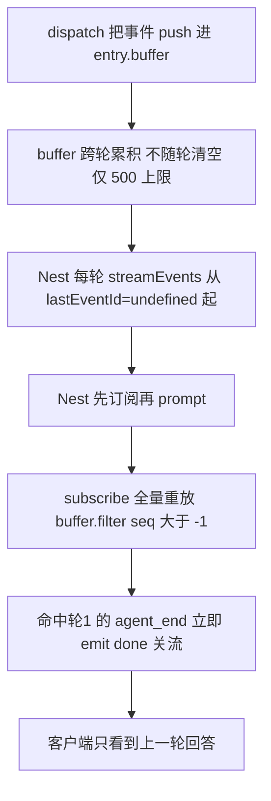
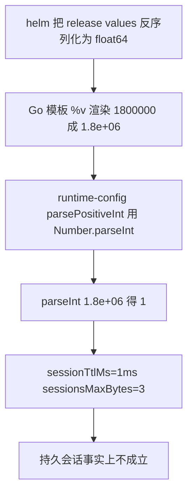
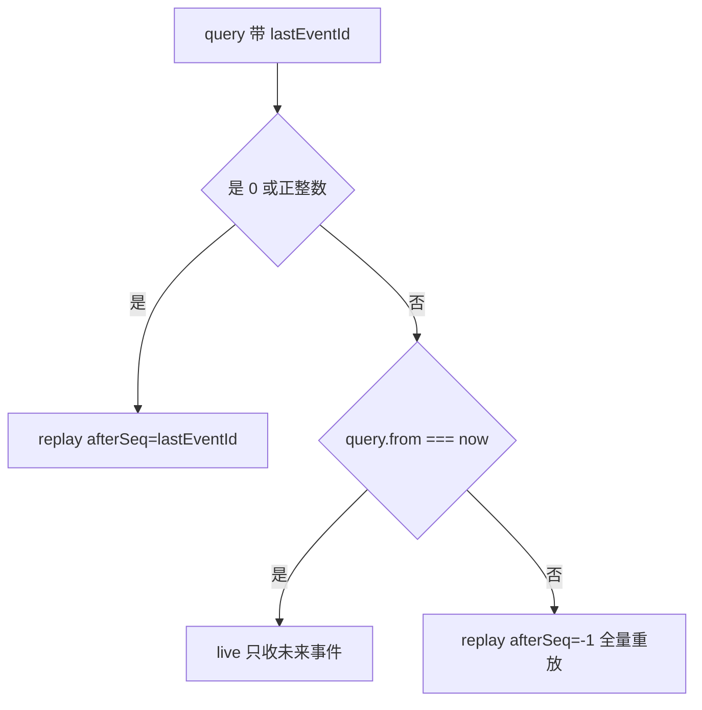

# pi-runtime 事件订阅跨轮重放与 helm 科学计数法修复设计规格

状态：已实现（2026-09-29）
前置：`docs/superpowers/specs/2026-09-29-agent-tool-canvas-sessionid-hotfix-design.md`（#74，画布会话 id 与 pi 会话键解耦，本包在其生产验收中发现的两个**既有缺陷**）、`docs/superpowers/specs/2026-09-29-persistent-harness-session-design.md`（#70，事件缓冲与 SSE 订阅现状的来源）
分支约定：实现走 feature 分支 + PR + squash merge。

## 0. 配图索引（结构与视觉两类，均随本文档演进）

本文档全部为**结构图**，一律以 Mermaid 内嵌（无视觉稿：本包不涉及页面布局，判据见 SPEC-CONVENTIONS §1 反面判据）。

| 编号 | 形式 | 内容 | 位置 | 用途 |
|---|---|---|---|---|
| 图 1 | 内嵌 Mermaid | P0-A 根因链：缓冲跨轮累积 + 全量重放 + 先订阅后 prompt | §2.1 | 定位断点用；每一环都有代码坐标 |
| 图 2 | 内嵌 Mermaid | 订阅起点裁决函数 `resolveEventsSubscribeMode` 的三路判定 | §5.1 | 实现自检：lastEventId / from=now / 缺省三者的优先级 |
| 图 3 | 内嵌 Mermaid | P0-B 根因链：helm float64 → Go `%v` 科学计数法 → `parseInt` 截断 | §2.2 | 说明为什么解析必须改 `Math.trunc(Number(raw))` |

## 1. 问题

生产验收 #74 时发现两个**互相独立**的 P0，均与 #74 无关（release values 未被 #74 改动，rev 31 及更早同样如此）：

### 1.1 P0-A：Nest 每轮新订阅重放 pi-runtime 全量事件缓冲 → 客户端只看到上一轮回答

**现象**：同一 agent 会话内第二轮对话，客户端流式看到的却是第一轮的回答。

**决定性证据**（pi-runtime 直连，同一会话两轮）：

| 订阅 | 时点 | 事件数 | seq 范围 | 内容 |
|---|---|---|---|---|
| SUB1 | 轮 1 后 | 35 | 0–34 | 轮 1 文本（「甲甲」）×23 |
| SUB2 | 轮 2 后，**全新订阅不带 lastEventId** | **61** | **0–60** | 轮 1 文本 ×23 + 轮 2 文本（「乙乙」）×15，含**两个 `agent_end`**（seq 34=轮 1、60=轮 2） |

SUB2 首条即 seq 0 = 轮 1 的 `agent_start` → 缓冲**跨轮累积且订阅全量重放**。

**不修不可的判据**：线上真实触发路径是 `AgentSideRail.vue:392` 的 `agentThreadId` 在同一会话内复用（`persistActiveThreadId` / `lastThreadStorageKey`，**不是每轮新建**）→ Nest `sessionKey` 不变 → 第二轮先订阅（从 `lastEventId=undefined` 起）再 prompt → 收到轮 1 的 `agent_end` 即 emit `done` 关流 → **本轮回答被上一轮顶替**。

### 1.2 P0-B：helm 把数字 env 渲染成科学计数法 → `parseInt` 解析成 1 → TTL=1ms / maxBytes=3

**现象（pod `printenv` 实测）**：`SESSION_TTL_MS=1.8e+06`、`SESSIONS_MAX_BYTES=3.221225472e+09`。

**node 实测**：`Number.parseInt("1.8e+06")` → **1**、`Number.parseInt("3.221225472e+09")` → **3** ⇒ `sessionTtlMs=1ms`（会话在下一 sweeper tick / 5min 内被回收）、`sessionsMaxBytes=3`（磁盘会话被 LRU 近乎全清）→ **持久会话事实上不成立**。

**排除项**：Nest 幂等缓存需显式 `idempotency-key` 头（`agent.controller.ts:269`），本次 e2e 未带 → 非 P0-A 的重放原因。

## 2. 根因

### 2.1 P0-A 根因链

见 图 1。



*图 1 · 这张图说明断点在哪一环：`session-manager.ts:758` 的 `dispatch()` 把事件推入 `entry.buffer` **跨轮累积**，而 `:633` 的 `subscribe(threadKey, listener, afterSeq = -1)` 对缓冲**全量重放**；Nest 侧 `pi-runtime.client.ts:238` 的 `streamEvents` 每轮从 `lastEventId=undefined` 起，且 `agent.service.ts` **先订阅再 prompt** —— 四环叠加，使第二轮的新订阅必然先吃到第一轮的全部事件（含 `agent_end`）。*

**逐环代码坐标**：

| 环 | 位置 | 事实 |
|---|---|---|
| 1 | `services/pi-runtime/src/session-manager.ts:758` | `dispatch()` 把事件 push 进 `entry.buffer`，**跨轮累积不随轮清空**（仅 `BUFFER_LIMIT=500` 上限） |
| 2 | `services/pi-runtime/src/session-manager.ts:633` | `subscribe(threadKey, listener, afterSeq = -1)` → `buffer.filter(e => e.seq > afterSeq)` **全量重放** |
| 3 | `apps/server/src/agent/pi-runtime/pi-runtime.client.ts:238` | `streamEvents` 每次从 `lastEventId = undefined` 起 |
| 4 | `apps/server/src/agent/agent.service.ts` | **先订阅再 prompt**；收到 `agent_end` 即 emit `done` |
| 5 | `apps/web/src/components/agent/AgentSideRail.vue:392` | `agentThreadId` 同一会话内复用（线上触发路径） |

### 2.2 P0-B 根因链

见 图 3。



*图 3 · 这张图说明 P0-B 为什么「看起来配对了却全错」：helm（Go 模板 `{{ $value | quote }}`）把 release values 里的数字反序列化为 float64 后用 `%v` 渲染，大数必然变成科学计数法字符串；而 `runtime-config.ts` 的 `parsePositiveInt` 用 `Number.parseInt` 解析，在 `e` 处截断 —— 两边的「合理假设」互相踩空。修法必须在解析端兼容科学计数法（`Math.trunc(Number(raw))`），因为存量 release values 已经是坏的，不能指望部署侧一次性洗干净。*

## 3. 判据

| ID | 判据 | 落地 |
|---|---|---|
| **E-1** | **每轮新订阅只收未来事件**：Nest 每轮 prompt 前的订阅不得重放历史缓冲 | `subscribeLive` + `?from=now`；`iteratePiEvents` 传 `{ live: true }` |
| **E-2** | **断线重连语义不变**：带 `lastEventId` 的订阅仍走全量重放补齐（P0-③ 的既有语义），与 live 首连互不叠加 | `resolveEventsSubscribeMode` 中 `lastEventId` 优先于 `from=now` |
| **E-3** | **缺省行为保守**：无参/畸形 query 维持旧全量重放语义（不破坏任何既有消费方） | fallback `{ mode: "replay", afterSeq: -1 }` |
| **E-4** | **fail-closed 一致**：`subscribeLive` 对未知会话键抛 `NotFoundError`，与 `subscribe` 同 | 同一路径 `this.require(threadKey)` |
| **E-5** | **数字解析兼容科学计数法**：`parsePositiveInt` 用 `Math.trunc(Number(raw))`，非法/非正回退 | `1.8e+06 → 1800000`；`"12abc" → fallback` |
| **E-6** | **部署侧不再放大问题**：helm 升级命令用 `--set-string` 传数字 env（本次部署即改），解析端兼容作为双保险 | 部署 checklist |
| **E-7** | **回归锁**：两侧各加用例锁住 live 订阅与科学计数法解析 | 见 §8 |

## 4. 明确不做（有意不支持）

| 项 | 理由 |
|---|---|
| Nest 维护 `Map<sessionKey, highestSeq>` watermark（A 方案） | 有状态：Nest 重启丢失、`created`/`rebuilt` 时须清零、多实例不共享；B 方案（pi-runtime 加实时语义）无状态更稳 |
| `subscribeLive` 返回句柄或支持 afterSeq | 无消费方；断线重连已由 `lastEventId` 覆盖（判据 E-2） |
| 清空/轮转 `entry.buffer` | 缓冲服务于 `lastEventId` 重放（P0-③），动它风险大且不必；live 语义绕过缓冲即可 |
| 改 `BUFFER_LIMIT` | 与本缺陷无关 |
| 把 chart `values.yaml` 里的数字改成字符串写法 | 仓库 values.yaml 是占位模板且**绝不整份 `-f`**（会降级+抹密钥）；真正生效的是 helm 命令行 `--set`，部署侧用 `--set-string` 即可（判据 E-6） |

## 5. 方案

### 5.1 订阅起点裁决（P0-A）

见 图 2。



*图 2 · 这张图说明 `resolveEventsSubscribeMode` 的三路判定与优先级：`lastEventId` 最高（断线重连语义，判据 E-2），`from=now` 次之（live 首连，判据 E-1），二者都缺省时保守回落旧全量重放（判据 E-3）。纯函数单独导出供测试直测。*

**pi-runtime 侧**（`session-manager.ts` + `app.ts`）：

- 新增 `subscribeLive(threadKey, listener)`：只 `listeners.add`，**不重放缓冲**；未知键 fail-closed 抛 `NotFoundError`；
- `/events` 路由改用 `resolveEventsSubscribeMode(request.query)`：`live` → `manager.subscribeLive`，`replay` → 既有 `subscribe(…, afterSeq)`；`buffered` 初值改 `[]`（live 模式没有要补发的缓冲）。

**Nest 侧**（`pi-runtime.client.ts` + `agent.service.ts`）：

- `streamEvents` 加第 4 参 `opts?: { live?: boolean }`：`lastEventId` 未定且 `live` 时首连 URL 带 `?from=now`；一旦重连改带 `lastEventId`，不再叠加 `from=now`（图 2 的优先级在客户端同样成立）；
- `iteratePiEvents` 调用点传 `{ live: true }`——**每轮新订阅必须 live**（判据 E-1）。全仓仅 `chat/conversation` 一处经 `streamConversation` 订阅，无中途恢复端点，无其他调用方需改。

### 5.2 数字解析修复（P0-B）

`runtime-config.ts` `parsePositiveInt` 重写：

```ts
const n = Math.trunc(Number(raw));
if (!Number.isFinite(n) || n <= 0) return fallback;
return n;
```

`Number` 完整解析科学计数法（`"1.8e+06"` → 1800000），`Math.trunc` 消化小数尾巴，`Number.isFinite` + `n <= 0` 守卫保留原非法回退语义（`""` / `undefined` / `"-5"` / `"12abc"` 均回退）。

## 6. 与既有机制的关系

- **P0-③（SSE 断线重连 `lastEventId`）不受影响**：二者职责不同——`lastEventId` 服务「同一订阅生命周期内的断流续传」，`from=now` 服务「新一轮订阅从现在开始」。sseResponse clean close 不触发重连（视为 turn 结束），故 live 首连后正常结束不留尾巴。
- **#74 的 `toolContext` 修复不受影响**：本包不触碰会话键、`canvasSessionId`、工具链路。
- **chart `PI_RUNTIME_MODE=off` 死值**：与本包无关（该 env 在 pi-runtime dist 零命中，权威在 Nest `/opt/lnkpi/.env`），不顺手改。

## 7. 文件级改动清单

| 文件 | 改动 |
|---|---|
| `services/pi-runtime/src/session-manager.ts` | 新增 `subscribeLive(threadKey, listener)`（不重放缓冲；`require` fail-closed） |
| `services/pi-runtime/src/app.ts` | 新增导出纯函数 `resolveEventsSubscribeMode`；`/events` 路由三路裁决；`Querystring` 加 `from?: string` |
| `services/pi-runtime/src/runtime-config.ts` | `parsePositiveInt` 改 `Math.trunc(Number(raw))` + 守卫 |
| `apps/server/src/agent/pi-runtime/pi-runtime.client.ts` | `streamEvents` 加 `opts?: { live?: boolean }`；URL 构造按图 2 优先级 |
| `apps/server/src/agent/agent.service.ts` | `iteratePiEvents` 的 `streamEvents` 调用传 `{ live: true }` |

## 8. 测试策略与验收标准

| 文件 | 用例 |
|---|---|
| `services/pi-runtime/src/session-manager.test.ts` | ① `subscribeLive` 不重放缓冲、只收未来事件（dispatch seq 0/1 → subscribeLive → `seen===[]` → dispatch seq 2 → `seen===[2]`）；② 未知键抛 `NotFoundError` |
| `services/pi-runtime/src/app.test.ts` | ③ `resolveEventsSubscribeMode` 三路判定（lastEventId 优先 / from=now → live / 无参畸形 → 全量重放）；④ `/events?from=now` 未知键 404 |
| `services/pi-runtime/src/runtime-config.test.ts` | ⑤ `"1.8e+06" → 1800000`、`"3.221225472e+09" → 3221225472`、`"6e2" → 600`；⑥ `"12abc" → fallback`（不再被 parseInt 截断） |
| `apps/server/src/agent/pi-runtime/pi-runtime.client.test.ts` | ⑦ `live=true` 首连带 `?from=now`；⑧ `live=true` 断流重连（`controller.error()` 触发）改带 `lastEventId` 且不叠加 `from=now`；⑨ live 缺省（旧调用方）首连不带 query |
| `apps/server/src/agent/agent.service.pi-runtime.test.ts` | ⑩ 复合 threadId 用例追加断言 `streamEvents.mock.calls[0][3]` `toEqual({ live: true })`（opts 是第 4 参） |

**验收标准**：

1. 新增用例全绿；既有全量（pi-runtime 317 例、Nest `src/agent`+`src/sessions`）不回归；
2. 三侧 `tsc --noEmit` / `vue-tsc -b` 通过；
3. 生产复验：同一会话第二轮客户端看到**本轮**回答（不再被轮 1 顶替）；sweeper tick 后会话仍在（TTL=30min 生效）。

## 9. 风险

| 风险 | 缓解 |
|---|---|
| Nest 之外的 `/events` 消费方依赖全量重放 | 已核：全仓仅 Nest `chat/conversation` 一处订阅；缺省语义保守（E-3），不传参行为不变 |
| live 订阅后 Nest 崩溃重启丢事件 | 与现状同（重启本就丢订阅上下文）；P0-③ 的 `lastEventId` 只服务单次流内断线，跨重启恢复是另一个未立项缺口 |
| `Math.trunc(Number())` 对超大数精度丢失 | `3221225472` 在 double 安全整数内；env 值域远小于 2^53 |
| 部署顺序 | 两侧都改，且 Nest 新请求带 `?from=now`、旧 pi-runtime 不认识该参数 → 依赖 fastify 对**未声明 query 参数默认忽略**的容错（`additionalProperties` 默认移除不报错）。按仓库铁律**先 API 后 pi-runtime**：先发 API 的最坏情况 = 缺陷暂存（仍走旧全量重放），不会产生新失败形态；pi-runtime 先发则新端点对旧 Nest 完全无感，同样安全 |

## 10. 后续包 / 路线图

- harness compaction 未接（长会话无压缩）——既有已知缺口，未立项；
- Nest 跨重启的会话事件恢复（`lastEventId` 持久化）——本包范围外；
- chart `values.yaml` 占位模板的数字写法治理——低优先级，`--set-string` 已规避。

## 11. 配图规范自检

`pnpm verify-spec-figures --file docs/superpowers/specs/2026-09-29-pi-events-live-subscribe-design.md`：0 错 0 警（见实现计划 Task 5）。
