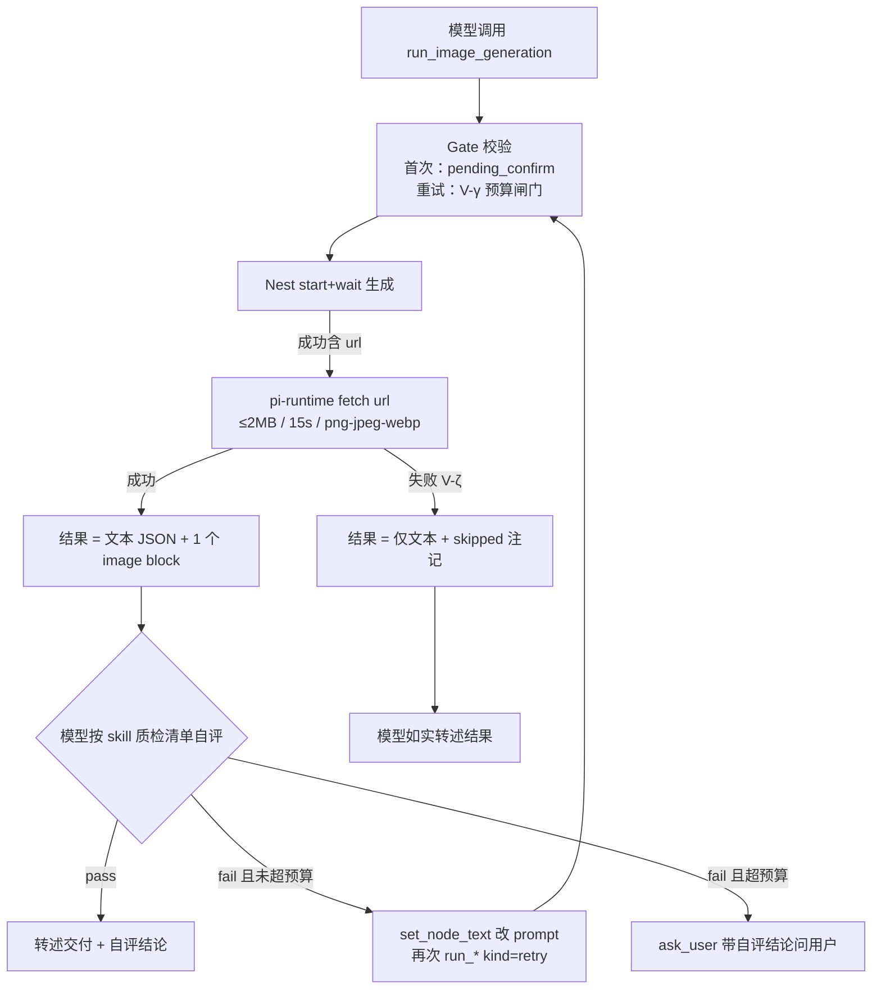

# PI-Lnk 视觉自评闭环（Vision Self-Refine Loop）· 设计规格

> **状态**：Draft v0.9（待 sign-off）
> **创建日期**：2026-09-29
> **路径**：`docs/superpowers/specs/2026-09-29-vision-self-refine-loop-design.md`
> **关联文档**：[Fast-Ramp + K3s 设计规格](./2026-09-19-pi-lnk-fast-ramp-k3s-design.md)、[工具层可学性改造 PR #62](https://github.com/sev7n4/pi-lnk/pull/62)
> **新增决策**：V-α ~ V-ζ 共 6 个
> **前置验证**：2026-09-29 spike 双确认（详见 §1.5）

---

## 0. 配图索引

| 图号 | 内容 | 形式 |
|---|---|---|
| 图 1 | 视觉自评闭环数据流（P0 范围） | Mermaid flowchart |

## 1. 背景与动机（Why 立项）

### 1.1 能力定义

把 `run_*_generation` 的生成结果作为 **image block 回流到模型上下文**，让模型在把结果转述给用户之前**先"看"一遍**：按任务类型清单自评质量，不合格则归因、改写 prompt 并重生成（预算内），或带自评结论询问用户。本质是把 agent 从"执行器"（用户当质检员）升级为"带质检的创作者"（模型当第一道质检员）。

### 1.2 业界共性场景（为什么这是行业主线）

1. **交付前自检（verify-before-delivery）**：图像生成的头号失败模式是图内文字乱码与主体细节错误，用户一眼可见，纯文本模型永远发现不了。Manus/Claude Code 的浏览器 agent 截图自检是同构模式，是当前多模态 agent 的主流实践
2. **自我修正重生成（self-refine）**：发现偏差 → 结构化归因 → 改写 prompt → 重生成。典型如电商图 agent 发现品牌 logo 画错，自动在 prompt 追加正确拼写与"精确渲染文字"指令重出
3. **多候选择优（best-of-N）**：一次出多张、模型按标准打分选优交付——用生成成本换用户往返成本（本 spec 列为非目标，见 §2）
4. **参考图理解**：让模型"看见"用户的参考素材再写 prompt，对"仿这家的排版"类需求是质变（本 spec 列为 P2）

### 1.3 行业最佳实践硬约束（本 spec 的设计边界，全部采纳）

1. **重试预算封顶**：自动重生成 ≤1-2 次，超限转 `ask_user` 带自评结论询问——不封顶会烧钱烧时间且模型陷入循环（→ V-γ）
2. **结构化评清单**：按任务类型定义检查项，模糊自评得到模糊的"看起来不错"（→ V-δ）
3. **贵生成省着用**：视频 11 分钟/次，不做多轮 auto-refine，只做廉价预检（→ V-ε，P2）
4. **不越过 HITL**：不静默覆盖用户已确认的生成，重试必须有自己的确认语义（→ V-γ）
5. **评估标准放 skill 不放代码**：检查清单随业务迭代，不改 runtime（→ V-δ）

### 1.4 画布场景映射与优先级（为什么先做电商白底图）

| 优先级 | 场景 | 检查点 | 依据 |
|---|---|---|---|
| P0 | 电商白底图（`ecommerce-product-photo` 0.4.0 已上生产） | 品牌文字拼写、产品完整性、背景纯净、色温、水印 | 生产 skill 已有、失败模式最典型、checklist 现成可增补 |
| P1 | 人物多视图/三视图 | 角色一致性、视图覆盖、服装顺序（先身份后衣服） | 一致性是重灾区；配合 `grid_slice_image` 可逐格检查 |
| P1 | 带文字的营销图/海报 | 图内文案拼写 + 自动修正 | 最易验证收益的场景 |
| P2 | 视频廉价预检 | 首帧/缩略图构图预检，避免 11 分钟等待后才发现构图错误 | 前置：核实 video orchestrator 是否产出 thumbnail |
| P2 | 参考图理解 | 侧栏参考图回流，prompt 贴合参考风格 | `apply_sidebar_attachments` 的另一半收益 |

### 1.5 可行性证据（2026-09-29 spike，双确认）

1. **harness 层**：vendored pi `AgentToolResult.content` 原生支持 `(TextContent | ImageContent)[]`（`vendor/earendil-works/pi/packages/agent/src/types.ts:364`）；pi 自带的 `harness/tools/read.ts` 即返回 image block——**该工具仅作 harness 支持 image content 的存在性证据，pi-runtime 刻意不装配任何自带文件系统工具**（无合法 cwd、bash 为多租户 pod 的 RCE 面），pi-runtime 侧零 harness 改造
2. **网关层**：生产同款 `agnes-2.5-flash` 经 `api.agnes-ai.cn/v1` 实测视觉输入放行——64×64 纯红 PNG 以 OpenAI `image_url`（data URI）格式请求，返回「红色」且 `usage.prompt_tokens_details.image_tokens=64`，图片真实入模

## 2. 目标与非目标

**目标**

- G1：电商白底图场景的「生成 → 自评 → 修正 → 交付」闭环上生产
- G2：通用机制就位——`run_image_generation` 结果带图回流 + Gate 重试语义 + 观测，P1/P2 场景零机制成本接入
- G3：自评/重试行为可观测（metrics + 现有 SSE trace）

**非目标（有意不做，需求确定性裁决）**

- N1：视频 auto-refine 多轮循环——只做 P2 廉价预检
- N2：best-of-N 多候选择优——涉及 Nest 生成并发与画布节点语义，单独立项
- N3：参考图回流（侧栏 @I* 图片进模型上下文）——P2，涉及 attachments 隐私与体积策略
- N4：runtime 硬编码自评循环状态机——自评由模型主导（V-α），runtime 只提供机制与预算闸门
- N5：`run_text/prompt/audio_generation` 结果回流——无图可回

## 3. 决策摘要

| ID | 决策 | 理由 |
|---|---|---|
| V-α | 自评由**模型主导**：工具描述 + skill 规则引导模型在 run 成功后自评、归因、改 prompt、重跑；runtime 不写循环状态机 | 避免再造 runtime 状态机；模型上下文里已有图与原 prompt，自评是纯推理行为 |
| V-β | 回流通道：`run_image_generation` execute 成功后 **pi-runtime 侧 fetch url → base64 → 追加 1 个 image block**；Nest 零改动 | Nest 返回 `{url?}`（agent-canvas-tools.service.ts:1166）；netpol egress 443 已放行任意 host |
| V-γ | 重试 Gate 语义：**同一节点在同一会话内第 2 次 `run_*` 直接放行**（用户首次确认已表达该节点生成意图），并打 `kind=retry` 观测；**第 3 次起 Gate 拦截**，模型必须 `ask_user` 或重新 `propose_generation` | 用户多点一次确认的 UX 代价大于收益；但预算闸门必须在 runtime 侧（不能只靠模型自觉） |
| V-δ | 质检标准载体 = skill：`ecommerce-product-photo` 升 0.5.0 增「质检清单」节；通用清单 skill `canvas-quality-check` v0.1.0 于 P1 新增 | 行业实践 5；skill 版本约定（frontmatter version + 变更记录）已就位 |
| V-ε | 范围：P0 仅 `run_image_generation` 回流；`run_video_generation` 首帧预检为 P2（前置核实 thumbnail 可得性） | 行业实践 3；11 分钟/次的重生成不进循环 |
| V-ζ | 失败降级 fail-open：图片 fetch 失败/超时/超限时**仅返回文本结果**（附 `imageRefine: "skipped"` 注记），绝不阻塞生成主链路 | 生成是主交付，自评是增强；增强失败不能拖垮主功能 |

## 4. 架构设计

### 4.1 数据流

P0 范围的端到端闭环见图 1：

*图 1 · 视觉自评闭环数据流（P0 范围）*

### 4.2 pi-runtime 改动（`services/pi-runtime/src/tools/`）

1. **新 helper `fetchImageAsBlock(url)`**（`generation.ts` 或新文件 `image-refine.ts`）：
   - `fetch` + `AbortSignal.timeout(15_000)`；`Content-Length > 2MB` 或流式读超限即放弃（V-ζ）
   - mimeType 白名单：`image/png`、`image/jpeg`、`image/webp`；按 Content-Type 判定，不符即放弃
   - 成功返回 `{ type: "image", data: base64, mimeType }`；任何异常返回 `undefined`（调用方降级）
2. **`runTool`（run_image_generation 分支）**：成功且 `data.url` 存在时，`content = [textResult, ...imageBlock?]`；文本 JSON 增加 `imageRefine: "attached" | "skipped:<原因>"` 字段，并在 description 中告知模型该字段的含义与自评职责（V-α 的挂点）
3. **特性开关**：`PI_RUNTIME_IMAGE_REFINE`（默认 `on`；`off` 时跳过 fetch，行为与 0.0.12 一致）——回退开关，见 §9
4. **`run_video/text/prompt/audio_generation` 不改动**（V-ε/N5）

### 4.3 Gate 改动（`src/gate/generation-gate.ts` + `index.ts` hook）

1. `GenerationGateStore` 增 per-session `Map<nodeId, runCount>`：`run_*` 通过校验后计数 +1
2. 放行规则（V-γ）：节点处于 `pending_confirm`（首次，现状不变）**或** `runCount === 1`（重试放行，`metrics.observeToolCall(tool, "ok", "retry")` 打点）；`runCount >= 2` 拒绝，reason 指引模型「预算已尽，用 ask_user 或重新 propose_generation」
3. 会话删除/`onSessionCreated` 时清零（沿用现有 resetSession 语义）

### 4.4 上下文预算

- 实测单图 image_tokens ≈ 64（64×64）；真实生成图按分辨率估算数百-数千 token，单结果单图（V-β 上限 1）可控
- 观测复用 PR #62 的 `pi_runtime_tool_result_bytes` 直方图——回流上线后该指标自然反映体积增幅，设告警阈值（p99 > 512KB 时复核）
- 不做跨轮图片裁剪/compaction 特殊处理（YAGNI，等观测数据）

### 4.5 SSE / 前端

- tool_end 事件对前端透传内容变化无感：`AgentSideRail` 只消费文本 delta 与 canvas_command，tool result 的 image block 不直接渲染——**前端零改动**
- 模型的自评结论经正常文本流呈现给用户（"已生成并自检：文字清晰、背景纯净；色温偏暖已自动修正一版"）

## 5. Skill 改动（V-δ）

1. `skills/ecommerce-product-photo/SKILL.md` 0.4.0 → **0.5.0**：新增「生成后质检清单」节——① 品牌与图内文字拼写正确 ② 产品主体完整无裁切 ③ 背景纯净无杂物 ④ 色温/明暗符合品类 ⑤ 无水印乱码——并写明自评流程（pass → 转述；fail → 归因改 prompt 重跑一次；再 fail → ask_user）
2. P1：新增 `skills/canvas-quality-check/SKILL.md` v0.1.0（通用清单 + 三视图/海报分节）
3. 版本与变更记录遵循 skill 约定（frontmatter `version` + 文末 `## 变更记录`）

## 6. 观测与验收

1. **验收冒烟（生产/预发）**：公网发「帮我做一张 XX 的白底图」→ 用户确认 → SSE 观察 `run_image_generation` → 模型输出自评文本；重试场景人工构造一次 fail prompt 验证 V-γ 第 2 次放行、第 3 次拦截
2. **metrics**：`pi_runtime_tool_calls_total{...,kind="retry"}`、`{kind=...}` 缺失即预算闸门未生效；`pi_runtime_tool_result_bytes` p99 复核
3. **KPI**：对齐 spec §4.4 shadow 7 项口径，不新造体系

## 7. 测试计划

1. `fetchImageAsBlock` 单测（mock fetch）：成功返回 block / 超时 undefined / >2MB undefined / 非白名单 mime undefined
2. `run_image_generation` 结果断言：成功含 image block 且 `imageRefine:"attached"`；fetch 失败仅文本且 `imageRefine:"skipped:..."`；开关 off 时无 block
3. Gate 重试计数：同节点第 2 次 allowed（打点 retry）、第 3 次 rejected 且 reason 含 ask_user；跨节点互不影响；会话重建清零
4. 回归：`config.test.ts` 工具总数 32 不变；`verify-contract` 不动（HTTP 契约零变更）
5. skill：0.5.0 frontmatter version + 变更记录存在性测试（skill-tool.test 既有模式）

## 8. Phase 计划

| Phase | 内容 | 交付 |
|---|---|---|
| P0（本 spec 主交付） | §4.2/4.3 机制 + 电商白底图 skill 0.5.0 + 观测 | pi-runtime 0.0.13（helm runbook 升级） |
| P1 | 三视图/海报清单泛化 + `canvas-quality-check` skill | skill 交付为主 |
| P2 | 视频首帧预检（前置：核实 thumbnail）+ 参考图回流设计 | 另立 spec 补充 |

## 9. 回退

- `PI_RUNTIME_IMAGE_REFINE=off` + pod 重启：工具结果回到 0.0.12 行为（无 image block），Gate 重试放行随开关一并关闭（计数逻辑短路）——秒级止血不换镜像
- 版本回退：helm `--set image.tag=0.0.12`（runbook L2）

## 10. 与既有红线的关系

1. 不触碰 `vendor/**`（V-β 全部在 pi-runtime 业务侧）
2. HITL 纪律不越界：首次生成仍走 propose→confirm；重试放行边界与预算闸门见 V-γ（**sign-off 时需重点确认此决策**）
3. 需求确定性裁决留痕：N1-N5 明确「有意不做」及重启条件
4. 部署走 pi-runtime runbook（构建 --no-cache + dist 特征串验证 + helm 显式 tag），下一版本号 0.0.13
