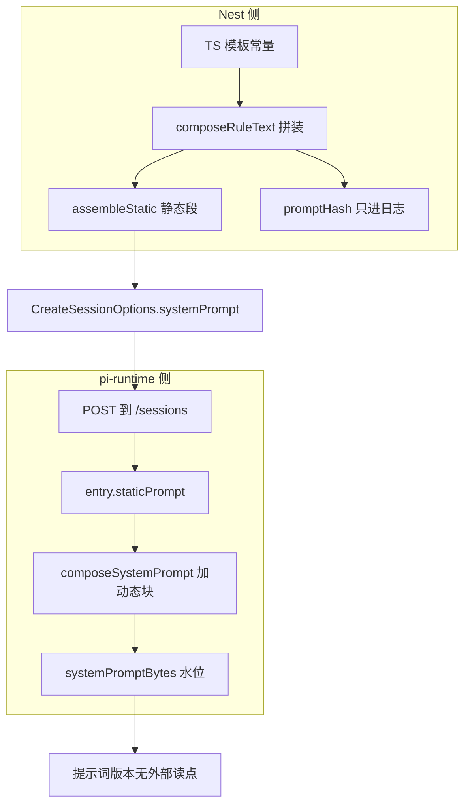
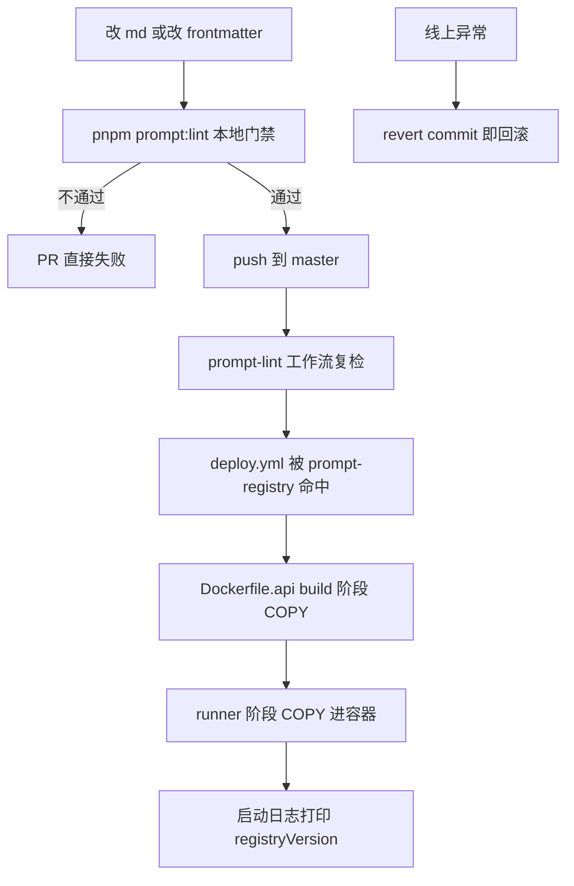

# 提示词注册中心 prompt-registry（W1a 地基层）· 设计规格

> **状态**：待评审（2026-10-02，二轮审计后续的第一个正式执行单元）
> **前置**：[二轮审计报告 §04 方案 A](./../../2026-10-02-prompt-engineering-audit-round2.html)、[首轮审计报告 §04–08](./../../2026-10-02-prompt-engineering-audit.html)
> **取证基线**：`origin/master` `d574b8b`（pi-runtime 0.0.40 / helm rev 57）。全部宿主侧行号以该基线为准
> **实现约定**：feature 分支 + PR + squash merge；工作区存在并行窗口改动，**开工前先 `git fetch`，从 `origin/master` 拉 worktree 再动**
> **本包不做的**：规则原子化重写（W4–W5）、eval 回归集（W1b）、pi-runtime 侧接入（W3）

---

## 0. 配图索引

本文档的图一律以内嵌 Mermaid 承载（结构图，可随文 diff）。

| 编号 | 形式 | 内容 | 位置 | 用途 |
|---|---|---|---|---|
| 图 1 | 内嵌 Mermaid | 现状提示词注入拓扑与版本断点 | §3 | 说明版本身份为什么在现有链路上断掉 |
| 图 2 | 内嵌 Mermaid | Registry 目录结构、loader 校验与装配契约 | §5 | 验收 loader 与渲染器的边界 |
| 图 3 | 内嵌 Mermaid | 内容变更到生产生效的链路与回滚点 | §9 | 判定一次 .md 改动是否真的发版、怎么回滚 |

---

## 1. 目标

1. **把散在 TS 模板字符串里的系统提示词规则搬进受管文件资产**：新增根目录 `prompt-registry/`，每条规则一个 `.md`，元数据走 YAML frontmatter，总登记处 `MANIFEST.yaml`。
2. **让提示词具备可读、可比对、可回滚的版本身份**：每条 `.md` 带 `version` 与内容哈希，Registry 整体产出 `registryVersion` + `registryHash`，并落到启动日志与 manifest 字段。
3. **给提示词装上第一道 CI 门禁**：`pnpm prompt:lint` 对 frontmatter 完整性、版本 bump 义务、id 唯一性、规则预算、以及"fallback 常量与文件是否双写漂移"硬校验；不通过则 PR 红。

---

## 2. 范围（含明确不做）

### 2.1 做

- 新建 `prompt-registry/` 目录（`.md` 资产 + `MANIFEST.yaml`）。
- 新建薄 loader `apps/server/src/agent/pi-runtime/prompt-registry.loader.ts`（fs 读 + frontmatter 解析 + 校验 + 渲染）。
- `pi-prompt-assembler.service.ts` 的静态段改为从 Registry 渲染；**输出字符串与搬家前逐字节相同**。
- 保留代码内 fallback 常量，供容器里读不到目录时兜底；lint 负责卡住二者漂移。
- `scripts/prompt-lint.ts` + 根 `package.json` 的 `prompt:lint` 脚本 + `.github/workflows/prompt-lint.yml`。
- `deploy/docker/Dockerfile.api` 双阶段各加一行 COPY；`deploy.yml` 的 push paths 与 changes 过滤器各加一条 `prompt-registry/**`。

### 2.2 明确不做

| 不做 | 原因 | 归哪个包 |
|---|---|---|
| 规则原子化 / 拆分 / 重写措辞 | 会让模型看到的字节变化，而首轮 P0-1 的回归集此时还不存在 | W4–W5（硬门槛：W1b 的 L1 判据可信） |
| 把版本号注进 prompt 正文 | 会改变送达模型的字节，等于一次无护航的提示词变更 | W4–W5，需 eval 通行证 |
| eval harness / 30 条 golden case | 依赖本包产出的 `registryHash`（基线身份）与依赖装包 | W1b |
| pi-runtime 侧接入 Registry、容器 COPY | W1a 的静态段全部由 Nest 生产，pi-runtime 本包不需要读文件 | W3（media-parse 子提示词归位时） |
| 侧栏块 / 画布摘要 / 长期记忆动态块入库 | 动态块是每轮世界状态，不属于"受管内静态资产" | W4–W7 |
| K3s configmap 热更 .md | 与 `skills/` 既有心智不一致，且会引入"内容与镜像不一致"的第二套真相 | §12，可取但非必需 |
| 新增运行时 HTTP 诊断端点 | 新增攻击面；启动日志已能回答"进程跑的是哪版" | §12，按是否需要再定 |

---

## 3. 与既有规格的关系

**本包显式推翻**二轮报告 §04.1 目录树里 `packages/prompt-registry` 作为 **pnpm workspace 包**的画法，改为**根目录纯文件资产**。推翻理由（都可复现核查）：

- `pnpm-workspace.yaml` 仅声明 `apps/*`、`packages/*`、`services/*`，根 `prompt-registry/` 天然不是包；
- `services/pi-runtime/Dockerfile:8` 用 `pnpm install --filter @pi-lnk/pi-runtime --frozen-lockfile`，做包要连带改 install 过滤与 lockfile；
- `skills/` 已是"根文件资产 + Dockerfile COPY + 运行时 fs 读"的先例且在生产运行（`services/pi-runtime/src/skills/loader.ts`），**不新增构建机制是这个决策最值钱的部分**；
- 提示词是内容不是代码，随 build 发 npm 会造成"代码版本 + 内容版本"双版本地狱；版本应由 frontmatter 与 MANIFEST 管。

**本包显式修订**首轮报告 §04 的"Registry 可单测、有 hash/version"表述：类型安全不再由 TS 提供，改为**由 lint 与 golden 测试提供**——这是形态选择的代价，可接受。

**本包沿用**二轮报告 §09 的"不做清单"：不 fork vendor 换摘要骨架、不把规则拆成 N 个 promptTemplate、不自建技能渐进披露。

版本身份在现有链路上的断点见 图 1。



**图 1 · 提示词从生产到交付的四段链路，以及版本身份只停留在第一段内部。** 图中 A4 的 promptHash 由 `pi-prompt-assembler.service.ts:74` 算出、只在 `:229` 写进 `logger.log`；我逐个 `git ls-tree` 反查过 `origin/master` 全量 `apps/server/src/**/*.ts`，消费它的只有该文件自身与它自己的单测——没有指标、没有会话档案、没有 DB。

---

## 4. 规范与判据

以下五条是**跨后续所有包复用**的规则，后续同类需求直接套，不必重新设计。

### 4.1 目录与文件命名

```
prompt-registry/
├── MANIFEST.yaml
└── rules/
    ├── <id>.md          # id 用小写蛇形，与 frontmatter 的 id 一致
    └── ...
```

- 目录**必须**放在仓库根，不进 `packages/*`（见 §3）。
- 一个 `.md` = 一条规则 = 一个最小可发布单元；**W1a 允许一条里面含多句指令**（那是 W4–W5 的活），但必须能被整体引用与整体回滚。
- id 命名：小写 + `_`，禁 `-` 与大小写混排（与 `skills/loader.ts:14` 的 `NAME_PATTERN` 同族约束）。

### 4.2 frontmatter 契约

对齐 vendor 的分隔符约定（`vendor/earendil-works/pi/packages/agent/src/harness/prompt-templates.ts:214-215`：`startsWith("---")`，终止于 `\n---`）。字段：

| 字段 | 必填 | 取值 | 约束 |
|---|---|---|---|
| `id` | 是 | 小写蛇形 | 全局唯一，与文件名一致 |
| `version` | 是 | `MAJOR.MINOR.PATCH` | 内容变 → 必须升 PATCH；结构/口径变 → 升 MAJOR |
| `title` | 是 | 中文短句 | ≤ 40 字 |
| `order` | 是 | 正整数 | 同组内唯一，决定注入先后 |
| `group` | 否 | `writeTools` \| `genTools` | 省略 = 恒注入（core 段） |
| `unlessGroup` | 否 | `writeTools` | 存在该组时**不**注入（写守卫专用） |
| `owner` | 是 | 组名或个人标识 | 用于评审找责任人 |
| `updated` | 是 | `YYYY-MM-DD` | 校验"谁在什么时候改的" |

`group` 的取值集合不是自由文本：lint 持有一份白名单，出现未知值直接报错——这是防止口径漂移的关键，也是把首轮报告"三份文档三个数"那类口子关掉的通用手法。

### 4.3 版本与哈希

- **单件哈希**：`sha256(body)` 取前 12 位 hex，`body` 为第二个 `---` 之后、经 `trimEnd()` 的文本。
- **Registry 整体版本**：`MANIFEST.yaml` 声明 `version` + `registryHash`。`registryHash = sha256(规范化清单)` 前 12 位；规范化 = 按 `order` 升序、条目为 `id@version#contentHash` 的换行拼接。确定性排序是硬要求，否则同一个目录两次加载会算出不同哈希。
- **版本不进 prompt 正文**：W1a 的版本身份一律**带外**传递（启动日志 + manifest 字段）。正文注入属 W4–W5。
- **fallback 双写必须由 lint 兜住**：`pi-prompt-assembler.service.ts` 里保留的内嵌常量（见 §5.3）必须与 Registry 逐字节相等，否则 lint 红。这条把"内容搬进文件后代码里还留着旧副本"的漂移风险变成 CI 可见。

### 4.4 渲染不变式（本包最硬的一条）

> `renderStatic(ruleGroups)` 的输出，对任意 `ruleGroups` 组合，**必须与搬家前的 `composeRuleText()` 输出逐字符相等**。

推论：`.md` 的 body 经 `trimEnd()` 后，必须等于原来那个 TS 常量；拼接符仍是 `\n`。

| 旧的 `group` 组合 | 期望输出 |
|---|---|
| `[core]` | `PREFIX\nRULE_3_NO_GEN\nTAIL` |
| `[core, writeTools]` | 上式 + `\n` + `WRITE_TOOLS_RULES` |
| `[core, genTools]` | `PREFIX\nRULE_3_GEN\nTAIL` + `\n` + `GEN_TOOLS_RULES` |
| `[core, writeTools, genTools]` | `TAIL` 后先 `WRITE_TOOLS_RULES` 再 `GEN_TOOLS_RULES` |

这四种组合各锁一条 golden 用例（见 §10）。

### 4.5 lint 规则集（`pnpm prompt:lint`）

全部为**错误级**（PR 红），无 warning 降级：

1. `L1` 每个 `.md` 的 frontmatter 完整（§4.2 必填项齐备、类型合法）。
2. `L2` `id` 与文件名一致且全局唯一；`order` 同组内唯一。
3. `L3` **contentHash 变了而 `version` 没变 → 报错**（强制 bump 义务）。
4. `L4` `group` / `unlessGroup` 取值必须在白名单内；引用了不存在的组 → 报错。
5. `L5` body 不得含尾部空白（保证 `trimEnd()` 是幂等的）；不得含裸标签 `<...>`——二轮报告 §09 已记录 `<style>` 会进 CDATA 吞掉整段 HTML/文档，提示词文本里同样不能留这个坑。
6. `L6` 静态段总字符预算：恒注入 + 常见组合 ≤ 2400 字符，超过报错；≥ 2000 报错前先警告并登记。现行实测：core-only 465，全组合 1925，留有余量。
7. `L7` **fallback 常量与对应 `.md` 的 body 必须逐字符相等**（§4.3）。
8. `L8` `MANIFEST.yaml` 的条目集合必须与磁盘上的 `.md` 集合完全一致（漏登记报错）。
9. `L9` 代码里引用的 id 必须在 Registry 中存在（`pi-prompt-assembler.service.ts` 的组装逻辑声明的 id 清单）。

---

## 5. 架构与契约

### 5.1 组件与数据流


**图 2 · Registry 的三段职责：读文件、校验算版本、按组渲染。** 校验（L2）与渲染（L4）刻意不合并，是为了让 lint 能复用同一份校验代码——CI 与运行时跑同一套判据，才能避免"本地过、线上炸"。

### 5.2 目录解析

loader 的 root 解析顺序（生产环境必然落第二条）：

1. `process.env.PI_PROMPT_REGISTRY_DIR`（显式指定，未来挂 configmap 时零改代码）；
2. 容器内的 `/app/prompt-registry`；
3. 开发态：以 `process.cwd()` 为基准向上找 `prompt-registry` 目录（覆盖 `apps/server` 与仓库根两种 cwd）。

**两条都要存在但语义相反**：
- **运行时 fail-soft**：目录读不到 → 用代码内 fallback 常量出一版静态段，保证线上不哑火，同时打 `warn`；
- **CI fail-hard**：`prompt-lint` 与前述 golden 用例不依赖 fallback 分支，读不到就是红。

### 5.3 接口契约

```ts
// apps/server/src/agent/pi-runtime/prompt-registry.loader.ts
export interface PromptRegistryEntry {
  id: string; version: string; title: string; order: number;
  group?: "writeTools" | "genTools";
  unlessGroup?: "writeTools";
  owner: string; updated: string;
  body: string;            // 已 trimEnd
  contentHash: string;     // 12 位 hex
}

export interface PromptRegistrySnapshot {
  registryVersion: string;   // MANIFEST.yaml 声明
  registryHash: string;      // 规范化清单哈希，12 位 hex
  entries: PromptRegistryEntry[];
  degraded: boolean;         // true = 走了 fallback
  degradedReason?: string;
}

/** 读目录 + 校验 + 算版本；失败不抛，走 degraded 语义。 */
export function loadRegistry(root: string): PromptRegistrySnapshot;

/** 渲染静态段；与搬家前的 composeRuleText() 逐字节等价（§4.4）。 */
export function renderStatic(snapshot: PromptRegistrySnapshot, groups: string[]): string;

/** 供 lint 与单测复用。 */
export function renderStaticFallback(groups: string[]): string;   // 直接用内嵌常量
export function assertRegistryIntegrity(root: string): string[];  // 返回错误数组，空数组=通过
```

`renderStaticFallback` 就是 §4.3 说的"fallback 双写"——它让线上永远有退路，也让 lint 有对照物。

### 5.4 迁移映射表（W1a 搬运清单）

全部基于 `origin/master` 实测字符数：

| Registry id | 来源 | 原行号 | 字符 | `group` | `unlessGroup` |
|---|---|---|---|---|---|
| `identity.opening` | `CORE_RULES_PREFIX` | `:89` | 107 | —（恒注入） | — |
| `no_gen_claim.nogen` | `RULE_3_NO_GEN` | `:95` | 89 | — | — |
| `no_gen_claim.gen` | `RULE_3_GEN` | `:98` | 92 | — | — |
| `sidebar_vision.tail` | `CORE_RULES_TAIL` | `:100` | 269 | — | — |
| `media_tool_policy` | `WRITE_TOOLS_RULES` | `:113` | 911 | `writeTools` | — |
| `gen_tool_policy` | `GEN_TOOLS_RULES` | `:121` | 468 | `genTools` | — |
| `write_guard` | `RULE_10_WRITE_GUARD` | `:106` | 79 | — | `writeTools` |

`composeRuleText`（`:131-141`）的组合逻辑逐字保留：core 段按 `genTools` 决定用 `gen` 还是 `nogen` 版本，随后按 `writeTools` → `genTools` 顺序追加，最后当 `!writeTools` 时追加写守卫。注意 `:137-139` 的注释自己声明了"注入顺序为 1,2,3,7,4,5,11,12,13，与 explore.py 不同，顺序差异对模型语义无影响"——W1a 不动这个顺序，顺序讨论留给 W4–W5。

---

## 6. 打样/首场景规格：第一次真实搬运

以 `identity.opening` 为样板走完全流程，其余六条同法批量执行。样板产出（body 逐字符等于 `CORE_RULES_PREFIX` 的全部三行）：

```markdown
---
id: identity.opening
version: 1.0.0
title: 身份与语气
order: 10
owner: agent-platform
updated: 2026-10-02
---
你是 lnkpi 无限画布助手。用简洁中文回答。
规则：
...
```

逐条验收判据：

1. `id` 与文件名同名，七条 id 之间无重名（lint L2）。
2. 每条 body 与 §5.4 表格里的原常量**逐字符相等**（lint L7 + golden 测试双保险）。
3. `MANIFEST.yaml` 七条目齐全，顺序按 `order`。
4. 四条组合 golden 全绿（§10）。
5. `registryHash` 是一个稳定的 12 位 hex，且**同一个目录内容两次加载结果相同**。

> **订正（2026-10-03，实施期取证）**：本节原写「八条目」，实际落地为**七条**——
> `no_gen_claim` 是一条规则的两个互斥版本（`no_gen_claim.nogen` / `no_gen_claim.gen`，
> 由 `genTools` 开关二选一），不是两条独立规则。`entries=7`。
> 下文 §9 表与 §10 中 `entries=8` 一并按七读取。

---

## 7. 数据与状态变更

| 变更 | 内容 | 影响面 |
|---|---|---|
| `PromptManifest` 新增字段 | `registryVersion`、`registryHash` | `pi-prompt-assembler.service.ts:44-51` 的 `PromptManifest` 接口（本服务自己的类型） |
| manifest 日志行 | 在 `:229` 现有行尾追加 `registry=<version> hash=<hash>` | 日志格式变化，需确认现有日志告警/采集规则不因字段增减误报 |
| 启动日志 | 进程启动时打印一行 `prompt registry version=… hash=… entries=7 degraded=false` | 新增；这是回答"生产跑的是哪版"的唯一日常手段。条目数为 **7**（`no_gen_claim` 是同规则两版，见 §6 订正） |
| pi-runtime | **W1a 不改** | 无。版本可观测性本期只到 Nest |
| helm / runtime-deploy | **W1a 不改** | W1a 不新增任何 env、不碰 `--set-string` 清单 |

---

## 8. 纯函数与算法（含单测要求）

loader 全部是纯函数，无 IO 副作用（IO 只在 `loadRegistry` 一处）：

| 函数 | 算法要点 | 单测要求 |
|---|---|---|
| `parseFrontmatter(text)` | 复用 vendor 分隔符约定：`startsWith("---")` 起，终止于 `\n---`（`indexOf("\n---", 3)`，从索引 3 起防止首个字符就是分隔符） | 无 frontmatter 时视为空 frontmatter + 全文 body；无终止分隔符时报错；YAML 非对象时报错 |
| `contentHash(body)` | `sha256().update(body,"utf8").digest("hex").slice(0,12)`，与既有 `promptHash`（`:74`）同族 | 稳定、同输入同输出、跨进程一致 |
| `normalizeManifest(entries)` | 按 `order` 升序稳定排序；条目序列化为 `id@version#contentHash` | 乱序输入 → 同输出（确定性排序硬要求） |
| `renderStatic(snapshot, groups)` | 遍历 `order` 升序，满足 `group∈groups` 且 `!unlessGroup∈groups` 才拼入，用 `\n` 连接 | 四组合 golden（§4.4 表）+ 空组返回空串 |
| `assertRegistryIntegrity(root)` | 复用 §4.5 的 L1–L9，返回错误数组 | 每条 lint 规则各一条负例：故意造坏文件，确认**该报的错都报了** |

单测运行方式与仓库既有纪律一致：Nest 侧 `apps/server` 走 vitest（`pnpm --filter @lnkpi/server exec vitest run <file>`）；`services/pi-runtime` 那套 `node --import tsx --test` 的测试链本包用不上——loader 明确放在 `apps/server/src/agent/pi-runtime/` 下，随 Nest 侧 vitest 一起跑，不必为它引入 tsx 测试链路。

---

## 9. 文件级改动清单



**图 3 · 从改一个字到线上生效的完整链路与三个回滚点。** 关键约束在 `D1`：若 `deploy.yml` 的 push paths 不含 `prompt-registry/**`，那么"只改 .md"的提交连 workflow 都不会启动，容器里仍是旧文案，而所有人都以为发版了。

| 文件 | 动作 | 说明 |
|---|---|---|
| `prompt-registry/MANIFEST.yaml` | 新增 | 含 `version`、`registryHash`、七条目 |
| `prompt-registry/rules/*.md`（7 个） | 新增 | 内容见 §5.4 |
| `apps/server/src/agent/pi-runtime/prompt-registry.loader.ts` | 新增 | §5.3 契约 |
| `apps/server/src/agent/pi-runtime/prompt-registry.loader.test.ts` | 新增 | §8 单测 |
| `apps/server/src/agent/pi-runtime/pi-prompt-assembler.service.ts` | 改 | `composeRuleText` 改走 `renderStatic`；常量降级为 fallback；`PromptManifest` 加两个字段 |
| `apps/server/src/agent/pi-runtime/pi-prompt-assembler.service.test.ts` | 改 | 四条 golden + fallback 分支用例 |
| `scripts/prompt-lint.ts` | 新增 | §4.5 的 L1–L9 |
| `package.json`（根） | 改 | `scripts.prompt-lint` 一行（现 scripts 块在 `:7-20`） |
| `.github/workflows/prompt-lint.yml` | 新增 | PR + master 推送触发 |
| `deploy/docker/Dockerfile.api` | 改 | build 阶段 COPY（现 COPY 列表在 `:23-26`）、runner 阶段 COPY（现 `:74-81`） |
| `.github/workflows/deploy.yml` | 改 | `on.push.paths` 加 `prompt-registry/**`；`changes` 的 `api` filter 加同一条（现 `:42-56`） |

**pi-runtime 侧本期不动**：`services/pi-runtime/Dockerfile` 不加 COPY。理由已给（§2.2），W3 接入子提示词时再加。

---

## 10. 测试策略与验收标准

### 10.1 验收判据（逐条可勾选）

1. `pnpm --filter @lnkpi/server exec vitest run src/agent/pi-runtime/pi-prompt-assembler.service.test.ts` 绿，且四条组合 golden 通过（§4.4 表）。
2. `pnpm --filter @lnkpi/server exec vitest run src/agent/pi-runtime/prompt-registry.loader.test.ts` 绿，含 §4.5 每条 lint 规则各一条负例。
3. `pnpm prompt:lint` 在干净仓库退出码 0；故意制造"改 body 不升 version"与"fallback 与文件不一致"两个负例时**必须退出码非 0 且点名到文件行**。
4. `pnpm verify-spec-figures` 对本文档通过（结果贴 §13）。
5. 容器证据：`docker run --rm <api-image> ls /app/prompt-registry/rules | wc -l` 输出 `7`；启动日志出现 `registryVersion=… entries=7 degraded=false`。
6. 字节等价总证：在同一时间点对比改造前后 `assembleStatic` 对四个组合的返回值，逐字符 `toEqual`。

### 10.2 回滚方式

| 层级 | 动作 | RTO |
|---|---|---|
| 内容改错了 | `revert` 对应 commit（内容即文件，squash merge 后一行 revert 即回到旧文案） | < 5 分钟 |
| 容器读不到目录 | 已是 fail-soft：`degraded=true` + 用 fallback 常量，服务不哑火；修 Dockerfile/COPY 后重发 | 一个发版周期 |
| CI 门禁误报 | lint 规则调整需另开 PR，不接受直接在 master 上跳过门禁 | 一个 PR 周期 |

因为 W1a 是**字节等价搬家**，模型看到的文本一字未变，所以本包对线上行为的影响面≈0——真正的风险只在路径解析与 CI 门禁，而这两者上面都有兜底与硬校验。

---

## 11. 风险

| 风险 | 等级 | 判据/缓解 |
|---|---|---|
| **silent drift：改 .md 了但没发版**（`deploy.yml` paths 漏配） | 高 | §9 的 D1 改动是硬要求；验收项 5 用容器证据兜底 |
| fallback 双写后续漂移到不同文案 | 中 | lint L7 每次都比；并在 `pi-prompt-assembler.service.ts` 对应常量加 `@deprecated` 指向 Registry |
| 开发态路径解析在不同 cwd 下找错目录 | 中 | §5.2 三级解析 + 单测覆盖三种 root 输入；容器用绝对路径 |
| `trimEnd` 约定与未来某条规则的尾随换行冲突 | 低 | lint L5 禁尾随空白，把歧义挡在 CI |
| 与并行窗口改动冲突 | 中 | 复工前 `git fetch` + `origin/master` worktree；**不整文件 cp 工作区改动**（仓库既有纪律，历史上有 `tiering.ts` 被回退、改动混入他人口味的先例） |
| lint 规则过严拖慢日常 | 低 | 规则只覆盖格式与一致性，不审核文案质量；文案质量归 W4–W5 的 eval |

---

## 12. 后续包 / 路线图（本包外登记，避免隐性范围）

| 包 | 内容 | 前置 |
|---|---|---|
| W1b | eval harness + 30 条 golden case；`registryHash` 作为切分遥测的键 | 本包产出的 registryHash |
| W2 | 压缩 customInstructions 一行止血、延迟工具索引块补自然语言触发条件 | 本包（版本可归因） |
| W3 | pi-runtime 侧接入 Registry + `services/pi-runtime/Dockerfile` COPY；media-parse 子提示词归位；**删除 fallback 常量** | 本包稳定 1 周 |
| W4–W5 | 规则原子化重写、版本注入正文 | W1b 的 L1 判据可信 |
| W6 | `⟦plan⟧` → custom entry + EntryProjector | W1b |
| W7 | 调度守卫 / Model 分两条 | W4–W5 |
| §12-a（取决于本包上线后需求） | K3s configmap 挂载 `prompt-registry`；诊断端点；`pi_runtime_prompt_version_info` 指标（pi-runtime 侧，走手搓 runtime-deploy） | 本包 |

configmap 那条之所以可选项：§5.2 的 `PI_PROMPT_REGISTRY_DIR` 环境变量已经留好了口子，将来换挂载方式**不需要改 loader 代码**。

---

## 13. 配图规范自检

```bash
pnpm verify-spec-figures --file docs/superpowers/specs/2026-10-02-w1a-prompt-registry-design.md
```

| 规则 | 结果 |
|---|---|
| R1 视觉稿格式 | 不适用（本文档无 SVG 附件，全为内嵌 Mermaid） |
| R2 图号唯一且连续 | 图 1/图 2/图 3 连续 |
| R3 每张图有图注 | 三张图各配图注行 |
| R4 正文引用图号 | §3 引 图 1、§5 引 图 2、§9 引 图 3 |
| R5 §0 索引 | §0 索引表列出全部三张图 |
| R6 附件存在 | 无附件 |
| R7 Mermaid 类型合法 | 三张均为 `flowchart`，非空 |
| R8 SVG 标注 | 不适用 |

实际执行输出：

```
✓ docs/superpowers/specs/2026-10-02-w1a-prompt-registry-design.md

校验完成：1 篇在范围内，0 篇历史文档跳过（< 2026-09-22），0 个错误，0 个警告
```

执行方式：`./node_modules/.bin/tsx scripts/verify-spec-figures.ts --file <path>`。直接走 `pnpm verify-spec-figures` 时进程被 SIGKILL 137 收掉，改走本地 tsx 直连可稳定跑完；根 `package.json:19` 的 `verify-spec-figures` 脚本仍照常维护。
