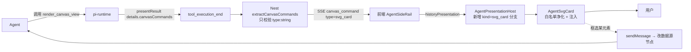

# 工具契约标准化 + 画布可视化渲染卡片（render_canvas_view）设计规格

状态：待评审（对话态设计已于 2026-10-03 三轮拍板；本spec 为书面化产物）
前置：`services/pi-runtime` 工具层已上线 40 个工具；`canvas_command` SSE 通道已上线（`ask_user` / `arrange_nodes` 在用）
分支约定：实现走 feature 分支 + PR + squash merge。**本PR 只做 §4 列出的 5 项标准化 + §5 的工具，存量工具不动。**

## 0. 配图索引

本文档结构图一律以Mermaid 内嵌。无视觉稿（纯工具契约 + 前端渲染分支，无像素级布局）。

| 编号 | 形式 | 内容 | 位置 | 用途 |
|---|---|---|---|---|
| 图 1 | 内嵌 Mermaid flowchart | 卡片产出的两跳通道（tool → SSE → 前端） | §5 开篇 | 验收「零 Nest 逻辑改动」 |

## 1. 目标

1. 给 pi-runtime agent 一个**只读可视化渲染工具**，让画布上已有的节点/边/表格能以图（SVG 卡片）呈现给用户看，**回答"为什么/怎么/关系/结构"类问题**；卡片在**刷新/重连后仍可恢复**（落库通道，见 §4.6 三跳账）
2. 落地工具定义的**书面规范 + 机器校验**，使新工具从第一天起符合 vendor 契约，不再靠口传惯例
3. 明确第41 个工具的加入**不放大**既有的 4 个契约缺口
4. 建立**与 vendor 契约面的机检门禁**，使「升级 pi-agent 后工具契约不会静默失效」有可执行保障（§4.8）——前3 项只保证内部一致，这项才保证与上游同步

## 2. 范围（含明确不做）

**在范围**：
- `ToolTier` 新增 `present`（只读投影 tier）
- 新增统一返回构造器 `presentResult()`（与既有 `uiResult` / `resultWithActions` 并列）
- 新增 `render_canvas_view` 工具（tier=`present`）
- `PiCanvasCommand` 扩 `type:"svg_card"` 字段透传；`AgentPresentationEnvelope` 扩 `kind:"svg_card"`
- 前端 `AgentPresentationHost.vue` 新增 `svg_card` 渲染分支 + 新组件 `AgentSvgCard.vue`
- 工具 `description` 规范写入 spec + 新增 lint 校验
- **新增 `scripts/verify-tool-contract.ts`（vendor 工具契约面漂移机检，§4.8）**，挂 `pnpm verify:tools` 接入 CI
- `prompt-registry/rules/` 新增 1 条规则承载「什么时候调」（三层when）

**不在范围**（显式不做，避免隐性范围）：
- **不改现有 40 个工具的任何 return 形状**（新规范只管新代码；存量整改另立PR，见 §7已知缺口）
- 不给存量工具补 `onUpdate` / `invocation` / `terminate`
- 不改 `tier` 现有 8 值的语义
- 不改 `prompt-registry` 现有 7 条规则
- **不做 `topo_preview` 老通道的复活**（见 §7 已知决策：L3 生成场景与那条线重合，优先级低于 L1/L2）
- 不做工具的代码生成 / 自动生成
- 不动 DB schema / helm / 部署链路
- **不清理 `tiering.ts:126` 的 `as LnkpiTool` 类型逃逸口**（改它要动 `createLoadToolsTool` 返回类型推导，属存量整改）⇒ §4.8 的 A3 断言只保证「逃逸口数量不增加」，不保证「已清零」

## 3. 与既有规格的关系

- **显式复用** `canvas_command` SSE 通道与 `extractCanvasCommands` 派生逻辑（`apps/server/src/agent/pi-runtime/pi-events.ts:297-326`）——只新增一个 `type` 值 `svg_card`，**不改派生契约**。该函数双通道（`tool_execution_end` + `tool_execution_update`）均只校验 `type` 是 string，其余字段全透传
- **显式复用** `presentation` 存储链路（`apps/server/src/agent/agent.service.ts:84,90,1104` 已能落库 `metadata.presentation`；`apps/web/src/stores/agent.ts:382-384` 已能解析）——**该链路当前无产出方，本PR 补上第一个产出方**
- **显式复用** `AgentPresentationHost.vue` 的 `kind` 白名单分支结构（`:39-48`，现 7 个 kind）——新增第 8 个分支
- **显式复用** `AgentMermaidBlock.vue` 的懒加载渲染范式（`components/agent/AgentMermaidBlock.vue:9-16`：动态 import + 失败降级 `pre`）
- **显式推翻**：不改 `nodeTypes`（画布不新增节点类型，见 §4.1 判据）

## 4. 规范与判据

### 4.1 落点判据：为什么是「只读投影」而不是画布节点

**判据**：用户要编辑的对象是**数据源**（镜头表 prompt 节点），不是图本身。

- 图的数据源是镜头表 / 资产表（已有 prompt 节点）或画布边（`get_canvas_layout`），**图是它的投影**（projection）
- 用户框选说"这镜压到 3 秒"时，agent 改的是**镜头表的时长格**（走 `set_node_text`），然后重渲染图。**编辑图= 编辑图的代码= 荒谬**
- 因此图**不落DB**、**不参与编排**（`arrange_nodes` / `connect_nodes` 对一张图无意义——它不是节点、没有上下游）
- **不新增画布节点类型**的理由：加了之后 `CanvasPage.vue:1254` 的 `nodeTypes` 映射、`useCanvasActions.ts` 的 applier、`packages/agent/src/tools/executor.ts` 的 applier拷贝都要同步，且`canvas-write.ts:88-90` 的 Nest 白名单要开口子——四处改动换零收益

**反面判据（何时这条不成立）**：若将来出现「用户要直接拖拽图上的元素并改变数据」的诉求，则落点需重估为画布节点。本spec 不预留该分支（YAGNI）。

### 4.2 tier 判据：新增 `present`

`ToolTier`（`services/pi-runtime/src/tools/types.ts:12-20`）现有 8 值无一语义匹配：

| 现有 tier | 为何不适用 |
|---|---|
| `read` | 只读，但产物是文本不是可视投影 |
| `write_light` | **不写库**（这是关键差异，硬塞会误导 before_tool 审批与 metrics 分组） |
| `ui_command` | 语义是「命令前端做某事」（focus/undo/redo），本工具是「agent 交付内容」 |
| `graph_batch` | 语义是画布图操作，与渲染无关 |

`present` 语义定义：**agent 产出的只读可视投影，无持久化、无副作用、不参与画布编排、可被用户丢弃后重生成**。

**审批判据**：`present` 归入 `before_tool` 免审批（同 `ui_command`）——它不改任何状态。

### 4.3 返回构造器判据

新增 `presentResult()` 于 `services/pi-runtime/src/tools/present-result.ts`：

```
presentResult(card: { svg: string; title: string; nodeIds?: string[] }) => {
  content: [{ type: "text", text: JSON.stringify({ ok: true, card_id, bytes, truncated }) }],
  details: { canvasCommands: [{ type: "svg_card", ... }] },
}
```

**判据**：与 `resultWithActions`（`result-with-actions.ts:15`）同构——**必须有 `details.canvasCommands`，否则 SSE 派生拿不到，卡片全程不可见**。该文件的注释记录了 PR #65 的踩坑（`details: undefined` ⇒ actions 丢进文本 ⇒ 「Nest 已改、画布不变，要等回合末全量回拉」），本构造器是对那条教训的制度化。

**存量工具不迁移的理由**：38 处手写 return 迁移的风险高于收益；lint 拦住新增即可。

### 4.4 description 规范判据（4 条惯例 + 机器校验）

现状：4 条惯例**事实存在**（40 个工具实测），但**无文档、无 lint**。本spec 把它变成可校验规则。

| # | 惯例 | 正例（实测） | 反例 |
|---|---|---|---|
| R1 | 动词开头，说清**返回什么** | `get_canvas_layout`（149 字符）"Get the current canvas layout (nodes with positions and sizes, groups, and edges…)" | 名词开头、无返回说明 |
| R2 | **前置条件**写进描述 | `get_generation_diagnostic`（116）"Requires generation…" | 把前置条件塞进 skill 正文 |
| R3 | **明确的否定边界**（不干什么 + 该改调什么） | `upsert_media_node`（152）"Does not start generation — use propose_generation after" | 只说能干什么 |
| R4 | **枚举值语义逐个说明** | `arrange_nodes`（225）"grid ignores edges, along_edges requires edges" | 裸列枚举值 |

**长度区间判据**：描述长度落在 `[80, 400]` 字符。
- 上界：> 400 说明把参数文档写进了 description（参数文档应在 `Type.String({ description })` 里逐字段写）
- 下界：< 80 大概率缺 R1/R2/R3 之一

**lint 落点**：新增 `scripts/lint-tool-descriptions.ts`，挂 `pnpm lint:tools`。
**为什么不用 `prompt:lint`**：`prompt:lint` 脚本**不在 master 的根 `package.json`**（实测 `scripts` 仅 6 条：dev/dev:web/dev:server/build/lint/test/test:server/test:server:changed/test:runtime/verify-*），它只存在于未合并的 `.worktrees/w1a-prompt-registry`。**本PR 独立建 lint，不等那个 worktree 合并**（避免依赖未合并分支）。

**lint 强制范围**：校验「本 spec 新增的工具」+「本次 PR 后新增的任何工具」，存量 40 个工具**豁免**。
实现方式：lint 读取 `services/pi-runtime/src/tools/present-result.ts` 同级的 `LEGACY_TOOL_NAMES` 常量（首次落地时填入现有 40 个工具名），不在该集合内的工具一律强制校验。这样存量豁免是**显式白名单**而非隐式跳过，新增工具漏网会直接让 CI红。
（否则 PR 必红，且与 §2「不改存量」冲突。）

**lint 必查项**：动词开头、长度 ∈ [80,400]、含否定标记（`not` / `never` / `does not` / `不`）、参数文档不重复出现在 description（人工判，不自动化）。

### 4.5 渲染安全判据（SVG 白名单注入，不用 iframe）

**判据**：选 SVG 而非 iframe，因为 SVG 白名单化后注入比 iframe 少一整层 XSS 面。

- **无 iframe**：`deploy/nginx.conf` 无 CSP 头（实测无 `Content-Security-Policy`/`frame-src`），这意味着一旦用 iframe 且配错 sandbox，**没有任何第二道防线**
- SVG 必须走**白名单净化**：剥离 `<script>`、`<foreignObject>`、事件属性 `on*`、`href="javascript:"`、外部 `url()` 引用
- 净化实现**不引入新依赖**：用浏览器原生 `DOMParser` + 遍历剔除（避免 DOMPurify 增加包体积与供应链面）
- **数据来源**：`get_canvas_layout` 返回的 `title` / 节点 id 会被写入 SVG 的 `<text>`，agent 生成的文本是**不可信输入** ⇒ 文本节点必须经 `escapeHtml`
- **超限截断**：`presentResult` 对 `svg` 长度设上界（截断时在 `content` 里显式回报 `truncated: true`），防止超长 SVG 撑爆气泡

### 4.6 通道判据：逐跳核实（**更正早期「零 Nest 逻辑改动」的笼统表述**）

⚠️ **本节在2026-10-03 实施前取证时更正过一次**。早期只核实了第 1 跳（SSE 派生）就宣布「零 Nest 逻辑改动」，这是**不准确的**——落库那一跳需要改 Nest。逐跳账如下：

| 跳 | 做什么 | 是否要改 Nest | 实测依据 |
|---|---|---|---|
| **1 派生** | `tool_execution_*.details.canvasCommands` → `canvas_command` SSE | ❌ **不改** | `extractCanvasCommands`（`pi-events.ts:297-326`）双通道均只 `.filter(c => typeof c?.type === "string")`，其余字段全透传 ⇒ 加 `type:"svg_card"` + `svg` 字段是纯增量 |
| **2 实时渲染** | SSE `canvas_command` → 前端出卡片 | ❌ 不改 Nest | 但**要改前端**：`AgentSideRail.vue:2514-2558` 的 `canvas_command` 分支是**硬编码 if-else 链**，无 `svg_card` 分支；且 `stores/agent.ts` **流内无任何代码写 `msg.presentation`**（`presentation` 仅在 `loadHistory:386-398` 从 `metadata.presentation` 读）⇒ 必须新增 `setPresentation()` + 分支调用 |
| **3 落库恢复** | 刷新/重连后卡片仍在 | ✅ **要改 Nest** | `agent.service.ts:998-1012` 的 `extractCanvasCommands` 循环**只把 `ask_user` 进 `executionEvents`**（其余类型仅 `yield` 不落库）；且 `finalizeTurn` 的 `buildTurnMetadata({ executionEvents })`（`:1081`）**从未传 `presentation`**（实测 `presentation` 在 pi 路径零产出）⇒ svg_card 刷新后会消失 |

**结论**：本spec 的准确表述是「**SSE 派生零 Nest 改动（1 跳）+落库需最小 Nest 改动（3 跳）**」。

**3 跳的最小改动判据**（与 2 跳的 `ask_user` 同款，不新开机制）：
- Nest `agent.service.ts:1002` 的 `if (cmd.type === 'ask_user')` 条件扩为 `if (cmd.type === 'ask_user' || cmd.type === 'svg_card')`，落库走既有 `executionEvents` 通道（`canvas_command` 事件类型已在白名单，无需新增）；
- `finalizeTurn` 的 `buildTurnMetadata({ executionEvents })` **不动**——`svg_card` 的恢复由前端从 `metadata.executionEvents` 重放（`loadHistory:383-385` 已走 `replayExecutionTraceEvents`），**不需要** `metadata.presentation` 通道。
- 前端 `executionTraceReducer.ts` 的 `replayExecutionTraceEvents` 增加 `canvas_command` + `svg_card` 的重放分支（当前无此类型）。**这是比走 `metadata.presentation` 更短的路径**——后者需要 Nest 额外构造 envelope + 改 `buildTurnMetadata` 调用点。
- ⚠️ **代价（诚实声明）**：`executionEvents` 重放恢复的是「卡片曾出现过」，但**不恢复 `stepper`**（presentation envelope 自带 stepper 字段；svg_card 无 stepper）⇒ `AgentPresentationHost` 的 `AgentStepper` 对本卡不适用，`AgentSvgCard` 须是**无 stepper 的独立挂载点**，不能塞进 host 的 stepper 布局里。

完整两跳链路见图 1。

**前端判定实测**（修正一处早期误判）：`historyPresentation`（`AgentSideRail.vue:1060-1062`）判定为 `role==='assistant' && !streaming && msg.presentation`，**不检查 `kind`、不检查 `stepper`** ⇒ 通道比早期估计的更松，presentation 存在即渲染。

`AgentPresentationHost.vue:39-48` 的 `kind` 白名单是 computed 分支，新增第 8 个分支为纯增量。

### 4.7 视图维度判据：`view` 只管形态，业务语义走 `overlay`

**判据**：`view` 的三个值按**渲染形态**分类（横向时序 / 有向依赖 / 二维表），不按业务语义分类。业务语义差异一律走 `overlay`（轨道/色阶）或 `annotations`（标注）。

**取证依据**：把 8 个 skill 的结构化数据形状全提一遍，落到渲染层只有 5 类，其中 3 类已被现有 `view` 覆盖，另 2 类必须靠叠加而非新view：

| 数据形状 | 实测出处 | 覆盖者 |
|---|---|---|
| 横向时序 | `drama-audio-design:41,56`、`drama-motion-video:67,86` | `view:'timeline'` |
| 有向依赖 | `drama-storyboard:89` | `view:'topology'` |
| 二维表 | `drama-audio-design:49` | `view:'table'` |
| **多维曲线**（情绪强度 × 集数，跨集对比） | `drama-script-writing:38`、`drama-qc-review:35` | `view:'timeline'` + `overlay:'emotion'` |
| **校验清单**（层级 × 严重度 × 定位 × 判据） | `drama-qc-review:31-36,58-62,71` | `view:'table'` + `overlay:'severity'` |

**为什么不拆成 5 个 view**：`timeline` 与情绪曲线**共享 X 轴**（镜号/集号），拆开等于让用户来回切，而"这镜台词超 2 秒"与"这镜正好是情绪峰值"**必须看同一张图**才看得出来——叠加本身就是洞察来源。组合数从 3 变成 3 + 3×2 = 9，而枚举只加**1 个键**。

**枚举不膨胀判据**：`skills/` 已有 8 个 skill 覆盖三个产品线（短剧/漫剧、TVC、电商）。若按业务语义扩 `view`（`curve`/`checklist`/`graph`/`character_sheet`…），每个新 skill 都会带来一次枚举扩张，schema 不可控。故 `view` **冻结为 3 值**。

**显式否决的两个伪需求**（避免后续接手的人重复评估）：

| 伪需求 | 否决理由 |
|---|---|
| `graph`（人物关系图谱） | 与 `topology` **同构**——都是有向图，差别只在节点语义（人 vs 资产）。应做成 `topology` 支持可配节点样式，不新增枚举值。依据 `drama-script-writing:79`、`:37` 主角三角（**结构化的三元，不是图**）、`drama-qc-review:34` 轴线/视线匹配 |
| `character_sheet`（角色设定集对照） | 数据源是**图片**（角色基准图），本质是把图片排成网格 ⇒ 已由 `CanvasNodeGroup`（分组节点）承担。本工具是"渲染图"，去画媒体网格会重复造轮子。依据 `drama-character-design:15-18,71,73` |

**非静默降级判据**：`overlay` 传了但 `view='topology'` ⇒ **返回错误**而非忽略。理由同项目既有纪律「空集合导致条件短路 ⇒ 静默放行」——静默忽略会让 agent 以为叠加生效了，图却少一条轨道，比报错更难查。

### 4.8 契约面漂移机检判据（第 5 项）

**为什么必须单列**：§4.2–§4.4 解决的是「我们内部一致」（tier 语义统一、return 形状统一、description 写法统一）。**它不覆盖「与 vendor 契约面同步」** —— 那是另一件事。本项是唯一覆盖后者的机制。

**问题（实测三条证据）**：

| 证据 | 实测 |
|---|---|
| CI 无任何 vendor 契约检测 | 三个 workflow 中 vendor 只出现在 `runtime-deploy.yml:92` 的 paths 触发条件 |
| `scripts/verify-contract.ts` 名不副实 | 它比的是**模型 API schema（TypeScript vs Python）**，与工具契约无关 |
| `VENDORED.md` 是纸面约定 | patch 流程「M2 阶段才启用」、upmerge「≥3 个 minor 触发季度评审」—— 无任何自动化会告诉升级者「工具契约破了」 |

**因此的判据**：把「vendor 有哪些工具契约字段 / 我们声明消费了哪些 / 哪些是已知零消费缺口」固化为**可执行断言**，而不是文档。新 vendor 版本一升，缺字段 / 类型形状变 / 新增必填字段未接 ⇒ 直接红。

**新增脚本 `scripts/verify-tool-contract.ts`，挂 `pnpm verify:tools`，接入 CI。断言分四类**：

| # | 断言 | 失败含义 |
|---|---|---|
| A1 | 从 vendor `harness/types.ts` 与 `agent/src/types.ts` **反射**读出 `AgentHarnessTool` / `AgentToolResult` / `AgentTool` 的字段名集合，产出 `VENDOR_TOOL_FACES` | vendor 契约面变了（新增/删除字段） |
| A2 | 比对 `services/pi-runtime/src/tools/types.ts` 的 `LnkpiTool` 与 A1 结果：每个 vendor 字段必须在 `LnkpiTool` 侧有对应或**在 `KNOWN_UNCONSUMED_FACES` 里显式列出** | 我们漏接了 vendor 新增字段 ⇒ **升级静默失效** |
| A3 | 全仓扫描 `as LnkpiTool` / `as unknown as` ，命中数必须等于 `KNOWN_UNCONSUMED_FACES` 允许的上限（当前实测**只有 1 处**：`tiering.ts:126` `createLoadToolsTool` 返回值） | 类型逃逸口增加 ⇒ 最坏位置（控制工具激活的元工具）出现新的静默 undefined |
| A4 | 校验 `LEGACY_TOOL_NAMES`（§4.4 存量豁免白名单）里的工具名**都真实存在**；新工具文件若未在白名单中且缺 R1–R4 ⇒红 | 存量豁免白名单与实际工具漂移 |

**A3 的具体处置**：`tiering.ts:126` 那处 `as LnkpiTool` **本 PR 不改**（改它要动 `createLoadToolsTool` 的返回类型推导，属存量整改，违反 §2「不改存量」）。断言把它登记为**唯一已知逃逸口**（常量 `KNOWN_CAST_EXCEPTIONS`），并在其旁加注释指向本 spec §7。**逃逸口数量增加即红**——这是本项的核心价值：不要求存量已干净，要求**退化不可静默**。

**已知零消费面（写入 `KNOWN_UNCONSUMED_FACES`，附实测证据）**：

| vendor 契约面 | 我们的状态 | 证据 |
|---|---|---|
| `onUpdate` | 仅 `ask-user.ts:63,76` 真用；`arrange-nodes.ts:85` 声明未用 | grep 计数 |
| `invocation.getMemo` / `setMemo` | 零消费（`generation.ts:72,144`、`canvas-write.ts:241`、`ask-user.ts:65` 仅命名为 `_invocation` 后忽略） | grep 计数 |
| `terminate` / `usage` | 零使用 | grep 计数 |
| `prepareArguments` | 零使用，**而 vendor 自家 `harness/tools/edit.ts:101` 用了** | vendor 源码 |
| `truncateHead` / `truncateTail` | 零使用，自研两套并存（`canvas-read.ts:19` `trimItems` + `web.ts:73` `truncateMarkdown`） | grep 计数 |
| `summary` / `deferred` | vendor 侧本身是占位 seam（`types.ts:63,71` 注释明说未实现） | vendor 源码 |

**设计边界的诚实声明**：本项只能保证「**契约面不漏**」，**不能保证「新能力我们用上」**。后者靠 §7 的翻转条件，而那条是人工判据不是机器判据。**不把人工纪律包装成机器保障**是本项的设计前提。

**为什么不叫 `verify-contract`**：现有 `scripts/verify-contract.ts` 已被模型 API schema 占用，名字会被误读为「验证所有契约」。新脚本必须叫 `verify-tool-contract.ts`，否则半年后有人查「契约破了跑哪个脚本」会跑错。

## 5. 架构与契约



*图 1 · 卡片产出的两跳通道。第 1 跳 pi-runtime→Nest 零逻辑改动（§4.6）；第 2 跳前端新增 kind 分支。用户编辑回路由sendMessage 复用现有回流，agent 改数据源后重渲染。*

### 5.1 pi-runtime 工具定义（新增 `services/pi-runtime/src/tools/render-canvas-view.ts`）

**入参**（全部可选，无一必填 —— 缺数据时报错而非编造）：

| 字段 | 类型 | 说明 |
|---|---|---|
| `view` | `'timeline' \| 'topology' \| 'table'` | 视图**形态**。timeline=横向时序（镜头时长/台词预算）；topology=有向依赖（资产→分镜）；table=二维表。**枚举不做业务语义扩展**，理由见 §4.7 |
| `overlay` | `Type.Optional(Type.Object({kind: 'emotion' \| 'budget' \| 'severity', data: unknown}))` | **业务语义正交维度**：叠加轨道或色阶。仅 `timeline` / `table` 支持；`topology` 传了即报错（非静默忽略），见 §4.7 |
| `node_ids` | `string[]` | 数据源节点。缺失时由 `view` 决定默认取法（如 timeline 取画布全部 shot 节点） |
| `title` | `string` | 卡片标题 |
| `annotations` | `{nodeId: string, text: string, severity: 'info'\|'warn'}[]` | 标注（如"超时长"）。severity=warn 的项前端标红 |

**overlay 三个取值的实测出处**（不是设想的，全在既有 skill 里）：

| overlay.kind | 渲染效果 | 数据源（实测行号） |
|---|---|---|
| `emotion` | 叠加情绪强度曲线（跨集/跨镜对比） | `drama-script-writing:38`"情绪曲线 + 目标情绪峰值位置（爽点/甜点/悬点的分布）"、`drama-qc-review:35` L3"情绪曲线是否按剧本落点" |
| `budget` | 叠加预算对比轨道 + 超限标红 | `drama-audio-design:41,56` 时长格表 + 台词字数上限、`drama-motion-video:79,86` Gate 4 |
| `severity` | `table` 的行底色按严重度分级 | `drama-qc-review:31-36` L1–L4 四层 + `:58-62` 五类漂移 + `:71` "每行 = 严重度 + 层级 + 镜号 + 节点id + 证据 + 建议修复" |

**description 草稿**（按 §4.4 四条惯例）：

> Render a read-only SVG card visualizing existing canvas data (shot timeline, asset-to-shot topology, or a structured table), optionally with an overlay track carrying business semantics (emotion curve, budget overrun, or severity color scale). Requires the source nodes to already exist; returns an error listing what is missing instead of inventing rows. Read-only projection: does NOT edit any node, does NOT create nodes, does NOT trigger generation — user edits go through set_node_text on the source node, then re-render. overlay=kind is rejected on view=topology rather than silently ignored. severity=warn marks items over budget (e.g. dialogue chars exceeding duration × 4.5 for Chinese at 4-5 chars/sec).

**行为契约**：
- 只读 `get_canvas_layout` / `get_node`，**不POST 任何 Nest 写端点**
- 数据源不存在 → 返回 `{ok:false, error, missing}`，**不编造**
- `overlay` 传了但 `view='topology'` → 返回 `{ok:false, error:'overlay not supported on topology'}`，**不静默忽略**（与项目既有「查不到真值即拒」纪律同款）
- 必定 `presentResult` 返回；**不阻塞**（不 await 用户）

### 5.2 tier 注册

- `tier: "present"`（`types.ts:12-20` 加枚举值）
- **必须加进 `ALWAYS_ON_TOOL_NAMES`**（`tiering.ts:22-62`）。理由（实测纪律）：`load_tools` 触发率实测为 0 ⇒ 延迟工具 ≈ 不可达；且规则文本要逐字引用该工具名
- **不进 `extractCanvasActions` 派生**（那是画布数据动作通道，`svg_card` 是 UI 呈现）

### 5.3 when 规则（三层，按频率排序）

落点：`prompt-registry/rules/canvas_view_policy.md`（新增，不改现有 7 条）。判据结构对齐 `media_tool_policy.md:4-5`（正向触发 + 负向黑名单 + 数量下限）。

| 层 | 触发判据 | 数据源 | 典型问法 |
|---|---|---|---|
| **L1 解释/澄清**（最高频，主场景） | 用户问"为什么/怎么/关系/结构/流程"，且答案涉及 ≥3 个节点或 ≥2 层关系 | 已在画布 | "这 12 镜节奏为什么快""这个资产谁在用""为什么这镜挂两张参考" |
| **L2 校验** | 触达某条 Gate 需人工心算（Gate 3 时长匹配 / Gate 4 节奏） | 已在画布 | 台词字数 vs 时长格 |
| **L3 生成预览** | 产出一份新规划的预览（资产表/镜头表刚写完） | agent 刚写的 prompt 节点 | 分镜拓扑预览 |

**L1 是主场景，L2 与 L1 是同一张图**（解释的同时完成校验），**L3 最弱**。

**负向黑名单**（抄 `media_tool_policy.md:4` 的既有范式：*"闲聊、谢谢、纯识图问句…即使工具可见也不得…"*）：
- 用户问单个节点/单个字段 → 纯文本回答，**不得**出图
- 数据源节点不存在 → 不得编造行，**直接报错**
- 用户只是闲聊/道谢 → 不得出图
- 渲染后**不得**声称已生成图/已出图（`no_gen_claim` 规则同族约束）

**终止判据**（抄 `ask-user-design.md` §4 的"agent 终止判据"）：渲染完成后agent 就本轮输出止叙述，**不得**接着调 `propose_generation` 或继续建节点——除非用户明确要求出图。

## 6. 组件与文件清单

| 文件 | 动作 | 判据 |
|---|---|---|
| `services/pi-runtime/src/tools/types.ts` | 改 | `ToolTier` 加 `present` |
| `services/pi-runtime/src/tools/present-result.ts` | 新增 | §4.3 |
| `services/pi-runtime/src/tools/render-canvas-view.ts` | 新增 | §5.1 |
| `services/pi-runtime/src/tools/tiering.ts` | 改 | `ALWAYS_ON_TOOL_NAMES` 加名（§5.2） |
| `services/pi-runtime/src/tools/registry.ts` | 改 | 装配 |
| `services/pi-runtime/src/tools/present-result.test.ts` | 新增 | 截断/sanitize 边界 |
| `services/pi-runtime/src/tools/render-canvas-view.test.ts` | 新增 | 数据源缺失报错、不编造、**`view='topology'` + `overlay` 传了必报错（非静默忽略）** |
| `services/pi-runtime/src/tools/tiering.test.ts` | 改 | 该名在常驻集内 |
| `apps/server/src/agent/pi-runtime/pi-events.ts` | 改 | `PiCanvasCommand` 加 `svgCard` / `annotations` 字段 + 注释（**不改 filter**） |
| `apps/server/src/agent/agent.service.ts` | 改 | `:1002` 落库条件扩为 `ask_user \|\| svg_card`（§4.6 第 3 跳，**最小改动**，不加新机制） |
| `apps/web/src/stores/agent.ts` | 改 | 新增 `setPresentation()`（流内写 `last.presentation`）+ 从 `executionEvents` 重放恢复（§4.6 第 2/3 跳） |
| `apps/web/src/components/agent/executionTraceReducer.ts` | 改 | `replayExecutionTraceEvents` 加 `canvas_command`+`svg_card` 重放分支（当前无此类型） |
| `apps/web/src/components/agent/AgentSideRail.vue` | 改 | `canvas_command` switch（`:2514`）加 `svg_card` 分支 → `setPresentation`；模板加 `AgentSvgCard` 挂载点（**独立于 AgentPresentationHost 的 stepper 布局**） |
| `apps/web/src/components/agent/presentation/types.ts` | 改 | `AgentPresentationBody` 加 `svg?`/`annotations?`；`AgentPresentationEnvelope.kind` 白名单前端侧由 computed 判定，无枚举约束 |
| `apps/web/src/components/agent/presentation/AgentPresentationHost.vue` | 改 | 加 `isSvgCard` 分支（§4.6） |
| `apps/web/src/components/agent/presentation/AgentSvgCard.vue` | 新增 | 白名单净化 + 注入（§4.5）；**`overlay` 轨道/色阶渲染**（§4.7，`timeline` 叠轨道、`table` 叠行底色） |
| `apps/web/src/components/agent/presentation/AgentSvgCard.test.ts` | 新增 | script/on*/javascript: 全部被剥离；escapeHtml 生效；净化失败降级 `pre`；**`overlay.kind` 三值各自渲染路径 + `topology` 收到 overlay 时前端亦不崩** |
| `prompt-registry/rules/canvas_view_policy.md` | 新增 | §5.3 |
| `scripts/lint-tool-descriptions.ts` | 新增 | §4.4 |
| `scripts/verify-tool-contract.ts` | 新增 | §4.8 四类断言 A1–A4；导出 `VENDOR_TOOL_FACES` / `KNOWN_UNCONSUMED_FACES` / `KNOWN_CAST_EXCEPTIONS` / `LEGACY_TOOL_NAMES` |
| `scripts/verify-tool-contract.test.ts` | 新增 | **断言自身要测**：故意改 vendor 字段名 / 加一处 `as LnkpiTool` ⇒ 必须红（不测的断言等于没有） |
| `services/pi-runtime/src/tools/tiering.ts` | 改（仅注释） | 在 `:126` 的 `as LnkpiTool` 旁加注释指向 §4.8 A3，**不改代码** |
| 根 `package.json` | 改 | 加 `lint:tools` + `verify:tools` |
| `.github/workflows/ci.yml` | 改 | 加 `lint:tools` + `verify:tools` step |

⚠️ **`.dockerignore` 检查**：新加的 `.md`（`canvas_view_policy.md`）需确认 `prompt-registry/**/*.md` 白名单已覆盖 —— 已覆盖（MEMORY 记录：`:6` `*.md` 仅 `!prompt-registry/**/*.md` 与 `!skills/**/SKILL.md` 白名单）。`scripts/*.ts` 不受 `*.md` 影响。

## 7. 已知缺口与翻转条件（不修，但要记）

| 缺口 | 实测 | 翻转条件 |
|---|---|---|
| 38 个存量工具手写 return | `grep -c onUpdate` 仅 `ask-user` / `arrange-nodes` 命中 | 出现第二起"details形状错导致呈现丢失"的线上事故⇒ 存量统一迁移提为独立 PR |
| `invocation`（durable memo）零使用 | `vendor/.../harness/types.ts:96-104` 提供 `getMemo`/`setMemo`，全仓零消费 | 一旦要做工具级durable 重放（`lane.ts` 已有 `getMemo`/`setMemo` 消费点）⇒ 本 spec 的工具需补`invocation` |
| `terminate` 零使用 | `vendor/.../agent/src/types.ts:374` | agent 终止判据若要从 skill 正文移到协议层⇒ 本工具需设 `terminate: true` |
| `summary` / `deferred` 是占位 seam | `types.ts:63,71` 注释明说"未实现任何加载/筛选逻辑" | 渐进加载策略确定⇒ 补 `summary` 并决定是否进延迟集 |
| **CI 无 vendor 契约门禁**（本 PR 部分修，见 §4.8） | 实测三个 workflow 只有 `runtime-deploy.yml:92` paths 条件；`scripts/verify-contract.ts` 比的是模型 API schema | 本 PR 后若 §4.8 A1–A4 被绕过或被删⇒ 恢复独立 PR，并把 §4.8 的断言降级为文档即视为本行翻转 |
| **`as LnkpiTool` 类型逃逸口 1 处** | `tiering.ts:126`（`createLoadToolsTool` 返回值），全仓唯一 | vendor 给 `AgentTool` 加必填字段 ⇒ 该处 tsc 不报、运行时 undefined。§4.8 A3 只拦「增加」，不拦「存量清零」 | 出现第2 处 `as LnkpiTool` ⇒ 强制清零全部逃逸口（而非只加白名单） |
| `topo_preview` 老通道是孤儿 | `grep topo_preview` 在 pi-runtime / server 零命中；`AgentPresentationHost` 5 处挂载但无产出方 | L3 场景优先级回升 ⇒ 决定复活老通道（届时本卡的 `topology` 视图可并入） |

## 8. 测试判据

- **单元**：`presentResult` 的截断上界；`render_canvas_view` 数据源缺失时返回 `missing` 且 `ok:false`；**`view='topology'` + `overlay` 同时传时返回 `ok:false` 而非忽略**；SVG 净化剥离 `script`/`on*`/`javascript:`；`escapeHtml` 覆盖 `<>&`
- **集成**：`tiering.test.ts` 断言 `render_canvas_view` 在 `ALWAYS_ON_TOOL_NAMES` 内
- **回归**：`pnpm -r build`（tsc，**非仅 vitest** —— vitest走 esbuild 不查类型）；`pnpm test:runtime`；`pnpm lint:tools`；**`pnpm verify:tools`**
- **机检自身**：§4.8 的断言必须有**变异测试**—— 人为在 vendor 侧加一个字段名 / 在 tools侧加一处 `as LnkpiTool`，`pnpm verify:tools` 必须红。**只跑通不测红的断言等于没写**
- **渲染**：`AgentSvgCard.test.ts` 断言净化后 `container.querySelector('script')` 为 null，且 `pre` 降级路径可用
