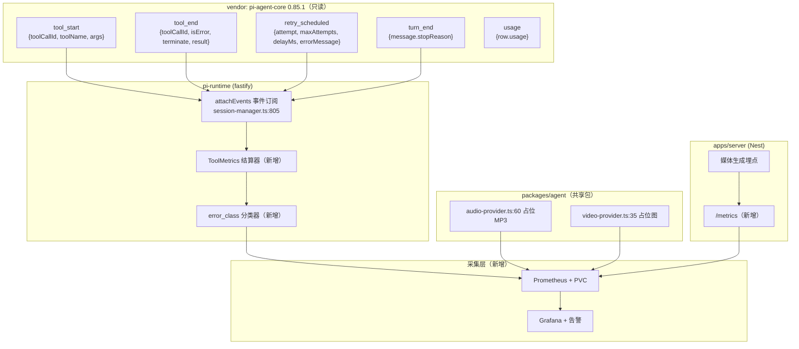
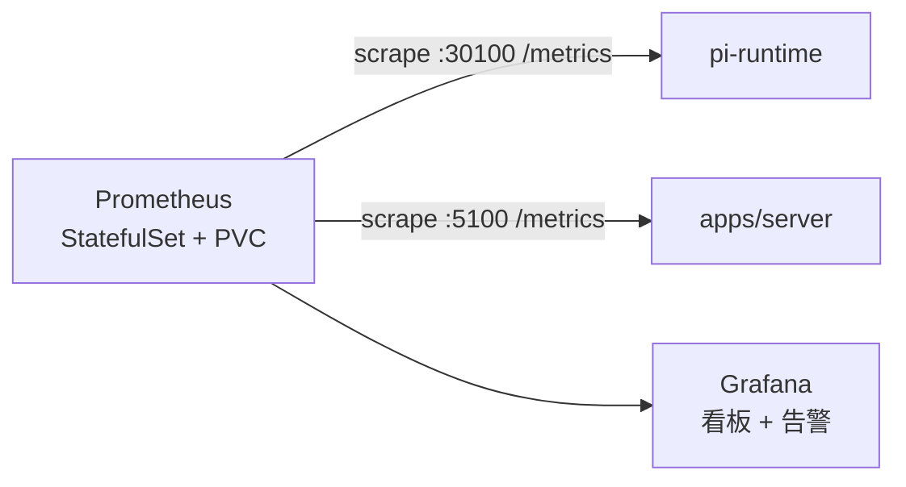

# 指标可观测性专项设计规格（工具指标 + 上游模型错误 + 静默降级）

状态：待评审（对话态设计已于 2026-10-04 三节拍板；本 spec 为书面化产物）
前置：`services/pi-runtime` 已有自研零依赖 `Metrics` 类 + `/metrics` 端点（约 25 个指标族）；`apps/server`（Nest）**零指标、无 `/metrics`**
分支约定：实现走 feature 分支 + PR + squash merge。改动 `services/pi-runtime/**` 需手工发`workflow_dispatch`（`runtime-deploy.yml` 纯手工触发），合并后须盯该流水线。

## 0. 配图索引

本文档结构图一律以 Mermaid 内嵌。无视觉稿（纯指标契约 + 采集拓扑，无像素级布局）。

| 编号 | 形式 | 内容 | 位置 | 用途 |
|---|---|---|---|---|
| 图 1 | Mermaid flowchart | 三层埋点位置与事件收口 | §3 | 验收「工具指标零改动全覆盖」 |
| 图 2 | Mermaid flowchart | 采集与部署拓扑 | §7 | 验收「两个target 都被 scrape」 |

## 1. 目标

1. **工具调用指标全覆盖**：当前 22 个工具实现文件里仅 5 处接线（`ui-command`/`arrange-nodes`/`skill-tool`/`config`/`ask-user`），其余 17 个工具调用完全无指标。目标是漏埋率归零，且**新增工具自动获得指标**。
2. **上游模型错误可观测**：当前 `pi_runtime_llm_prompt_errors_total{reason}` 取值域仅 `upstream_rate_limited`/`upstream_error`，由 `app.ts:194` 一句正则 `/429|rate/i` 判定，无 stage / 渠道 / 模型 / 重试维度。目标是能回答「哪个渠道的哪个模型在哪一阶段报什么错、重试了几次、最终成没成」。
3. **静默降级可见化**：本项目最大事故源是「`status=completed` 但结果错」（识图 0 token、音频占位曲、视频占位图）。这类必须**独立计数**，不能混进失败率。
4. **指标可被长期消费**：现状 Prometheus 未部署，指标是进程内存态 Map、pod 重启归零 ⇒ 任何趋势/环比都是编数据。目标是部署带持久化卷的 Prometheus + Grafana。

## 2. 范围（含明确不做）

**在范围**：

- pi-runtime：事件层统一埋点（工具计数/耗时/错误分类）、LLM 错误与重试指标、token 按阶段归因
- pi-runtime：删除 5 处分散手写埋点，消除 label 漂移
- apps/server：引入 `prom-client`、新增 `/metrics` 端点、媒体生成与上游调用指标
- **packages/agent**：音频/视频 provider 的静默降级埋点（见 §5.1归属澄清 —— 这两个 provider 在共享包里，不在 Nest 侧）
- 采集层：新增 Prometheus + Grafana chart、告警规则
- CI：标签基数闸门（渠道×模型组合数 > 50 拒绝合并）

**明确不做**：

- **不改`vendor/earendil-works/pi/**`**（ADR-0009：只读镜像，禁止业务 patch）。本方案全部埋点落在我们自己的 `session-manager.ts` 事件订阅层。
- 不引入分布式追踪（OpenTelemetry / traceId 串联）。当前问题是「看不到指标」，不是「看不到调用链」；待指标铺开后评估。
- 不做日志聚合（ Loki / ELK）。
- 不把 `session_id` / `user_id` 放进任何 label（基数不可控且含PII）。
- 不重构 `Metrics` 类的零依赖渲染实现——它工作正常，只扩展。

## 3. 架构：为什么工具指标能做到零改动全覆盖



**图 1 · 三层埋点位置与事件收口** —— 验收「工具指标零改动全覆盖」

**关键事实**：vendor 的 `tool_start` / `tool_end` 是**全工具统一事件**，载荷已含 `toolCallId`、`isError`、`terminate`。我们已在 `session-manager.ts:841 attachEvents` 里订阅了它们（用于 SSE 归一）。因此只要在该订阅层加一个结算器，**39 个工具零改动全覆盖**，且不碰 vendor。

### 3.1 三种埋点方案对比与选型

| 方案 | 覆盖 |准确度 | 代价 |
|---|---|---|---|
| **A. harness 事件层统一埋点** | 39/39 零改动 | `error_class` 需兜底推断 | ✅ 选定 |
| B. 每个工具自埋 | 需写 N 遍 | 最准 | 正是今天 17 个工具漏埋的成因；新增工具仍会漏 |
| C. registry builder 外包 wrapper | 39/39 | 准 | registry 是 9 个独立 builder 函数无单一收口；且 `tiering.ts:201` 有全仓唯一的生产侧 `as LnkpiTool` 类型逃逸口，不宜再扩大 |

**选型：A 为主 + B 为辅**。事件层负责全覆盖骨架（计数 + 耗时 + 成败）；`config.ts` 保留它已有的 `errorKind` 通道作为精确分类补充。

### 3.2 必须删除的 5 处手写埋点

事件层铺开后，下列手写调用**必须删掉**，否则重复计数：

| 文件 | 现状 | 处理 |
|---|---|---|
| `tools/ui-command.ts:37,48,59,70,81` | 硬编码 5 个工具名分别上报 | 删 |
| `tools/arrange-nodes.ts:141` | `observeToolCall(\`arrange_nodes_${mode}\`)` —— **动态 label，基数风险** | 删，mode 改由 `args` 在需要时查|
| `tools/skill-tool.ts:27,36,43` | 三处手写 ok/error | 删 |
| `tools/ask-user.ts:71` | 手写 | 删（`observePendingOp` 保留，它记的是超时口径，不同语义） |
| `tools/config.ts:47,48` | 有 `errorKind` + `resultBytes` | **保留为精确通道**，但不再重复上报 `tool_calls_total` |

## 4. pi-runtime 指标契约

### 4.1 工具指标

```
pi_runtime_tool_calls_total{tool, result, error_class}    counter
pi_runtime_tool_duration_seconds{tool}                    histogram
pi_runtime_tool_result_bytes{tool}                        histogram（既有，保留）
pi_runtime_tool_error_kinds_total{tool, kind}             counter（实现期新增，见注）
```

> 注：`tool_error_kinds_total` 是实现期新增的第 4 个族。`config.ts` 的 `onCall` 回调保留了
> `errorKind` 精确分类通道（Nest 侧返回的结构化分类，比事件层拿错误文本正则猜更准），
> 单独成族以免与事件层的 `error_class` 混淆。
> 已知：`ToolErrorKind` 的 `gate_blocked` / `retry` 两值目前**无写入方**。
> `circuit_open` 于 2026-10-07 接入（`nest-client.ts` 的 `checkCircuit` 分支），
> 与 `error_class` 侧的同类值同名同义。

- `tool`：`tool_end.toolName`，39 个闭集
- `result`：`ok` | `error` | `blocked`（三值，由`isError`/`terminate` 派生）
- `error_class`：仅 `result != "ok"` 时出现，取值见 §4.4
- 耗时：`tool_start` 记 `{toolCallId → ts}`，`tool_end` 结算并清理。**配对不到 start 时不计时长**（只记计数），避免脏数据

### 4.2 LLM 指标（含渠道与模型）

```
pi_runtime_llm_errors_total{stage, error_class, channel, model}       counter
pi_runtime_llm_retries_total{stage, channel, model}                   counter
pi_runtime_llm_tokens_total{stage, kind, channel, model}              counter   ⚠️ 本阶段未实现
pi_runtime_llm_stage_duration_seconds{stage, channel, model}          histogram  ⚠️ 本阶段未实现
```

> ⚠️ **本阶段未实现**：`llm_tokens_total` 与 `llm_stage_duration_seconds`。
> 现有 `pi_runtime_usage_tokens_total{kind}` 是**既有族**（无 stage/channel/model 维度），
> 由 `usage` 事件驱动。stage/channel 维度的归因需要按调用阶段拆开 token 归属，
> 属独立 Task（见 §4.5 已知缺口清单）。**不要以为 token 已按阶段归因。**

`stage` 为闭集：`main_turn` | `compaction` | `tool_result_summarize` | `deferred` | `unknown`

> ⚠️ **`unknown` 的来由（2026-10-04 实现期修订）**：`retry_scheduled` 事件在 vendor 有**三处**发射
> （`drive/response.ts:392` 主轮、`drive/structural.ts:989` compaction、`:1098` branch_summary），
> 但三处载荷**在运行时不可区分** —— `step` 是同一个 `idGenerator` 的 uuid7、`maxAttempts`/`delayMs`
> 都取 `normalizedRetryPolicy(lane)`、in-run 压缩的 `runId` 与主轮同一 `operationId`、
> `recovery` 只覆盖三处中一处、`entry.compacting` 恰好漏掉 in-run 压缩。
> 故 `retry_scheduled` 一律报 `stage="unknown"`。
>
> **为什么不用 `main_turn`**：那会让压缩重试永久伪装成主轮重试，看板上无法区分，
> 且**错误映射比「诚实的未知」更危险**。宁可「可见的不可知」。
> **待vendor 配合**：给该事件加判别字段后，只需改 `session-manager.ts` 一行透传，结算器与渲染无需改。

**取代**既有的 `pi_runtime_llm_prompt_errors_total{reason}`（2 值正则判定）。旧指标保留一个发布周期后移除，避免告警断档。

#### 4.2.1 渠道与模型的取值来源（重要）

`model` 维度最初被否决，理由是「model_id 随 BYOK 渠道动态变化、基数不可控」。**复核后这个顾虑已被现有代码解决**：

- `model-assembly.ts:201`：`providerId = \`byok-${providerIdFrom(override.providerRef)}\``
- `model-assembly.ts:174`：`providerIdFrom` = `sha1(ref).digest("hex").slice(0, 12)`

即**渠道引用已被哈希成固定 12 位十六进制**。因此：

- `channel` 取 `providerId`，形态为 `agnes` 或 `byok-3f2a1b9c4d5e`
- 该值**天然有界**，且不泄漏渠道名与凭据 —— 符合 `model-assembly.ts:196-198` 自己标注的红线①（「日志只出现哈希后的 providerId」）
- `model` 取 `model.id`，来自 `ProviderChannel.models`（Prisma `String` JSON），是我们自己配置的集合，增长可预判

> ⚠️ 残余风险：BYOK 渠道泛滥（每用户建渠道 = 一个新 `byok-` 哈希）。由 §6 的 CI 基数闸门兜住。

### 4.3 上游错误的事件源（修正一处错误判断）

设计过程中曾把 `fault` 事件当作 LLM 上游错误源，**这是错的**。核实结果：

- `fault` 仅在 `HarnessFault`（harness 自身存储/不变量违规）时发出，载荷固定 `{code:"harness_fault", message}`（`harness/runtime/harness.ts:309-317`），**与 LLM 调用失败无关**
- `handler_error` 是 hook 处理器自身抛错，也不是上游模型错误

真正的上游错误源有三处：

| 来源 | 载荷 | 用途 |
|---|---|---|
| `retry_scheduled`（lane 事件，可订阅） | `{attempt, maxAttempts, delayMs, errorMessage}` | 重试排期 + 错误原文 |
| `turn_end` | `message.stopReason` / `errorMessage` | 重试耗尽后终态 |
| `app.ts:194` catch | `err.message` | 入口早拒（保留） |

**附带发现**：`stopReason` 字段我们**当前完全没读**（`session-manager.ts` 中无该字段）⇒ 现在分不清「LLM 报错」与「正常结束」。本设计补上。

> `retry_scheduled` 不在 `SpecialEventPayload` 内（`agent-harness.ts:377`），属lane 事件，**可经 `harness.events.on` 订阅**。这意味着「重试次数 + 退避时长 + 错误原文」全部免费可得，无需新钩子。

### 4.4 `error_class` 分类器（闭集 9 值）

判定优先级，自上而下，首个命中即定：

| 序 | 条件 | 值 |
|---|---|---|
| 1 | `terminate === true` | `blocked_terminate` |
| 2 | `result` 含 abort/ 取消 | `aborted` |
| 3 | 含 `circuit open`（本进程熔断） | `circuit_open` |
| 4 | 含 `http 4xx` / 4xx / 429 / rate limit | `upstream_4xx` |
| 5 | 含 5xx / upstream | `upstream_5xx` |
| 6 | 含 timeout / 超时 | `timeout` |
| 7 | 含 ECONNREFUSED / fetch 失败 | `network` |
| 8 | 含 gate / HITL / 未授权 | `gate_blocked` |
| 9 | 含 invalid / 参数校验 | `validation` |
| 兜底 | 以上均不命中 | `internal` |

**两条纪律**：

1. **兜底必须落`internal`，绝不静默丢弃** —— 归错类可接受，看不见不可接受
2. **禁止把错误原文当 label** —— 39 工具 × 无限报错串 = 基数爆炸

分类依据是自由文本正则，**必然有误判**。这是刻意的取舍：上游只给自由文本，没有结构化错误码；闭集枚举保证指标可用，误判率通过 `internal` 占比监控（若`internal` 占比异常升高，说明分类器需更新）。

> **`circuit_open`（2026-10-07 增补）**：本值对应**本进程熔断** —— `NestClient.checkCircuit`
> 在断路器开路期间直接抛出 `circuit open for <path>`，请求根本没出网。
>
> 为什么必须单列（生产取证）：2026-10-07 的 Watchdog 失败窗口（68.66 次调用 / 8.16 个错误）里，
> 这类错误**100% 落 `internal`**（文案不含任何既有正则的关键词），而同窗口
> `pi_runtime_tool_error_kinds_total` 的增长为 **0**（`checkCircuit` 的 catch 不传 `errorKind`）
> ⇒ 两条通道对同一批错误给出相反结论，告警只剩「错误率超阈」，分不清该查上游可用性还是参数。
>
> ⚠️ 规则必须排在 `gate_blocked` **之前**：该文案后面紧跟一条工具路径，而路径片段可能含 `gate`
> （如 `/agent/internal/check-generation-gate`），实测会被 `\bgate\b` 抢成 `gate_blocked`。

## 5. apps/server 指标契约（从零新建）

```
nest_gen_outcomes_total{media, outcome}              counter
nest_gen_silent_degrade_total{kind}                  counter
nest_gen_retries_total{media, outcome}               counter
nest_gen_duration_seconds{media, outcome}            histogram
nest_upstream_errors_total{error_class}               counter
```

- `media`：`video` | `audio` | `image`
- `outcome`：与生成记录终态一致（`completed` / `failed` / `fallback_pending` / `generating`）
- `kind`（静默降级）：`placeholder_audio` | `placeholder_image` | `omitted_param` | `downscale` | `unsupported_fallback`

**原缺口（2026-10-04 发现，2026-10-05 已补）**：`session-manager.ts` 里 `lane.prompt(...)` 的
`!result.ok` 与 `.catch()` 分支**只派发 SSE error 事件、零指标**，
于是 `pi_runtime_llm_errors_total` 只能反映 `app.ts` 的**入口早拒**，
**看不到「模型调用失败」** —— 而那才是真正要监控的。

**补法**（commit `2377ea90`）：
- 新增 `llm-error-class.ts`：复用 `classifyToolOutcome` 的闭集分类器，只额外区分
  `stage`（`main_turn` / `compaction`，按 `entry.compacting` 判）与「该不该计数」。
- `SessionManager.observeLlmFailure()` 私有辅助 + 两处接线（`!result.ok`、`.catch`）。
- **观测口绝不抛**（try/catch 兜底），错误原文只喂分类器不进 label，
  拿不到身份时用闭集内字面量 `"unknown"`。

**⚠️ 精度上限（重要，别误读指标）**：vendor 的 `toError(error)`（`harness/result.ts`）把错误压成
`unknown`/`Error`，**拿不到 status / retryable 等结构化字段** ⇒ 主路径只能拿文本做正则分类，
比入口早拒粗糙。**若要更高精度，需 vendor 侧暴露结构化错误码**（未做，见 backlog）。

**⚠️ 用户主动取消刻意不计数**：`llm_errors_total` 只有 stage/error_class/channel/model 四个维度、
**没有 outcome**，混进取消会让 `sum(rate(llm_errors_total))` 这个最直观的错误率**偏高**，
而取消是用户的正常操作、不是故障。若要观测取消趋势，需另立 `llm_aborts_total` 族（本次未做）。

**验收判据**：接线可证伪 —— 注释掉任一`observeLlmFailure(...)` 调用，`session-manager.llm-error.test.ts`
必须变红。实测 3/3 变异被杀（断 `!result.ok` 埋点、断 `.catch` 埋点、让取消也计数）。

### 5.1 静默降级必须独立计数

> ⚠️ **归属澄清**：音频/视频 provider **不在 `apps/server`，而在 `packages/agent/src/tools/`**。
> 初稿曾把它们记在 Nest 侧，实测后发现两处provider 都在共享包里。若埋点只做 Nest 侧，将**完全漏掉**这两个最严重的降级点。

`FallbackAudioProvider`（`packages/agent/src/tools/audio-provider.ts:60-73`）catch 后 `console.warn` 并返回占位 MP3、**不抛错** ⇒ 不进 catch ⇒ 不退款。业务判定为 `completed`。
占位常量在同文件 `:19`（`PLACEHOLDER_MP3` 指向 `soundhelix.com` 示例曲 —— 与 2026-10-03 生产取证的 18/18 记录完全吻合）。

这类点必须在**决定降级的那一行**打点，而不是在失败分支。若只在 `outcome` 上打点，占位曲会与真实成功混为一谈 —— 这正是「18 条记录全是示例曲却无人察觉」的原因。

已知需埋点位置：

| 位置 | 降级形态 |
|---|---|
| `packages/agent/src/tools/audio-provider.ts:60-73` | 占位 MP3（catch + warn，**不抛错**） |
| `packages/agent/src/tools/video-provider.ts:35-45` | Unsplash JPEG 冒充视频（`:37-38` 为示例图常量） |
| `apps/server/.../generation-adapter.ts:727-759` | `VIDEO_PARAMS` 未声明键 ⇒ `generateAudio` 丢弃 352 次 |
| `services/pi-runtime/src/direct-images.ts` / `model-assembly.ts` | 图片被换`(image omitted…)` ⇒ `image_tokens=0` |

> 对照：`UnsupportedVideoGatewayProvider`（`video-provider.ts:57`）是**抛错**的（行为正确），
> 而 `FallbackAudioProvider` 是**吞错**的（行为错误）。两者不可混为一谈。

## 6. 标签基数预算与 CI 闸门

| 指标 | 最坏序列数 | 判定 |
|---|---|---|
| `tool_calls_total{tool,result,error_class}` | 39 × 3 × 8 = 936 | ✅ 稀疏，实际远低于此 |
| `tool_duration_seconds{tool}` | 39 × 12 = 468 | ✅ |
| `llm_errors_total{stage,error_class,channel,model}` | 4 × 8 × C × M | ⚠️ 需闸门 |
| `nest_upstream_errors_total{error_class}` | 8 | ✅ |

**CI 闸门**：新增测试断言「`channel` × `model` 组合数 ≤ 50」，超限时拒绝合并。防BYOK 渠道泛滥打爆基数。

> 实现约束：`channel` / `model` 的取值必须来自上述封闭来源，**不得透传请求体里的任意字符串**。

## 7. 采集与部署



**图 2 · 采集与部署拓扑** —— 验收「两个 target 都被 scrape」

### 7.1硬约束

1. **Prometheus 必须挂持久化卷**。现状指标是进程内存态 Map、pod 重启归零 —— 若新装 Prometheus 也无 PVC，本次部署等于白装。
2. `/metrics` 端点**必须免鉴且仅内网可达**（NetworkPolicy 限制）。参照现有 pi-runtime 免鉴端点先例（`GET /api/agent/prompt-registry`）—— 其安全边界是响应字段本身，故本设计规定 `nest` 侧 `/metrics` **只暴露聚合数值，不含任何业务字段**。
3. 新 chart 独立于现有 `charts/pi-lnk-runtime`，**不得整份覆盖**现有部署（沿用 `--reuse-values` + 只 `--set` 增量项的纪律）。

### 7.2 告警规则

每条规则对应一次已发生过的真实事故，非通用模板。**投递渠道见 §7.3（本轮不接外部通知）**。

| # | 条件 | 阈值 | 对应事故 |
|---|---|---|---|
| 1 | `increase(nest_gen_silent_degrade_total[5m]) > 0` | **0** | 音频 100% 占位曲（退款 0） |
| 2 | 上游 5xx 占全部上游错误比 | **> 5%** | 视频 47% 未产出（252failed） |
| 3 | `errors > 0` 且同期 `retries == 0` | **持续 10min** | 429/503 明确可重试却零重试 |
| 4 | 工具错误率（`result="error"` / 全部调用） | **> 2%** | 哪个工具在坏 |
| 5 | 交互类工具 p99 耗时 | **> 30s** | 回合变慢 |
| 6 | 生成类工具 p99 耗时 | **> 660s** | 视频生成卡死 |

#### 5/6 必须拆开的原因（阈值差 22 倍）

初稿把工具耗时笼统设成 `p99 > 60s`，**核实后判定为错误阈值**，会持续误报：

| 工具类别 | 实例 | 合法耗时量级 | 来源 |
|---|---|---|---|
| 交互类 | 画布增删改、读文档、记忆、focus | **秒级** | 无长轮询 |
| 轮询类 | 工作流执行结果回拉 | **180s** | `agent-canvas-tools.service.ts:60` `DEFAULT_POLL_TIMEOUT_MS` |
| 生成类 | 视频生成 | **660s** | `video-generation.orchestrator.ts:10` `VIDEO_POLL_TIMEOUT_MS`（对齐 Agnes 600s + 网络缓冲） |

若用统一 60s：**每一次健康的视频生成都会触发告警**。故按 `tool` 维度分两组阈值，生成类阈值对齐其轮询上限（超过即真卡死）。

> 判定归属规则：`tool` 名含 `generate_*` / `upsert_*_node` / `render_*` 归生成类；其余归交互类。该映射须写成显式清单测试（新增工具默认归交互类，避免误分类导致漏报）。

#### 阈值性质说明

- 规则 1 刻意为 **0** —— 静默降级没有「可接受比例」，发生即告警
- 规则 3 用 `持续 10min` 而非瞬时值 —— 偶发一次可重试错误是正常的
- 规则 2/4/5/6 的阈值（5% / 2% / 30s / 660s）为**初值**，上线后按真实基线校准。校准依据：`pi_runtime_uptime_seconds` 确认观察窗口长度，避免把「低流量时段」误读成「低错误率」

### 7.3 告警接收渠道

告警规则**只定义「什么条件算异常」，不绑定投递方式**——规则写进Grafana Unified Alerting 的 alert rule，投递渠道是可替换的配置项。

| 配置项 | 值 |
|---|---|
| 规则位置 | Grafana Unified Alerting（不另起独立 Alertmanager） |
| 通知内容 | 告警名、触发值/阈值、相关面板链接、`channel`/`model` 标签（定位用） |
| 重复时机 | `for` 字段命中后**每 5min 重复一次**（`group_wait` 60s） |
| 抑制 | 同 `alertname` + 同 `channel` 的重复告警 1h 内只发一次 |
| 投递渠道 | **本轮不接外部通知**（见下） |

#### 本轮不做外部通知（已评估后取消）

原计划接邮件（`sev7nseason@gmail.com`），**评估后取消**，理由：

| 障碍 | 说明 |
|---|---|
| Gmail SMTP 需两步验证 + 应用专用密码 | 人工前置操作，且发件/收件账号不同时还需把收件地址加进已验证联系人 |
| 凭据管理 | 密码须走 `GF_SMTP_PASSWORD` 环境变量注入，多一处运维负担 |
| 通道可靠性 | 依赖外部 SMTP 服务，链路更长 |

**替代方案（成本更低，优先选它）**：Grafana 内建 **webhook** contact point → 企微 / 钉钉机器人。Grafana 有现成 webhook 类型，**不依赖任何外部凭据与人工前置操作**，一条配置即可生效。需确认的只有一点：群机器人是否已有、以及是否愿意接收。

**决策**：本轮把 6 条规则与抑制策略落地，看板可查；**外部通知留作独立后续项**。理由是告警的紧急程度尚未被验证 —— 阈值本身是初值（待按真实基线校准），在阈值没稳之前就接通通知，只会制造需要立即处理的噪音，进而让人开始无视告警。规则跑一段时间、确认「真的能抓到问题」之后再接通知更稳妥。

> 本节记为**已知缺口**，不是遗漏：告警能算出来，但没人会主动来看板。等接收渠道接上，这一节即可闭环。


## 8. 测试策略

| 层 | 手段 |
|---|---|
| `error_class` 分类器 | 表驱动单测，8 个分支各一例 + 兜底 `internal` + 「错误原文不出现于 label」断言 |
| 事件层结算器 | 构造 `tool_start`/`tool_end` 事件喂入，断言计数/耗时/`error_class`；含「start 缺失时不计时长」 |
| 孤儿事件 | 只有 `tool_end` 无 `tool_start` 时不得抛错，且不产生脏时长 |
| 删除 5 处埋点 | 回归测试断言 `tool_calls_total` 总量 == 事件层结算量（防重复计数） |
| Nest 侧 | 静默降级点单测：mock 上游抛错，断言 `silent_degrade_total` 递增**且** `gen_outcomes_total{outcome="completed"}` 也递增（证明两码独立） |
| 基数闸门 | 断言组合数 ≤ 50 |
| 渲染 | `/metrics` 输出经 `metrics.test.ts` 同类断言：HELP/TYPE 行存在、枚举值在闭集内 |

**必查项**：`pi-runtime` 改动后必须实跑 `/metrics` 确认新指标出现（注意：**counter 型 Map 为空时只有 HELP/TYPE 行、无数据行**）。

## 9. 交付流程（分支纪律）

1. 本 spec 提交到 `feat/metrics-observability`
2. 写实施 plan（`docs/superpowers/plans/2026-10-04-metrics-observability.md`），拆到 task 级
3. 按 plan 在分支上实现 → PR → 盯 CI → squash merge
4. **合并后必须手工发`Runtime Deploy (pi-runtime)`**（`tag` = master commit 短 SHA，`feature_grep` 留空），否则 pi-runtime 改动不上线
5. 上线后从 CVM 本机 curl `/metrics` 取证（外网读不到）

> ⚠️ 已知仓库陷阱（`MEMORY.md` 记录）：`concurrency: cancel-in-progress: false` 只保留最新 1 个 pending ⇒ 派发后必须 `gh run list` 确认自己的 run 还在。真顺序 pi-runtime → (api ∥ web)。

## 10. 决策记录（含一处被推翻的决策）

| 决策 | 结论 | 理由 |
|---|---|---|
| 指标消费方式 | 生产端 + 部署 Prometheus/Grafana | 现状外网读不到、重启归零 |
| 工具埋点方式 | A（事件层）+ config.ts 精确通道 | 覆盖 39/39，防漏埋 |
| 工具 label | `tool` + `result` + `error_class`，**不含完整错误 message** | 防基数爆炸 |
| 静默降级 | 独立计数，阈值 0 | 最大的事故源 |
| 重试 | 独立计数 | 现状「明确可重试却零重试」 |
| 耗时 | 工具级 + LLM 级双层 | 定位「哪个工具/请求拖慢回合」 |
| token/成本 | 按阶段归因 | 全局总量无法定位 |
| **model + 渠道维度** | **加** | ⚠️ 初版曾否决（怕基数失控），复核发现 `providerId` 已是 12 位哈希 ⇒ 天然有界且不泄密。**以本版为准** |

> 最后一行是关键：半年后若有人看到「model 维度是后加的、与早期结论矛盾」，**不要当成失误去移除** —— 依据是 `model-assembly.ts:174-201` 的哈希归一化。
