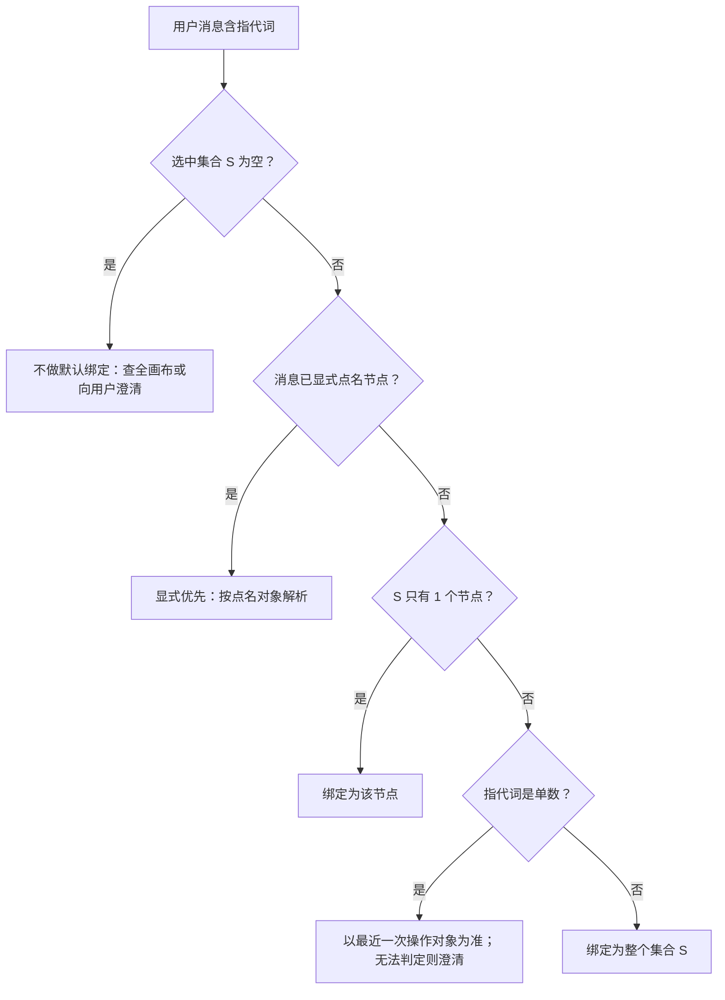
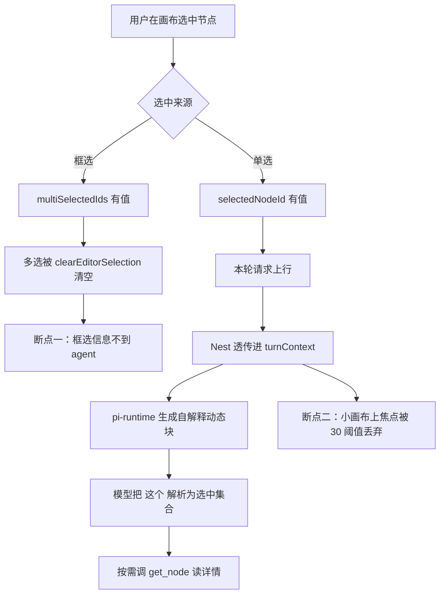

# 画布选中 = Agent 默认指代 — 设计规格

状态：**已拍板**（2026-10-06，产品定义；实现待排期）
代号：**SEL-REF**
前置：[`2026-08-07-agent-sidebar-m3-explicit-refs-design.md`](./2026-08-07-agent-sidebar-m3-explicit-refs-design.md)（M3，D-B「`focusNodeId` 仅作指代」）
分支约定：实现走 feature 分支 + PR + squash merge。

> 一句话产品定义：**用户在画布上选中什么，agent 就默认知道他在指什么。**
> 边界同样重要：**指代 ≠ 授权**——知道用户在指谁，不等于允许改它。

---

## 0. 配图索引（结构与视觉两类，均随本文档演进）

本文档的图分两类：**结构图**一律以 Mermaid 内嵌；**视觉稿**以 `assets/` 下的 SVG 附件承载（相对路径引用）。本规格**不含视觉稿**，理由：全部设计都是数据流与判据，无空间/比例信息（SPEC-CONVENTIONS §1 反面判据）。

| 编号 | 形式 | 内容 | 位置 | 用途 |
|---|---|---|---|---|
| 图 1 | 内嵌 Mermaid | 选中 → 指代信号的端到端数据流（含当前断点） | §5.1 | 实现时的改动面定位基准 |
| 图 2 | 内嵌 Mermaid | 「这个 / 这几个」解析为选中集合的判据决策树 | §4.3 | 提示词与澄清逻辑的验收基准 |

---

## 1. 目标

1. **产品定义**：画布**选中**（单选与框选）即 Agent 的**默认指代**。用户问「这个节点是什么 / 这张图是什么 / 这几个统一一下」时，Agent 默认绑定到当前选中对象，**无需**先点「加入 Agent 引用」。
2. 指代信号**不占工具槽、不占 L6 静态提示词预算**——走每轮动态上下文，且**自解释**（块内自带说明，不依赖新增静态规则）。
3. 指代信号与既有的「摘要焦点过滤」**语义解耦**：前者是"告诉模型在指谁"，后者是"换话题污染收口"。后者现有的 fail-open 三闸（无焦点 / 小画布 / 焦点不存在 → 全量）**保持不变**。

---

## 2. 范围

### 2.1 做

| # | 内容 |
|---|---|
| S-1 | 单选与框选**都**产生指代信号（今天框选在 `selectMultipleNodes` 里被清空）。 |
| S-2 | 指代信号**不受 30 节点阈值影响**（今天 `CANVAS_SUMMARY_FULL_LIMIT` 会让小画布上的焦点被整体丢弃）。 |
| S-3 | 多选时给出**可读列表**（id + 类型 + 标题），让模型能分辨"这几个"具体是谁。 |
| S-4 | 用**动态块**承载信号（`assembleDynamic` 通路），块体自解释。 |
| S-5 | 模型拿到 id 后的**深读复用现有 `get_node`**（已返回 `localRefs` 与 `relationsForNode`）。 |

### 2.2 明确不做

| # | 不做 | 理由 |
|---|---|---|
| N-1 | **选中自动进芯片 / 自动参与生成** | M3 D-A、D-D 仍生效。本规格只解决"agent 知道你在指谁"，不改素材注入。 |
| N-2 | **新增 agent 工具**（如 `read_selection`） | 常驻集已压缩到 28（PR #218），且 `tool_search` 触发率实测为 0 ⇒ 新增读取类工具既挤配额又不可靠。指代是**情境**不是**动作**，天然属于上下文层。 |
| N-3 | **读取芯片内容 / 连线语义化** | 独立深读能力，见 §12 后续包。 |
| N-4 | **改动 `focusNodeId` 的摘要过滤行为** | 那是独立机制（"换话题污染收口"，审计 P0-①），本规格不碰。 |
| N-5 | **指代即授权** | 写操作仍走既有确认门（`propose_generation` 等），不得因"知道用户指谁"而免确认。 |
| N-6 | 改 `prompt-registry/**` 静态规则 | L6 最紧组合余量仅个位数（见 `AGENTS.md` 变更影响面矩阵），本规格刻意用自解释动态块绕开。 |

---

## 3. 与既有规格的关系

**承接，不推翻。** M3 决策摘要里的 D-B 原文是：

> **D-B**：`focusNodeId` 与 img2img ref 解耦 —— `focusNodeId` **仅作指代/续作上下文**；img2img 必须先进芯片条。

本规格把 D-B 从"一个字段的定位说明"**升格为产品级默认行为**，并补上它从未完成的实现部分（见 §3.2）。

| 既有决策 | 关系 | 说明 |
|---|---|---|
| M3 **D-A**（画布节点默认不 silent 进芯片） | **保持** | 指代信号**不**写入 `attachments` / `localRefs`。 |
| M3 **D-B**（`focusNodeId` 仅作指代） | **承接并落地** | 本规格即其实施细则。 |
| M3 **D-C/D-E/D-F**（芯片条 / `@` 语义） | **无关** | 那三条约束的是"进芯片之后怎么用"。 |
| M3 **D-D**（多选仅支持批量显式加入） | **不冲突，但需澄清** | D-D 约束的是**芯片**；本规格约束的是**agent 读取**。多选可以"被 agent 看见"而**不同时**"进入芯片"。 |
| M3 §8 风险表「首版无自动升格；后续可在设置加『选中自动加入』默认关」 | **需澄清措辞** | 该条把「不进芯片」与「agent 可读」混为一谈。本规格明确：**不进芯片 = 不自动升格**，与**可读**并行不悖。 |
| [`2026-09-17-selection-batch-generate-design.md`](./2026-09-17-selection-batch-generate-design.md)（SEL-BATCH） | **互补** | SEL-BATCH 是**用户显式点按钮**跑批；本规格是 **agent 侧指代**。其 SB-D12「不对 Agent 暴露任何新工具」**被本规格遵守**（N-2）。 |

---

## 4. 规范与判据

### 4.1 术语

| 术语 | 定义 |
|---|---|
| **选中集合 S** | 本轮请求发出瞬间，画布上处于选中态的节点 id 集合。单选 `|S| = 1`，框选 `|S| ≥ 2`；未选中 `S = ∅`。 |
| **指代信号** | 把 S 连同"来源（单选/框选）"与"节点摘要（id / type / title）"随本轮请求上行、并以自解释动态块呈现给模型的那份上下文。 |
| **默认指代** | 当**用户消息含指代词**（这个 / 这张 / 这几个 / 它 / 刚才那个…）且 `S ≠ ∅` 时，指代词**默认**解析为 S，无需用户显式点名。 |
| **显式指定优先** | 若消息本身已用**可定位**的方式点名了对象（节点标题、镜号、id、或清晰的唯一描述），则按显式对象解析，**忽略**默认指代。 |

### 4.2 规范（产品级，可复用）

| 规则 | 内容 |
|---|---|
| **R-S1** | **选中有边际则指代成立**：`S ≠ ∅` ⇒ 默认指代生效；`S = ∅` ⇒ 不虚构指代（见 R-S2）。 |
| **R-S2** | **无选中时不得猜**：`S = ∅` 而用户说「这个」，须走澄清或退化为查全画布，**禁止**凭"最近提到的节点"硬猜并声称已理解。 |
| **R-S3** | **显式优先于默认**：显式点名与默认指代冲突时，显式胜。 |
| **R-S4** | **指代 ≠ 授权**：指代只解决"是哪一个"，不构成任何写操作的授权。写操作照走确认门（N-5）。 |
| **R-S5** | **指代 ≠ 素材注入**：指代信号**不**改写 `attachments` / `localRefs` / `mentionedKeys`（M3 D-A 保持）。 |
| **R-S6** | **信号轻量**：动态块只放 id + 类型 + 标题；**不放**节点正文、URL、图片字节。详情由模型按需调 `get_node`（S-5）。 |
| **R-S7** | **不遮蔽失败**：动态块生成失败或 S 的节点已被删除时，**降级为不注入**（fail-open），**不得**注入半截列表让模型误判。 |

### 4.3 判据（决策树）

解析规则落成一条决策树（图 2）；实现时每个分支都必须能对上代码，不允许出现"图上没有、代码里有"的隐式路径。



*图 2 · 指代解析判据。这张图是提示词措辞与澄清逻辑的验收基准：每条出边都要能在实现里找到对应分支，不允许"图上没有、代码里有"的隐式路径。*

判据落点：`S = ∅` 与单数歧义（节点 I）是**澄清**分支，其文案与触发条件须在 §10 逐条验收。

### 4.4 `S` 的上限处理

| 条件 | 行为 |
|---|---|
| `|S| ≤ 8` | 全量列出（id + 类型 + 标题）。 |
| `|S| > 8` | 列出前 8 个 + 一行 `（另 N 个：<id 列表，仅前 16 个>）`；总数必写。 |

阈值 8 与 16 为 V1 取值，可依实测调整；**调整不改变 R-S6**（始终不超过"id + 类型 + 标题"）。

---

## 5. 架构与契约

### 5.1 数据流（含当前断点）

改动面以 图 1 为定位基准，§9 的文件清单与之逐项对应。



*图 1 · 选中到 agent 的端到端通路。两个断点（框选清空、30 阈值丢弃）是本规格要拆掉的两处；右侧 `get_node` 是**复用**而非新建，用于证明本规格不需要新工具。*

### 5.2 契约增量

| 层 | 文件 | 增量 |
|---|---|---|
| 共享契约 | `packages/shared/src/agentContract.ts` | 新增 `selectedNodeIds: z.array(z.string()).optional()` |
| 前端 | `apps/web/src/components/agent/AgentSideRail.vue` | 发送时组 `selectedNodeIds`：框选优先取 `multiSelectedIds`，否则退化为单选的 `[selectedNodeId]` |
| Nest DTO | `apps/server/src/agent/agent.controller.ts` | `AgentConversationRequest` 增加同名可选字段并透传 |
| Nest 服务 | `apps/server/src/agent/agent.service.ts` | 并入 `piContext`，与 `focusNodeId` **并列**写入 `turnContext` |
| 客户端 | `apps/server/src/agent/pi-runtime/pi-runtime.client.ts` | 透传该字段 |
| runtime 入参 | `services/pi-runtime/src/app.ts` | 接收并写入 session turn state |
| runtime 状态 | `services/pi-runtime/src/session-manager.ts` | `turn.selectedNodeIds` |
| 工具上下文 | `services/pi-runtime/src/tools/types.ts` | 若后续工具需要，追加同名字段（**V1 不追加**：当前无消费方，避免死字段） |

### 5.3 `focusNodeId` 与新字段的关系

**两者并存，语义不同，互不派生（V1）。**

| 字段 | 语义 | 当前消费方 | 本规格改动 |
|---|---|---|---|
| `focusNodeId` | 摘要**过滤** + 换话题污染收口（审计 P0-①） | `getCanvasSummary` 焦点过滤 | **不动**。其 fail-open 三闸（无焦点 / ≤30 节点 / 焦点不存在 → 全量返回）保持不变。 |
| `selectedNodeIds` | **指代信号** | 新增：动态块 | 新增。**不受 30 阈值约束**（S-2）。 |

> 为什么不解耦成一个字段：`focusNodeId` 的"小画布回退全量"是**有意的 fail-open**（注释原文：「≤ 此数全量返回，避免小画布反而丢信息」）。而指代信号在小画布上**恰恰最需要**——把它们合成一个字段会必然牺牲其一。

### 5.4 动态块形态（自解释）

```text
【用户当前选中】2 个节点（框选）
- n_8f3a · image · 小柚定妆照
- n_1c02 · prompt · 第3镜 · 雨夜街头
用户说「这个 / 这几个」时指的就是上面这些；要看细节调 get_node。
```

要点：块体**自带说明**（不依赖新增静态提示词规则，N-6）；只含 id/类型/标题（R-S6）；`S = ∅` 时**整块不输出**（R-S7 的 fail-open 形态）。

---

## 6. 主场景规格（逐项可验收）

| # | 场景 | 期望 |
|---|---|---|
| M-1 | 单选 1 个节点，问「这个节点里面是什么」 | 默认绑定该节点；需要细节时调 `get_node`；回答内容可追溯到该节点。 |
| M-2 | 框选 3 个节点，说「这几个风格统一一下」 | 三个都进指代集合；agent 明确复述是这 3 个，再走生成确认门（**不**自动开跑）。 |
| M-3 | 画布共 12 个节点，单选后提问 | 指代**生效**（今天被 30 阈值丢弃是失效的）。 |
| M-4 | 未选中，说「这个改一下」 | 走澄清（R-S2），**不**硬猜。 |
| M-5 | 框选 2 个，但说「第 3 镜的图重做」 | 显式优先（R-S3）：按"第 3 镜"解析，忽略默认指代。 |
| M-6 | 单选 1 个节点，只说「好的」 | 无指代词 ⇒ 不触发指代逻辑，不产生副作用。 |
| M-7 | 指代后要求"直接改掉" | 仍走确认门（R-S4）。 |

---

## 7. 数据与状态变更

| 项 | 变更 |
|---|---|
| Prisma schema / 迁移 | **无**（N-1 级的红线：本规格不碰 schema） |
| 积分 / 扣分 / 退款 | **无** |
| 前端持久化（画布 JSON） | **无**（指代信号是每轮瞬时上下文，不落画布数据） |
| 会话状态 | runtime turn state 增加 `selectedNodeIds`（内存态，随轮求值） |

---

## 8. 纯函数与算法（含单测要求）

新增纯函数，建议置于 `packages/shared/src/canvas/selectionDigest.ts`（与 SEL-BATCH 的 planner 同层，便于双向单测）。

```ts
export interface SelectionDigestInput {
  nodeIds: readonly string[]
  /** 幂等查找；找不到的 id 视为已删除 */
  lookup: (id: string) => { type: string; title: string } | undefined
  limit?: number   // 默认 8
}

export function buildSelectionDigest(input: SelectionDigestInput): string | null
```

| 单测 | 期望 |
|---|---|
| `nodeIds = []` | 返回 `null`（调用方据此**整块不输出**） |
| 1 个有效节点 | 含 id / 类型 / 标题；标注"单选" |
| 3 个有效节点 | 三个都出现；标注"框选" |
| 9 个节点 | 前 8 个列出 + 末尾含「另 1 个」与 id |
| 含 1 个已删除 id | 该条被剔除，**其余照常**；总数按剔除后计 |
| **全部** id 都已删除 | 返回 `null`（R-S7 fail-open，不注入半截） |
| 9 个节点、其中 2 个已删除 | 「另 1 个」的计数 = 7 - 8 归零 ⇒ 不输出"另 N 个"行 |

> 判据形态说明（避免枚举式验收）：上表的断言一律卡**类别**（"是否含 id/类型/标题"、"总数是否正确"、"空集是否返回 null"），**不**卡具体节点 id 或字符数。

---

## 9. 文件级改动清单

| 文件 | 变更 | 备注 |
|---|---|---|
| `packages/shared/src/agentContract.ts` | 加 `selectedNodeIds` | 契约先行 |
| `packages/shared/src/canvas/selectionDigest.ts` | **新建**（纯函数） | §8 |
| `packages/shared/src/canvas/selectionDigest.test.ts` | **新建** | §8 用例 |
| `apps/web/src/components/agent/AgentSideRail.vue` | 发送时组 `selectedNodeIds` | 与 `focusNodeId` 并列，不改后者 |
| `apps/web/src/pages/CanvasPage.vue` | 确认框选时 `multiSelectedIds` 可被读取 | **不**改 `clearEditorSelection()` 语义（那是编辑器选中态，另有用途） |
| `apps/server/src/agent/agent.controller.ts` | DTO + 透传 | |
| `apps/server/src/agent/agent.service.ts` | 并入 `piContext` 与 `turnContext` | 与 `focusNodeId` 并列 |
| `apps/server/src/agent/pi-runtime/pi-runtime.client.ts` | 透传 | |
| `services/pi-runtime/src/app.ts` | 接收新字段 | |
| `services/pi-runtime/src/session-manager.ts` | turn state | |
| runtime 动态块拼装处 | 调用 `buildSelectionDigest` 并追加块 | 具体文件在写 plan 时按 vendor 消费面确定 |

---

## 10. 测试策略与验收标准

### 10.1 单测

- `selectionDigest` 全量用例（§8）。
- `AgentSideRail` 发送参数快照：框选时 `selectedNodeIds` = 框选集合；单选时 = 单元素数组；未选中时缺省（不传空数组，避免与"传了但为空"混淆）。

### 10.2 目视 / E2E 验收

| # | 验收 |
|---|---|
| A-1 | M-1 场景：回答能对上所选节点内容（**不是**画布里随便一个节点）。 |
| A-2 | M-3 场景：12 节点画布上指代生效 —— 这是**回归判据**，今天必失败。 |
| A-3 | M-2 场景：agent 复述的对象数 = 3，且**没有**自动开跑生成。 |
| A-4 | M-4 场景：走澄清，且回复里**不**出现"我理解你指的是 X"。 |
| A-5 | M-7 场景：出现确认门；无确认则不产生写操作。 |
| A-6 | 无指代词的消息（M-6）内联一条新块也**不**出现（`S = ∅` 时整块不输出）。 |
| A-7 | 成本自检：同一轮对话的静态提示词字符数**不变**（证明未碰 L6）。 |

### 10.3 回归（必须绿）

- `pnpm --filter @lnkpi/shared test`
- `pnpm --filter @lnkpi/server test`
- 既有 `get_canvas_summary` 焦点过滤用例（`CANVAS_SUMMARY_FULL_LIMIT` 三闸）**不变**
- `pnpm prompt:lint`（证明静态规则未动）

---

## 11. 风险

| 风险 | 缓解 |
|---|---|
| **歧义**：多选 + 单数指代（"这个" vs 3 个选中） | 判据节点 I 走"最近一次操作对象 / 澄清"；不猜（R-S2）。 |
| **上下文膨胀**：框选 50 个 | §4.4 上限 + R-S6（只放 id/类型/标题）。 |
| **误以为已授权**：模型把指代当默认授权去改 | R-S4 写进规范；A-5 验收。 |
| **用户以为"选中=自动进芯片"** | 本规格**刻意不做**（N-1），需在 UI 侧保持现状的显式入口不变；若后续要改，另开规格。 |
| **与摘要过滤语义打架** | §5.3 明确两者并存、互不派生；不合并。 |
| **死字段**：`selectedNodeIds` 无人消费 | V1 **不**写进 `tools/types.ts`（§5.2 末行）；有消费方再加。 |
| **同一会话内选中频繁变化导致事件风暴** | 信号每轮按需求值（与 `turnContext` 既有模式一致），不订阅选中变化事件。 |

---

## 12. 后续包 / 路线图

| 包 | 内容 | 前置 |
|---|---|---|
| **SEL-REF-2** | 深读：芯片内容语义化（把 `localRefs` + 上游边渲染成"芯片"描述）、图片多模态直通 | 本包落地 + 产品确认 |
| **SEL-REF-3** | `focusNodeId` 与 `selectedNodeIds` 的收敛（若实测证明可合并而不损 fail-open） | SEL-REF 上线后按实测决定；**不设默认排期** |
| **常驻集下沉** | 与 `docs/agent/tool-framework-roadmap.html` §4 P1 联动；本规格**不**新增工具，故不阻塞其进度 | 独立 |

**明确不在本规格内**：图生视频/分镜等垂类流程改动、画布 UI 选中交互改动、任何 schema 与计费改动。

---

## 13. 配图规范自检

本地校验（提交前必跑）：

```bash
pnpm verify-spec-figures --file docs/superpowers/specs/2026-10-06-selection-as-default-reference-design.md
```

结果：**通过**（图 2 张，均为内嵌 Mermaid；图号连续、均有图注、均被正文引用、§0 索引齐备；无附件类检查项）。若后续新增视觉稿，须同步补 `assets/` 与 §0 索引。
