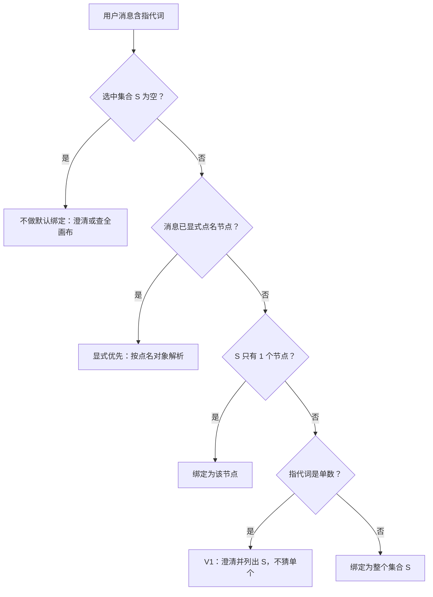
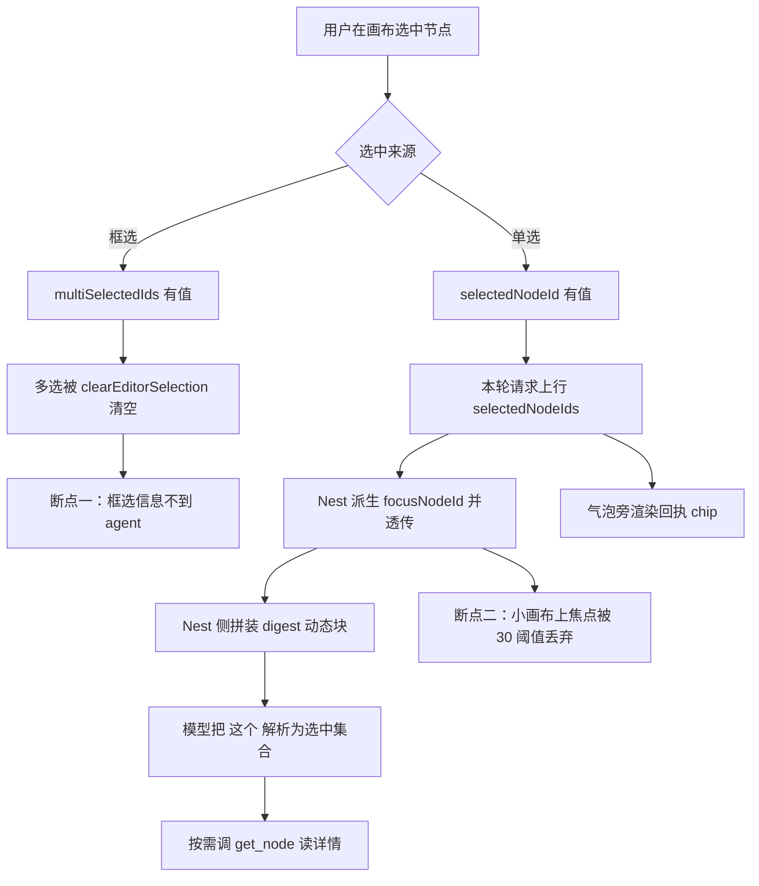

# 画布选中 = Agent 默认指代 — 设计规格

状态：**已拍板**（2026-10-06，产品定义；**同日评审修订已补齐 P0-1~P0-3 / P1-1~P1-4 / P2-1~P2-2**；实现待排期）
代号：**SEL-REF**
前置：[`2026-08-07-agent-sidebar-m3-explicit-refs-design.md`](./2026-08-07-agent-sidebar-m3-explicit-refs-design.md)（M3，D-B「`focusNodeId` 仅作指代」）
分支约定：实现走 feature 分支 + PR + squash merge。

> 一句话产品定义：**用户在画布上选中什么，agent 就默认知道他在指什么。**
> 两条边界同样重要：**指代 ≠ 授权**（知道在指谁 ≠ 允许改它）、**回执 ≠ 表达**（模型可以说，不算担保）。

---

## 0. 配图索引（结构与视觉两类，均随本文档演进）

本文档的图分两类：**结构图**一律以 Mermaid 内嵌；**视觉稿**以 `assets/` 下的 SVG 附件承载（相对路径引用）。本规格**不含视觉稿**，理由：全部设计都是数据流与判据，无空间/比例信息（SPEC-CONVENTIONS §1 反面判据）。

| 编号 | 形式 | 内容 | 位置 | 用途 |
|---|---|---|---|---|
| 图 1 | 内嵌 Mermaid | 选中 → 指代信号的端到端数据流（含当前断点） | §5.1 | 实现时的改动面定位基准 |
| 图 2 | 内嵌 Mermaid | 「这个 / 这几个」解析为选中集合的判据决策树 | §4.3 | 提示词与澄清逻辑的验收基准 |

---

## 1. 目标

1. **产品定义**：画布**选中**（单选与框选）即 Agent 的**默认指代**。用户问「这个节点是什么 / 这张图是什么 / 这几个统一一下」时，Agent 默认绑定到当前选中对象，**无需**先点「加入 Agent 引用」。
2. 指代信号**不占工具槽、不占 L6 静态提示词预算**——走每轮动态上下文，且**自解释**（块内自带说明，不依赖新增静态规则）。
3. 指代信号与既有的「摘要焦点过滤」**语义解耦**：前者是"告诉模型在指谁"，后者是"换话题污染收口"。后者现有的 fail-open 三闸（无焦点 / 小画布 / 焦点不存在 → 全量）**保持不变**。
4. **可验证**：绑定是否生效，由**系统侧确定性 UI**（回执）呈现，不依赖模型自述（R-S8）。

---

## 2. 范围

### 2.1 做

| # | 内容 |
|---|---|
| S-1 | 单选与框选**都**产生指代信号（今天框选在 `selectMultipleNodes` 里被清空）。 |
| S-2 | 指代信号**不受 30 节点阈值影响**（今天 `CANVAS_SUMMARY_FULL_LIMIT` 会让小画布上的焦点被整体丢弃）。 |
| S-3 | 多选时给出**可读列表**（id + 类型 + 标题），并**按画布位置稳定排序**（§4.4）。 |
| S-4 | 用**动态块**承载信号（`assembleDynamic` 通路），块体自解释，**并显式声明 kind 归属**（§5.4）。 |
| S-5 | 模型拿到 id 后的**深读复用现有 `get_node`**（已返回 `localRefs` 与 `relationsForNode`）。⚠️ #222 分级下发后 `get_node` 仍属**常驻**（`services/pi-runtime/src/tools/tiering.ts:76`），**不依赖 `tool_search`**，故本路径可用。 |
| S-6 | **回执**：用户消息气泡旁渲染「已绑定 N 个选中节点」chip（可展开核对 id/标题），由**系统侧确定性 UI** 呈现（R-S8）。 |
| S-7 | **灰度与关停**：新增**服务端 env 开关**（R-S9）。前端 `useFeatureFlag` 覆盖不到 Nest/runtime 注入点，**不可**用于本开关。 |
| S-8 | **digest 排序**：输出按画布位置（`y` → `x`）排序，不沿用请求数组顺序（§4.4）。 |

### 2.2 明确不做

| # | 不做 | 理由 |
|---|---|---|
| N-1 | **选中自动进芯片 / 自动参与生成** | M3 D-A、D-D 仍生效。本规格只解决"agent 知道你在指谁"，不改素材注入。 |
| N-2 | **新增 agent 工具**（如 `read_selection`） | **永久约束**：指代是**情境**（模型决定做什么*之前*就必须知道），工具是**动作**（决定*之后*才调）⇒ 情境层的东西不做成工具。⚠️ 此判据**不锚定任何指标数字**——常驻集在 #218（28）与 #222（32）之间已反复过一次，数字会漂，约束不该跟着漂。 |
| N-3 | **读取芯片内容 / 连线语义化** | 独立深读能力，见 §12 后续包。 |
| N-4 | **改动 `focusNodeId` 的摘要过滤行为** | 那是独立机制（"换话题污染收口"，审计 P0-①），本规格只让它**由新字段派生**（§5.3），不改其过滤逻辑。 |
| N-5 | **指代即授权** | 写操作仍走既有确认门（`propose_generation` 等），不得因"知道用户指谁"而免确认。 |
| N-6 | 改 `prompt-registry/**` 静态规则 | L6 最紧组合余量仅个位数（见 `AGENTS.md` 变更影响面矩阵），本规格刻意用自解释动态块绕开。 |
| N-7 | **要求模型先复述绑定对象** | 本仓已实测「模型能逐字复述指令，但不会照做」（`docs/2026-10-02-prompt-engineering-audit.html:141`），且原 system prompt 约定已被移除（`AgentSideRail.vue:238-240`）。回执改走确定性事件（R-S8）。 |

---

## 3. 与既有规格的关系

**承接，不推翻。** M3 决策摘要里的 D-B 原文是：

> **D-B**：`focusNodeId` 与 img2img ref 解耦 —— `focusNodeId` **仅作指代/续作上下文**；img2img 必须先进芯片条。

本规格把 D-B 从"一个字段的定位说明"**升格为产品级默认行为**，并补上它从未完成的实现部分。

| 既有决策 | 关系 | 说明 |
|---|---|---|
| M3 **D-A**（画布节点默认不 silent 进芯片） | **保持** | 指代信号**不**写入 `attachments` / `localRefs`。 |
| M3 **D-B**（`focusNodeId` 仅作指代） | **承接并落地** | 本规格即其实施细则。 |
| M3 **D-C/D-E/D-F**（芯片条 / `@` 语义） | **无关** | 那三条约束的是"进芯片之后怎么用"。 |
| M3 **D-D**（多选仅支持批量显式加入） | **不冲突，但需澄清** | D-D 约束的是**芯片**；本规格约束的是**agent 读取**。多选可以"被 agent 看见"而**不同时**"进入芯片"。 |
| M3 §8 风险表「首版无自动升格；后续可在设置加『选中自动加入』默认关」 | **需澄清措辞** | 该条把「不进芯片」与「agent 可读」混为一谈。本规格明确：**不进芯片 = 不自动升格**，与**可读**并行不悖。 |
| [`2026-09-17-selection-batch-generate-design.md`](./2026-09-17-selection-batch-generate-design.md)（SEL-BATCH） | **互补** | SEL-BATCH 是**用户显式点按钮**跑批；本规格是 **agent 侧指代**。其 SB-D12「不对 Agent 暴露任何新工具」**被本规格遵守**（N-2）。 |
| **#222 分级下发**（`tiering.ts`，常驻 32 / 延迟 15） | **无耦合** | 本规格不新增工具、不改分层。唯一受影响处是 S-5：`get_node` 经 #222 恢复为常驻，反而更稳。 |

---

## 4. 规范与判据

### 4.1 术语

| 术语 | 定义 |
|---|---|
| **选中集合 S** | 本轮请求发出瞬间，画布上处于选中态的节点 id 集合。单选 `|S| = 1`，框选 `|S| ≥ 2`；未选中 `S = ∅`。 |
| **指代信号** | 把 S 连同"节点摘要（id / type / title）"随本轮请求上行、并以自解释动态块呈现给模型的那份上下文。 |
| **默认指代** | 当**用户消息含指代词**（这个 / 这张 / 这几个 / 它 / 刚才那个…）且 `S ≠ ∅` 时，指代词**默认**解析为 S，无需用户显式点名。 |
| **显式指定优先** | 若消息本身已用**可定位**的方式点名了对象（节点标题、镜号、id、或清晰的唯一描述），则按显式对象解析，**忽略**默认指代。 |
| **回执** | 由**系统侧确定性 UI** 呈现的「绑定已生效」事实，不经模型转述（R-S8）。 |

### 4.2 规范（产品级，可复用）

| 规则 | 内容 |
|---|---|
| **R-S1** | **选中有边际则指代成立**：`S ≠ ∅` ⇒ 默认指代生效；`S = ∅` ⇒ 不虚构指代（见 R-S2）。 |
| **R-S2** | **无选中时不得猜**：`S = ∅` 而用户说「这个」，须走澄清或退化为查全画布，**禁止**凭"最近提到的节点"硬猜并声称已理解。⚠️ 本条只约束 `S = ∅`；`S ≠ ∅` 的多选单数歧义按 §4.3 节点 I 判据处理，两条不冲突。 |
| **R-S3** | **显式优先于默认**：显式点名与默认指代冲突时，显式胜。 |
| **R-S4** | **指代 ≠ 授权**：指代只解决"是哪一个"，不构成任何写操作的授权。写操作照走确认门（N-5）。 |
| **R-S5** | **指代 ≠ 素材注入**：指代信号**不**改写 `attachments` / `localRefs` / `mentionedKeys`（M3 D-A 保持）。 |
| **R-S6** | **信号轻量**：动态块只放 id + 类型 + 标题；**不放**节点正文、URL、图片字节。详情由模型按需调 `get_node`（S-5）。 |
| **R-S7** | **不遮蔽失败**：动态块生成失败或 S 的节点已被删除时，**降级为不注入**（fail-open），**不得**注入半截列表让模型误判。 |
| **R-S8** | **指代必须回执，回执不得由模型自述**：绑定生效由**系统侧确定性 UI** 呈现——用户消息气泡旁渲染「已绑定 N 个选中节点」chip，可展开核对 id/标题。模型**可在**回答中提及对象（表达），但**不得充当回执**。<br>理由：回执是**担保**，只能由客观事实源（本轮请求确实携带的 `selectedNodeIds`）渲染；模型自述等于让生成方兼任被验证方。本仓已两次实测「模型能逐字复述指令但不会照做」（`docs/2026-10-02-prompt-engineering-audit.html:141`、`:438`），且原先的「先复述再动工具」system prompt 约定已被移除（`AgentSideRail.vue:238-240`）。<br>判据句（本仓原话，`AgentSideRail.vue:223-225`）：「**一个事件就够，比赌模型自觉可靠得多**」。 |
| **R-S9** | **服务端开关，默认关**：本能力由服务端 env `SEL_REF_ENABLED` 控制，**V1 默认 `off`**，灰度开启。⛔ 不用前端 `useFeatureFlag`——它是**前端进程内 Map**（`apps/web/src/composables/useFeatureFlag.ts:10-12`），覆盖不到 Nest/runtime 注入点，且其文件头自述「远程 kill switch 通道（V2 远程 config 落地前，紧急关停 = 改此处一行 + 发版）」⇒ 远程通道不存在。参照既有的 `PI_RUNTIME_TOOL_TIERING=off` kill switch 形态。 |

### 4.3 判据（决策树）

解析规则落成一条决策树（图 2）；实现时每个分支都必须能对上代码，不允许出现"图上没有、代码里有"的隐式路径。



*图 2 · 指代解析判据。这张图是提示词措辞与澄清逻辑的验收基准：每条出边都要能在实现里找到对应分支，不允许"图上没有、代码里有"的隐式路径。*

判据落点（逐条可验收）：

| 节点 | 触发条件 | 行为 | 验收判据 |
|---|---|---|---|
| C | `S = ∅` + 含指代词 | 澄清，或退化为查全画布 | 回复中**不出现**"我理解你指的是 X"（A-4） |
| E | `S ≠ ∅` + 消息已点名 | 按点名对象解析 | 绑定对象 ≠ `S`（A-5） |
| G | `|S| = 1` | 绑定该节点 | 绑定对象 = `S[0]`（A-1） |
| **I** | `|S| ≥ 2` + **单数**指代 | **V1：澄清并列出 S**（不猜单个） | 回复中列出 `S` 的 id 与标题，且**未**擅自绑定单一对象（A-6） |
| J | `|S| ≥ 2` + 复数指代 | 绑定整个 `S` | 复述的对象数 = `|S|`（A-3） |

> **为什么 V1 不做「取最近一次被单独操作的对象」**：该判据需要"节点最近一次单节点交互时间戳"，现网**没有可靠来源**（新增埋点属独立改动）。V1 取安全侧（澄清），把该分支列入 §12 的 SEL-REF-4。

### 4.4 `S` 的上限与排序

| 条件 | 行为 |
|---|---|
| `|S| ≤ 8` | 全量列出（id + 类型 + 标题）。 |
| `|S| > 8` | 列出前 8 个 + 一行 `（另 N 个：<id 列表，仅前 16 个>）`；总数必写。 |

阈值 8 与 16 为 V1 取值，可依实测调整；**调整不改变 R-S6**（始终不超过"id + 类型 + 标题"）。

**输出顺序判据**：按画布位置排序（`y` 升序，同 `y` 按 `x` 升序），**不沿用请求数组顺序**。理由：数组顺序取决于选中操作序（点击序 / 框选遍历序），既与用户对"我刚框的 3 个"的记忆顺序可能不一致，也**不可复现**（同一选区两次请求可能给出不同列表）。排序判据必须落在纯函数内（§8），不得散到调用方。

---

## 5. 架构与契约

### 5.1 数据流（含当前断点）

改动面以 图 1 为定位基准，§9 的文件清单与之逐项对应。



*图 1 · 选中到 agent 的端到端通路。两个断点（框选清空、30 阈值丢弃）是本规格要拆掉的两处；右侧 `get_node` 是**复用**而非新建，用于证明本规格不需要新工具；回执分支不经模型，走确定性渲染路径。*

### 5.2 契约增量

| 层 | 文件 | 增量 |
|---|---|---|
| 共享契约 | `packages/shared/src/agentContract.ts` | 新增 `selectedNodeIds: z.array(z.string()).optional()` —— **唯一新增上行字段** |
| 前端 | `apps/web/src/components/agent/AgentSideRail.vue` | 发送时组 `selectedNodeIds`：框选优先取 `multiSelectedIds`，否则退化为 `[selectedNodeId]`。**前端不再单独发送 `focusNodeId`**（改由服务端派生，见 §5.3） |
| 前端 | `apps/web/src/components/agent/AgentSelectionBindingChip.vue` | **新建** —— 回执 chip（可展开核对 id/标题） |
| Nest DTO | `apps/server/src/agent/agent.controller.ts` | 接收 `selectedNodeIds`；`focusNodeId` 保留为可选入参（兼容旧客户端）但**不再由前端填** |
| Nest 服务 | `apps/server/src/agent/agent.service.ts` | **派生** `focusNodeId = selectedNodeIds?.length === 1 ? selectedNodeIds[0] : undefined`，与 `selectedNodeIds` 一并写入 `piContext` / `turnContext` |
| Nest 服务 | `apps/server/src/agent/agent.service.ts`（`assembleDynamic`） | **在此拼装 digest 块**（§5.5） |
| Nest 服务 | `apps/server/src/agent/agent.service.ts` | 读 env `SEL_REF_ENABLED`（R-S9）；`off` 时不拼装、不回执 |
| 客户端 | `apps/server/src/agent/pi-runtime/pi-runtime.client.ts` | 透传 `selectedNodeIds` + 派生出的 `focusNodeId` |
| runtime 入参 | `services/pi-runtime/src/app.ts` | 接收 `selectedNodeIds` 并写入 session turn state（`focusNodeId` 沿用现有兼容分支） |
| runtime 状态 | `services/pi-runtime/src/session-manager.ts` | `turn.selectedNodeIds` |
| 工具上下文 | `services/pi-runtime/src/tools/types.ts` | **V1 不追加**（当前无消费方，避免死字段） |

### 5.3 `focusNodeId` 与新字段的关系

**语义不同，但由新字段单向派生，永不漂移。**

| 字段 | 语义 | 消费方 | 本规格改动 |
|---|---|---|---|
| `selectedNodeIds` | **指代信号**（唯一真源） | Nest 拼装 digest 动态块 | 新增；**不受 30 阈值约束**（S-2） |
| `focusNodeId` | 摘要**过滤** + 换话题污染收口（审计 P0-①） | `getCanvasSummary` 焦点过滤 | 改为**由 `selectedNodeIds` 派生**；其 fail-open 三闸（无焦点 / ≤30 节点 / 焦点不存在 → 全量返回）**完全不变** |

派生规则：`focusNodeId = |selectedNodeIds| === 1 ? selectedNodeIds[0] : undefined`。

> **为什么必须派生而不是各传一份**：两者一旦都能被独立写入，迟早出现"框选了 3 个但 `focusNodeId` 指着其中一个"的漂移，而这种漂移**静默**（摘要照常过滤，只是过滤错了对象）。派生让漂移**在结构上不可能**。
> 派生**不影响** fail-open：`selectedNodeIds = ∅` 时 `focusNodeId` 也是 `undefined`，命中第一闸"无焦点 → 全量返回"，与今天行为逐字一致。

### 5.4 动态块形态（自解释 + kind 归属）

```text
【用户当前选中】2 个节点（框选）
- n_8f3a · image · 小柚定妆照
- n_1c02 · prompt · 第3镜 · 雨夜街头
用户说「这个 / 这几个」时指的就是上面这些；要看细节调 get_node。
```

**kind 归属（必须显式声明）**：`canvas`。

> ⚠️ **现网机制约束（不写清就会被截断）**：`services/pi-runtime/src/dynamic-budget.ts` 的 `DEFAULT_SHARES` 为 canvas 55% / vision 25% / sidebar 10% / memory 10% / **general 0%**；`MIN_BLOCK_CHARS = 80`；`classifyBlock` 按**块首标记字符串**判定，未命中 ⇒ `general` ⇒ **份额 0、只享 80 字符保底**并计 unknown 告警。
> 因此：① 本块的**块首标记必须进 `classifyBlock` 映射表**（与 `dynamic-budget.test.ts` 里钉死的四条真实生产标记并列）；② kind **不得**选 `general`。
> ⚠️ **该模块当前生产未接线**（`applyDynamicBudget` / `classifyBlock` 只有 `dynamic-budget.test.ts` 与 `compose-system-prompt.golden.test.ts` 引用）。这意味着 V1 上线时预算**尚未生效**；一旦接线，未登记 kind 的块会被打回 80 字符 ⇒ **接线前必须先补映射**，否则多选场景静默截断（判据：接线 PR 的 diff 里必须出现 `classifyBlock` 的映射变更）。

要点：块体**自带说明**（不依赖新增静态提示词规则，N-6）；只含 id/类型/标题（R-S6）；`S = ∅` 时**整块不输出**（R-S7 的 fail-open 形态）。

### 5.5 拼装层定在 Nest 侧（白拿归属校验）

**决策**：digest 在 **Nest 侧**（`agent.service.ts` 的 `assembleDynamic`）拼装，不放 runtime 侧。

| 维度 | Nest 侧拼装 | runtime 侧拼装 |
|---|---|---|
| 节点 `type` / `title` 来源 | **复用已有 `getCanvasSummary({sessionId})`**（`agent-canvas-tools.service.ts:845-856`）一次拿到全画布节点的 `id/type/title` | 需新增一次回查 Nest 内部接口 |
| 会话内归属校验 | **天然具备**：该方法只返回本会话画布的节点（`getNode` 走 `loadSession(sessionId)` + `canvas.nodes.find`，`:835-837`），不在 `S` 里的 id 一律查不到 ⇒ 天然被剔除 | 需显式实现归属校验，否则可注入**别的画布**的节点 id/标题 |
| 可测性 | 归属校验可在上层直接单测 | 需跨进程测试 |

> 归属校验不是可选项：`selectedNodeIds` 来自前端，**未经服务端校验**。若 digest 直接采信它并回查标题，跨画布/竞态 id 会把**别的画布的节点标题**注入提示词。

### 5.6 回执的渲染位置

| 项 | 内容 |
|---|---|
| 位置 | 用户消息气泡**旁**（不改气泡本体，不折叠进消息文本） |
| 触发 | 本轮请求**确实携带**非空 `selectedNodeIds`（判据是**请求事实**，不是模型输出） |
| 形态 | 「已绑定 N 个选中节点」chip；点击展开列出 `id · type · title` |
| 时机 | **请求发出的瞬间**渲染，早于模型第一次开口（对照：agent 首次吐字前有 20~40s 空窗，`AgentSideRail.vue:221-222`） |
| 关停 | `SEL_REF_ENABLED=off` 时**不渲染**（R-S9） |

---

## 6. 主场景规格（逐项可验收）

| # | 场景 | 期望 |
|---|---|---|
| M-1 | 单选 1 个节点，问「这个节点里面是什么」 | 默认绑定该节点；需要细节时调 `get_node`；回答内容可追溯到该节点。 |
| M-2 | 框选 3 个节点，说「这几个风格统一一下」 | 三个都进指代集合；agent 明确复述是这 3 个，再走生成确认门（**不**自动开跑）。 |
| M-3 | 画布共 12 个节点，单选后提问 | 指代**生效**（今天被 30 阈值丢弃是失效的）。 |
| M-4 | 未选中，说「这个改一下」 | 走澄清（R-S2），**不**硬猜。 |
| M-5 | 框选 2 个，但说「第 3 镜的图重做」 | 显式优先（R-S3）：按"第 3 镜"解析，忽略默认指代。 |
| M-6 | 单选 1 个节点，只说「好的」 | 无指代词 ⇒ 不触发指代逻辑，不产生副作用。 |
| M-7 | 指代后要求"直接改掉" | 仍走确认门（R-S4）。 |
| M-8 | 框选 3 个后说「**这个**改一下」（单数指代） | 走澄清并列出这 3 个（节点 I），**不**擅自绑定其中一个。 |
| M-9 | 任一带指代的请求 | 气泡旁出现回执 chip，展开可见 id/type/title。 |
| M-10 | `SEL_REF_ENABLED=off` | 既不拼装动态块、也不渲染回执；系统行为与今天一致。 |

---

## 7. 数据与状态变更

| 项 | 变更 |
|---|---|
| Prisma schema / 迁移 | **无** |
| 积分 / 扣分 / 退款 | **无** |
| 前端持久化（画布 JSON） | **无**（指代信号是每轮瞬时上下文，不落画布数据） |
| 会话状态 | runtime turn state 增加 `selectedNodeIds`（内存态，随轮求值） |
| 服务端配置 | 新增 env `SEL_REF_ENABLED`（默认 `off`） |

---

## 8. 纯函数与算法（含单测要求）

新增纯函数，建议置于 `packages/shared/src/canvas/selectionDigest.ts`（与 SEL-BATCH 的 planner 同层，便于双向单测）。

```ts
export interface SelectionDigestInput {
  nodeIds: readonly string[]
  /**
   * 幂等查找；返回 undefined 表示该 id **不属于本会话画布或已被删除**，
   * 一律剔除（这同时承担了归属校验，见 §5.5）。
   */
  lookup: (id: string) => { type: string; title: string; x: number; y: number } | undefined
  limit?: number   // 默认 8
}

export function buildSelectionDigest(input: SelectionDigestInput): string | null
```

| 单测 | 期望 |
|---|---|
| `nodeIds = []` | 返回 `null`（调用方据此**整块不输出**） |
| 1 个有效节点 | 含 id / 类型 / 标题；标注"单选" |
| 3 个有效节点 | 三个都出现；标注"框选" |
| 9 个节点 | 前 8 个列出 + 末尾含「另 1 个」与 id |
| 含 1 个已删除 / 不属于本画布的 id | 该条被剔除，**其余照常**；总数按剔除后计 |
| **全部** id 都无效 | 返回 `null`（R-S7 fail-open，不注入半截） |
| 9 个节点、其中 2 个无效 | 「另 1 个」的计数 = 7 - 8 归零 ⇒ 不输出"另 N 个"行 |
| **顺序**：3 个节点，传入顺序与画布位置顺序**不同** | 输出**按 `y` → `x`**（S-8），与传入顺序无关 |
| **稳定性**：同一输入重复调用 3 次 | 3 次输出**逐字节相同**（无时间/随机源，prompt cache 友好） |

> 判据形态说明（避免枚举式验收）：上表的断言一律卡**类别**（"是否含 id/类型/标题"、"顺序是否按位置"、"是否逐字节稳定"、"空集是否返回 null"），**不**卡具体节点 id 或字符数。

---

## 9. 文件级改动清单

| 文件 | 变更 | 备注 |
|---|---|---|
| `packages/shared/src/agentContract.ts` | 加 `selectedNodeIds` | 契约先行；**唯一新增上行字段** |
| `packages/shared/src/canvas/selectionDigest.ts` | **新建**（纯函数，含位置排序） | §8 |
| `packages/shared/src/canvas/selectionDigest.test.ts` | **新建** | §8 用例 |
| `apps/web/src/components/agent/AgentSelectionBindingChip.vue` | **新建** | 回执 chip（R-S8） |
| `apps/web/src/components/agent/AgentSideRail.vue` | 发送时组 `selectedNodeIds`；渲染回执 chip | **不再单独发 `focusNodeId`** |
| `apps/web/src/pages/CanvasPage.vue` | 确认框选时 `multiSelectedIds` 可被读取 | **不**改 `clearEditorSelection()` 语义（那是编辑器选中态，另有用途） |
| `apps/server/src/agent/agent.controller.ts` | DTO 接收 `selectedNodeIds` | `focusNodeId` 保留兼容 |
| `apps/server/src/agent/agent.service.ts` | 派生 `focusNodeId`；**在此拼装 digest 块**；读 env 开关 | §5.3 / §5.5 / R-S9 |
| `apps/server/src/agent/pi-runtime/pi-runtime.client.ts` | 透传 | |
| `services/pi-runtime/src/app.ts` | 接收新字段 | |
| `services/pi-runtime/src/session-manager.ts` | turn state | |
| `services/pi-runtime/src/dynamic-budget.ts` + `.test.ts` | **补 `classifyBlock` 映射**：本块块首标记 → `canvas` | ⚠️ 见 §5.4，接线前必做 |
| 部署配置 | 新增 env `SEL_REF_ENABLED`（默认 `off`） | 参照 `PI_RUNTIME_TOOL_TIERING` 的既有 kill switch |

---

## 10. 测试策略与验收标准

### 10.1 单测

- `selectionDigest` 全量用例（§8）。
- **派生规则**：`selectedNodeIds` 长度 0 / 1 / ≥2 时 `focusNodeId` 分别为 `undefined` / `S[0]` / `undefined`。
- `AgentSideRail` 发送参数快照：框选时 = 框选集合；单选时 = 单元素数组；未选中时**缺省**（不传空数组，避免与"传了但为空"混淆）；**任何情况下前端不发 `focusNodeId`**。

### 10.2 目视 / E2E 验收

| # | 验收 |
|---|---|
| A-1 | M-1 场景：回答能对上所选节点内容（**不是**画布里随便一个节点）。 |
| A-2 | M-3 场景：12 节点画布上指代生效 —— 这是**回归判据**，今天必失败。 |
| A-3 | M-2 场景：agent 复述的对象数 = 3，且**没有**自动开跑生成。 |
| A-4 | M-4 场景：走澄清，且回复里**不**出现"我理解你指的是 X"。 |
| A-5 | M-5 场景：绑定的是"第 3 镜"，**不是**选中的那两个。 |
| A-6 | M-8 场景：回复**列出 3 个候选**且**未**绑定其中任一个。 |
| A-7 | M-7 场景：出现确认门；无确认则不产生写操作。 |
| A-8 | M-9 场景：气泡旁回执 chip 存在，展开可见 id/type/title；且**模型全程未复述该绑定**（回执不得由模型承担）。 |
| A-9 | M-10 场景：置 `SEL_REF_ENABLED=off` 后重跑 A-1 ⇒ 指代**不生效**（系统回到今天行为）。 |
| A-10 | 成本自检：同一轮对话的静态提示词字符数**不变**（证明未碰 L6）。 |
| A-11 | 排序自检：同一选区连发两轮，动态块里的 id 列表**逐字节相同**。 |

### 10.3 回归（必须绿）

- `pnpm --filter @lnkpi/shared test`
- `pnpm --filter @lnkpi/server test`
- 既有 `get_canvas_summary` 焦点过滤用例（`CANVAS_SUMMARY_FULL_LIMIT` 三闸）**不变**
- `services/pi-runtime` 的 `tiering` 与 `dynamic-budget` 用例**不变**（除 §9 的映射新增）
- `pnpm prompt:lint`（证明静态规则未动）

---

## 11. 风险

| 风险 | 缓解 |
|---|---|
| **歧义**：多选 + 单数指代（"这个" vs 3 个选中） | 节点 I 走**澄清并列出 S**（M-8 / A-6），不猜。 |
| **上下文膨胀**：框选 50 个 | §4.4 上限 + R-S6（只放 id/类型/标题）+ 8 条上限。 |
| **误以为已授权**：模型把指代当默认授权去改 | R-S4 写进规范；A-7 验收。 |
| **用户以为"选中=自动进芯片"** | 本规格**刻意不做**（N-1），UI 侧保持现有显式入口不变；改它需另开规格。 |
| **回执缺失 ⇒ 信任负债** | R-S8 把回执列为**必做**（S-6）而非可选；A-8 验收。 |
| **预算接线后静默截断** | §5.4 要求 `classifyBlock` 映射先落地；kind 显式为 `canvas`；接线 PR 的 diff 必须含该映射。 |
| **跨画布节点标题注入** | §5.5 digest 在 Nest 侧拼装 + `lookup` 只认本会话画布节点（归属校验，§8 用例覆盖）。 |
| **关停手段够不到注入点** | R-S9 服务端 env 开关；⛔ 不用前端 flag（覆盖不到 Nest/runtime）。 |
| **用户无法关停 ⇒ 灰度必做** | V1 默认 `off`（R-S9）+ A-9 关停验收。 |
| **死字段**：`selectedNodeIds` 无人消费 | V1 **不**写进 `tools/types.ts`（§5.2 末行）；有消费方再加。 |
| **同一会话内选中频繁变化导致事件风暴** | 信号每轮按需求值（与 `turnContext` 既有模式一致），不订阅选中变化事件。 |

---

## 12. 后续包 / 路线图

| 包 | 内容 | 前置 |
|---|---|---|
| **SEL-REF-2** | 深读：芯片内容语义化（把 `localRefs` + 上游边渲染成"芯片"描述）、图片多模态直通 | 本包落地 + 产品确认 |
| **SEL-REF-4** | 判据节点 I 的"取最近一次被单独操作的对象"分支——需先有可靠的节点单节点交互时间戳 | 新增交互埋点（独立包） |
| **常驻集下沉** | 与 `docs/agent/tool-framework-roadmap.html` §4 P1 联动；本规格**不**新增工具，故不阻塞其进度 | 独立 |

> 原 SEL-REF-3（"`focusNodeId` 与 `selectedNodeIds` 的收敛"）**已在本版关闭**：改为 §5.3 的**单向派生**，双字段在结构上不可能漂移，不再需要后续收敛包。

**明确不在本规格内**：图生视频/分镜等垂类流程改动、画布 UI 选中交互改动、任何 schema 与计费改动、`dynamic-budget` 的接线本身（只补映射）。

---

## 13. 配图规范自检

本地校验（提交前必跑）：

```bash
pnpm verify-spec-figures --file docs/superpowers/specs/2026-10-06-selection-as-default-reference-design.md
```

结果：**通过**（图 2 张，均为内嵌 Mermaid；图号连续、均有图注、均被正文引用、§0 索引齐备；无附件类检查项）。若后续新增视觉稿，须同步补 `assets/` 与 §0 索引。
