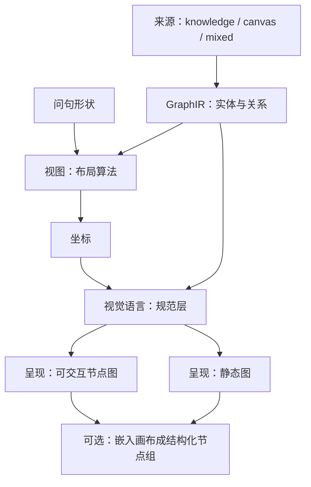
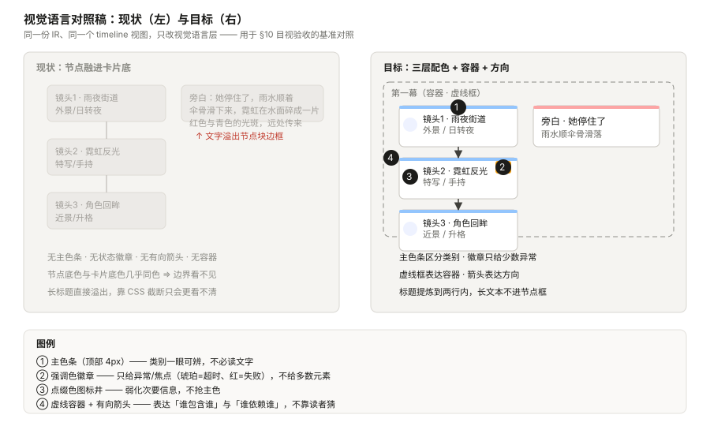
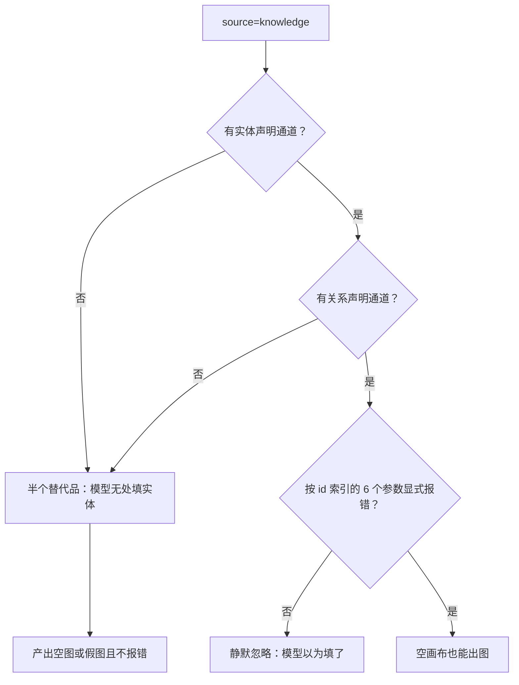
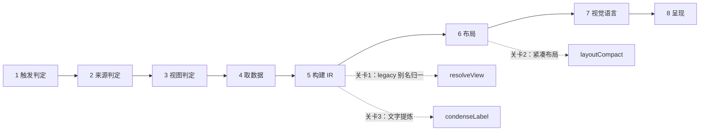
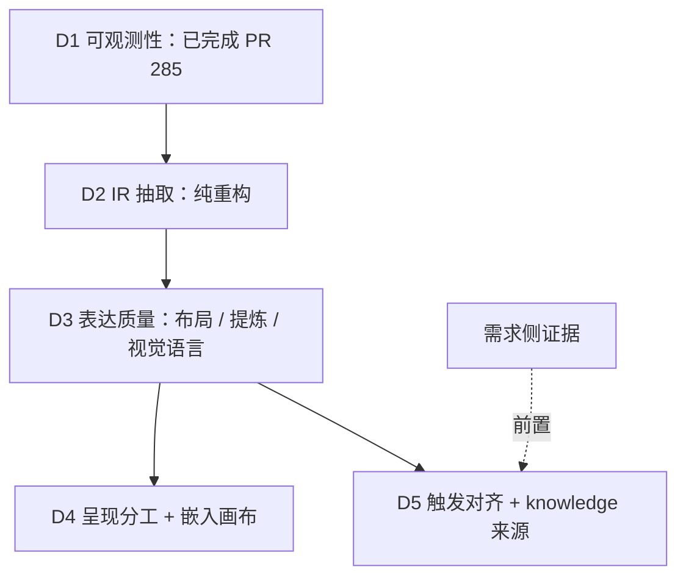
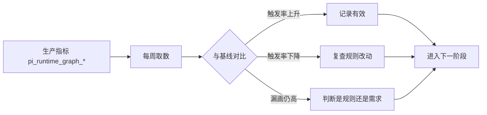

# 图形化表达引擎 —— 设计规格 v2（质量优先）

状态：待评审（brainstorming 产出，2026-10-08）
作者：WorkBuddy × sev7n4
输入：`docs/superpowers/canvas_rend_view-conversation.md`（用户原始意图的第一手记录，1304 行）
取代：`2026-10-08-graph-expression-engine-design.md`（v1，PR #276，525 行）
相关：`docs/ops/graph-observation-baseline-2026-10-08.md`（D1 生产基线，本版全部数据的出处）

> ⭐ **本版的论点：从「让它更常被用」转向「让它一次就画好」。**
> v1 写于观测数据之前，默认瓶颈是「模型不会用」，于是把触发判据排在第二。
> D1 的生产数据推翻了这个默认：**触发率并不低（用户口径 36%–57%），低的是需求基数（1.2%）。**
> 而用户亲自反馈的痛点是「表达力弱」—— 那是**单次质量**，不是覆盖率。
> 因此本版把质量（IR → 布局 → 文字提炼 → 视觉语言）提到最前，触发与来源扩展后置。

### 相对 v1 的五处修订（详见 §3）

| # | 修订 |
|---|---|
| 1 | 正交维度从 3 个变 **4 个**：新增**视觉语言层**（v1 完全没有，是用户 14:58 反馈的直接产物） |
| 2 | 交付顺序重排：`IR → 质量 → 呈现 → 触发/来源`，v1 的「触发优先」被数据推翻 |
| 3 | `source=knowledge` 的真正阻塞不是缺 `source` 参数，而是**缺关系声明通道**（15 个参数里 6 个按画布 id 索引） |
| 4 | v1 的 D1 观测方案依赖 `text_delta`——**实测它从不落库**，历史回溯只能取 user content |
| 5 | v1 §7 的 L1 / L6 / L7 已由 D1 给出答案（本版直接引用，不再列为待验证） |

---

## 0. 配图索引

| 编号 | 形式 | 内容 | 位置 | 用途 |
|---|---|---|---|---|
| 图 1 | 内嵌 Mermaid | 四个正交维度 | §4.1 | 判据：任一维度的改动不得推导其他维度 |
| 图 2 | 内嵌 Mermaid | 端到端数据流与三道质量关卡 | §5 | 定位每道关卡各自的可测点 |
| 图 3 | SVG 附件 `assets/graph-expression-engine-v2-3-visual-language.svg` | 视觉语言对照稿（现状 vs 目标） | §4.2 | §10 目视验收的基准对照 |
| 图 4 | 内嵌 Mermaid | knowledge 来源的阻塞与最小通道 | §4.4 | 防止「半个替代品」上线 |
| 图 5 | 内嵌 Mermaid | 交付顺序与硬依赖 | §6 | 排期门禁：D2 未完不得进 D3 |
| 图 6 | 内嵌 Mermaid | 观测闭环 | §10 | 上线后用数据验收，不用感觉验收 |

---

## 1. 目标（3 条，均可验收）

| # | 目标 | 成功判据（可观测 / 可断言） |
|---|---|---|
| **G1** | **单次表达质量达标** —— 画出来的那一次就看得清、看得懂、有重点 | 目视：与 图 3 右侧一致（三层配色、虚线容器、有向箭头、无文字溢出）；断言：节点 label 在 168px × 2 行内完整显示 |
| **G2** | **来源 × 视图 × 视觉语言正交** —— 领域知识、画布事实、混合三类来源共用同一套视图与视觉语言 | 空画布 + `source=knowledge` + 模型自供实体 ⇒ 必须出图（意图 1 的硬判据） |
| **G3** | **图可嵌入画布继续创作** —— 落地为结构化节点组，不是位图 | 嵌入后节点可编辑、agent 可读懂（位图不可：agent 无法理解一块像素） |

⚠️ v1 的 G1–G6 里有一条仍然成立且本版继续主张：**G6「模型用对了没有」必须由数据回答，不能假设**。
它的前提 D1 已交付（PR #285），因此本版把它从「遗留」移进 §10 的观测闭环。

---

## 2. 范围

### 2.1 本版要做的

| 编号 | 内容 | 对应用户意图 |
|---|---|---|
| D2 | IR 抽取：把布局算法从渲染里剥离，legacy 别名在 IR 入口归一 | 全部三条 |
| D3 | 表达质量：布局紧凑化 + 文字提炼 + 视觉语言规范 | 图看得清（14:58 反馈） |
| D4 | 呈现分工（静态 / 可交互）+ 嵌入画布为结构化节点组 | 意图 3「嵌入协同创作」 |
| D5 | 触发判据对齐 + `source=knowledge` / `mixed` 来源扩展 | 意图 1 / 意图 2 |

### 2.2 明确不做

| # | 不做 | 理由 |
|---|---|---|
| N1 | 不做图表库（饼图 / 柱状图 / 折线图） | 那是「数据可视化」不是「关系表达」，另开能力 |
| N2 | 不做通用流程图编辑器 | 本工具产出是**只读投影**；可编辑画布是另一条链 |
| N3 | 不做拖拽创建节点 | 越界。创建节点是 `upsert_media_node` 的职责 |
| N4 | 不追求「一张图表达所有东西」 | 视图选择本身就是减法；强塞会退化成看不清 |
| N5 | 不新增顶层参数（**唯一例外：`edges`**，理由见 §4.5） | 现有 15 个已超出模型可靠选择的能力边界 |
| N6 | 不为覆盖所有场景而自动选视图 | 选不出来时**如实说不确定**，比乱选好 |
| N7 | 不在本规格解决缩略图取图链路 | 只声明依赖（需一条带鉴权的取图接口） |
| N8 | ⛔ **不用 CSS 截断代替内容提炼** | 「字太多」是内容问题。夹紧只是把溢出变成省略号，用户看到的仍是没提炼 |

---

## 3. 与既有规格的关系

### 3.1 对 v1 的显式修订

| # | v1 的说法 | v2 修订 | 依据 |
|---|---|---|---|
| 1 | 三个正交维度（来源 / 视图 / 呈现） | **四个**：新增视觉语言层 | 用户 14:58 反馈「颜色对比不够、没有 PPT 感、文字溢出」——这三点都不在 v1 的任何维度里 |
| 2 | D1 → D2 触发 → D3 IR → D4 能力 → D5 渲染 | D1 ✅ → **D2 IR → D3 质量 → D4 呈现 → D5 触发/来源** | D1 基线：用户口径触发率 36.4%（全量）/ 57.1%（30 天），**不低**；需求基数 1.2% |
| 3 | 加 `source` 参数即落地 knowledge | 不够。真正阻塞是**无关系声明通道** | 实测：`nodes` 只是 `{node_id, color}` 样式覆盖；`node_ids` / `focus` / `annotations[].node_id` / `overlay.data[].node_id` **4 个**直接按画布 id 索引，另有 `hops` 依赖 `focus` |
| 4 | D1 观测点含 `text_delta` | ⛔ `text_delta` **从不落库**，改为取 user 行 content | 实测 `agent.service.ts` 只在 `tool_call` / `tool_result` / `canvas_command` / `canvas_action` / `thinking` / `turn_usage` / `task_*` 时 push |
| 5 | L1 / L6 / L7 列为待验证 | 已由 D1 回答，直接引用 | 基线快照 §三 |

### 3.2 与 #282（视觉语言重设计）的关系

PR #282 已在 `neowow-tokens.css` 与 `AgentNodeGraph.vue` 上做了第一轮视觉修复（三层配色、防溢出、箭头虚框）。
⭐ **本版把 #282 的成果提升为规范**（§4.2），并要求它在 IR 之上实现，而不是在「画布透传」之上——
否则布局紧凑化（D3）落地时视觉层要重写一遍。

---

## 4. 规范与判据

### 4.1 四个正交维度

见 图 1。

| 维度 | 决定什么 | 谁决定 |
|---|---|---|
| **来源** | 画什么（有哪些实体、什么关系） | 问句 + 画布是否有相关节点 |
| **视图** | 怎么排（关系 / 时序 / 层级 / 阶段交叉 / 分布） | **问句的形状**，与来源无关 |
| **视觉语言** | 怎么看得清（主色 / 强调色 / 点缀色 / 容器 / 方向 / 对比度） | 规范（本 §4.2），不由模型选 |
| **呈现** | 静态 SVG 还是可交互节点图 | 节点数 + 是否需要 overlay（§4.6） |

⭐ **关键**：视觉语言是**规范层，不是参数层**。它绝不能变成第 16 个参数让模型去选——
这正是 v1「不加参数」判据的延伸，也是「模型选不准」担忧的直接缓解。

#### 图 1 · 四个正交维度

*图 1 · 四个维度互不推导：换来源不换视图、换视图不换视觉语言、换视觉语言不换呈现。IR 是唯一真相源 ⇒ 任一维度的改动都收敛到一处。*



### 4.2 视觉语言规范（本版新增）

见 图 3。这是用户 14:58 反馈的直接落地，四条硬判据：

**（1）三层配色**（PPT 式分工，各层职责不重叠）

| 层 | 承载什么 | 落点 | 取色规则 |
|---|---|---|---|
| 主色 | 「这是什么类别」 | 节点顶部 4px 色条 + 图例 | 浅色主题 500–600 档；深色主题 **200 档**（深底上可读性最高） |
| 强调色 | 「这里需要你注意」 | 状态徽章（琥珀=超时/进行中，红=失败/阻塞）+ 选中描边 | ⛔ **单图中强调色元素 ≤ 总数的 20%** —— 超过等于没有强调 |
| 点缀色 | 「次要但要有位置」 | 图标井底色 | 主色的低透明度底，不得抢主色 |

**（2）容器与方向**

- 容器（分组 / 阶段）一律**虚线框**；⛔ 实线框会被误读成节点。
- 有向关系（`relation=dependency`）**必须带箭头**；无向（`relation=category`）**不得带箭头**。
- 判据：方向由 `view + relation` 决定，⛔ 禁止渲染层自行决定是否加箭头。

**（3）对比度（硬判据）**

- 节点底色必须与卡片底色**不同色**：浅色 `#ffffff` 节点 / 深色 `#2a2a33` 节点（比卡片亮一档）。
- ⛔ **深色主题禁止纯白节点卡** —— 纯白落在深底上形成刺眼白块，这是旧 SVG 卡片「字看不清」的根因。
- 正文对比度 ≥ 4.5:1（WCAG AA），节点标题字号 ≥ 12px。

**（4）文字提炼（内容规则，不是样式规则）**

这是「字太多、文字溢出节点块」的**真正解法**：

- 判据：节点 `label` 必须能在 **168px 宽 × 2 行**内完整显示 ⇒ 由 **IR 构建侧保证**，不是渲染侧截断。
- 提炼规则：`label ≤ 12 个汉字或 24 个拉丁字符`（可断言的纯函数，见 §8）。
- 超出的部分进 `description`（hover / 详情 / 导出 HTML），⛔ 绝不进节点框。
- ⛔ 禁止「生成长文本 + CSS line-clamp」的组合（N8）。

#### 图 3 · 视觉语言对照稿

*图 3 · 同一份 IR、同一个 timeline 视图，只改视觉语言层。左侧是现状（节点融进卡片底色、无方向、文字溢出），右侧是本版目标。用于 §10 目视验收：上线后截图与右侧对照。*



### 4.3 knowledge 来源：真正的阻塞

见 图 4。

**事实核查**（2026-10-08，核对 `render-canvas-view.ts`）：现有 15 个参数中，**4 个直接按画布节点 id 索引**，
另有 `hops` 依赖 `focus`：

```
node_ids[]            "Source node ids; omitted means all canvas nodes"
focus                 "Must be an existing node id"
nodes[].node_id       "Canvas node id this styling applies to"
annotations[].node_id "Annotated node id"
overlay.data[].node_id  "node_id omitted means positional against the canvas nodes"
hops                  依赖 focus，非直接索引
```

⚠️ 因此：**只加 `source=knowledge` 而不给「实体声明通道」，等于让这 6 个参数在 knowledge 模式下全部失效。**
这正是记忆里的铁律命中场景 ——「**半个替代品 = 幻觉源**」：模型会填 `source=knowledge` 却无处填实体，
产出空图或假图，而没有任何东西会报错。

#### 图 4 · knowledge 的最小充分通道

*图 4 · knowledge 来源的最小充分集是三件事，缺一即不可上线。第三件（失效参数显式报错）是防止静默降级的关键。*



**最小充分集**（三件，缺一不可）：

1. `nodes[]` 从「样式覆盖」扩展为「实体声明」：`node_id` 变**可选**；无 `node_id` 时 `label` **必填**（模型自造实体）。
   ⭐ 这样**复用现有参数**，不新增顶层参数。
2. 新增 **`edges`** 参数 —— 本版唯一新增，理由：现有 15 个参数里**没有任何**关系声明通道，不可替代（§4.5）。
3. knowledge 模式下 `focus` / `hops` / `node_ids` / `annotations` / `overlay.data` **必须显式报错**，⛔ 不得静默忽略。

### 4.4 参数门禁

沿用 v1 判据并提高门槛：**新增任何参数前，必须证明它不可替代。**

| 步骤 | 问题 | 本版结论 |
|---|---|---|
| 1 | 能否用现有 15 个参数的组合表达？ | 能 ⇒ 不加 |
| 2 | 不能 ⇒ 能否**扩展现有参数的取值域**表达？ | 能 ⇒ 扩（如 `nodes[]` 扩为实体声明） |
| 3 | 都不能 ⇒ 才允许新增顶层参数 | 本版仅 `edges` 一例 |

⭐ **删除优先于新增**：D1 已给出删除候选 `show_type`（生产使用 2 次）、`focus_anchor`（1 次）。
删掉一个从没被用过的参数，比新增任何参数都更能改善模型选择准确性，且零成本。

### 4.5 呈现分工（沿用 v1，本版补一条）

| 情况 | 选谁 |
|---|---|
| 需要 overlay（情绪 / 预算 / 严重度） | 静态图 |
| 节点数 > 15 | 静态图 |
| 用户说「打开看看 / 点进去」 | 可交互节点图 |
| 默认 | 静态图 |

⭐ **本版补充**：无论选哪种呈现，都**共用同一套视觉语言**（§4.2）。
⛔ 不允许静态图是一套配色、节点图是另一套——那正是历史上「两套逻辑必然漂移」的复发。

---

## 5. 架构与契约

见 图 2。

#### 图 2 · 端到端数据流与三道质量关卡

*图 2 · 从问句到呈现的八个阶段，其中三道质量关卡各自有可断言的纯函数（§8）。关卡的意义：质量问题是内容问题，必须在关卡内解决，不能推给渲染层。*



### 5.1 GraphIR

在 v1 的 IR 上补三处（其余不变：`nodes` / `edges` / `view` / `title` / `overlays`）：

```ts
interface GraphIRNode {
  id: string;
  type: 'entity' | 'step' | 'group' | 'milestone' | 'category';
  /** ⭐ 提炼后的短标签，必须满足 168px × 2 行的预算（§4.2-4）。 */
  label: string;
  /** 完整文本。⛔ 不进节点框，只进 hover / 详情 / 导出。 */
  description?: string;
  /** 来源标识：canvas 有缩略图位，knowledge 没有。 */
  sourceKind?: 'canvas' | 'knowledge' | 'derived';
  /** knowledge 来源的语义标注（与 dim 互斥）。 */
  concept?: { category?: string; definition?: string };
  /** 语义标注（情绪强度 / 超时 / 严重度）→ 映射为强调色。 */
  mark?: { kind: string; level: number; text?: string };
  dim?: Record<string, string>;
  canvasNodeId?: string;
}

interface GraphIREdge {
  source: string;
  target: string;
  kind: 'sequence' | 'dependency' | 'containment' | 'flow';
  label?: string;
}
```

⚠️ **IR 仍然不含坐标**（沿用 v1）：坐标是布局阶段的产物，换视图不动 IR。
⭐ 本版新增的 `label` / `description` 分离，是「文字提炼」能成为**可断言纯函数**的前提。

### 5.2 布局层

五个视图算法（`buildLayoutSvg` / `buildTreeSvg` / `buildTimelineFlowSvg` / `buildSwimlaneSvg` / `buildMatrixSvg`）
从「直接吐 SVG 字符串」改为「**吐坐标**」，渲染降级为纯消费。

- ⛔ legacy 别名 `topology` / `table` 在 **IR 构建之前**就归一（`resolveView`）⇒ IR 的 `view` 字段不含 legacy 值。
- ⭐ D1 数据：`topology` 32 次、`table` 40 次 ⇒ **本轮不得废弃这两个别名**。

### 5.3 视觉语言层

IR → 视觉角色的映射是**纯函数**（`visualRole`），不含样式字符串：

| IR 信号 | 视觉角色 | 落点 |
|---|---|---|
| `node.type` | 主色 | 顶部 4px 色条 + 图例 |
| `node.mark.level` 超阈 / `severity=warn` | 强调色 | 状态徽章（≤ 总数 20%） |
| 其他 | 点缀色 | 图标井底色 |
| `edge.kind=dependency` | 有向 | 带箭头 |
| `edge.kind=category` | 无向 | 不带箭头 |
| 分组 / 阶段容器 | 虚线框 | `stroke-dasharray` |

---

## 6. 交付物与顺序

见 图 5。

#### 图 5 · 交付顺序与硬依赖

*图 5 · 顺序即优先级，箭头是硬依赖。D2 未完成不得进 D3（IR 是地基）；D5 的前置是需求侧证据，而不是 D4 完成。*



### D1 可观测性 —— ✅ 已交付（PR #285）

产出：`pi_runtime_graph_*` 指标族 + 查询脚本 + 生产基线快照。
本版全部数据来自它（见 §7）。

### D2 IR 抽取（纯重构）

- 五个视图算法改吐坐标；legacy 别名在 IR 入口归一；
- `label` / `description` 分离；
- **验收：对外输出逐字节不变**（快照测试），否则不算纯重构。

### D3 表达质量（本版的核心）

| 编号 | 内容 | 对应判据 |
|---|---|---|
| D3-1 | 布局紧凑化 —— 坐标紧凑排布，消灭「vast 空里几个小点」 | 26 节点时包围盒面积显著小于透传 |
| D3-2 | 文字提炼 —— `condenseLabel` 在构建侧保证预算 | 168px × 2 行内完整显示 |
| D3-3 | 视觉语言规范落地 —— 三层配色 + 虚框 + 箭头 + 对比度 | 与 图 3 右侧一致 |

⭐ **为什么 D3 排在触发之前**：D1 数据显示用户口径触发率 **36.4%（全量）/ 57.1%（近 30 天）**，
「模型不会用」不是主要矛盾；而用户亲自反馈的痛点是「表达力弱」。
漏掉的 43%–64% 确实存在，但绝对量是**每月 6–14 条**量级 ⇒ 修触发规则的收益上限很小。

### D4 呈现分工与嵌入

- 按 §4.5 自动选呈现；两种呈现在同一套视觉语言之上；
- 嵌入画布 = IR → 结构化节点组（⛔ 不是位图）。

### D5 触发对齐与来源扩展

- 触发规则改为**可判定信号**（沿用 v1 §4.4）；
- `source=knowledge` / `mixed` 按 §4.3 的最小充分集落地；
- ⛔ **前置条件：需求侧证据**。D1 显示用户明确要图仅占轮次 **1.2%（全量）/ 1.6%（近 30 天）**，
  在这个基数上扩能力的收益未被证明 ⇒ 可后置，直到出现需求侧证据。

---

## 7. 数据与状态变更

本版全部决策数据的出处（`docs/ops/graph-observation-baseline-2026-10-08.md`，生产库全量 1806 轮 / 近 30 天 856 轮）：

| 指标 | 全量 | 近 30 天 |
|---|---|---|
| 轮次 | 1806 | 856 |
| 真调过 `render_canvas_view` | **46（2.5%）** | — |
| 用户明确要图的轮次 | 22（1.2%） | 14（1.6%） |
| 触发率（用户口径） | **36.4%** | **57.1%** |

**本版新增测算**（口径见 §10.3）：按「问句形状适合图形化」放宽（不要求用户说出「图」字），
候选池 53 轮（2.9%），其中真画 13 轮 ⇒ **24.5%**。
⇒ 即便放宽口径，适用场景仍在 **3% 量级**，这支撑了「质量优先于覆盖率」的排序。

⚠️ **头号发现（必须写进任何后续规则）**：裸「图」在本产品线是**反信号** ——
宽松词表 749 命中 / 19 真画（2.5%），严格词表 16 / 8（50%），差 20 倍。
原因是本产品是**生图平台**，用户嘴里的「图」绝大多数指「生成一张图片」。

**遗留问题的答案**（v1 的 L1 / L6 / L7，本版不再列为待验证）：

| # | 问题 | 答案 |
|---|---|---|
| L1 | 「该画没画」的发生率 | 用户口径下 43% 没画；绝对量每月 6–14 条 |
| L6 | 哪些参数该删 | `show_type` 2 次、`focus_anchor` 1 次 ⇒ 删除候选 |
| L7 | legacy 别名是否还在用 | `topology` 32 次、`table` 40 次 ⇒ **本轮不得废弃** |

---

## 8. 纯函数与算法（含单测要求）

| 函数 | 输入 → 输出 | 必须覆盖的用例 |
|---|---|---|
| `resolveView(view)` | legacy → 规范视图 | `topology` 与 `layout+dependency` 产出**同一 IR**（v1 Review Focus #4） |
| `condenseLabel(label, budget)` | 长文本 → 短标签 | 中文 12 字边界、拉丁 24 字符边界、含标点、空串 |
| `layoutCompact(ir, view)` | IR → 坐标 | 26 节点时包围盒面积显著小于透传；单节点不除零 |
| `visualRole(node)` | IR 节点 → 视觉角色 | 强调色元素占比 **≤ 20%**；`mark` 缺失时回落点缀色 |
| `toCanvasNodeGroup(ir)` | IR → 结构化节点组 | 产物含可编辑节点而非位图；标题含 `<script>` 被转义 |

⭐ **项目硬纪律**：每个纯函数至少做**一次变异验证**（人为改坏实现，确认对应用例转红），
并在提交信息里写明「改了什么 → 哪条变红 → 还原后复绿」。本条与 D1 的六处接线变异一致。

---

## 9. 文件级改动清单（预期，实施阶段以计划为准）

| 文件 | 改动 | 阶段 |
|---|---|---|
| `services/pi-runtime/src/graph/graph-ir.ts`（新增） | IR 类型 + `resolveView` + `condenseLabel` | D2 |
| `services/pi-runtime/src/graph/layout/*.ts`（新增） | 五视图「IR → 坐标」+ `layoutCompact` | D2 / D3 |
| `services/pi-runtime/src/tools/render-canvas-view.views.ts` | 5 个 `build*Svg` 改为算坐标 | D2 |
| `services/pi-runtime/src/tools/render-canvas-view.ts` | `nodes[]` 扩为实体声明；新增 `edges`；knowledge 模式显式报错 | D5 |
| `apps/web/src/components/agent/presentation/AgentNodeGraph.vue` | 消费 IR + 视觉语言角色 | D3 / D4 |
| `apps/web/src/styles/neowow-tokens.css` | 视觉语言变量（承接 #282） | D3 |
| `prompt-registry/` 触发规则 | 可判定信号（承接 D1「裸图是反信号」） | D5 |

---

## 10. 测试策略与验收标准

### 10.1 目视验收（G1 的判据）

上线后在**深浅两种主题**下各截一张，与 图 3 右侧对照：三层配色分明、容器是虚框、
有向边有箭头、节点文字无溢出、节点与卡片底色可区分。

### 10.2 断言验收

- D2：五视图渲染快照**逐字节不变**（纯重构判据）；
- D3：`condenseLabel` 与 `visualRole` 单测 + 变异验证；
- D4：嵌入产物含可编辑节点、XSS 转义（`&` 必须第一个处理，否则 `&lt;` 被二次转义）；
- D5：**空画布 + `source=knowledge` + 模型自供实体 ⇒ 必须出图**（G2 硬判据）。

### 10.3 观测闭环

见 图 6。D1 已交付指标，后续每项改动都与其对比，**不用感觉验收**。

#### 图 6 · 观测闭环

*图 6 · 上线后按周取数，与基线对比；任一指标反向变化即触发复查，而不是等用户反馈。*



**本版新增测算的口径声明**：§7 的「问句形状池」用关键词近似（关系 / 结构 / 流程 / 顺序 / 阶段 / 对比 / 分布 / 依赖 …），
并排除了命中生图词的轮次。它**会漏掉**「这几镜之间什么关系」这类无关键词的诉求 ⇒ 只能作为上界参考，
真值以 runtime 上线后的 `pi_runtime_graph_*` 指标为准。

---

## 11. 风险

| 风险 | 影响 | 缓解 |
|---|---|---|
| 需求基数仅 1.2%，D5 可能白做 | 投入产出比低 | D5 的前置是需求侧证据（图 5），不是 D4 完成 |
| D2 纯重构破坏现有行为 | 用户可见回归 | 验收判据是「对外输出逐字节不变」+ 快照测试 |
| 视觉语言是主观的 | 评审反复 | 图 3 作目视基准；深浅两主题各一版；不在评审里用形容词争论 |
| knowledge 模式的失效参数被静默忽略 | 模型产出假图且无报错 | §4.3 第三件：必须显式报错 + 单测锁住 |
| 缩略图取图链路未通 | 视觉资产画布上只有类型图标 | N7：本规格只声明依赖，不解决 |
| 文字提炼压掉关键信息 | 图变清楚了但没信息 | `description` 保留全文，hover / 详情 / 导出可见 |

---

## 12. 后续包 / 路线图

| 项 | 何时 |
|---|---|
| 缩略图取图链路（带鉴权） | D4 之后单独一包 |
| 删除 `show_type` / `focus_anchor`（L6 候选） | D2 完成后，与 IR 一起做 |
| `source=knowledge` 的需求侧取证 | D5 的前置 |
| SVG 静态图路径的存废 | D4 上线后用呈现分布数据决定，不在本规格下结论 |
| 导出独立 HTML（快照分享） | 依赖取图链路 |

---

## 13. 配图规范自检

```bash
pnpm verify-spec-figures --file docs/superpowers/specs/2026-10-08-graph-expression-engine-design-v2.md
```

结果：见本包提交信息（要求 0 错误；R4 / R8 为警告级，需确认无遗漏引用）。
