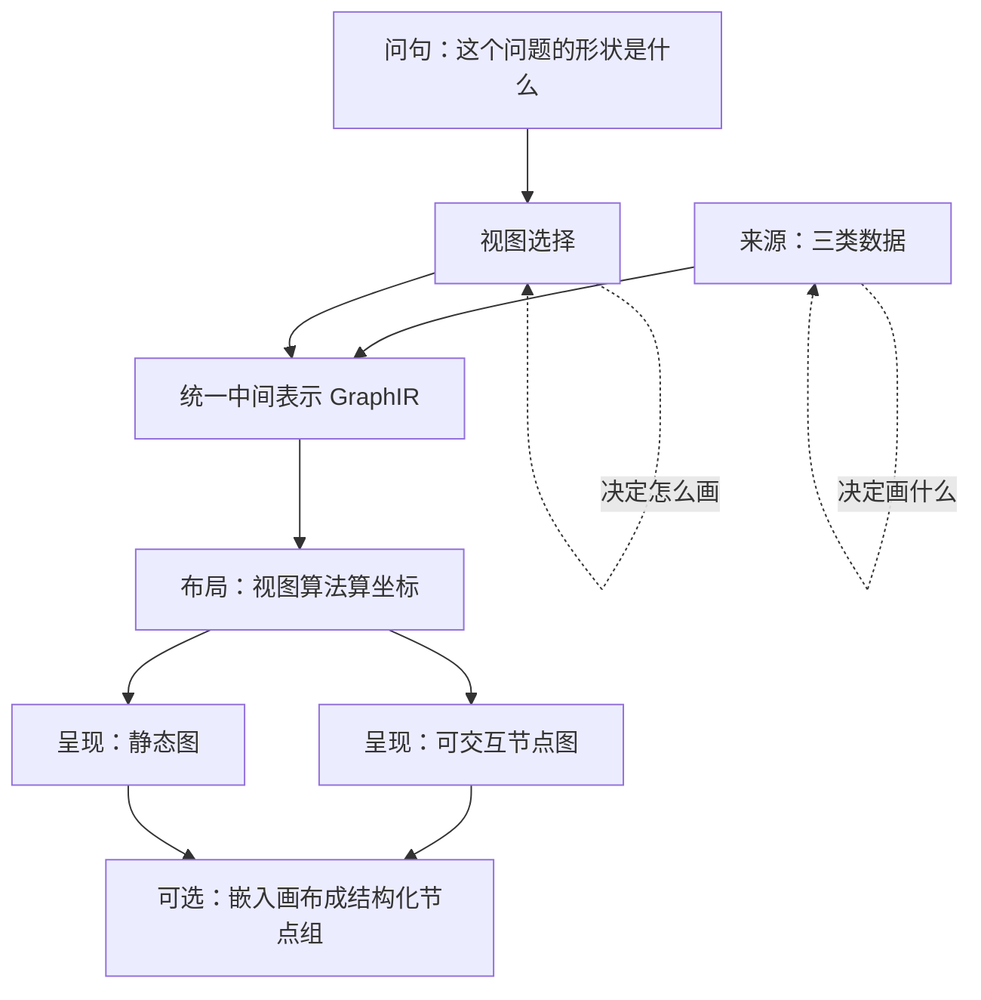
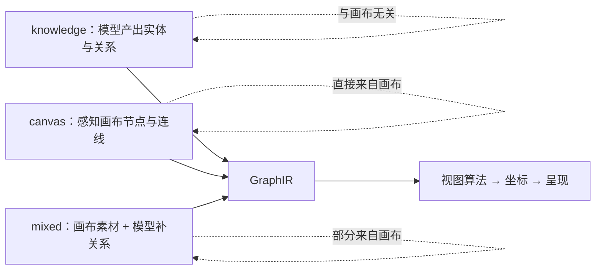
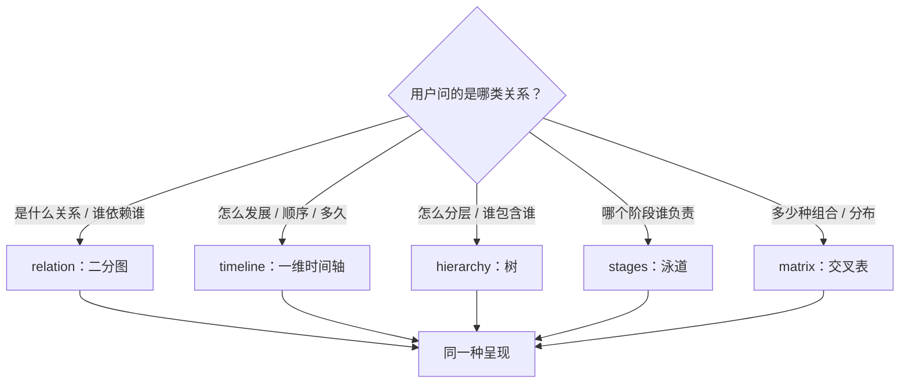
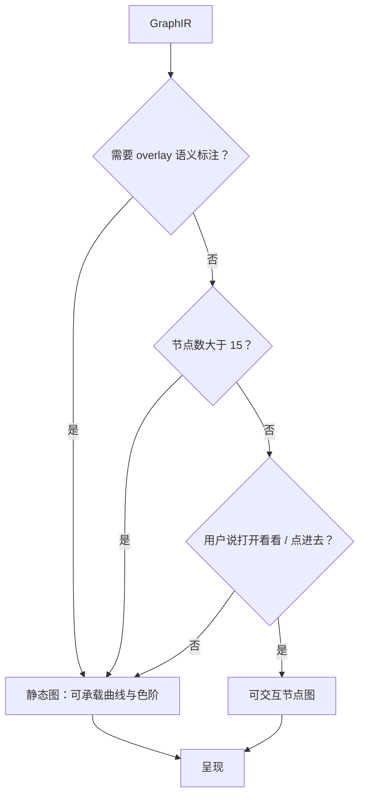
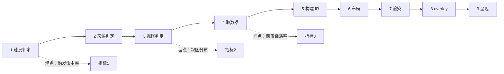

# 图形化表达引擎 —— 设计规格

状态：草案（待评审）
日期：2026-10-08
作者：WorkBuddy × sev7n4
取代：`render_canvas_view` 现有的「画布卡片」定位（`svg_card` / `node_graph` 双写为临时形态）

> ⭐ **本文从产品意图出发写，不以现有代码能力为锚点。**
> 现有的 `render-canvas-view.ts`（717 行手写 SVG）+ `expressive.ts` + `views.ts` 共约 1330 行
> 是**上一版实现**，不是本规格的约束。文中凡引用它的地方，只作为「现状参考」，
> 不表示要延续它的结构。

---

## 0. 配图索引

| 图 | 形式 | 说明了什么 |
|---|---|---|
| 图 1 | 结构图 | 三类数据来源如何汇入同一个表达引擎 |
| 图 2 | 结构图 | 一次调用的完整数据流：问句 → 来源 → 视图 → 呈现 → 去向 |
| 图 3 | 结构图 | 视图家族与各自适用的问句类型 |
| 图 4 | 结构图 | 呈现形态的分工与选择判据 |
| 图 5 | 状态图 | 一次表达的生命周期与可观测点埋点位置 |

---

## 1. 问题与动机

### 1.1 用户的原始意图（第一手，2026-10-08）

工具的设计意图有三条，**并列且同等重要**：

1. **与画布无关的信息**（领域知识）—— 模型根据对话内容和「问的是什么」选视图，图形化表达。
2. **与画布相关的信息** —— 通过感知画布获取画布信息，同样由「问的是什么」选视图，图形化表达。
3. **两者混合** —— 可以有关也可以无关的信息或知识，同样选视图、图形化表达。
   **表达之后可以把图嵌入画布，进行协同创作。**

### 1.2 这三条合起来意味着什么

**来源是输入，视图是表达方式，产出是可继续创作的对象。**

推论（这三条决定了后续全部设计）：

| # | 推论 |
|---|---|
| A | ⛔ **不能把工具绑死在「读画布」上**。来源有三种，其中两种与画布无关。 |
| B | ⭐ **来源与视图必须正交**。领域知识也能画时间线；画布也能画交叉统计表。 |
| C | ⭐ **图不是终点**。意图 3 明确「表达后嵌入画布协同创作」⇒ 产出必须是**可转成画布节点的结构**，不是死图。 |
| D | ⭐ **视图选择由「问的是什么」决定**，而不是由「有什么数据」决定。这两件事必须解耦。 |

### 1.3 现状为什么不够（2026-10-08 生产取证）

对生产库 `AgentMessage` 表做了取证，共 **50 次** `render_canvas_view` 调用，得到三条事实：

| # | 事实 | 证据 |
|---|---|---|
| 1 | 模型选具体视图**是准的** | `view:topology + relation:dependency + focus`画依赖图；`view:timeline + groupBy:type` 画时间线 |
| 2 | 🔴 **常在选视图之前先岔出去** | "让我先搜索《沙丘》电影的时间线信息" → 先调 `web_search`；"我应该先加载相关技能看看" → 先调 `load_skill` |
| 3 | 🔴 **实际触发信号比规则窄** | 模型靠「用户明确说『示意图 / 图』」触发；规则写的是「问题涉及 3+ 节点或 2 层以上关系」 |

**由此得到本规格的第一个交付物（见 §6）。**

⚠️ 事实 3 揭示：文档化的触发判据与模型实际使用的信号**不一致**。
这意味着「模型能否正确调用」**不能被假设**，必须被观测。

---

## 2. 目标与非目标

### 2.1 目标

| # | 目标 | 成功判据（可观测） |
|---|---|---|
| G1 | 工具能表达**三类来源**，且来源与视图正交 | 领域知识来源的调用占比 > 0（当前恒为 0，因为工具只能读画布） |
| G2 | 「问的是什么 → 选哪个视图」的判据**可判定**，且模型实际行为与之一致 | 触发信号命中率、视图选择正确率（指标定义见 §6） |
| G3 | 图可**嵌入画布继续创作**，且落地为**结构化节点**而非位图 | 嵌入后可编辑、agent 可读懂（位图不可：agent 无法理解一块像素） |
| G4 | 表达**覆盖需要图形才说得清的问题**，且图形比文字/表格更清楚 | 用户不再要求「再来一张图」；不再出现「vast 空里几个小点」 |
| G5 | 调用链**不绕路** | 画图前的前置调用（web_search / load_skill 等）占比下降 |

### 2.2 非目标（明确不做）

| # | 不做 | 理由 |
|---|---|---|
| N1 | 不做图表库（图表、饼图、柱状图） | 那是「数据可视化」不是「关系表达」。需要时另用 `chart` 能力 |
| N2 | 不做通用流程图编辑器 | 本工具产出是**只读投影**；可编辑画布是另一条链（意图 3 的「嵌入」已覆盖） |
| N3 | 不做节点图设计工具（拖拽创建节点） | 越界。创建节点是 `upsert_media_node` 的职责 |
| N4 | 不追求「一张图表达所有东西」 | 视图选择本身就是「减法」；强塞会退化成看不清 |

---

## 3. 核心概念模型

### 3.1 三个正交维度

用户意图 1/2/3 说的是**来源**，但真正决定一张图长什么样的，是三个彼此独立的维度。

见 图 1。

```
                  ┌──────────────────────┐
  问句 ─────────▶│  视图选择（怎么画）    │
  「问什么」      │  relation/timeline/…  │
                  └──────────┬───────────┘
                             │ 决定
                             ▼
  ┌─────────────┐      ┌──────────────┐      ┌──────────────┐
  │ 来源        │─────▶│ 统一中间表示  │─────▶│ 呈现          │
  │ knowledge   │      │ nodes+edges  │      │ 静态 / 可交互 │
  │ canvas      │      │ + 语义标注    │      │              │
  │ mixed       │      └──────────────┘      └──────┬───────┘
  └─────────────┘                                    │
                                          ┌─────────▼─────────┐
                                          │ 可嵌入画布（可选）  │
                                          │ → 结构化节点组│
                                          └───────────────────┘
```

**关键设计**：中间表示（nodes + edges + 语义标注）是**唯一的真相源**，
静态图与可交互图都只是它的两种**渲染**。这消除了「两套逻辑必然漂移」的历史问题。

#### 图 1 · 三个正交维度

*图 1 · 三个维度彼此正交：问句决定「怎么画」，来源决定「画什么」，呈现是渲染结果。IR 是唯一真相源 ⇒ 换视图不动数据结构。*



### 3.2 统一中间表示（IR）

一份IR 同时承载三种来源与五种视图的产出。字段设计原则：**只放三种来源都有的概念**。

```ts
/** 表达图元的统一中间表示。来源无关、视图无关。 */
interface GraphIR {
  nodes: GraphIRNode[];
  edges: GraphIREdge[];
  /** 视图名（来源无关，只记录"用哪种画法"）。 */
  view: ViewName;
  /** 标题（用户可见）。 */
  title?: string;
  /** 语义标注轨道（可选）——对应现有的 overlay 能力。 */
  overlays?: OverlayTrack[];
}

interface GraphIRNode {
  id: string;
  type: 'entity' | 'step' | 'group' | 'milestone' | 'category';
  label: string;
  /** 该节点携带的数据维度（timeline 用时间、matrix 用行列键等）。 */
  dim?: Record<string, string>;
  /** 语义标注（如情绪强度、超时标记、严重度）。 */
  mark?: { kind: string; level: number; text?: string };
  /** 画布节点 id（来源=canvas 时有；嵌入画布时用）。 */
  canvasNodeId?: string;
}

interface GraphIREdge {
  source: string;
  target: string;
  kind: 'sequence' | 'dependency' | 'containment' | 'flow';
  label?: string;
}
```

⚠️ **IR 不含坐标**。坐标是**渲染阶段的产物**，由视图算法根据 IR 计算得出。
这样「换视图」= 换渲染器，IR 不动。

### 3.3 三类来源

见 图 2。

| 来源 | 数据从哪来 | 模型要不要产出实体 | 与画布的关系 |
|---|---|---|---|
| `knowledge` | **模型自己**从对话与领域知识产出实体与关系 | 要 | 无关 |
| `canvas` | 感知画布（节点/连线/分组/时间戳/元数据） | 不要（读取即可） | 直接来自画布 |
| `mixed` | 画布 + 模型补充（画布给素材，模型给关系与标注） | 要（补关系） | 部分来自画布 |

⚠️ **`knowledge` 来源是当前完全缺失的能力**，也是用户意图 1 的直接落地。
它的存在意味着工具**不再依赖画布非空**。

#### 图 2 · 三类来源汇入同一引擎

*图 2 · 三类来源（knowledge / canvas / mixed）汇入同一个 IR。knowledge 与画布无关，mixed 部分来自画布 —— 三者共用同一套视图算法。*



### 3.4 视图家族

见 图 3。

| 视图 | 回答的问句 | 需要的 IR 维度 | 备注 |
|---|---|---|---|
| `relation` | 「这些是什么关系 / 谁依赖谁」 | `edges.kind = dependency` | 二分图布局 |
| `timeline` | 「怎么发展 / 顺序是什么 / 花了多久」 | `nodes.dim.time` + `edges.kind=sequence` | 一维时间轴 |
| `hierarchy` | 「怎么分层 / 谁包含谁」 | `edges.kind = containment` | 树布局 |
| `stages` | 「哪个阶段谁负责 / 阶段×维度交叉」 | `nodes.dim.stage` × `nodes.dim.owner` | 泳道 |
| `matrix` | 「有多少种组合 / 分布如何」 | `nodes.dim.rowKey/colKey` | 交叉表 |

⚠️ 视图数量**保持 5个**，不增加。理由见 §4.3。

#### 图 3 · 视图家族与适用问句

*图 3 · 视图选择只取决于「问的是什么」，与数据来源无关。五个视图覆盖关系/时序/层级/阶段交叉/分布五类问句。*



---

## 4. 设计取舍

### 4.1 渲染：静态图 vs 可交互图

见 图 4。

**决策：保留两种呈现，但不是「二选一」，而是「同一 IR 出两种，用户/模型按需选」。**

| 维度 | 静态图（SVG） | 可交互节点图（Vue Flow） |
|---|---|---|
| 布局密度 | 高（可为文字定制尺寸） | 中（节点尺寸受交互约束） |
| 语义标注 | 丰富（曲线、色阶、标记） | 弱（只做角标） |
| 操作 | 无 | 缩放/拖拽/点节点跳画布 |
| 适合 | 标注密集、需要「一眼看全」 | 需要「点进去操作」 |

#### 图 4 · 呈现形态的分工

*图 4 · 静态图与可交互节点图不是二选一，而是同一 IR 的两种渲染。默认静态图；只有需要 overlay、节点过多、或用户明确要「打开看看」时才用节点图。*



**选择判据**（写进工具描述与规则）：

| 情况 | 选谁 |
|---|---|
| 需要 overlay（情绪/超时/严重度） | 静态图（可交互节点图承载不了曲线） |
| 节点数 > 15 | 静态图（节点图会挤成一团，见现状教训） |
| 用户说「打开看看 / 点进去」 | 可交互节点图 |
| 默认 | 静态图（更紧凑、语义更丰富） |

⚠️ 这个判据**必须进 prompt 规则**，否则模型选不对（现状取证已证明选择会出错）。

### 4.2 嵌入画布：落地为结构化节点

**决策：嵌入的产物是「结构化节点组」，不是一张位图。**

理由：位图在画布上只是一块像素 —— agent 无法理解它、不能基于它推理，
且与画布上「真实资产」节点的语义冲突。结构化节点组可编辑、agent 可读懂。

**代价与决策**：嵌入默认**不自动持久化**（需显式保存），
因为画布 SSOT 写入是高风险操作，不该由一个「表达工具」悄悄触发。

### 4.3 不增加工具数量与参数

⚠️ **这是本规格最重要的一条取舍，直接回应「token 消耗」与「模型选不准」的担忧。**

| 不做 | 理由 |
|---|---|
| 不新增第二个「知识图」工具 | 与 `render_canvas_view` 职责重叠 ⇒ 模型选工具就会更难 |
| 不新增 `interactive` 布尔参数 | ⛔ 会加参数。改为**由视图 + 节点数自动判定**（§4.1 判据），用户可显式覆盖 |
| 不新增 `source` 参数的更多取值 | 三种取值已覆盖用户意图的 1/2/3；不加第四种 |
| 不新增 `layout` / `style` 类参数 | 现有参数已偏多（view/relation/groupBy/overlay/focus/scope/hops/node_ids/nodes/title） |

**判据**：新增任何参数前，必须回答「它是否只能用现有参数组合表达」。
能 ⇒ 不加。

### 4.4 触发判据：从描述性改为可判定

现状取证事实 3 表明规则描述与模型实际行为不一致。本规格要求触发判据**可判定**：

| 当前写法（描述性） | 改后（可判定） |
|---|---|
| 「问题涉及 3 个以上节点或 2 层以上关系」 | 「用户要求**图形化表达**（说『图 / 示意图 / 可视化 / 看图』）**或** 明确问**关系 / 顺序 / 分层 / 阶段 / 分布**」 |

⚠️ 区别：前者需要模型判断「是否涉及 3+ 节点」（主观、易漂移），
后者是**可匹配的字面信号**。

---

## 5. 端到端数据流

见 图 5。

| 阶段 | 输入 | 输出 | 可观测点 |
|---|---|---|---|
| 1. 触发判定 | 用户问句 + 画布摘要 | 是否调用 | ⭐ **触发命中率**（当前是盲区） |
| 2. 来源判定 | 问句 + 画布是否有相关节点 | `source` | 来源分布 |
| 3. 视图判定 | 问句 + IR 维度 | `view` |视图分布 + 后续纠错率 |
| 4. 数据获取 | `source` | 原始数据 | — |
| 5. **IR 构建** | 原始数据 | `GraphIR` | — |
| 6. 布局 | `view` + IR | 坐标 | — |
| 7. 渲染 | 坐标 + IR | 静态图 / 节点图 | ⭐ 渲染耗时 |
| 8. overlay | IR 标注 | 语义轨道 | overlay 使用率 |
| 9. 呈现 | — | 卡片 / 新窗口 |⭐ **前置绕路率** |

#### 图 5 · 生命周期与可观测点

*图 5 · 一次表达的生命周期与三个可观测点。阶段 1（触发判定）是当前最大盲区 —— 没调用的记录不落库，所以「该画没画」观测不到。*



⚠️ 第 1 阶段是**当前最大盲区**：没调用的记录不落库，
所以「该画没画」完全观测不到。§6 把补上它列为第一交付物。

---

## 6. 交付物（先定顺序，再谈排期）

⚠️ 顺序是本规格的核心主张：**观测先于能力**。

### D1. 可观测性（前置，其余全部依赖它）

**交付内容**：

1. **补齐触发盲区** —— 记录「本轮未调用画图工具」的事实，使「该画没画」可计算。
2. 三个指标落库（不新增模型可见参数、不改工具契约）：
   - 触发信号：命中的信号词（`图` / `关系` / `顺序` / …）+ 是否调用
   - 视图分布：`view` 各取值计数
   - **前置绕路率**：画图前是否先调了其他工具（及其名字）
3. 一个只读查询入口（SQL 或脚本）能直接回答：
   「该画图的问句里有多少真画了」「视图选对率」「绕路发生在哪个工具之前」

**为什么第一**：⚠️ 用户原话「担心不能正确调用，即使保留两个图也白搭」。
没有 D1，D2–D5 上线后**无法判断是否真的改善** —— 只能凭感觉。

### D2. 触发判据对齐（修规则，不加能力）

- 按 §4.4 把 `canvas_view_policy` 规则改成**可判定**信号；
- 把「前置绕路」的成因写进规则：明确「画布图不需要先搜索外部资料」这类反直觉约束；
- ⛔ 不动工具参数。

### D3. IR 抽取（把布局算法从渲染里剥离）

- 把现有 SVG 生成器**改造为「IR → 坐标」**的计算层，渲染降级为纯消费；
- 现有 5 个视图全部迁到 IR 之上（这一步是纯重构，**对外行为不变**）；
- 目的：让 D4/D5 有稳定的地基，且消除「两套逻辑」的历史债务。

### D4. 能力补齐（三件事一起）

| 编号 | 内容 | 对应用户意图 |
|---|---|---|
| D4-1 | `source: knowledge` —— 模型自己产实体与关系 | 意图 1 |
| D4-2 | `source: mixed` —— 画布素材 + 模型补关系 | 意图 3 |
| D4-3 | 布局紧凑化 —— 无论哪种视图，坐标紧凑排布 | G4（现状「vast 空里几个小点」） |

⚠️ **D3 全部完成后**才做 D4 —— 否则又是在不稳定地基上加能力。

### D5. 渲染分工与嵌入

- 按 §4.1 判据实现两种呈现的自动选择；
- 嵌入画布 = IR → 结构化节点组（§4.2）；
- 可交互节点图补缩略图（依赖鉴权取图链路，需先有该链路）。

---

## 7. 遗留与待验证（上线后用数据说话）

⚠️ 以下问题**在设计阶段无法回答，也不该由用户判断**（2026-10-08 反馈：
「两个问题不好判断，我是用户视角」）。列为遗留，**由 D1 的数据在D2–D5 上线后回答**。

| # | 遗留问题 | 由哪个数据回答 | 何时可得 |
|---|---|---|---|
| L1 | 模型「该画图时不画」的实际发生率是多少 | D1-1 触发命中率 | D1 上线后 |
| L2 | `load_skill` 前置是走偏还是必要 | D1-3 绕路率 + 该 skill 的内容 | D1 上线后 |
| L3 | 「该画没画」是规则问题还是模型能力问题 | D1-1 + D2 后的对比 | D2 上线后 |
| L4 | 静态图 vs 节点图的实际选择率与用户满意度 | D5 渲染形态分布 | D5 上线后 |
| L5 | 缩略图取图链路的成本 | 鉴权取图接口的实测耗时 | D5 阶段 |

⚠️ **若 D1 的数据显示触发率极低**（模型基本不画图），
则 D2–D5 的优先级需重排 —— 这正是先做 D1 的原因。

---

## 8. 验收方式

| 交付物 | 验收判据 |
|---|---|
| D1 | 能用一条查询回答「过去 7 天：该画图的问句 N 条、真画了 M 条、M/N 的视图分布、前置绕路率」 |
| D2 | 规则文本里的触发判据全部为**可匹配信号**（无「涉及 3 个以上节点」这类主观描述） |
| D3 | 现有 5 个视图的渲染测试全绿，且**对外输出逐字节不变**（纯重构判据） |
| D4 | `source=knowledge` 在**空画布**下能出图（这是意图 1 的硬判据） |
| D5 | 节点数 26 时文字仍可读（现状是糊的）；嵌入后节点在画布上可编辑 |

---

## 9. 明确的非目标再强调

| # | 不做 |
|---|---|
| N5 | 不做「一个工具什么都干」—— 三来源 × 五视图已是组合爆炸，再加就选不准 |
| N6 | 不为了覆盖所有场景而自动选视图 —— 选不出来时**如实说不确定**，比乱选好 |
| N7 | 不在本规格里解决缩略图取图链路本身 —— 只声明依赖 |

---

## 10. 已知风险

| 风险 | 影响 | 缓解 |
|---|---|---|
| D1 数据显示触发率极低 | D2–D5 全部优先级需重排 | ⭐ 这正是 D1 排第一的理由 |
| IR 抽取（D3）过程中破坏现有行为 | 用户可见的功能回归 | D3 验收判据是「对外输出逐字节不变」 |
| 5 个视图 × 3 来源的组合爆炸 | 难以测试、难选对 | ⛔ 不加参数（D4 决策）；IR 让组合收敛到有限测试集 |
| 前置绕路根因是模型能力而非规则 | 改规则无效 | L2 用数据区分；若属能力问题，则需换模型或改skill 结构 |