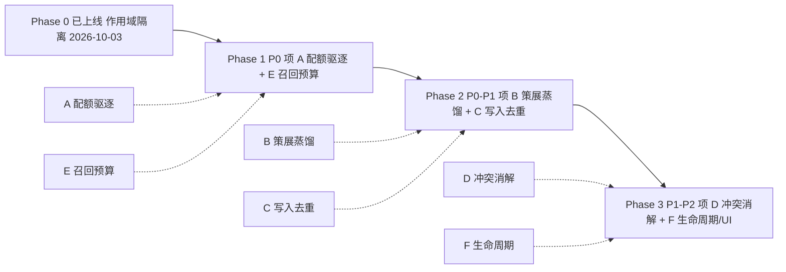

# pi-lnk 产品侧记忆 · 采纳 WorkBuddy 最佳实践 · 开发规格与范围

> 状态：**草案**（2026-10-08，待评审）；本文是产品侧 `AgentMemory` 的采纳开发规格 + 实施范围，不含代码改动。
> 日期：2026-10-08（v1.0）
> 关联文档：
> - [2026-10-08-workbuddy-three-layer-memory-design.md](./2026-10-08-workbuddy-three-layer-memory-design.md)（WorkBuddy 三层记忆设计，最佳实践来源）
> - [memory-diagnostic.md](../agent/memory-diagnostic.md)（agent 侧缺口诊断，已闭环 PR #286）
> - [2026-10-03-agent-memory-scope-isolation-design.md](./2026-10-03-agent-memory-scope-isolation-design.md)（产品侧作用域隔离设计，**已上线**）
> 方法论来源：WorkBuddy 记忆系统设计（`memory_system` 指令 7 原则）、pi-lnk `AgentMemory` 实现与 `memory-scope-classify.ts` 实测

| 字段     | 值                                                                                       |
| ------ | --------------------------------------------------------------------------------------- |
| 文档版本  | v1.0                                                                                    |
| 创建日期  | 2026-10-08                                                                               |
| 文档定位  | 把 WorkBuddy 记忆体系 7 原则映射到 **pi-lnk 产品侧 `AgentMemory`**，给出采纳开发规格与范围        |
| 关联文档  | workbuddy-three-layer-memory-design.md（来源）、2026-10-03 作用域隔离（已上线）、memory-diagnostic.md（agent 侧闭环） |
| 验收标准  | G1–G6（见 §5 / §7）                                                                        |

***

## 0 配图索引

| 图号  | 说明                           | 位置    |
| --- | ---------------------------- | ----- |
| 图 1 | 产品侧记忆采纳路线：Phase 0→3 与缺口映射 | §6    |

***

## 1 背景与目标

pi-lnk 作为产品，对外提供 `agent_memories` 记忆功能（`AgentMemory` 模型，scope=`canvas`/`user`）。**作用域隔离**（2026-10-03 设计）已上线并止血了"跨画布记忆泄漏"事故：默认写画布、显式才跨会话、召回数据级自曝 `scope/sessionId/crossCanvas` 并附硬性提示。

但对照 WorkBuddy 记忆体系的 **7 条设计原则**，产品侧记忆在"配额/蒸馏/去重/冲突消解/生命周期"上还停留在"原始日志"阶段——这正是 2026-10-03 设计 §10 展望里点名的"跨会话层应是策展摘要，而非原始日志"。

本文目标：

1. **提炼** WorkBuddy 7 原则中**适用于产品侧**的部分；
2. **映射** pi-lnk `AgentMemory` 现状到每条原则（已对齐 / 缺口）；
3. **给出采纳开发规格**（A–F 六项，含验收）与**实施范围**（分阶段、in/out）。

> 范围边界：本文只谈 **产品侧 `AgentMemory`**（服务终端用户的画布/用户记忆）。**agent 自身记忆**（`.workbuddy/memory/`，L3 实例）已由 PR #286 闭环，仅在本文明末复述，不重复展开。

***

## 2 WorkBuddy 7 原则摘要（产品侧视角）

| #   | 原则            | 意图                                                         | 对产品侧 `AgentMemory` 的启示                              |
| --- | ------------- | ---------------------------------------------------------- | ---------------------------------------------------- |
| P1  | 分作用域          | 账号级 / 项目级分离，避免事实污染与重复                               | 已有 canvas/user 两级；需补"同主题跨 scope 冲突消解"                    |
| P2  | 配额硬限          | 超出即截断注入，防旧记忆淹没上下文                                     | 产品侧 `content` 无上限、召回最多 200 条无 token 预算——**最大缺口**        |
| P3  | 索引/证据分离       | 索引轻量，证据下沉，避免被撑爆                                      | 等价物 = "策展摘要 vs 原始记忆"，§10 已点名但未做                        |
| P4  | 蒸馏纪律          | 定期把流水压成索引、删除旧物，记忆不无限膨胀                             | 等价物 = "原始记忆定期合并/驱逐"，产品侧完全没有                          |
| P5  | 追加写优先         | 累积文件先读后写，避免重复追加                                       | 产品侧 `save_memory` 纯追加、无同主题更新 ⇒ 已出现"小熊 ×13" 重复        |
| P6  | 落盘复核          | 写入成功 ≠ 落盘，需复核                                           | 产品侧走 DB 事务，天然比文件稳健；保留 save 返回确认即可，缺口小              |
| P7  | 不假设单一真相源      | 同一事实多处存在时按"最新 + 最权威"选、带时间戳                          | 召回未做冲突消解/时效加权；旧 user 记忆可能与新 canvas 记忆矛盾而全返回         |

***

## 3 pi-lnk 产品记忆现状 vs 7 原则

| 原则 | pi-lnk 现状（2026-10-08 实测）                                                            | 对齐度 | 缺口 |
| --- | ----------------------------------------------------------------------------- | --- | --- |
| P1  | `AgentMemory` 有 `scope`/`sessionId`；召回返回 `scope/sessionId/crossCanvas`；数据级 fail-closed | ✅ 已超 WB | — |
| P2  | `content: String` 无上限；召回 `MEMORY_SCAN_MAX=200` 是**条数**上限，无 **token 预算**；无 per-user/scope 配额、无驱逐 | 🔴 缺口 | 缺口 A / E |
| P3  | 仅有原始 `content`，无策展摘要层                                                        | 🔴 缺口 | 缺口 B |
| P4  | 记忆永不合并/压缩/删除；存量随使用线性膨胀                                                | 🔴 缺口 | 缺口 B / F |
| P5  | `save_memory` 纯追加，无去重/更新；`memory-scope-classify.ts` 已暴露"小熊 ×13" 类重复              | 🟡 部分 | 缺口 C |
| P6  | 写入经 Nest + Prisma 事务落 SQLite，有返回确认                                            | ✅ 已具备 | — |
| P7  | 召回按 `sessionId 命中优先 → scope 序 → createdAt desc`，**无同主题冲突消解、无"标过期"**            | 🟡 部分 | 缺口 D |

**结论**：产品侧在"作用域隔离 + 数据安全"上已做得比 WorkBuddy 自身记忆更扎实（数据级强制、fail-closed、审计 `source` 列、dry-run/apply 幂等回填）。但"记忆质量治理"（配额、蒸馏、去重、冲突、生命周期）几乎空白——这正是 WorkBuddy 用配额/蒸馏/索引分离解决的同一类问题。

***

## 4 需借鉴项（开发项 A–F）

| 项  | 借鉴自      | 现状差距                                                                | 方案要点                                                            | 优先级 |
| --- | -------- | ------------------------------------------------------------------- | --------------------------------------------------------------- | --- |
| A   | P2 配额硬限  | `content` 无上限、无 per-user/scope 配额、无驱逐策略                                  | 引入 per-user（及 per-scope）配额：记忆**条数 + token 预算**双上限；超配触发蒸馏/驱逐        | P0  |
| B   | P3+P4 蒸馏 | 原始记忆永不合并，噪声随使用累积                                                   | 策展蒸馏服务：定期把同 scope 的原始记忆合并为 ≤N 条 **curated 摘要**；原始保留可回溯；召回优先返回 curated | P0  |
| C   | P5 追加优先 | `save_memory` 纯追加，重复主题各自成行（小熊 ×13）                                     | 写入去重/合并：同去重键命中已有记忆 ⇒ **更新**而非新增；消除近重复行                      | P1  |
| D   | P7 单一真相 | 召回无同主题跨 scope/时间冲突消解，旧记忆可能覆盖新事实                                   | 召回冲突消解：同主题多版本按"最新 + 最权威 scope"选，标 `superseded`；带 `updatedAt` 时效 | P1  |
| E   | P2 配额硬限  | 召回最多 200 条无 token 预算，长记忆直接淹没模型上下文                                   | 召回 **token 预算硬截**：按相关度截断，总 token ≤ 预算；200 条也不溢出                 | P1  |
| F   | P4 蒸馏纪律  | 无删除/过期，记忆只增不减                                                      | `delete_memory` API + 可选 TTL 过期 + 用户可见管理 UI（承接 §10 展望）          | P2  |

> 双向学习（pi-lnk 已优于 WB，WB 应反过来借鉴）：① 数据级作用域强制 + fail-closed，而非仅提示词规则；② 审计 `source` 列；③ dry-run/apply 幂等回填；④ `(userId, scope, sessionId)` 复合索引保召回性能。这些应在规格里**固化，不被后续改动退化**。

***

## 5 开发规格（逐项）

### A · 记忆配额与驱逐（P0，来自 P2）

- **目标**：给 `AgentMemory` 加 per-user / per-scope 的**条数 + token 双上限**，超限触发治理（蒸馏或驱逐），防止单用户记忆无限膨胀、召回淹没上下文。
- **非目标**：不做基于内容的智能取舍（那是 B 的职责）；不改动作用域语义。
- **方案要点**：
  - 配置化上限（`MEMORY_QUOTA_PER_USER`、`MEMORY_TOKEN_BUDGET_PER_USER`，默认如 500 条 / 40k token）；
  - 写入前校验：超条数 ⇒ 触发"最旧非 user 凭据类"驱逐或转入 B 的策展队列；
  - 统计埋点：每用户记忆数 / token 分布，便于调参。
- **验收 G1**：单测——超过 `MEMORY_QUOTA_PER_USER` 时 `save_memory` 触发驱逐或策展入队；配置项存在且可覆盖。

### B · 策展蒸馏服务（P0，来自 P3+P4）

- **目标**：定期把同 scope 的原始记忆合并为少量 **curated 摘要**，降低噪声，让"跨会话层是精选而非原始日志"（§10 展望的落地）。
- **非目标**：本规格用**规则/合并**做策展，不引入 LLM 自动摘要（避免成本与不可控）；LLM 摘要列为 Phase B 备选，不在本规格强制。
- **方案要点**：
  - 新增 `curated` 标记或独立表 `AgentMemoryCurated`（scope + 摘要 + 来源记忆 id 列表）；
  - 定时任务（或召回时惰性）按 scope 聚类原始记忆，生成 ≤N 条摘要；原始行保留、标 `archived` 供回溯；
  - 召回路径优先返回 curated，必要时下钻原始。
- **验收 G2**：端到端——注入 30 条同主题原始记忆后，策展产出 ≤N 条摘要；召回优先返回摘要；原始可回溯。

### C · 写入去重/合并（P1，来自 P5）

- **目标**：`save_memory` 遇同主题（去重键命中已有记忆）时**更新**而非新增，消除"小熊 ×13"类重复。
- **非目标**：不做语义级去重（成本高）；用**去重键**（如 scope+sessionId+归一化主题向量/关键词指纹）近似。
- **方案要点**：
  - `save_memory` 先查同 scope 下相似记忆；命中 ⇒ 更新 `content` + 刷新 `updatedAt`（`source='agent_auto'` 保持）；
  - 凭据类（`CREDENTIAL_RULES` 命中）永不自动合并，防误并。
- **验收 G3**：单测——连续写入 13 条同画布"小熊"记忆，落库 ≤2 行（1 原始 + 合并更新），不出现 13 行重复。

### D · 召回冲突消解（P1，来自 P7）

- **目标**：同一主题在 canvas / user 或不同时间存在冲突版本时，召回返回**最新 + 最权威**者，并标 `superseded`，不把过时记忆当事实。
- **非目标**：不做全局事实库；只在本条召回内做同主题消解。
- **方案要点**：
  - 召回结果按"主题聚类"，每簇取 `updatedAt` 最新 + `source` 权威序（user_explicit > agent_auto 仅当同主题更新）；其余标 `superseded:true`；
  - 返回体增 `updatedAt`、`superseded` 字段（延续 A4 的"数据级自曝"传统）。
- **验收 G4**：单测——同主题旧 user 记忆 + 新 canvas 记忆冲突时，召回默认返回新版本并标旧版 `superseded`。

### E · 召回 token 预算硬截（P1，来自 P2）

- **目标**：`recall_memory` 返回体总 token 不超过预算，即使命中 200 条也不淹没模型上下文。
- **非目标**：不降低相关度；只截断低相关尾部。
- **方案要点**：
  - 召回先按相关度（sessionId 命中 + 文本相似 + 时效）排序，累计 token 到 `MEMORY_RECALL_TOKEN_BUDGET` 即截断；
  - 截断时返回 `truncated:true` + 剩余计数 hint（延续"对用户可见"透明度判据）。
- **验收 G5**：单测——注入 200 条长记忆，召回返回 token 数 ≤ 预算且 `truncated:true`；高相关项仍在前列。

### F · 生命周期 / 删除 / TTL（P2，来自 P4，承接 §10）

- **目标**：给记忆可终结的生命周期——`delete_memory` API + 可选 TTL 过期 + 用户可见管理 UI。
- **非目标**：不做自动遗忘模型；TTL 默认关闭，按需开启。
- **方案要点**：
  - `delete_memory(id)` 工具（pi-runtime + Nest 两侧），带作用域校验（只能删自己 scope）；
  - 可选 `expiresAt`（默认 null = 不过期）；定时清扫过期；
  - 用户可见的记忆管理面板（列出/删除/提升为 user 级），承接 §10 v1.1 UI。
- **验收 G6**：单测 + 手测——`delete_memory` 删自己 scope 成功、跨 scope 拒绝；TTL 过期后被清扫。

***

## 6 实施范围与分阶段

各阶段与缺口 A–F 的映射关系见图 1。

*图 1 · 产品侧记忆采纳路线：Phase 0（已上线）→ Phase 1（配额+召回预算，最高杠杆）→ Phase 2（策展+去重）→ Phase 3（冲突消解+生命周期）*

### 6.1 分阶段说明

- **Phase 0（已上线）**：作用域隔离（canvas/user + crossCanvas 数据级警告）。本规格基线。
- **Phase 1（最高杠杆，建议先落地）**：**A 配额驱逐 + E 召回预算**。两者都是"护栏类"改动，纯增量、不碰作用域语义、风险低，却直接解决"记忆淹没上下文"这一 WB 原则 2 的核心风险。
- **Phase 2**：**B 策展蒸馏 + C 写入去重**。解决噪声累积与重复行，是记忆"质量"层。
- **Phase 3**：**D 冲突消解 + F 生命周期/管理 UI**。收口时效与可终结性，承接 §10 展望。

### 6.2 In Scope（本规格覆盖）

A 配额/驱逐、B 策展蒸馏、C 写入去重、D 召回冲突消解、E 召回 token 预算、F 生命周期/删除/TTL/UI。

### 6.3 Out of Scope（明确不做）

- 图片通道修复（独立议题，2026-10-03 §1 已划清）；
- thread 级作用域（`AgentThread.fork` 会静默复制记忆，隔离语义不可预测，2026-10-03 §3.2 否决）；
- LLM 自动摘要抽取（B 用规则/合并，成本与可控性考虑；列为 Phase B 备选，非强制）；
- 跨账号 / 多租户记忆迁移（属 L2 账号切换议题，与本产品侧正交）；
- 改动已上线的 fail-closed / 审计 `source` / 复合索引（固化，不退化）。

***

## 7 验收总表

| 编号  | 验收项                       | 判据                              | 对应缺口 | 阶段  |
| --- | ------------------------- | ------------------------------- | ---- | --- |
| G1  | 配额/驱逐生效                  | 超 `MEMORY_QUOTA_PER_USER` 触发治理     | A    | P1  |
| G2  | 策展摘要产出 + 优先召回           | 30 条原始 ⇒ ≤N 条摘要，召回优先，原始可回溯      | B    | P2  |
| G3  | 写入去重                      | 13 条同主题 ⇒ 落库 ≤2 行                 | C    | P2  |
| G4  | 召回冲突消解 + 标过期             | 同主题新旧冲突 ⇒ 返回最新 + `superseded`      | D    | P3  |
| G5  | 召回 token 预算硬截            | 200 条长记忆 ⇒ token ≤ 预算 + `truncated` | E    | P1  |
| G6  | 删除/TTL/UI                 | `delete_memory` 作用域内可删、TTL 清扫      | F    | P3  |

***

## 8 风险与开放问题

1. **配额阈值怎么定**：默认 500 条 / 40k token 是拍定值，需生产统计（`AgentMemory` 当前 30 条/6 用户的基线远未触顶）调参；建议 Phase 1 先埋点、Phase 2 再收紧。
2. **B 策展的"聚类键"**：规则聚类可能误并不同项目；凭据类强制不并（沿用 `CREDENTIAL_RULES` 思路），其余保守。
3. **C 去重键的精度**：关键词指纹可能漏并/误并；建议先在 canvas scope 内试跑，不跨 scope 合并。
4. **D 的"权威序"边界**：`user_explicit` 一定压 `agent_auto` 吗？若用户在新画布改了偏好，旧 user 记忆应是被更新而非永远压新——这要求 C/D 联动（更新而非新增）。
5. **固化已有优势**：fail-closed、审计 `source`、复合索引不能在 A–F 实现中退化，需在各自验收里加回归断言。

***

## 附录 · agent 侧记忆（已闭环，仅复述）

`pi-lnk/.workbuddy/memory/` 作为 WorkBuddy **L3 工作区记忆**的实例，已按最佳实践闭环（PR #286，CI 全绿）：

- 字符护栏脚本 `scripts/check-memory-size.ts`（L3 3000 / L2 4000 配额校验）+ `package.json` 入口；
- 蒸馏纪律、索引/证据分离、落盘复核写入 `docs/agent/memory.md`；
- 缺口诊断 `docs/agent/memory-diagnostic.md`（A–F 六项），其中配额超限（A）、护栏（D）、落盘复核（E）已闭合，9 月日志蒸馏（C）、账号切换 L2 迁移（F）列为后续。

本文不重复上述内容，产品侧与 agent 侧是**两条正交链路**（详见 2026-10-08-workbuddy-three-layer-memory-design.md §2.4）。
