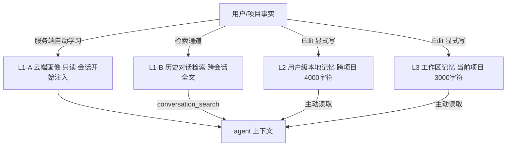
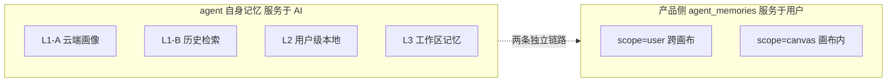
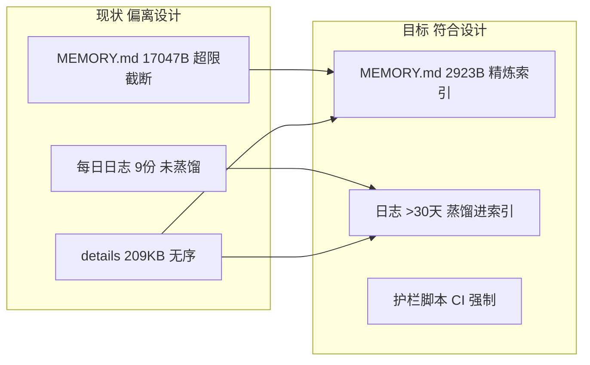

# WorkBuddy 三层记忆体系设计（最佳实践案例）

> 状态：**草案**（2026-10-08，待评审）；本文档同时是 pi-lnk 采纳该体系的规格。
> 日期：2026-10-08（v1.0）
> 关联文档：[memory-diagnostic.md](../agent/memory-diagnostic.md)（缺口诊断）、[memory.md](../agent/memory.md)（本项目约定）、[2026-10-03-agent-memory-scope-isolation-design.md](./2026-10-03-agent-memory-scope-isolation-design.md)（产品侧记忆，见 §3 边界）
> 方法论来源：WorkBuddy 记忆系统设计（`memory_system` 指令）、pi-lnk 2026-10-08 实测（`MEMORY.md` 超限截断 + `MEMORY-details.md` 快照机制）

| 字段    | 值                                                                                 |
| ----- | --------------------------------------------------------------------------------- |
| 文档版本  | v1.0                                                                              |
| 创建日期  | 2026-10-08                                                                         |
| 文档定位  | 把 WorkBuddy 三层记忆体系写成**最佳实践案例**，并作为 pi-lnk 采纳该体系的实施规格            |
| 关联文档  | memory-diagnostic.md（缺口）、memory.md（约定）、agent-memory-scope-isolation-design.md（产品侧） |
| 验收标准  | G1–G6（见 §6）                                                                        |

***

## 0 配图索引

| 图号  | 说明                          | 位置      |
| --- | --------------------------- | ------- |
| 图 1 | 三层记忆体系架构与召回路径               | §2.2    |
| 图 2 | agent 自身记忆 与 产品侧记忆 的边界       | §3      |
| 图 3 | pi-lnk 记忆流水线：现状 → 目标          | §5      |

***

## 1 背景与目标

WorkBuddy 给 agent 自身设计了一套**分层、分作用域、带配额与蒸馏纪律**的记忆体系，用来在「跨会话保留长期事实」与「避免上下文被旧记忆淹没」之间取得平衡。它不是把全部历史塞进 prompt，而是把信息按**作用域**与**召回时机**分成三层（外加一个历史检索通道），每层有不同的存储位置、写入策略和字符配额。

本项目的 agent 侧记忆（`pi-lnk/.workbuddy/memory/`）正是这套体系的一个**实例**，但 2026-10-08 实测发现：实例已偏离设计——`MEMORY.md` 膨胀到 17047 字节（超 3000 字符硬限 5.7 倍），本会话注入被截断；每日日志 9 月共 9 份从未蒸馏；`MEMORY-details.md` 209KB 无蒸馏纪律。

本文档目标：

1. **提炼** WorkBuddy 三层记忆的设计原则（最佳实践案例）；
2. **诊断** pi-lnk 实例相对设计的缺口（见 `memory-diagnostic.md`）；
3. **给出采纳方案与验收标准**，使实例重新符合设计意图。

> 注意：本文档谈的是 **agent 自身记忆**（agent 用来记住用户/项目的事实）。它与本产品的 **`agent_memories` 功能**（给用户画布提供的作用域隔离记忆，scope=user/canvas）是**两回事**，见 §3。

***

## 2 WorkBuddy 三层记忆体系设计

### 2.1 四层模型（三层 + 一个历史检索通道）

严格说系统由 **3 个持久层 + 1 个检索通道** 组成。习惯称「三层」是指三个**可读写的持久记忆层**（L1-A 是只读画像，不计入可写层）：

| 层         | 名称              | 作用域        | 写入方式             | 配额              | 召回时机                  |
| -------- | --------------- | ---------- | ---------------- | --------------- | --------------------- |
| L1-A     | 云端画像            | 跨项目（服务端托管） | 服务端自动学习，**禁止本地写** | 服务端控制            | 会话开始自动注入              |
| L1-B     | 历史对话检索          | 跨会话全文      | 不可写（检索通道）         | 服务端排序返回          | 用户显式问「过去某次讨论」时调用       |
| **L2**  | 用户级本地记忆         | 跨项目（绑账号）   | `Edit` 显式写        | **≤4000 字符/会话**  | 所有项目共享，主动读取           |
| **L3**  | 工作区记忆（项目级）      | 当前项目       | `Edit`/`Write` 显式写 | **≤3000 字符/会话**  | 当前项目内，主动读取            |

*图 1 · 三层记忆体系架构与召回路径（L1-A 只读注入，L1-B 检索通道，L2/L3 显式读写）*

### 2.2 各层细节

- **L1-A 云端画像**：服务端生成的用户长期画像，缓存在 `~/.workbuddy/user-<UUID>-personal/memory/`，**本地只可读、不可写**（任何本地写会被服务端覆盖）。它解决「跨项目的基础偏好」但**不可靠承载项目专属事实**。
- **L1-B 历史对话检索**：`conversation_search` 工具，服务端排序检索历史会话；**零访问当前会话**，查询必须自包含。它是「回忆某次具体讨论」的通道，不是日常事实存储。
- **L2 用户级本地记忆**：`~/.workbuddy/user-<UUID>-personal/MEMORY.md`，**绑账号 UUID**。作用域=所有项目；配额 4000 字符/会话。写入策略：跨项目的用户偏好/个人习惯显式写入。账号切换 = 换 UUID 目录 = 旧滞留新空（本项目 2026-10-08 账号切换事故根因）。
- **L3 工作区记忆**：`项目/.workbuddy/memory/`，**绑项目、不绑账号**。三件套：
  - `MEMORY.md`：精炼长期索引，≤3000 字符，只放高频判据；
  - `YYYY-MM-DD.md`：每日日志，**追加写、不可覆盖**，记录当天实质工作；
  - `MEMORY-details.md`：`MEMORY.md` 每条结论的**全文快照/证据/file:line**，按标题搜索，避免索引被证据撑爆。

三层架构与召回路径见图 1。

### 2.3 设计原则（最佳实践要点）

1. **分作用域（Tiered Scope）**：账号级（L2）与项目级（L3）分离；项目事实不污染其它项目，跨项目偏好不重复写在每个项目里。
2. **配额硬限（Char Budget）**：L2 4000 / L3 3000 字符，**超出即截断注入**——这是设计的主动约束，不是 bug。索引必须精炼。
3. **索引/证据分离**：`MEMORY.md` 是「目录 + 结论」，证据下沉 `MEMORY-details.md`。两者**不是同一份文件**，索引靠标题锚定证据。
4. **蒸馏纪律（Distillation）**：每日日志 >30 天按主题蒸馏进 `MEMORY.md`，再删除旧文件；`MEMORY.md` 超配额时压缩（只压措辞、数字/file:line 下沉 details），**判据不可删**。
5. **追加写优先**：每日日志 append-only；编辑 `MEMORY.md` 这类累积文件前**先读一遍**，避免重复追加。
6. **落盘复核**：Write/Edit 工具报「成功」≠ 磁盘落盘（本环境 broker 可能吞写），必须用 `wc -c` + grep 关键句复核。
7. **不假设单一真相源**：同一事实可能在 L1-A / L2 / L3 / 每日日志同时存在；召回时按「哪一层最新、哪一层最权威」选择，带时间戳。

### 2.4 与产品侧记忆的边界

本项目**自己也是一个产品**，它给终端用户提供 `agent_memories` 表（scope=user/canvas，见 `2026-10-03-agent-memory-scope-isolation-design.md`）。这是**产品的功能记忆**，与本文档的 **agent 自身记忆** 完全正交：前者存「用户在画布里让 AI 记住的东西」，后者存「AI 用来服务用户的项目知识」。二者存储、作用域、生命周期都不同，不可混谈（两条独立链路的边界见图 2）。

*图 2 · agent 自身记忆（L1–L3，服务于 AI）与 产品侧 agent_memories（服务于终端用户）的边界*

***

## 3 pi-lnk 当前记忆实践（现状）

pi-lnk 的 agent 侧记忆（`pi-lnk/.workbuddy/memory/`）在结构上**已对齐** L3 三件套（MEMORY.md + 每日日志 + MEMORY-details.md），但执行上偏离设计：

- `MEMORY.md` 累计到 17047 字节（≈5.7 倍硬限），本会话注入被截断，高频判据反而读不全；
- `MEMORY-details.md` 209KB 已承载快照，但**缺乏蒸馏纪律**——索引没有真正精炼，只是把近全量内容又抄了一份；
- 9 月共 9 份每日日志（最大 369KB）从未蒸馏进 `MEMORY.md`；
- `MEMORY.md` 头部已有「全文快照按标题搜 details」的设计意图，但正文仍是近全量副本，意图未落实。

完整缺口见 `memory-diagnostic.md`（记忆流水线现状→目标见图 3）。下面给出采纳方案。

*图 3 · pi-lnk 记忆流水线：现状（MEMORY.md 膨胀、日志不蒸馏） → 目标（索引精炼、护栏强制、定期蒸馏）*

***

## 4 采纳方案

### 4.1 字符护栏脚本（强制配额）

新增 `scripts/check-memory-size.ts`：扫描 L3 `MEMORY.md`（3000）与 L2 `MEMORY.md`（4000），超限即非零退出并给出清晰报告；接入 `package.json` 脚本 `memory:check`，推荐并入 CI 的文档校验步骤。

### 4.2 蒸馏纪律（补上缺失的一环）

- 每月/每 30 天触发一次蒸馏：把 >30 天的每日日志按主题压进 `MEMORY.md`，删除旧日志；
- `MEMORY.md` 超过配额时执行「压缩」而非「删判据」：只压措辞，把数字/file:line 下沉 `MEMORY-details.md`；
- 编辑 `MEMORY.md` 前先读（防重复追加，本项目 2026-10-03 曾因此产生 7 行重复）。

### 4.3 索引/证据分离（已具备，需落实意图）

保留 `MEMORY-details.md` 作为证据库；`MEMORY.md` 只做索引 + 结论，靠标题锚定 details。本项目已在 `MEMORY.md` 头部声明该机制，本次把正文真正压到精炼索引（实测 17047→2923 字节）。

### 4.4 落盘复核（防 broker 吞写）

所有对 `.workbuddy/memory/` 的写入，事后用 `wc -c` + grep 关键句复核（本项目多轮因此吃过亏）。

***

## 5 验收标准（G1–G6）

| 编号  | 验收项                               | 判据                                              | 当前状态  |
| --- | --------------------------------- | ----------------------------------------------- | ----- |
| G1  | L3 `MEMORY.md` ≤3000 字符             | `scripts/check-memory-size.ts` 退出 0              | ✅ 已修  |
| G2  | L2 `MEMORY.md` ≤4000 字符             | 同上（扫描用户级文件）                                 | ✅ 空文件 |
| G3  | 护栏脚本可运行 + package.json 入口      | `pnpm memory:check` 可执行                           | 本次交付  |
| G4  | 索引/证据分离                          | `MEMORY.md` 有 details 指针，证据在 details 不进索引        | ✅ 已具备 |
| G5  | 蒸馏纪律文档化                          | `docs/agent/memory.md` 写明 30 天蒸馏 + 压缩不删判据        | 本次交付  |
| G6  | 9 月每日日志蒸馏                        | >30 天日志按主题进 `MEMORY.md`，旧文件可删                | ⚠️ 待排期 |

***

## 6 实施计划（对应 plan A）

| 步骤  | 交付物                                  | 状态     |
| --- | ------------------------------------- | ------ |
| 1   | 压缩 `MEMORY.md` ≤3000（修复超限截断）            | ✅ 完成   |
| 2   | 本 SPEC（三层记忆设计 + 采纳方案）                 | 本次交付   |
| 3   | 诊断报告 `memory-diagnostic.md`              | 本次交付   |
| 4   | 约定文档 `docs/agent/memory.md`             | 本次交付   |
| 5   | 护栏脚本 `scripts/check-memory-size.ts` + pkg | 本次交付   |
| 6   | 开分支 → 提交 → 开 PR → 盯 CI                  | 本次交付   |
| 7   | （后续）9 月日志蒸馏、护栏并入 CI                 | 待排期    |

> 本规格为「指导实施计划」，落地步骤即上表；无需另起计划文档。
