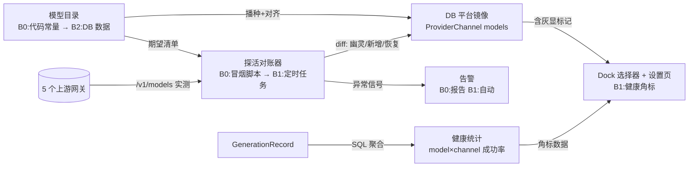

# 平台模型体系加固 —— 总体迭代优化设计规格 v1

状态：待评审（2026-10-09 生产事故复盘产出）
作者：WorkBuddy × sev7n4
输入：
- 2026-10-09 生产事故：用户选平台 `deepseek-v4` 文本模型 503 `model_not_found`（取证记录见 §2.4）
- 生产探针实测：agnes hub `/v1/models` 仅 12 个全 agnes 系模型；apimart `/v1/models` 402 余额不足
- 生产库统计：`GenerationRecord` type=text 按 model×status 分组（§2.4）
- 同日已上线：文本节点报错诊断入口（PR #311）

相关文档：
- 分项规格（§5 索引，共 9 篇）：`docs/superpowers/specs/2026-10-09-mph-<id>-<slug>-design.md`
- 前置机制：`packages/shared/src/studioModelCatalog.ts`（目录）、`apps/server/src/provider/model-catalog-sync.ts`（#306 自动对齐）、`packages/shared/src/generationDiagnostics.ts`（错误分类）、`packages/shared/src/platformCredentials.ts`（上游路由）

> ⭐ **本版的论点：展示层必须反映上游现实（探活），不能只信设计货架。**
> 三层清单（.env 密钥 → 代码目录 28 → DB 镜像 28）没有一层与网关真实在售清单（12 个）对账。
> 目录里的「幽灵模型」对用户**可点必挂**，从上架到发现只能靠用户报障——
> gemini-3.1-flash 失败 6 次/成功 0 存续数周无人知晓，就是这条断链的代价。

---

## 0. 分项规格索引

| 编号 | 批次 | 分项规格 | 一句话 |
|---|---|---|---|
| S0-1 | B0 | `2026-10-09-mph-s01-ghost-model-retirement-design.md` | 下架 3 个幽灵文本模型，#306 sync 自动清理镜像与用户可选列表 |
| S0-2 | B0 | `2026-10-09-mph-s02-error-semantic-mapping-design.md` | distributor 错误码→产品语义（errorCode=unknown 收敛） |
| S0-3 | B0 | `2026-10-09-mph-s03-smoke-probe-design.md` | 部署后冒烟探针：一次性对账报告（B1-1 的前身，不建长期设施） |
| S1-1 | B1 | `2026-10-09-mph-s11-liveness-reconciliation-design.md` | 定时探活对账器：/models diff → 镜像灰显 + 告警 |
| S1-2 | B1 | `2026-10-09-mph-s12-model-health-stats-design.md` | model×channel 成功率统计端点 + 失败率阈值告警 |
| S1-3 | B1 | `2026-10-09-mph-s13-dock-health-badge-design.md` | Dock 模型选择器健康角标 + 不可用灰显 |
| S2-1 | B2 | `2026-10-09-mph-s21-catalog-as-data-design.md` | 目录从代码迁 DB，运营后台热更 |
| S2-2 | B2 | `2026-10-09-mph-s22-routing-table-design.md` | model-family→上游路由从 resolver 链改数据驱动路由表 |
| S2-3 | B2 | `2026-10-09-mph-s23-failure-self-heal-design.md` | 失败诊断抽屉「一键换推荐模型重试」+ 退款透明化 |

---

## 1. 目标（5 条，均可验收）

| # | 目标 | 成功判据（可观测 / 可断言） |
|---|---|---|
| **G1** | **幽灵模型零可选** —— 用户在 Dock/设置页看不到「可点必挂」的平台模型 | 生产 `ProviderChannel('platform').models` 中不再存在「上游探活不通过却可选」的模型；SQL 判据：目录 ∩ 网关清单 = 可选集 |
| **G2** | **失败必有产品语义** —— 任何生成失败的 errorCode ≠ `unknown` 的占比 ≥ 95% | 生产新增失败记录（按时间戳过滤）中 `errorCode='unknown'` 占比 < 5%；distributor `model_not_found` 必映射 `model_unavailable` |
| **G3** | **断供/欠费主动告警** —— 上游异常在 10 分钟内被系统发现，而非用户报障 | 探活对账器每 6h 运行；欠费（402）与渠道消失（model_not_found）产生运维可见信号（B0 阶段=探针报告，B1 阶段=自动告警） |
| **G4** | **模型健康可查** —— 任何人 1 分钟内能回答「哪个模型最近稳/不稳」 | 健康端点按 model×channel 返回近 24h 成功率/退款数；Dock 展示健康角标 |
| **G5** | **上架模型不发版** —— 新增/下架平台模型不需要改代码走流水线 | 运营后台改目录后 ≤5 分钟生效（含镜像对齐），全程无 deploy |

⚠️ G1–G5 是**递进依赖**的：G1 用「目录删条目」即可止血（B0），但只有 G5（目录数据化）+ 探活闭环（B1）才能让 G1 长期成立——否则每次上游变动都要人工改代码重演一次本次事故。

---

## 2. 现状架构（as-is）

### 2.1 三层清单

| 层 | 载体 | 数量 | 谁写 | 谁读 | 与上游现实的关系 |
|---|---|---|---|---|---|
| 密钥层 | 生产 `.env`：`OPENAI_API_KEY`→`apihub.agnes-ai.cn/v1`、`APIMART_API_KEY`、`FAL_KEY`、`MINIMAX_API_KEY`、`STEPFUN_API_KEY` | **无模型清单** | 运维手工 | 服务端运行时 | 只提供鉴权与门牌，不约束模型名 |
| 目录层 | `packages/shared/src/studioModelCatalog.ts` 的 `STUDIO_MODEL_CATALOG`（代码常量） | 28 = 文本4 + 图7 + 视频11 + 音频6 | 改代码+发版 | DB 镜像播种、#306 sync 对齐 | **纯设计声明**，07-19 设计文档标注 deepseek-v4「待实测」，从未与网关对账 |
| 镜像层 | DB `ProviderChannel(id='platform').models`（JSON `[{name, capability}]`） | 28（实测与目录逐条一致） | `ensurePlatformChannel` 播种 + #306 `model-catalog-sync` bootstrap 自动对齐 | 设置页（「平台·只读」）、Dock 选择器 | 目录的忠实快照——**目录错它就跟着错** |

BYOK 渠道（用户自建）的 models 是用户自己的清单，与平台镜像无关，不在本规格范围内（生产数据证明其可用：`deepseek-v4-pro` 成功 106 次）。

### 2.2 运行时路由

`packages/shared/src/platformCredentials.ts` 按 model-family 的 if/else resolver 链把 28 个模型路由到 5 个上游：

| 上游 | 服务的目录模型 | 真实状态（2026-10-09 探针） |
|---|---|---|
| agnes hub（`OPENAI_BASE_URL`） | 文本全部 4 个 + agnes 系图/视频 | `/v1/models` = **12 个全 agnes 系**；目录的 agnes 系 7 个真实存在，3 个非 agnes 文本模型**无任何渠道** |
| apimart（`APIMART_BASE_URL`） | 非 agnes 系图片/视频（seedance、wan、seedream 等） | `/v1/models` **402 余额不足**（按 2026-09-26 取证惯例，402=欠费非 key 错） |
| StepFun（`STEPFUN_BASE_URL`） | 音频 6 个（step-* / stepaudio-*） | 已上线验证过（42 用户回填事件后正常） |
| MiniMax（`MINIMAX_BASE_URL`） | minimax-h3 等 | 未单独探活 |
| fal（`FAL_BASE_URL`） | h3-max 等 | 未单独探活 |

### 2.3 错误与可观测路径

- 失败分类：`packages/shared/src/generationDiagnostics.ts` 的 `mapMessageToErrorCode()`——规则表只认「积分不足/timeout/已取消/停用」等，**distributor 的 `No available channel for model ...` 不命中任何规则 → `errorCode='unknown'`**；`translateUpstreamFailure()` 已有 402/403/401/429 的中文翻译，但没有 `model_not_found` 文案。
- 计费：charged/refunded + `refundReason='platform_failed'` 落在 `GenerationRecord.metadata`，本次事故两笔均正确退款（charged 5 / refunded 5）。
- 健康统计：**无 metrics 设施**（apps/server 无 Metrics/Logger 体系，唯一 Metrics 在 pi-runtime 跨进程不可达）——只能 SQL 聚合 `GenerationRecord`。
- 前端诊断：节点左上角状态图标 → 右侧抽屉「诊断」tab（PR #311），复制格式由 `formatDiagnosticCopy()` 生成，含 code/httpStatus/providerSnippet。

### 2.4 事故取证（2026-10-09，写死存档）

| 证据 | 内容 |
|---|---|
| 失败记录 ×2 | `cmv0iibba0019qo01j71tdllu`、`cmv0h0t78000xqo01ml6q6mop`：`{modelKey: deepseek-v4, gatewayModelId: deepseek-v4, channelId: platform, errorCode: unknown}` |
| 上游原文 | `Text API 503: {"error":{"code":"model_not_found","message":"No available channel for model deepseek-v4 under group default (distributor) (request id: 20261009043413943840776XprVkXAP)","type":"AgnesAI_error"}}` |
| 生产 text 记录分组 | `deepseek-v4` 失败2/成0；`gemini-3.1-flash` 失败6/成0；`gpt-5.5` 零记录；`agnes-2.0-flash` 成36 失败2 |
| 网关清单 | 12 个：agnes-2.0/2.5/3.0-flash、agnes-2.5-pro(+alpha/beta)、agnes-image-2.0/2.1/2.5-flash、agnes-video-2.5/2.5-flash/v2.0 |
| 事实 | 目录 4 个文本模型中 3 个是幽灵；目录比网关**少了** agnes-2.5-flash/2.5-pro/3.0-flash/2.5-pro-alpha/beta 5 个可用模型（上架机会） |

### 2.5 问题清单

| # | 问题 | 根因层 |
|---|---|---|
| P-1 | 幽灵模型对用户可点必挂 | 目录层无探活（G1） |
| P-2 | 失败错误码 `unknown`，用户看到裸 503 JSON | 错误分类规则缺口（G2） |
| P-3 | 上游断供/欠费无主动信号 | 无探活、无告警（G3） |
| P-4 | 「哪个模型稳」只能临时写 SQL | 无健康统计（G4） |
| P-5 | 上架/下架模型要改代码发版（~20min 流水线） | 目录写死在代码（G5） |
| P-6 | model-family→上游映射散在 resolver if/else 链，加供应商=改代码 | 路由硬编码（G5 的伴生债） |

---

## 3. 目标架构（to-be）

### 3.1 探活对账闭环（核心新增）

闭环三不变量：
1. **可选集 ⊆ 探活通过集**：用户能选到的平台模型，必须是最近一次探活通过的（G1 的长期形式）；
2. **每笔失败都有语义码**：分类规则覆盖全部已知上游错误族（G2）；
3. **对账差异必须有下文**：幽灵→灰显+告警，新增→提示上架，恢复→解除灰显（G3）。

### 3.2 分批交付

| 批次 | 内容 | 出口判据 | 交付形式 |
|---|---|---|---|
| **B0 止血**（本周） | S0-1 下架幽灵模型；S0-2 错误语义映射；S0-3 冒烟探针 | G1 一次性达成；G2 达成；G3 的手工形式 | 每分项独立 PR，按 writing-plans 出 plan 后实现 |
| **B1 闭环**（1-2 周） | S1-1 定时探活对账；S1-2 健康统计+告警；S1-3 Dock 健康角标 | G3 自动化；G4 达成；G1 长期成立 | S1-1/S1-2 服务端先行，S1-3 前端消费 |
| **B2 体验/架构**（季度内，模型数翻倍前） | S2-1 目录数据化；S2-2 路由表配置化；S2-3 失败自助恢复 | G5 达成；P-6 消除；失败用户可自助换模型重试 | S2-1 先行（S2-2/S2-3 依赖其数据层），S2-3 独立可先做 |

### 3.3 排序门禁（硬依赖）

- **B1-1 未完成前，禁止把任何新模型上架目录**（否则重演幽灵事故）；
- **S2-1 未完成前，S2-2 不得开工**（路由表的数据层依赖目录数据化后的存储结构；其上游密钥部分可先行）；
- **S1-3 依赖 S1-2 的端点契约**（`GET model×channel 成功率`），端点先行、角标后接；
- S0-3 是 S1-1 的前身：**冒烟脚本的对账 diff 逻辑必须写成可复用纯函数**，B1-1 直接升级为定时调用，禁止重写第二套。

---

## 4. 全局约束

1. 幽灵/灰显处理**只禁可选、不删历史**：`GenerationRecord` 历史与引用该模型的既有画布节点照常工作（展示原 modelKey）；
2. 探活请求**只读 `/v1/models`**，禁止探活时发真实生成请求（避免烧积分）；
3. 错误文案新增**必须先落 `translateUpstreamFailure()`/`mapMessageToErrorCode()` 的单测 fixture**，fixture 用生产真实报错原文（如本规格 §2.4），禁止臆造；
4. BYOK 渠道行为零改动；
5. 每批次实现前按 `superpowers:writing-plans` 出 `docs/superpowers/plans/` 实施 plan（分任务/TDD/逐任务提交），实现走 `superpowers:subagent-driven-development` 或 `superpowers:executing-plans`；
6. 分支纪律：每分项独立分支+PR，`feat/mph-<id>-<slug>`；改前必开隔离 worktree。

---

## 5. Review Focus（规格隐含但测试不易覆盖的输入）

| 输入/条件 | 期望行为 | 锚定测试 |
|---|---|---|
| 网关返回的 models 列表**顺序/字段不稳定**（新增 owned_by 之外字段、乱序） | 对账 diff 按集合比较，不依赖顺序 | S1-1 单测：乱序+多字段 fixture |
| 上游 `/v1/models` 网络失败/超时 | 探活失败 ≠ 模型不可用；灰显不得因网络抖动误触发（连续 N 次失败才降级） | S1-1 单测：1 次失败不灰显 |
| 目录移除模型后，`disabledModels` 里残留其停用记录 | 一并清理（#306 既有口径），恢复上架视为新模型 | S0-1 单测：移除→sync→停用记录清空 |
| 用户画布里存在幽灵模型的既有节点，重新打开/重试 | 不崩：报错走 S0-2 语义文案，而不是静默或引用不存在目录项 | S0-2 集成测试 |
| 多上游同名模型（如 agnes-image-2.0-flash 同时在 agnes hub 与 apimart） | 探活按「路由表实际指向的那家」对账，不做全网关并集 | S2-2 单测：路由表映射后探活目标唯一 |

---

## 6. 风险与回滚

| 风险 | 缓解 | 回滚 |
|---|---|---|
| S0-1 下架后上游其实恢复了 | 下架≠删除：目录保留注释块/探活名单，恢复=重新加条目走正常上架 | git revert 单条目 |
| 探活对账器误判（网络抖动→灰显正常模型） | 连续 N 次（默认 3）失败才降级；降级发告警 | 关闭探活开关（B1-1 提供开关），镜像回到纯目录对齐 |
| 目录数据化（S2-1）引入双写不一致 | 单写原则：DB 为唯一真源，代码常量只做播种种子；bootstrap 播种幂等 | 特性开关回代码目录模式 |
| 错误文案误伤（规则过宽把正常 4xx 也翻译掉） | 规则只匹配已取证的具体错误族；每条规则带生产原文 fixture | revert 规则条目 |

---

## 7. 维护约定

1. 本规格是**全景骨架**：现状/目标架构与目标 G1–G5 的唯一权威；细节演进写在分项规格里，改架构必须回写本规格 §2/§3；
2. 分项规格的状态字段各自维护（待评审/实现中/已上线），上线后其「验收判据」段落转为生产复测脚本依据；
3. 每次批次完成，在 §3.2 表格追加实际交付 PR 号与日期；
4. 上游探活快照（每次对账的网关清单）按日期归档在 `docs/ops/`，本规格 §2.4 是第一份（2026-10-09）。
